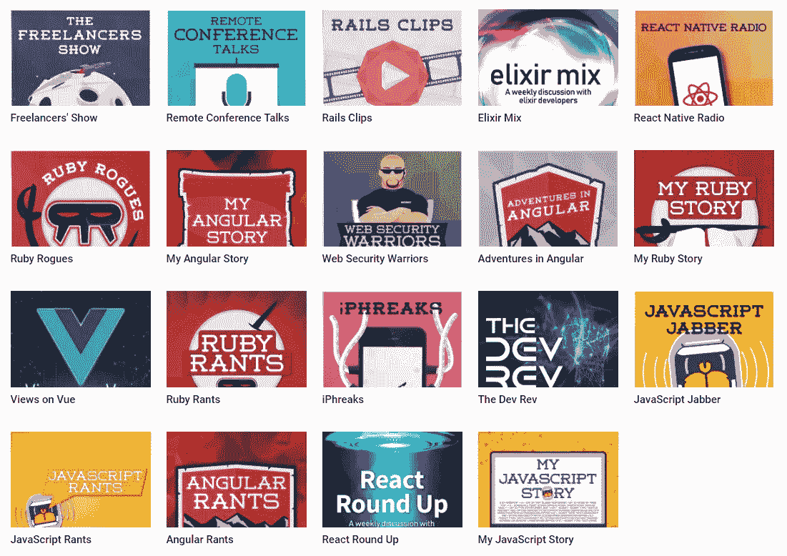

# 学习代码的播客

> 原文：<https://medium.com/hackernoon/podcasts-to-learn-code-2aa04c4d3f55>

DevChat.tv’s podcast network

DevChat.tv 的查尔斯·麦斯武德谈播客的力量

查尔斯·麦斯武德是 T2 dev chat . TV 的创始人，这是一个播客网络，每周有超过 70，000 名的听众。比较受欢迎的播客有 [JavaScript Jabber](https://devchat.tv/js-jabber/) 和 [Ruby Rogues](https://devchat.tv/ruby-rogues/) 。尽管他拥有庞大的听众，当我采访他时，他告诉我他认为播客还没有达到他们即将到来的“全盛期”

Watch the full interview here

他的部分信心是因为播客是一种独特的、分散的渠道来吸引利基受众。我问他播客的发展轨迹是否会与电视的历史相呼应——起初代表当地的小众利益，但很快标准化并吸引了广大人群。他认为不太可能。“有了这些吸引大众的节目——它们吸引了人们——它们会谈论人们关心的问题，但有时正是这些小众领域你会产生最大的影响，而吸引大众的节目不可能为所有人做到这一点。”

对查尔斯来说，利基播客的影响是意义和激情的源泉。在采访中，他讲述了一次一位听众向他表示感谢的故事。通过听 DevChat.tv 播客，听众收集了帮助他学习编码的技术知识。最终，这位听众脱离了低薪工作，进入了编程生涯。

查尔斯计划扩大 DevChat.tv 网络，增加六个新的播客，用于六个领域:开源可持续发展、数据科学、开发者领袖、人工智能/机器学习、物联网和虚拟现实/增强现实。他希望这些新的播客能改变更多程序员的生活。

我正在用[时代](https://era.eco/#step1)构建去中心化网络的平等主义基础设施。*如果你喜欢这篇文章，如果你为它鼓掌，分享它，并在*[***Twitter***](https://twitter.com/ambercazzell)*上与我联系，这将意味着很多！也可以订阅我的*[***YouTube***](https://www.youtube.com/channel/UCJsTKB06gr8smQQIkbIXc9Q)**频道！**