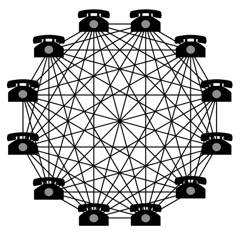
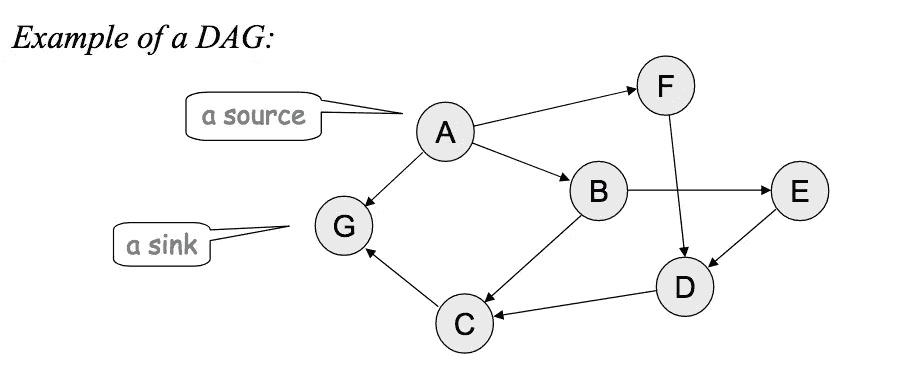
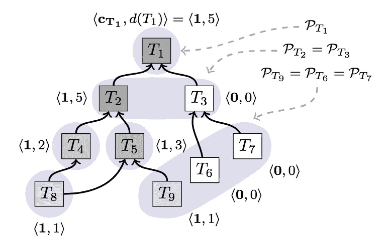

# 神奇宝贝进入区块链太空——协议简介:雪崩

> 原文：<https://medium.com/hackernoon/pok%C3%A9mon-is-entering-the-blockchain-space-avalanche-2c33640cd8b9>

Pokémon: Team Rocket

A valanche 是共识协议的集合，由**团队 Rocket** 于 2018 年推出。

> *“本文介绍了一个全新的适用于加密货币的共识协议族，基于随机抽样和亚稳态决策。这些协议提供了强大的概率安全保证，并保证了正确客户端的活性*

网址:[白皮书](https://ipfs.io/ipfs/QmUy4jh5mGNZvLkjies1RWM4YuvJh5o2FYopNPVYwrRVGV)

协议族包括以下四种:

*   **雪泥**(非拜占庭)
*   **雪花** (+拜占庭容错)
*   **滚雪球** (+信心计数器)
*   **雪崩**(前面三个协议的组合)

白皮书中介绍了雪泥、雪花和雪球，以便更好地理解最终协议背后的概念:**雪崩**。所有的概念和增强功能都融入其中。

Avalanche 承诺如下:

*   快速终结
*   低延迟(2 秒)
*   可扩展性(在 10k 到 10m 节点网络中的成功测试)
*   健壮(不需要精确的成员关系；任何人都可以在任何时候加入/离开网络——类似于比特币
*   不消耗大量能源—与工作证明链相反

该协议是建立在一个**故意亚稳态**机制上的。亚稳态本质上是指这样一个概念，即系统被设计成最终带来一个答案，并且不会保持平衡。

*   所有节点最终达成共识
*   随机样本支持以这样或那样的方式提示它
*   通过(整个网络的)随机子集采样促进扩展

每个节点必须在两种颜色之间做出选择:蓝色或红色。即使网络以 50:50 的分布开始，它也会通过随机仲裁以这样或那样的方式倾斜。

当前 Nakamoto 共识协议的关键区别:

*   故意亚稳定
*   TPS /延迟
*   受八卦协议的启发(查询正在触发其他查询，其他查询正在触发其他查询，..)
*   重要权衡:冲突事务的活性(仅保证良性事务的活性)
*   运行“亚定额”(随机子集抽样)，这使得较小的共识实例并行，从而可以实现更高的吞吐量。一个副作用是，在任何给定的时间，并非所有的节点都将彼此完全同步，但随着时间的推移，所有节点最终都将汇聚到相同的历史上。

提供两种保证:

*   安全:没有两个诚实的节点会接受冲突的交易
*   **活性**:任何由诚实客户发出的良性交易最终都会被每个诚实节点接受

# **传统共识 vs 中本聪共识**

**传统共识**机制具有二次通信复数 O(n ) (n 是网络中节点的数量)并且需要精确的知识成员。这意味着每添加一个额外的节点，就需要成倍增加的时间来与所有其他节点共享信息。

Source: [https://flatoutcrypto.com/home/avalancheprotocol](https://flatoutcrypto.com/home/avalancheprotocol)

而中本聪共识(以中本聪命名并于 2009 年引入)则不需要精确的成员。共识是通过工作证明达成的，在工作证明中,“随机”选择一个领导者(这里是矿工)来生产一个块。它允许网络中有一定比例的拜占庭(敌对)节点，并且仍然达成一致。然而，它也有一些缺点，如有限的可扩展性，高延迟和巨大的能源消耗，如 sybil 阻力。

Avalanche 估计它们的通信复杂性在以下范围内:

***O(kn log n)到 O(kn)***
*(n =节点；k =安全阈值)*

# 同步与异步网络

论文将雪崩描述为同步网络。比特币、以太坊和其他区块链项目都是同步网络。网上有相当多的好资源，然而一个简单的介绍应该能合理地抓住主要思想。

同步意味着有一个定时假设。一条比特币消息，例如每 10 分钟产生一个块(加上一些缓冲:[块时间戳—比特币维基](https://en.bitcoin.it/wiki/Block_timestamp))，每 15 秒产生一条以太坊消息(块)。基本上是某个已知的时限。任何超过此时间块都将超时，并被视为无效。

其中在异步网络中，消息可能需要无限长的时间才能到达对等节点，并且每个节点可能需要无限长的时间来响应。

同步网络容易受到 DoS(拒绝服务)攻击，这会降低网络速度，某些时间限制无法实现。

# 雪崩家族

雪泥、雪花和雪球是本文首先描述的协议。它们仅仅是为了理解最后一个成员:雪崩。它们都提供了技术方面的内容，最终汇集在一起。

## 烂泥

雪泥是家庭中最简单的礼仪。下面的例子很容易解释 Slush 和潜在的亚稳定性:

1.  节点从客户端接收事务并发起查询
2.  该节点均匀随机地查询网络的恒定大小( *k* )的样本
3.  接到查询后，
    *3a。*未着色的节点采用该颜色，用该颜色进行响应，并发起自己的查询；
    *3b。*一个有颜色的节点简单地用它自己的颜色来回应；
    *3c。*如果在一个时间界限内没有接收到 k 个响应，则该节点从剩余节点中挑选一个附加样本
4.  查询节点收集 *k* 响应，并检查一部分是否是相同颜色的
5.  如果达到阈值，并且采样的颜色不同于节点自身的颜色，则节点翻转到该颜色
6.  它再次从查询步骤开始，并启动下一轮查询，总共有 *m* 轮
7.  如果 *m* 足够高，该协议确保所有节点将被相同地着色

我用 MS Excel 开发了一个简单的例子(只要公式允许我这样做。我有意避免在这里使用 VBA)。这以一种简单的方式展示了亚稳态是如何通过显示随机子采样的效果来工作的:一种颜色将获得轻微的优势，并将放大这种不平衡(即使你以 50:50 的状态开始)

雪泥是没有记忆的。除了拥有颜色之外，它在不同的查询回合之间不保留任何状态。它也不保存与其他节点交互的历史。

此外，Slush 不是拜占庭容错的。(BFT)一个敌对的行动者可以保持网络处于平衡状态(不断翻转节点的颜色，所以他们达成共识。

## 雪花

雪花是基于雪泥，但增加了拜占庭容错(BFT)。
每个节点都有一个计数器 *cnt* ，它存储给出结果(全红或全蓝)的网络的连续样本数。

如果一个节点的 *cnt* 超过 *β* (类似于阈值)，则该节点接受当前颜色。

*   每当查询产生与节点相同颜色的一定数量的响应时， *cnt* 就递增。
*   每次颜色改变时，节点将 *cnt* 重置为 0。

## 雪球

雪球在雪花上堆积，包含一种自信的状态，因为计数器 *cnt* 是短暂的，因为它会随着每次颜色的变化而重置。添加了新的置信度计数器。

置信度计数器捕获已经为其相应颜色产生阈值结果的查询的数量，但是仅当其当前颜色变得低于新颜色的置信度值时才改变颜色。

1.  在每次查询时，该节点增加其相应颜色的置信度计数器。
2.  当当前颜色的置信度低于新颜色的置信度时，节点翻转其颜色。

## 雪崩

Avalanche 基于之前推出的所有三种协议，并增加了进一步的改进。它基于一个动态的只追加直接无环图(DAG)。DAG 有一个 sink，它是起源顶点([有向无环图——维基百科](https://en.wikipedia.org/wiki/Directed_acyclic_graph))。

Source: [http://homepages.math.uic.edu/~leon/cs-mcs401-s08/handouts/graphs-intro.pdf](http://homepages.math.uic.edu/~leon/cs-mcs401-s08/handouts/graphs-intro.pdf)

> *在任何有向图中，如果没有边通向 v，我们定义顶点 v 为
> 源，如果没有边通向 v，我们定义顶点 v 为
> 汇*

使用 DAG 有两个好处:

1.  它提高了效率，因为新事务显式地投票给其父( *1-n* )事务，并且隐式地投票给所有事务，因为对一个事务的投票是对其返回到起源顶点的路径上的所有事务的投票。
2.  它提高了安全性，因为它更难(不是不可能；基本上和区块链的结局一样)撤销过去的决定。

Avalanche 在置信度计数器旁边使用 *chits* ，这在雪球协议中有解释。

这就是它的工作方式(对于有冲突的交易尤其重要，例如双重消费尝试):

1.  查询事务 *T* ，从 *T* (通过沿边)隐式可达的所有事务也是查询的一部分。
2.  只有当 *T* 和它的整个祖先是它们的首选集合时，节点才会积极响应查询
3.  如果超过一定的阈值对查询投赞成票，则表示要收集一个 *chit* 的交易。便签是一次性样本的结果，是不可变的，取值范围从 0 到 1。
4.  节点将它们的置信度计算为不仅对于事务 *T* 本身而且对于父和后代(新事务)的 *chit* 值的总和。置信度可以随着 DAG 的增长而增加。

Source: Whitepaper <chits, confidence>

例如，因为 T2 比 T3 有更大的信心，所以它的后代比 T3 更有可能在未来收集 chits。

节点就事务是否正确或是否与另一个事务冲突达成一致。因此，雪崩可以被看作是用雪球的实例来解决冲突。Avalanche 为每个冲突包含了一个雪球实例。

与比特币类似，Avalanche 将是否接受交易的决定权留给了应用程序。

# 开放式问题

*   Sybil 抵抗性(例如，网络中有大量恶意节点)*一种可能的解决方案是令牌信誉赌注(在某种程度上类似于 DPoS)*
*   有冲突的交易(双重花费)会造成金钱损失吗？例如，像一个惩罚
    ——活跃度受到影响吗？
    —钱包坏了不小心发了两笔交易怎么办？

如果你对分布式账本技术、区块链、以太坊、比特币等感兴趣:

 [## ynkzlk (@ynkzlk) |推特

### ynkzlk 的最新推文(@ynkzlk)。新的移动性和信任最小化技术。对自主感兴趣…

twitter.com](https://twitter.com/ynkzlk) 

# 来源

*   [https://ipfs . io/ipfs/qmuy 4 jh5 mgn zvlkjies 1 rwm 4 yuvjh5 o 2 fyopnpvywrrvgv](https://ipfs.io/ipfs/QmUy4jh5mGNZvLkjies1RWM4YuvJh5o2FYopNPVYwrRVGV)
*   【https://flatoutcrypto.com/home/avalancheprotocol 号
*   【https://flatoutcrypto.com/home/avalancheprotocolpart2 
*   [https://en.bitcoin.it/wiki/Block_timestamp](https://en.bitcoin.it/wiki/Block_timestamp)
*   [https://bitcointalk.org/index.php?topic=99631.0](https://bitcointalk.org/index.php?topic=99631.0)