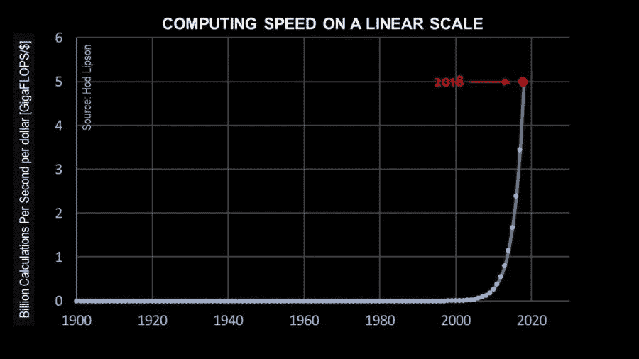
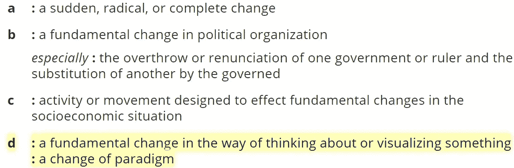
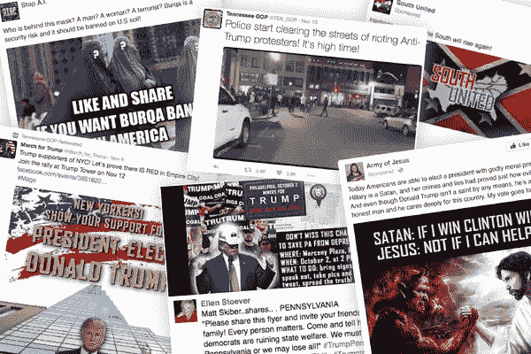
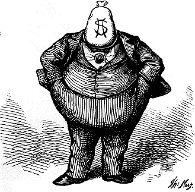
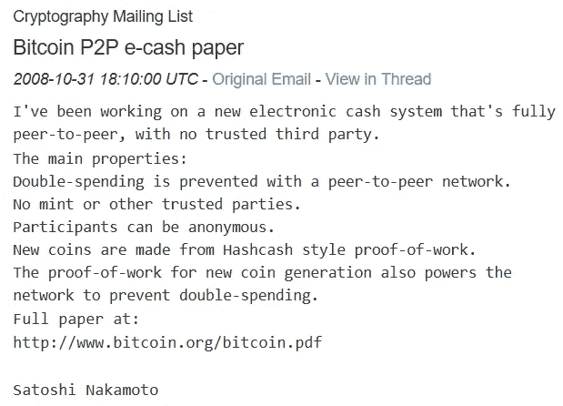
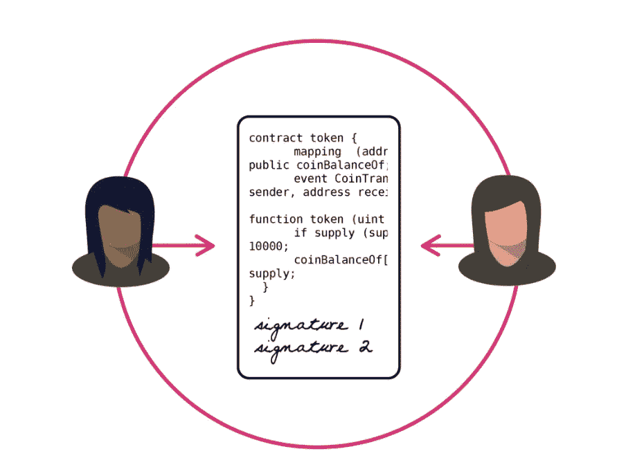
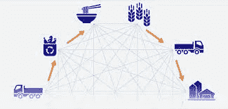
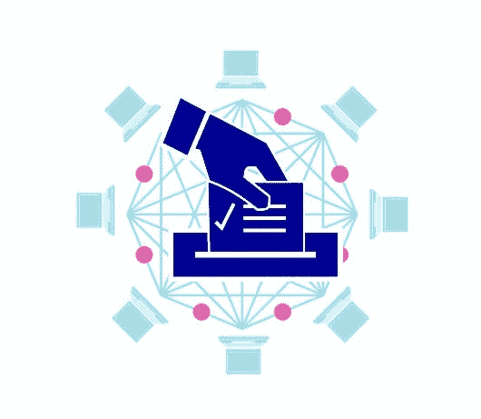

# 政治革命和区块链:两个范式转变的故事

> 原文：<https://medium.com/hackernoon/political-revolution-and-the-blockchain-18751b780f12>

这是最好的时代，这是最坏的时代，这是维基百科的时代，这是模因的时代，这是言论自由的时代，这是被谋杀的记者的时代，这是草根运动的时代，这是黑暗金钱政治的时代，这是人工智能的春天，这是气候变化的冬天，我们面前什么都有，我们面前什么都没有——简而言之， 当前这个时期的技术、全球社会和通信的碰撞是任何其他时期都无法比拟的。

在过去的十年里，互联网接入增加了近 30 亿人，从占全球人口的 20%增加到 50%以上，提高了识字率和获取信息的能力，并在全球范围内引入了即时通信的能力。

Source: [SingularityHub.com](https://singularityhub.com/2018/07/15/why-most-of-us-fail-to-grasp-coming-exponential-gains-in-ai/)

与此同时，计算能力正遵循[摩尔定律](https://en.wikipedia.org/wiki/Moore%27s_law)，每 18 个月成本产出比大约翻一番。一些人甚至预测，当线形图“垂直”时，人类和人工智能之间将出现一个[技术奇点](https://en.wikipedia.org/wiki/Technological_singularity)。

结合气候变化的现实、倒退的政治政策和协调的虚假信息运动，这一分水岭时刻可能会在相对较短的时间内带来灾难性后果或全球状况的巨大改善。

在这篇文章中，我将简要概述当前的政治、社会和技术状况，它们之间的相互影响，以及区块链系统的进步如何应对当今面临的一些挑战。

# **伯尼·桑德斯和政治革命**

2015 年夏天，当参议员伯尼·桑德斯宣布他将竞选美国总统时，我放下一切回到美国并提供帮助。开始是志愿去敲门，后来发展成开设竞选办公室、组织活动、招募志愿者，以及更多我数不清的面对面的政治对话。总的来说，一场小规模的草根运动开始像滚雪球一样发展成美国现代史上最大规模的政治参与。

YouTube: [30 Years of Speeches by Bernie Sanders](https://www.youtube.com/watch?v=RU3NKvvxcSs)

支持伯尼很容易，你只需要同情他人，分享伯尼自己的话。对于美国联邦政府在过去 30 年中犯下的几乎每一个反动错误，伯尼都支持进步。支持民权和同性恋权利，反对军事干涉主义，倡导教育和社会福利，伯尼一直不懈地倡导一个为所有人服务的明智政府。

然而，有一个竞选口号，许多人发现很难支持——政治革命。对许多人来说，革命这个词让人联想到暴力政变、无政府状态和断头台。虽然这种解释并非没有历史根据，但它并不是这个词的更广泛定义所固有的:

Source: [Merriam-Webster.com](https://www.merriam-webster.com/dictionary/revolution)

政治和技术的范式正在受到挑战，我们组织和解释周围世界的方式正在发生重大调整。富有的利益和腐败的政客继续操纵经济市场和政府，经常侵蚀民主制度，但技术、通信和信息力量的转变给我们带来了巨大的机遇。

# **社交媒体和“假新闻”**

在一个民主国家，能够举行公开、诚实和公平的选举是解决所有其他问题的基础。随着社交媒体允许信息以超出可信事实核查的速度传播，谎言和公开宣传成为主要问题也就不足为奇了。

Russian propagated social media in the 2016 election. Source: [NewYorkTimes.com](https://www.nytimes.com/interactive/2018/02/16/us/politics/russia-propaganda-election-2016.html)

在巴西，反少数、支持酷刑的保守派雅伊尔·博索纳罗与国际公司合作[通过脸书旗下广受欢迎的信使 WhatsApp 传播针对其对手的谎言和宣传](https://www.theguardian.com/world/2018/oct/18/brazil-jair-bolsonaro-whatsapp-fake-news-campaign)。在俄罗斯，“互联网研究机构”雇佣了数千人制作宣传材料并向美国选民传播，仅在脸书就有超过 1.26 亿用户可以看到，穆勒领导的对特朗普竞选团队和俄罗斯之间勾结的调查迄今已发出 [36 份起诉书，5 名特朗普助手达成了认罪协议](https://www.vox.com/policy-and-politics/2018/2/20/17031772/mueller-indictments-grand-jury)。

然而，我们也必须小心，我们不会对互联网本身的审查制度做出反应。虽然像脸书和 Twitter 这样的个别公司显然可以自由运营，随心所欲地禁止用户、语言和图像，但互联网本身作为一种公用事业必须保持开放和透明，让好事超过坏事。

Source: [WhiteHelmets.org](https://www.whitehelmets.org/)

在叙利亚，志愿白盔救援组织使用社交媒体，结合飞机传感器和机器学习算法，快速警告来袭的炸弹和导弹，并协调救援工作。据估计，这些分散的早期预警系统已经在遭受严重轰炸的地区减少了 27%的伤亡。

支持民主的“阿拉伯之春”运动始于一段迅速被分享的[视频，视频中一名街头小贩](https://www.history.com/topics/middle-east/heres-how-the-arab-spring-started-and-how-it-affected-the-world-video)在当地政府办公室前自焚，抗议政府骚扰他的水果摊。在线交流和协作在许多国家的传播速度超过了审查的速度。

# **黑金和影子政治**

虽然谎言和宣传的传播是破坏性的，但它可以用真相来打击。对美国选举更现实的威胁是黑金和超级政治行动委员会。

超级政治行动委员会(Super PAC)是一个政治行动委员会，从技术上讲，它与政治候选人是分开的，也没有交流。多亏了最高法院在[公民联盟诉联邦选举委员会](https://en.wikipedia.org/wiki/Citizens_United_v._FEC)一案中的裁决，超级政治行动委员会可以筹集并在广告上花费无限的资金，不披露他们的捐赠者是谁，并且只要没有直接协调的证据，就可以支持或反对特定的候选人。

这是对选举民主的曲解，它允许秘密资助政治组织用经常误导或不准确的广告轰炸所有形式的媒体。在 2016 年选举中，[超过 14 亿美元的黑钱被超级政治行动委员会](https://www.opensecrets.org/news/2016/11/1-4-billion-and-counting-in-spending-by-super-pacs-dark-money-groups/)花掉。富有的个人和公司给官方选举活动和超级政治行动委员会提供大量资金，反过来，当选的官员做出对他们有利的决定。

Source: [“Boss Tweed”](https://en.wikipedia.org/wiki/William_M._Tweed) depiction in Harper’s Weekly, 1871

也就是说，除非你相信这纯粹是巧合:互联网服务提供商在网络中立性被摧毁之前向国会竞选活动捐赠了 1 亿多美元；哈里伯顿[在伊拉克赢得了大量无投标政府合同](https://www.nytimes.com/2004/09/28/us/a-closer-look-at-cheney-and-halliburton.html)，而他们的前首席执行官迪克·切尼是副总统；石油、天然气和煤炭公司在 2016 年花费了 3.54 亿美元的竞选捐款[，同时获得了 294 亿美元的联邦补贴](https://www.vox.com/energy-and-environment/2017/10/6/16428458/us-energy-coal-oil-subsidies)？

或者，当特朗普总统的司法部以 600 万美元的价格解决了一起涉及纽约房地产的 2.3 亿美元的俄罗斯洗钱案时，代表俄罗斯的律师之前组织了她本人、小唐纳德·特朗普(Donald Trump Jr .)和特朗普竞选官员之间现在著名的特朗普大厦会议(T7)，这是一个巧合。

说到影子钱，据估计，国防部和住房和城市发展部在 1998 年至 2015 年的无支持调整中挪用了[***【21 万亿*** 美元。完全缺乏选民对税收支出的监督令人震惊。](https://www.forbes.com/sites/kotlikoff/2017/12/08/has-our-government-spent-21-trillion-of-our-money-without-telling-us/#30bc59d57aef)

我们最近还目睹了历史上最大的文件泄露事件，被称为[巴拿马文件](https://en.wikipedia.org/wiki/Panama_Papers)，详细披露了 200，000 多个离岸实体的信息，并揭露了来自 200 多个国家的世界领导人、商人和名人如何利用空壳公司进行欺诈、逃税和规避国际制裁。然而，尽管仅在内华达州就有 1260 家公司被点名，但在美国几乎没有起诉发生，因为公司和富人有完全合法的方式将资金藏在海外。

# **选举舞弊和选民权利被剥夺**

除了选民虚假信息和黑金影响的问题之外，美国还面临着选举欺诈和选民被剥夺选举权等非常现实的问题。虽然近几十年来一些问题已经取得了进步，比如将投票权还给重罪犯，但是合格选民登记和投票的能力应该是不可能的。

2018 年选举是[猖獗的选举舞弊和选民被剥夺选举权](https://www.americanprogress.org/issues/democracy/reports/2018/11/20/461296/voter-suppression-2018-midterm-elections/)。在俄亥俄州，大量非裔美国人居住的社区看到 10%的登记选民被从名单中清除，相比之下，周围地区只有 4%。在北卡罗莱纳州，越来越多的[证据表明，缺席选票是由政治操作人员收集的，只交给共和党选民。](https://www.vox.com/policy-and-politics/2018/12/26/18156326/north-carolina-9th-district-election-voter-fraud-hearing)

在佐治亚州，53，000 名选民登记者由于选举前的小拼写错误或缺少连字符而被置于“待定”状态，一个以非洲裔美国人为主的县不得不拒绝关闭七个投票站的计划。共和党国务卿布赖恩·坎普(Brian Kemp)在任期内从选民名册上删除了约 150 万人，并监督了他竞选州长的选举。

Source: [The Miami Herald/AP](https://www.firstpost.com/world/us-2012-election-images-long-long-lines-for-voting-517208.html)

拥有 27，000 人口的堪萨斯州道奇城将它唯一的投票点搬到了城外。在全国范围内，更少的投票点导致了更长的队伍，许多选民无法从工作中抽出足够的时间来参与投票。尽管美国的投票率很低，只有 50%左右，这些情况还是会发生。

[研究显示](https://www.brennancenter.org/blog/automatic-voter-registration-boosts-political-participation)自动选民登记提高了参与率，自 2015 年以来已有 12 个州通过了立法。将选举日移至周末或全国假日也可能增加投票率。

# **斩草除根**

解决重大倒退政策的关键是首先正视选举舞弊、选民权利和金钱在政治中的影响。从那时起，选民将拥有选举工具来打击现代社会中仍然普遍存在的许多不公正现象。

我们可以从对公众不负责的 50 亿美元的盈利性监狱行业开始，越来越多的[平民被无人机袭击杀害](https://www.militarytimes.com/news/your-military/2018/11/14/hidden-toll-of-us-drone-strikes-in-yemen-nearly-a-third-of-deaths-are-civilians-not-al-qaida/)，[告密者因在法律和道德上讲真话而受到惩罚](https://www.theguardian.com/us-news/2016/may/22/how-pentagon-punished-nsa-whistleblowers)，或者每年授予洛克希德·马丁和波音这样的战争奸商的[1000 亿美元纳税人资金](https://www.thenation.com/article/heres-where-your-tax-dollars-for-defense-are-really-going/)。

随着对纳税人资金的更好的民间监督，我们可以实施一个普遍的医疗保健系统，这不仅在伦理和道德上是公正的，而且科赫兄弟资助的一项研究发现从长远来看将节省资金。

通过透明、自由和诚实的选举赋予选民权力是取得进展的基础。让我们看看技术将如何在这个过程中帮助我们。

# **范式的改变:代码就是法律**

为了解释区块链的基本结构，从字面上理解单词“块”和“链”。在计算机术语中，块是“作为一个单元处理的一段文本”。区块链实际上是一长串计算机代码，一段接一段地“链接”在一起。

孤立地看，这只不过是一个不断增长的信息分类账。区块链提供的优势是在没有中央数据库的情况下进行点对点操作。这意味着每个网络用户读写完全相同的区块链，也称为分布式分类帐。

想象一台巨大的打字机，每个人都可以使用键盘，一次输入一个文本。只有一张纸，不断变长。任何打在纸上的东西都是永久不变的。这就是所谓的不变性，也是区块链技术最重要的方面之一。

另一个关键功能是区块链通过散列法**、**(最常见的是 [SHA256](https://en.wikipedia.org/wiki/SHA-2) )结合了加密技术。这是对文本应用数学函数的行为，确保只有正确的密钥才能解密它。通过这种方式，有不同的“私钥”来解锁访问区块链特定部分的能力，即所谓的“公共地址”，但没有可以访问所有内容的“万能钥匙”。

这种分散加密网络的使用将我们从法律和秩序的早期范例中转移出来。在更混乱的时代，剑就是法律，争端靠武力解决。随着文明的进步，文字变成了法律，通过民主选举，民众开始塑造法律框架。然而，词语仍然可以由律师解释，不公正的法律实践[经常不平等地适用法律](https://www.vox.com/identities/2017/11/17/16668770/us-sentencing-commission-race-booker)。分布式分类账提供了代码就是法律的无信任系统的许多优点。

为了说明这是如何操作的，让我们看看第一个也是最著名的区块链，比特币。

# **比特币:点对点数字现金**

[Original announcement](https://satoshi.nakamotoinstitute.org/emails/cryptography/1/) of Bitcoin and [Whitepaper](https://www.bitcoin.org/bitcoin.pdf).

比特币(也写作 BTC)始于 2009 年，创造者“开采”了一个单独的区块，直到今天，人们只知道他的化名中本聪。挖掘是指分散网络上的计算机求解加密哈希以创建下一个 BTC 块，并将网络事务写入区块链。

任何人都可以通过运行网络软件，或查看“区块浏览器”网站，如[blockchain.com](https://www.blockchain.com/explorer)，查看比特币区块链上的任何地址或交易。通过反向阅读分类账，你可以追溯 BTC 每一笔交易的每一部分，直至其源头。

例如，您可以在[0000000000019d 6689 c 085 AE 165831 e 934 ff 763 AE 46 a 2 a6 c 172 B3 f1 b 60 A8 ce 26 f](https://www.blockchain.com/btc/block/000000000019d6689c085ae165831e934ff763ae46a2a6c172b3f1b60a8ce26f)处查看 genesis 块，其中 50 BTC 在“块#0”处创建并发送到公共地址[1a 1 ZP 1 EP 5 qgefi 2 dmptft l5 slmv 7 div FNA](https://www.blockchain.com/btc/address/1A1zP1eP5QGefi2DMPTfTL5SLmv7DivfNa)。这个钱包仍然保存着 66.90222543 BTC，并且只有创建这个公共地址的人(在这个例子中是 Satoshi)被给予了将这些 BTC 发送到另一个地址所必需的私钥。

因为比特币软件是开源的，任何人都可以查看和验证软件的完整性，没有漏洞或“后门”。开源代码的任何改变都需要矿工和用户的分散网络达成共识，这意味着代码的改变会引起激烈的争论。

比特币以点对点和加密的方式运行，具有完全的不变性，这意味着没有任何个人、公司或国家可以改变或审查它。这种分散化还允许交易安全地发生，而不需要信任其他用户或第三方，并且防止了双重花费交易。

比特币也有一个写入其代码的[受控供应](https://en.bitcoin.it/wiki/Controlled_supply)，目前有超过 1700 万 BTC 可用，新 BTC 的创造速度放缓，直到 2100 万 BTC 的有限数量。这与美元、欧元或英镑等传统法定货币形成鲜明对比，这些货币可以随时印刷。

虽然有时会因网络使用量大而变慢，但比特币网络曾在几分钟内处理了一笔价值 3 亿美元的交易[，仅花了 4 美分](https://ethereumworldnews.com/300-million-usd-bitcoin-btc-004-usd-fee/)。使用国际银行标准 SWIFT 的费用为 15-35 美元，最少需要 1-2 天，并且不能独立于银行使用。

因为对比特币的讨论不可避免地会转向价格，所以我会简单地说，早期技术经历了许多价格上涨和修正，最好不要局限于此。在 Pets.com 破产，亚马逊在 2000 年损失了 90%的价值之后，互联网并没有被抛弃。9 年时间，BTC 从几分钱到几美元，从几百到几千，指数级上涨，8 次下跌超过 50%，是第一代新技术。

虽然我必须继续前进，但关于比特币还有很多要讨论的，包括估计有[300-400 万 BTC](http://fortune.com/2017/11/25/lost-bitcoins/) 将因私钥丢失而永远无法访问，保护网络免受[量子计算机](https://www.theregister.co.uk/2017/11/09/quantum_computers_could_crack_bitcoin/)有一天可能会破解 SHA256 加密，[当网络用户不同意更新源代码时“分叉”如何发生](https://www.coindesk.com/short-guide-bitcoin-forks-explained)，以及提供更快、更便宜或完全无法追踪的支付的数字货币竞争对手。

# **智能合约和区块链的演进**

Source: [CoinDesk.com](https://www.coindesk.com/information/ethereum-smart-contracts-work)

为了理解下面的大多数例子是如何利用区块链技术的，首先有必要介绍“智能合同”的概念数以千计的基于区块链的“加密货币”被创造出来，扩大了区块链和分布式账本的功能。虽然许多人只是关注支付和价值转移，无论是更快、更便宜、更容易还是匿名，但越来越多的人正在以创造性的方式利用分布式账本技术。

[以太坊](https://www.ethereum.org/)、 [EOS](https://eos.io/) 等基础设施加密货币都有代码脚本，可以由用户部署。这允许创建智能合约，智能合约是放置在区块链上的不可变代码，规定必须满足什么参数才能自动发生动作——这是在分散系统上运行的永久而安全的“如果-这-那-那”语句。

比特币彻底改变了没有中间人的防审查价值交换能力，智能合约允许分布式计算机网络运行分散的应用程序，即所谓的“DApps”。这样，在两个用户之间达成协议不需要可信的第三方，在处理特定代码时，任何形式的数字数据被存储或交换。这是区块链技术扩展其现实世界应用的地方，可能性是惊人的。

# **财务和资产所有权**

毫不奇怪，许多加密货币都专注于货币或商品的交换。除了支付渠道，还有一些总部位于区块链的公司整合了股票和证券交易，允许用户交易与公开交易的股票、黄金、白银或各种国家货币等资产挂钩的加密货币。这打破了进入壁垒，消除了作为中间人的经纪公司和银行。一些加密货币交易所甚至是完全分散的，不需要集中的账户、密码或数据库系统，允许用户在本地控制他们的交易资产。

像 Humaniq 这样的项目正在努力帮助那些基本上没有银行账户的发展中国家的成员，通过经济独立使受益者摆脱贫困。[甘露](https://www.mannabase.com/)是一个非盈利组织，它为任何人创造了普遍的基本收入，并通过他们的区块链进行分配。

其他公司使用智能合同来“标记”现实世界的资产，如土地和房屋所有权、艺术品和高价值物品、遗嘱和法律协议，甚至是用电量和碳信用额。通过在分布式账本上操作，所有者可以独立地持有私钥或传递资产的合法所有权。协议可以编码到智能合同中，消除了对律师的需求，使仲裁更简单、更便宜，并确保协议的规定由不变的代码执行。

此外，私人或政府运营的区块链可以提供完全透明、自动化和安全的法律框架。格鲁吉亚共和国目前正在测试这样一个项目:

> “通过建立一个基于区块链的财产登记处，并充分利用区块链技术所提供的安全性，格鲁吉亚共和国可以向世界展示我们是一个现代化、透明和无腐败的国家，可以领导世界改变土地所有权的方式，并为所有人的进一步繁荣铺平道路。”Papuna Ugrekhelidze，格鲁吉亚国家公共登记处主席

# **腐败与透明**

因为大多数分布式分类账是完全透明的，并且所有交易都是可追踪和不可改变的，所以腐败和滥用资金也可以通过这种方式解决。西班牙已经承诺建立[EU-宽区块链和人工智能应用](https://cointelegraph.com/news/spain-tackles-corruption-with-blockchain-ai-and-amendments-to-its-anti-corruption-laws-expert-take)以打击欧盟单一市场的腐败，澳大利亚证券交易所(ASX)正在用区块链技术[替换其当前系统](https://www.bbc.com/news/business-42261456)以降低交易成本、提高安全性和打击欺诈。

如果一个政府真的希望所有纳税人的资金都得到透明的分配，那么一个基于区块链的系统就可以快速、轻松地审计每一分钱。支付给承包商、员工或政府项目的资金可以完全信任地受到监控，任何腐败、贿赂或资金滥用都可以很容易地被发现。

# **供应链和假冒商品**

Source: [RaboBank.com](https://research.rabobank.com/far/en/sectors/farm-inputs/blockchain_changing-interaction-in-the-fanda-supply-chain-from-paddock-to-plate.html)

在全球商品供应链中也需要完全透明和防止欺诈，假货和盗版的负面影响估计高达数万亿，仅假药一项每年就造成 2000 亿美元的损失。带有基于区块链的跟踪系统的防篡改包装可以独立验证药品的原产地、运输和处理，这将拯救生命、节省资金，并在生产者、处理者和消费者之间建立信任。

世界各地的许多初创公司都在竞争他们供应链生态系统的合同， [IBM 正在区块链](https://www.ibm.com/blogs/blockchain/category/blockchain-supply-chain/)建立自己的供应链， [DHL 与一家区块链公司](https://anticorruptiondigest.com/anti-corruption-news/2018/04/27/dhl-trials-blockchain-in-pharma-supply-chain-to-cut-out-counterfeit-drugs/)合作，从产地到购买全程跟踪药品。

# **识别和数据**

Source: [UniversityMagazine.ca](https://universitymagazine.ca/data-breach/)

脸书和谷歌等科技公司拥有大量用户数据并不奇怪，但最近的披露[脸书实际上允许亚马逊、网飞和 Spotify 访问数亿用户的私人信息，这扩大了不道德使用用户数据的范围。](https://www.independent.co.uk/life-style/gadgets-and-tech/facebook-personal-data-user-details-amazon-netflix-spotify-mark-zuckerberg-a8690396.html)

在新的互联全球经济中，数据就是货币，但日常用户却被排除在外。像 23andMe 这样的公司通过绘制你的 DNA 而变得流行，但有一个警告，一旦你的生物数据被“去识别”，他们就可以出售你的生物数据。

像 Civic 这样的公司正在使用区块链安全系统来创建安全的身份登录系统，用户可以完全控制这些系统。统一基金会(Unification Foundation)是我在过去一年的早期发展中帮助孵化的一家公司，它正在完成一项总部位于区块链的协议的开发，该协议旨在实现各行业数据的标准化，并让消费者完全控制每个数据点。这使得用户可以可视化、管理甚至货币化他们创建的数据，所有这些都通过他们拥有密钥的分散加密网络来保护。

Startups focused on DNA testing, insurance and coverage, medical records, and clinical trial matching are all working to bring ownership of medical data back to consumers. The ability to truly own and control access to your online, medical, and financial data is paramount to personal freedom.

# **Communication and File Storage**

Another important use for distributed ledgers is in structural systems of communication and file storage. The ability to communicate freely, without censorship or surveillance, is rapidly being lost.

In China, it’s estimated that over [30,000 people are employed as ‘Internet Police’](https://en.wikipedia.org/wiki/Internet_censorship_in_China), monitoring websites and personal chats for dissenting opinions to censor, such as the Tiananmen Square massacre or criticisms of President Xi. In the USA, the National Security Agency (NSA) has collected massive amounts of data on its citizens [going back to the 1960s](https://www.washingtonpost.com/news/the-switch/wp/2013/08/23/how-the-nsa-spied-on-americans-before-the-internet/), with revelations by whistleblower Edward Snowden showing just how pervasive current surveillance is.

Projects such as [Adamant](https://adamant.im/) and [Mercury Protocol](https://www.mercuryprotocol.com/) allow for completely decentralized, censorship-proof, anonymous communication and data transfers. This allows the creation of truly secure data transmission for users as well as applications themselves.

YouTube: [Rap Against Dictatorship — ประเทศกูมี](https://www.youtube.com/watch?v=VZvzvLiGUtw)

Decentralized file storage systems such as [IPFS](https://ipfs.io/) allow users to securely and permanently store or share data. In Thailand, an activist [uploaded an anti-government song](https://www.ccn.com/activists-use-crypto-to-protect-rap-against-dictatorship-from-government-censorship/) by Rap Against Dictatorship onto the IPFS storage system, then used the anonymous cryptocurrency ZCoin to safely share the link. The ZCoin blockchain at block [111089](https://chainz.cryptoid.info/xzc/tx.dws?3dedf56d707de817a73474c4b9f15d2816ad7917b71c9d2995cad2e66c195de0.htm&fbclid=IwAR2G8kB3tiUtsy-9uE0TcbCYTCN-Xm9AUDga7an7nhlmdk1mQHakt-FvpJk) permanently displays the IPFS link, mXFf5QLQi3DhbwyrgR7qH8tHAZcGyWtWtsBy6iij4B7aL, which can be used to access the song.

安全、匿名地分享不被审查的信息的能力非常重要。2018 年， [53 名记者被谋杀](https://cpj.org/data/killed/2018/?status=Killed&motiveConfirmed%5B%5D=Confirmed&type%5B%5D=Journalist&start_year=2018&end_year=2018&group_by=location)，[全球至少 251 人被监禁](https://cpj.org/reports/2018/12/journalists-jailed-imprisoned-turkey-china-egypt-saudi-arabia.php)。

# **投票和选举诚信**

Source: [BlockExplorer News](https://blockexplorer.com/news/overstock-invests-millions-blockchain-voting/)

也许区块链技术可以帮助确保一个稳定和自由的社会的最强有力的方式之一是通过投票系统。在美国，选举由地方和州官员处理，这有许多优点，不集中选举权力或提供一个单一的失败点。然而，这意味着各州在投票方法、书面记录或选民身份法方面很少有一致性。

美国的一个主要问题是投票机的使用。大量研究表明，投票机面临被篡改和黑客攻击的严重风险，一个供应商承认在投票机中安装了后门软件。一些州使用直接记录的电子投票系统，将选票储存在硬盘上，但是没有任何形式的书面记录备份。

在区块链系统上投票意味着在提交时，投票者可以查看输入的文字代码来验证其内容。可以向选民提供投票的透明记录，同时保护他们的投票，并且还向选民提供解密密钥以验证他们对区块链的投票是正确的。选民登记可以是标准化的和安全的，错误、操作成本和欺诈都可以通过利用选民的生物测定验证而显著减少。

南韩的国家、泰国的政党、[日本的城市](https://www.ccn.com/in-a-first-japanese-city-deploys-online-blockchain-voting-system/)以及[美国西弗吉尼亚州](https://slate.com/technology/2018/09/west-virginia-blockchain-voting-app-midterm-elections.html)都已经开始试验基于区块链的投票系统。在美国，拥有投票计划和直接问题投票的州可以对各种措施进行安全的实时投票。

一些州已经开始采用不同于“得票最多者当选”选举制度的选举方法，这种制度在一段时间内只会产生两个主要政党，这种现象被称为“迪弗格法则”。将安全可靠的技术集成到我们的投票系统中，有助于推动更加公平和民主的选举方法，例如[分级选择投票](https://en.wikipedia.org/wiki/Ranked_voting)，选民对他们的选择进行分级，自动决胜系统确定最受欢迎的候选人。

# **连接但分散**

人类天生就喜欢联系。然而，我们也需要隐私、保护和个性。随着技术在全球范围内将我们聚集在一起，我们必须确保普通民众重新控制我们相互联系的世界赖以建立的结构基础。这适用于通信、财务、个人数据、选举等等。

我们正处于一个完全连接和分散的互联网的尖端，它不仅包含我们的电话和电脑，还包含越来越多的物联网设备。我们必须确保沟通的结构系统是透明的、自由的、不受审查的。

最重要的是，通过透明的基于代码的协议、未经审查的言论和新闻、安全的个人数据以及安全而公平的直接民主，用技术赋予我们自己权力可以集体赋予社会权力。

*Will Mekemson 是一名外联专家、政治组织者、分权倡导者以及加密货币投资者和分析师。*

*将弥合开发商与社区、政治家与选民、企业与消费者之间的沟通鸿沟。*

*联系人将通过* [*LinkedIn*](https://www.linkedin.com/in/willmekemson/) *或 William.Mekemson@gmail.com 在区块链会议上发言、业务拓展和战略咨询，或政治竞选和活动组织。*