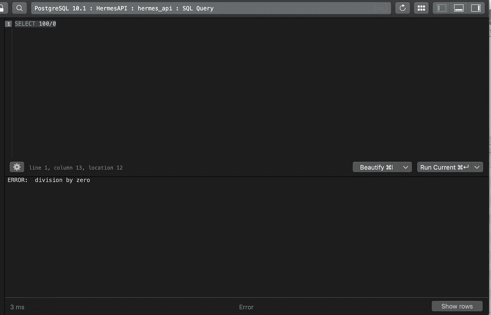
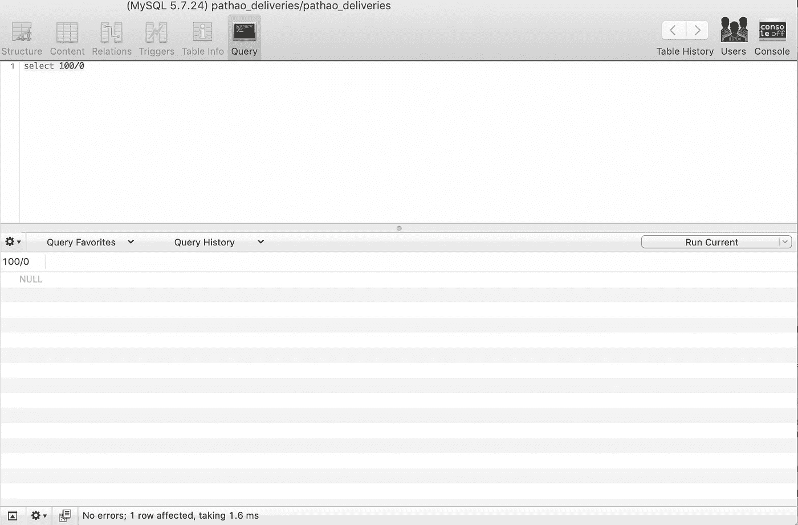
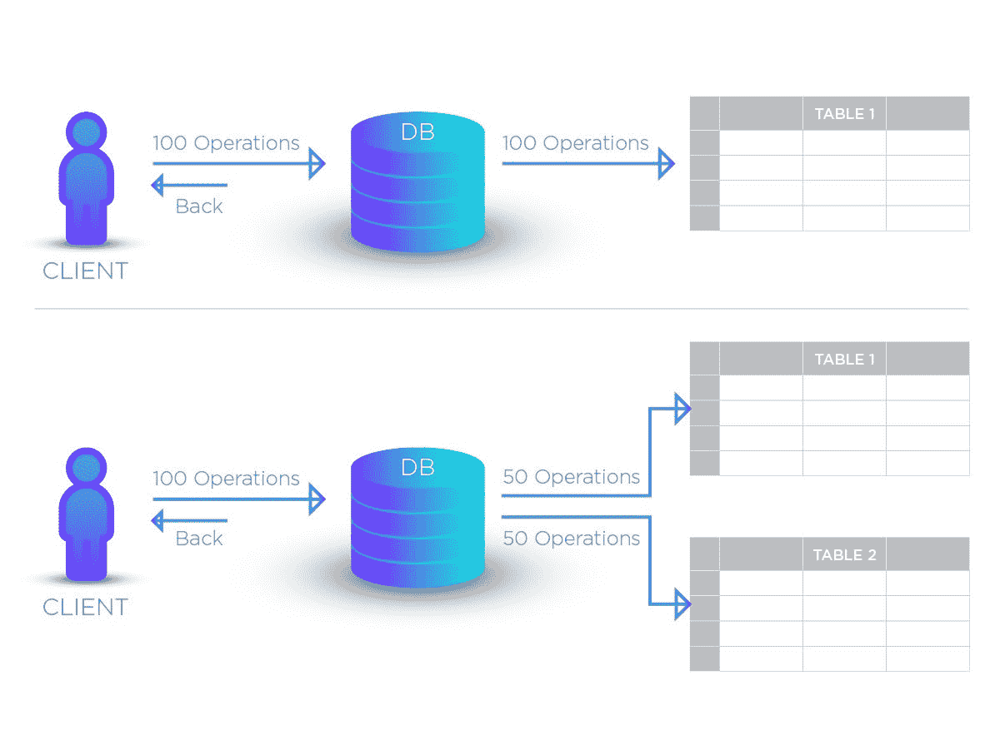

# PostgreSQL 令人兴奋的特性，你应该知道

> 原文：<https://medium.com/hackernoon/postgresqls-exciting-features-you-should-know-a516a441b8c4>


PostgreSQL 是一个强大的对象关系数据库系统，它扩展了 SQL 语言，并结合了许多功能，可以安全地存储和扩展最复杂的数据工作负载。

PostgreSQL 附带了许多功能，旨在帮助开发人员构建应用程序，帮助管理员保护数据完整性和构建容错环境，以及管理无论大小的数据集的数据。

在这里，我挑选了一些您可能没有看过但确实应该看的 PostgreSQL 特性，因为它们可以帮助您更快地将代码投入生产，使之更容易，并且通常可以用更少的代码和更少的工作量完成工作。

# 遗产

表继承允许将一组公共列提取到父表中，子表定义附加字段。

```
CREATE TABLE invoices (
    invoice_number   int  NOT NULL PRIMARY KEY,
    issued_on        date NOT NULL DEFAULT now()
);

CREATE TABLE government_invoices (
    department_id    text NOT NULL
) INHERITS (invoices);
```

这反映了政府发票都是发票，只是多了一个属性的情况。上面的“政府发票”表共有 3 列。

添加行就像表是独立的一样:

```
INSERT INTO invoices (invoice_number) VALUES (100);

INSERT INTO government_invoices
    (invoice_number, department_id) VALUES (101, 'DOD');
```

但是当你选择:

```
**SELECT * FROM government_invoices;** invoice_number | issued_on  | department_id
----------------+------------+---------------
            101 | 2018-06-19 | DOD **SELECT * FROM invoices;** invoice_number | issued_on
----------------+------------
            100 | 2018-06-19
            101 | 2018-06-19
```

在 Postgres 中使用表继承有一些主要原因。

比方说，我们有一些发票所需的表格，这些表格每个月都要创建和填写:

```
invoices
    - invoices_2010_04 (inherits invoices)
    - invoices_2010_05 (inherits invoices)
```

那么是什么让继承成为一个很酷的特性呢——为什么拆分数据很酷呢？

*   **性能**:在选择数据时，我们从日期在 X 和 Y 之间的发票中选择*，Postgres 只使用有意义的表格。例如，SELECT * FROM invoices WHERE date BETWEEN ' 2010–04–01 ' AND ' 2010–04–15 '只扫描 invoices_2010_04 表，其他所有表都不会被触动！
*   **索引大小**:我们没有在列日期有大索引的大表。我们每个月都有小表和小索引，读取速度更快。
*   **维护**:我们可以在每个月表上运行 vacuum full、reindex、cluster，而不锁定所有其他数据

# 数据类型

PostgreSQL 为用户提供了丰富的原生数据类型。用户可以使用 CREATE TYPE 命令向 PostgreSQL 添加新类型。

除了数字、浮点、字符串、布尔和日期类型，PostgreSQL 还支持 uuid、货币、枚举、几何、二进制、网络地址、位字符串、文本搜索、xml、json、数组、复合和范围类型，以及一些用于对象标识和日志位置的内部类型。平心而论，MySQL、MariaDB 和 Firebird 都不同程度地拥有其中的一些，但只有 PostgreSQL 支持全部。

让我们仔细看看其中的几个:

# JSON

PostgreSQL 支持原生 JSON 数据类型。它提供了许多操作 JSON 数据的函数和操作符。

让我们开始练习 JSON 数据类型。

```
CREATE TABLE orders (
ID serial NOT NULL PRIMARY KEY,
info json NOT NULL 
);
```

**插入 JSON 数据**

```
INSERT INTO orders (info)
VALUES(
'{ "customer": "John Doe", "items": {"product": "Bag",qty": 6}}'
);
```

让我们同时插入多行。

```
INSERT INTO orders (info)
VALUES
('{ "customer": "Lily Bush", "items": {"product": "Diaper","qty": 24}}'
),
('{ "customer": "Josh William", "items": {"product": "Toy Car","qty": 1}}'
),
('{ "customer": "Mary Clark", "items": {"product": "Toy Train","qty": 2}}'
);
```

**查询 JSON 数据**

要查询 JSON 数据，可以使用`[SELECT](http://www.postgresqltutorial.com/postgresql-select/)`语句，这类似于查询其他本地数据类型:

```
SELECT info FROM orders;
```

输出:

```
info         
----------------------------------------------------------------
 { "customer": "John Doe", "items": {"product": "Bag",qty": 6}}
 { "customer": "Lily Bush", "items": {"product": "Diaper","qty": 24}}'
{ "customer": "Josh William", "items": {"product": "Toy Car","qty": 1}}
 '{ "customer": "Mary Clark", "items": {"product": "Toy Train","qty": 2}}
```

PostgreSQL 提供了两个本地操作符`->`和`->>`来帮助您查询 JSON 数据。

*   运算符`->`通过键返回 JSON 对象字段。
*   操作符`->>`通过文本返回 JSON 对象字段。

以下查询使用运算符`->`以 JSON 的形式获取所有客户:

```
SELECT info -> 'customer' AS customer
FROM orders;
```

下面的查询使用运算符`->>`以文本形式获取所有客户:

```
SELECT info ->> 'customer' AS customer
FROM orders;
```

`->`操作符返回一个 JSON 对象，你可以用操作符`->>`链接它来检索一个特定的节点。例如，以下语句返回所有售出的产品:

```
SELECT
info -> 'items' ->> 'product' as product
FROM orders
ORDER BY product;
```

**在 WHERE 子句中使用 JSON 运算符**

我们可以在`[WHERE](http://www.postgresqltutorial.com/postgresql-where/)`子句中使用 JSON 操作符来过滤返回的行。例如，为了找出谁买了`Diaper`，我们使用以下查询:

```
SELECT
info ->> 'customer' AS customer
FROM orders
WHERE info -> 'items' ->> 'product' = 'Diaper'
```

为了找出谁一次购买了两种产品，我们使用以下查询:

```
SELECT
info ->> 'customer' AS customer,
info -> 'items' ->> 'product' AS product
FROM orders
WHERE
CAST ( info -> 'items' ->> 'qty' AS INTEGER ) = 2
```

# 排列

数组在 PostgreSQL 中起着重要的作用。PostgreSQL 允许您将列定义为任何有效数据类型的数组，包括内置类型、用户定义类型或枚举类型。

下面的 CREATE TABLE 语句创建了一个将`phones`列定义为文本数组的`contacts`表。

```
CREATE TABLE contacts (
id serial PRIMARY KEY,
name VARCHAR (100),
phones TEXT []
);
```

`phones`列是一个一维数组，保存一个联系人可能有的各种电话号码。

```
INSERT INTO contacts (name, phones)
VALUES
('John Doe',ARRAY [ '(408)-589-5846','(408)-589-5555' ]
);
```

**插入 PostgreSQL 数组值**

以下语句将新联系人插入到`contacts`表中。

```
INSERT INTO contacts (name, phones)
VALUES
('Lily Bush','{"(408)-589-5841"}'
),
('William Gate','{"(408)-589-5842","(408)-589-58423"}'
);
```

**查询数组数据**

我们可以使用 SELECT 语句查询数组数据，如下所示:

```
SELECT name,phones
FROM contacts;
```

我们使用方括号`[]`中的下标来访问数组元素。默认情况下，PostgreSQL 对数组元素使用从 1 开始的编号。这意味着第一个数组元素从数字 1 开始。假设，我们想要获得联系人的姓名和第一个电话号码，我们使用以下查询:

```
SELECT name, phones [ 1 ]
FROM contacts;
```

我们可以在 WHERE 子句中使用数组元素作为过滤行的条件。例如，为了找出谁的第二个电话号码是电话号码(408)-589–58423，我们使用以下查询。

```
SELECT name
FROM  contacts
WHERE phones [ 2 ] = '(408)-589-58423';
```

**修改 PostgreSQL 数组**

PostgreSQL 允许您更新数组的每个元素或整个数组。以下语句更新了 William Gate 的第二个电话号码。

```
UPDATE contacts
SET phones [ 2 ] = '(408)-589-5843'
WHERE
ID = 3;
```

# hstore

hstore 模块实现了 hstore 数据类型，用于将键值对存储在单个值中。hstore 数据类型在许多情况下非常有用，例如半结构化数据或具有许多很少被查询的属性的行。

在使用 hstore 数据类型之前，需要启用 hstore 扩展。

```
CREATE EXTENSION hstore;
```

我们使用 CREATE TABLE 语句创建 books 表，如下所示:

```
CREATE TABLE books (
 id serial primary key,
 title VARCHAR (255),
 attr hstore
);
```

我们使用 INSERT 语句将数据插入 hstore 列，如下所示:

```
INSERT INTO books (title, attr)
VALUES
 (
 'PostgreSQL Tutorial',
 '"paperback" => "243",
  "publisher" => "postgresqltutorial.com",
  "language"  => "English",
  "ISBN-13"   => "978-1449370000",
  "weight"    => "11.2 ounces"'
 );
```

Postgresql hstore 提供了`->`操作符来查询 hstore 列中特定键的值。例如，如果我们想知道`books`表中所有可用书籍的 ISBN-13，我们可以如下使用`->`操作符:

```
SELECT 
attr -> 'ISBN-13' AS isbn 
FROM 
books;
```

# 数据完整性

PostgreSQL 更可靠，因为它是 ACID(原子性、一致性、隔离性和持久性)兼容的，这意味着查询将保持数据完整性，并无错误地返回相同的输出。PostgreSQL 以其坚如磐石的引用和事务完整性而闻名。主键、限制和级联外键、唯一约束、非空约束、检查约束和其他数据完整性功能确保只存储经过验证的数据。

MySQL 和 MariaDB 正在努力使 InnoDB/XtraDB 存储引擎符合 SQL 标准。他们现在提供了一个使用 SQL 模式的`STRICT`选项，它决定了所使用的数据验证检查；但是，根据您使用的模式，在更新时可能会插入或创建无效的、有时会被静默截断的数据。这两个数据库目前都不支持 check 约束，而且对于外键约束也有许多警告。

# **区分大小写**

对于字符串比较，PostgreSQL 区分大小写。字段“史密斯”与字段“史密斯”不同。在查询中使用正确的大小写。(即其中 name='Smith ')。PostgreSQL 有一个不区分大小写的操作符，比如 ILIKE

# 自定义类型和函数

PostgreSQL 提供了强大的内置运算符和函数，包括那些支持专用数据类型的运算符和函数，但它也允许您创建自己的运算符和函数(包括聚合)以及自定义存储过程和触发器。让我们看一个简单的函数例子。

```
CREATE TYPE datetext AS (date date,date_as_text text);CREATE FUNCTION show_date_as_text(date)RETURNS datetext -- this is our composite typeAS   $$ SELECT $1, to_char($1, 'FMMonth FMDD, YYYY') $$LANGUAGE SQL;SELECT show_date_as_text('2015-01-01');-- Returns: (2015-01-01,"January 1, 2015")
```

# 错误处理

发生错误时，Postgresql 会返回正确的错误消息。请看下面的图片。



postgresql error message

但是当执行上述相同的 sql 时，什么返回 mysql。



# 组合查询

PostgreSQL 为`SELECT`语句之间的交互提供了`UNION`、`INTERSECT`和`EXCEPT`子句。`UNION`会将第二条`SELECT`语句的结果追加到第一条语句的结果中。`INTERSECT`只返回与两个`SELECT`语句都匹配的行。`EXCEPT`只返回第一个`SELECT`语句中与第二个`SELECT`语句中的行不匹配的行。

虽然 MySQL、MariaDB 和 Firebird 都支持`UNION`，但它们都不支持`INTERSECT`或`EXCEPT`。但是，通过在查询中使用连接和`EXISTS`条件，可以获得与 PostgreSQL 相同的结果。

# 窗口功能

一个*窗口函数*在一组与当前行有某种关系的表格行上执行计算。这与聚合函数可以完成的计算类型相当。

与聚合函数类似，窗口函数对一组行进行操作，但它不会减少查询返回的行数。

`OVER`关键字，可选与`PARTITION BY`和`ORDER BY`一起使用，表示正在使用窗口功能。注意，`WINDOW`子句在带有窗口函数的查询中不是必需的，但是它允许您创建和命名窗口，以帮助保持事物的完整性。

下面是一个示例，展示了如何将每个员工的工资与其所在部门的平均工资进行比较:

```
SELECT depname, empno, salary, avg(salary) OVER (PARTITION BY depname) FROM empsalary;
```

输出:

```
depname  | empno | salary |          avg          
-----------+-------+--------+-----------------------
 develop   |    11 |   5200 | 5020.0000000000000000
 develop   |     7 |   4200 | 5020.0000000000000000
 develop   |     9 |   4500 | 5020.0000000000000000
 develop   |     8 |   6000 | 5020.0000000000000000
 develop   |    10 |   5200 | 5020.0000000000000000
 personnel |     5 |   3500 | 3700.0000000000000000
 personnel |     2 |   3900 | 3700.0000000000000000
 sales     |     3 |   4800 | 4866.6666666666666667
 sales     |     1 |   5000 | 4866.6666666666666667
 sales     |     4 |   4800 | 4866.6666666666666667
```

前三个输出列直接来自表`empsalary`，表中的每一行都有一个输出行。第四列表示与当前行具有相同`depname`值的所有表格行的平均值。(这实际上与非窗口的`avg`集合是同一个函数，但是`OVER`子句使得它被当作一个窗口函数，并在整个窗口框架中进行计算。)

# 检查约束

以下语句定义了一个`employees`表。

```
CREATE TABLE employees (id serial PRIMARY KEY,first_name VARCHAR (50),last_name VARCHAR (50),birth_date DATE CHECK (birth_date > '1900-01-01'),joined_date DATE CHECK (joined_date > birth_date),salary numeric CHECK(salary > 0));
```

`employees`工作台有三个`CHECK`约束:

*   首先，员工的出生日期(`birth_date`)必须大于`01/01/1900`。如果您试图在`01/01/1900`之前插入出生日期，您将会收到一条错误消息。
*   第二，加入日期(`joined_date`)必须大于出生日期(`birth_date`)。这项检查将防止根据语义更新无效日期。
*   第三，工资必须大于零，这一点很明显。

# 分片

分片只是数据库“水平分区”的另一个名称。分片是将单个数据库分成更小、更易管理的块，并将这些块分布在多个服务器上，以便分散负载并保持高吞吐量

首先，它有助于最小化数据库查询的响应时间。

第二，你可以使用更便宜的“低端”机器来存放你的数据，而不是一个大型服务器，后者可能已经不够用了。



PostgreSQL 为以下形式的分区提供了内置支持:

**范围划分**

该表被划分为由一个键列或一组列定义的“范围”，分配给不同分区的值的范围之间没有重叠。例如，可以按日期范围或特定业务对象的标识符范围进行分区。

**列表分区**

通过明确列出每个分区中出现的键值来对表进行分区。

示例:

```
CREATE TABLE measurement (
    city_id         int not null,
    logdate         date not null,
    peaktemp        int,
    unitsales       int
) PARTITION BY RANGE (logdate);CREATE TABLE measurement_y2006m02 PARTITION OF measurement
    FOR VALUES FROM ('2006-02-01') TO ('2006-03-01');

CREATE TABLE measurement_y2006m03 PARTITION OF measurement
    FOR VALUES FROM ('2006-03-01') TO ('2006-04-01');
```

PostgreSQL 一天比一天丰富，具有内置特性和无数种方式，我们可以定制或扩展它来满足我们的需求。

虽然我已经介绍了一些使 PostgreSQL 有别于其他开源 SQL 解决方案的功能——还有更多的功能，但我希望这篇文章能帮助您大致了解为什么选择 PostgreSQL。

感谢阅读。