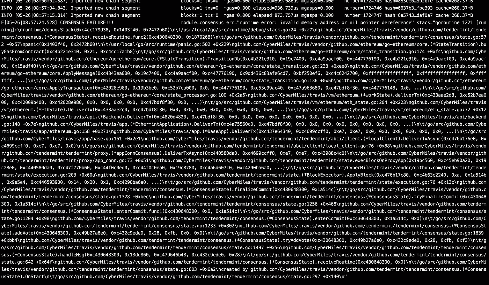
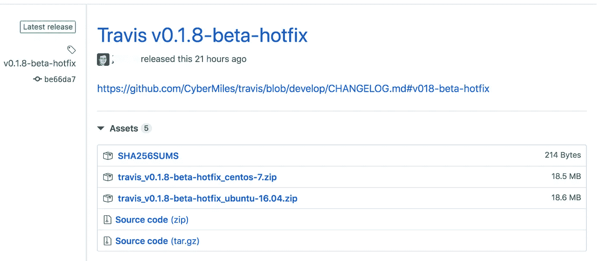
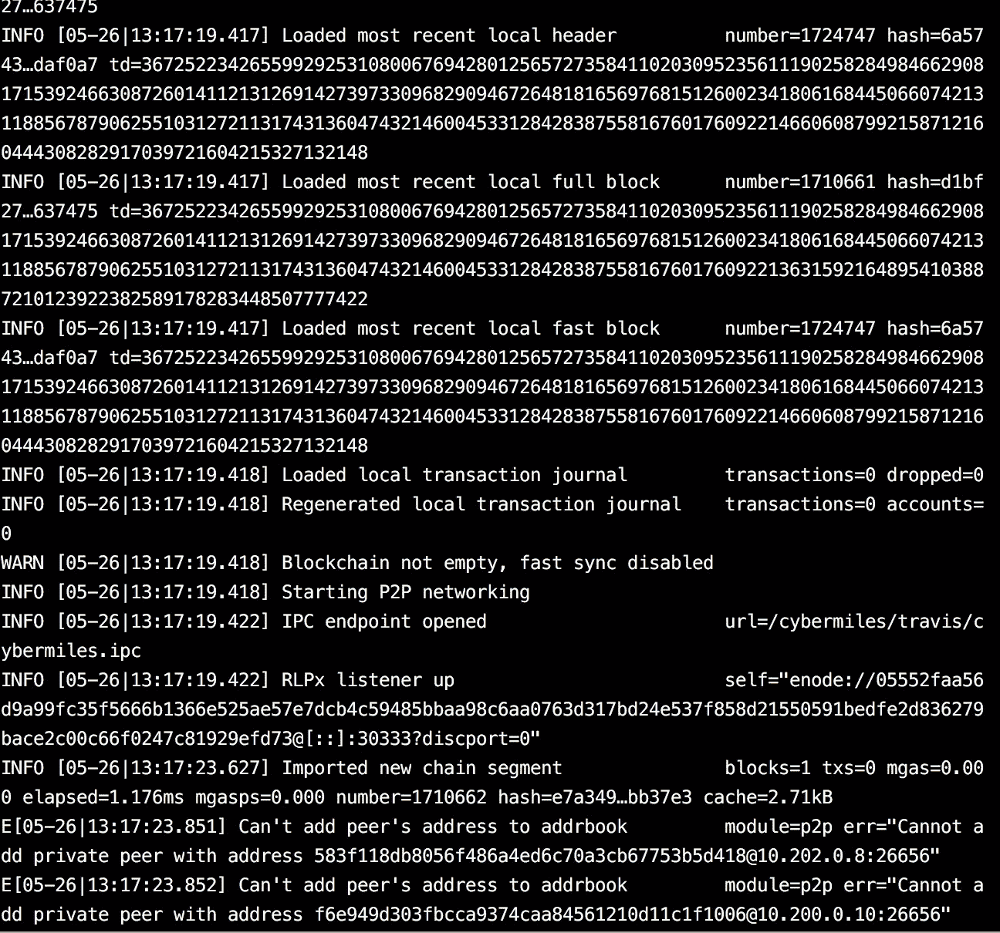

# 事后分析:CyberMiles 区块链服务中断事件

> 原文：<https://medium.com/hackernoon/postmortem-cybermiles-blockchain-service-disruption-incident-8ba65c3f410c>

总部设在区块链的 DPoS 和 dBFT 在过去一年中广受欢迎。与 PoW 区块链相比，DPoS 和 dBFT 替代品具有高性能、高能效、快速终结和几乎从不硬分叉等优势。

但是，一个值得注意但很少为人所知的权衡是，这些区块链可能会偶尔出现服务中断和不可用的情况。已经记录了 [EOS](https://www.trustnodes.com/2018/06/16/eos-stops-functioning-network) 、 [Steemit](https://unhashed.com/cryptocurrency-news/steemit-online-nine-hour-outage/) 、 [Stellar](/stellar-developers-blog/may-15th-network-halt-a7b933103984) 等的长时间服务中断。区块链的所有 dpo/dBFT 都会遇到这样的问题，这只是时间问题。

在这篇文章中，我们将使用一个对[区块链](https://cybermiles.io/)网络里程[最近服务中断](https://blog.cybermiles.io/post/20190527-incident-postmortem-en/)的事后分析作为一个例子来说明问题并提出潜在的解决方案。

2019 年 5 月 26 日，CyberMiles public 区块链遭遇技术故障，导致区块链运营暂停 17 个小时。在此期间，区块链没有接受或记录任何交易。**既没有数据丢失，也没有事务回滚。**

作为一个分散的公共区块链，CyberMiles 由全球 24 个验证者维护。任何软件变更都必须经过 23 名验证人员的批准和实施才能生效。区块链网络万里行的停机时间虽然令人遗憾，但由于有一组不同的独立验证者，它达到了通过协商一致来维护交易的安全性和完整性的目的。

事情是这样的。

美国东部时间 2019 年 5 月 26 日凌晨 5 点左右，一名用户在区块链网络英里(CyberMiles)上提交了一项创建智能合同的交易。该交易包含在地块高度 1724748 中。

> 当事务由每个区块链节点上的 CyberMiles 虚拟机(CVM)执行时，它触发了一个使 CVM 崩溃的错误。

具体来说，当用户请求在不支付汽油费的情况下执行交易时，CVM 的[“免费汽油”](https://www.litylang.org/gas/)规则检查交易的目标地址。但是，在智能合同创建事务的情况下，目标地址为空。

> 这导致软件抛出一个臭名昭著的空指针异常，使 CVM 崩溃。

所有 CyberMiles 节点在块高度 1724747 处停止，无法处理块高度 1724748。该问题被报告并上报给 CyberMiles 核心开发人员。

> 在台北的 CVM 开发人员立即着手解决这个问题，并制作了一个软件补丁。

区块链在北京和美国的工程团队随后对其进行了测试，并发布了新的软件版本 [v0.1.8-beta-hotfix](https://github.com/CyberMiles/travis/releases/tag/v0.1.8-beta-hotfix) 。核心开发人员已经准备好通知验证人员审查、批准和实现 v0.1.8-beta-hotfix。

> 然而，这时第二个问题出现了。由于空指针异常导致 CVM 崩溃，虚拟机异常关闭。

位于北京、洛杉矶和奥斯汀的运营团队发现，在这次崩溃之后，一些节点可能已经损坏了数据库文件。因此，直接重启新的二进制应用程序是不可能的。

出于充分的预防措施，工程团队决定建议所有节点按照 CyberMiles 的[快照快速同步程序](https://travis.readthedocs.io/en/latest/connect-mainnet.html#option-2-binary-from-snapshot)，从块高度为 1724748 的未损坏快照重启。

在社区中发现了块高度为 1724748 的具有所有验证程序签名的未损坏节点。压缩后的数据大小为 18GB。然后，来自该节点的数据快照在再次对社区可用[之前被审查、验证和确认。](https://s3-us-west-2.amazonaws.com/travis-ss-bucket/mainnet/travis_ss_mainnet_1558862782_1724747.tar)

美国东部时间下午 5 点，北美的第一批验证器节点带着更新软件 v0.1.8-beta-hotfix 上线。然而，如果没有 17 个有效验证器的法定人数(即块高度 1724748 处的 24 的 23 ),区块链就不能产生下一个块。当亚洲验证者在周一早上醒来时，法定人数在美国东部时间晚上 10 点达到。区块链服务，如 [CMT 钱包](https://www.cybermiles.io/en-us/blockchain-infrastructure/cmt-wallet/)、 [CMT 魔方](https://www.cybermiles.io/en-us/cmt/cmt-cube/)、 [CMT 追踪](https://www.cmttracking.io/)等，不久后全面恢复。

主要经验教训

*   CyberMiles 开发团队必须增加软件测试的覆盖面。
*   可以改进核心开发人员和验证人员之间的事件响应协调。在这种情况下，根本原因被很快地识别和修补，但是跨验证器的协调花费了很长时间。
*   多样化的验证器组提高了区块链的安全性，但由于难以达到法定人数，可能会延长服务中断时间。