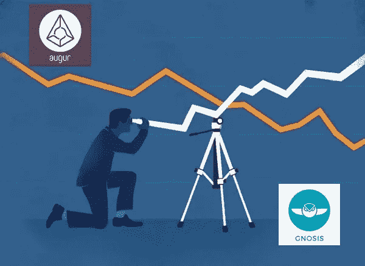
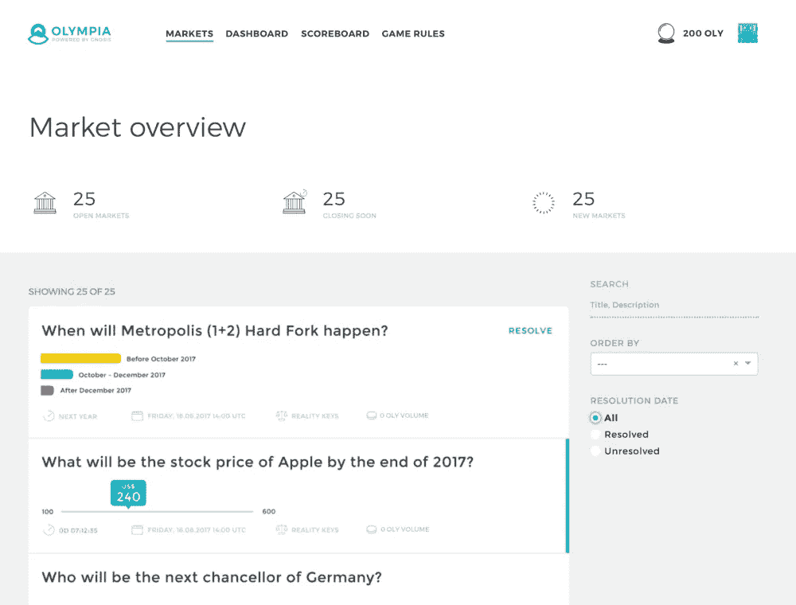

# 分散预测市场的实际应用

> 原文：<https://medium.com/hackernoon/practical-applications-of-decentralized-prediction-markets-cac0bcbd117>

## 加密货币驱动的市场如何扰乱赌博、金融、预测、科学研究和治理

# 介绍

2016 年初，我推测去中心化的预测市场可以让我们轻松地“谷歌”任何可以想象的事件发生的概率。  现在，第一个市场已经运行了 7 个月，是时候重新评估这项在当时还是理论上未经验证的技术的潜力了。

预测市场允许用户买卖特定事件结果的股票。事件发生后，持有准确事件结果份额的用户会得到奖励，而持有不准确事件结果份额的用户则会赔钱。在事件的结果确定之前，股票价格根据交易者的供给和需求在 0 和 1 之间波动，并且可以作为事件发生可能性的可靠估计。如果我以每股 5 美分的价格购买“Space X 将在 2024 年把人类送上火星吗”的“是”股票，市场估计这种情况发生的可能性为 5%，如果发生，我将能够以每股 1 美元的价格出售我的股票。

分散市场使用加密货币和智能合约在几个关键方面将自己与集中市场区分开来。用户不必向限制访问和管理市场创建的集中式服务注册，不需要注册，地球上的任何人都可以创建或参与任何类型的市场。市场不再依赖于由私人服务器上的封闭源代码运行的市场，而是由运行在公共区块链上的开放源代码实现自动化。用户不必信任一个集中的第三方来保管他们的资金，而是保持对他们资金的控制。

允许数十亿人轻松推测无限数量事件发生的可能性，可以使市场准入和先进的预测技术民主化。如果分散式预测市场成功实现大规模采用，社会将有能力以前所未有的规模挖掘和利用“群众的智慧”。

# 分散预测市场

## 占卜师

Augur’s User Interface

Augur 是世界上第一个推出的全功能分散预测市场，建立在以太坊的区块链之上。通过报告事件的结果，Augur 的信誉令牌(REP)持有者充当系统的分散式先知。他们是平台的关键部分，因为区块链依靠神谕来提供真实世界中发生的事件的信息。记者因准确报道而获得一定比例的交易费，因撒谎而被罚掉名誉。关于该项目的目标和技术架构的详细描述可以在 Augur 白皮书中找到。Robin Hanson 博士(“现代预测市场之父”)、Vitalik Buterin(以太坊创始人)、Ron Bernstein(Intrade 前 CEO)、Elizabeth Stark (Lightning Labs 创始人，硬币中心研究员)都曾担任该项目的顾问。

Augur 是第一批在以太坊上进行众筹的项目之一，它向早期采用者预售 REP token，以资助项目的开发。Augur 新颖地使用 REP 来实现完全去中心化，并在网络中执行关键功能，这有助于它在众多项目中脱颖而出，这些项目试图创建有价值的公用事业令牌，这些项目似乎是诈骗、抢钱或误导性的尝试，试图将令牌硬塞到不需要令牌的产品中。应用密码学顾问和以太坊怀疑论者 Peter Todd 评论说“Augur 是那些罕见的情况之一(实用令牌在技术上是有意义的)”。 [⁴](#49f9) Cryptoasset 分析师 Chris Burninske 和 Jack Tatar 写道:“augur 是加密令牌最明确的用途之一，它的潜在成功可能会为未来更多的加密令牌实现奠定基础。” [⁵](#d397)

## 灵知

An example market from the [Gnosis Olympia](https://blog.gnosis.pm/announcing-gnosis-olympia-5fb7e16dd259) prediction market tournament

Gnosis 是一个基于以太坊的预测市场协议，仍在开发中。Gnosis 的团队专注于创建开源工具，以帮助开发人员轻松构建针对不同用例的专门预测市场应用程序，而不是为所有类型的市场构建单一应用程序。⁶ 该团队还在努力获取在美国运营一家受监管交易所所需的许可证。

Gnosis 使用双令牌模型运行；GNO 代币可以被锁定以生成猫头鹰代币，每个代币在灵知交易平台上价值一美元的费用。Gnosis 不包括自己的 oracle，并且将兼容各种外部集中式和分散式 Oracle。Gnosis 荷兰交易所是一个分散的交易协议，将用于交易事件结果份额。⁷关于该项目的目标和技术架构的详细描述可以在 Gnosis 白皮书中找到。 [⁸](#b78d)

Gnosis 首席执行官马丁·克佩尔曼创建并出售了最大的基于比特币的预测市场 Fairlay。Vitalik Buterin、Robin Hanson 博士和以太坊联合创始人 Joseph Lubin 是该项目的顾问。该团队还与 Wedbush Securities 合作开发股票基本面预测应用程序。 [⁹](#ce9a)

# 应用程序

## 打赌

对体育或选举等热门事件下注是预测市场最明显的用例。除了加密货币价格投机之外，Augur 最受欢迎的一些市场是 2018 年美国中期选举、2018 年世界杯、2019 年奥斯卡奖和 2019 年超级碗。分散市场可以通过提供更大的市场创造和参与机会、更低的费用和用户对资金的托管来与传统的博彩服务竞争。

## 金融市场

分散预测市场允许用户在不拥有基础资产的情况下获得股票、商品或其他类型资产的敞口。这将使更多的人有比目前更多的金融工具可供选择。任何人都可以参与市场，无需任何人的许可，也无需依靠一个集中的中介来持有/转移他们的资金。

一个发展中国家的农民拥有一部手机、互联网接入、一家健康的企业和一些储蓄，但无法接触银行、美国股市或先进的金融服务，他可以通过押注股票价格运动的方向，从网络或移动应用程序将谷歌、特斯拉或苹果“添加”到他们的投资组合中。

美国的一名大学生只需点击几下鼠标，就可以接触到自己喜欢的股票，而无需注册经纪服务。他们不需要以超过 1000 澳元的价格购买 Alphabet 的全部股份，因为他们可能负担不起，他们可以购买一小部分“股份”，这是 Robinhood 等热门投资应用程序所不具备的功能。

想要从某个城市的房价波动中获利的投资者可以不直接投资房地产或通过基金投资，而是在市场上押注该地区的平均房价。个人和组织可以创建分散的保险应用程序，允许用户通过购买股票来对冲灾难发生的可能性。⁰ 理论上，几乎任何类别的金融衍生产品都可以利用分散的预测市场来构建。

## 预测

美国中央情报局 2007 年发表的一份报告指出，预测市场可以用来增强美国的情报能力。  该报告描述了谷歌、惠普实验室和加州理工学院、制药巨头 Eli Lily 和爱荷华选举市场(IEM)如何使用预测市场来预测产品发布、办公室开放、产品销售、药物试验结果和美国选举结果。  这些市场的表现往往优于官方公司预测和传统民调。例如，IEM 对 1988-2004 年美国总统选举结果的预测在 74%的时候比全国民调更准确。

加州理工学院的研究人员发现，基于预测市场的信息聚合机制(IAM)在预测英特尔未来的销售时，比该公司的官方预测更准确，准确率为 75%。福特汽车公司和谷歌的内部预测市场也超过了专家的预测。 [⁴](#0d75)

迄今为止，大多数关于预测市场的研究都来自于财力雄厚、拥有大量技术资源的机构:国家政府、大学和大公司。分散的预测市场将允许创业公司和其他中小型组织更容易地利用一个强大的工具，证明其效用。

## 科学研究

预测市场已经被用来有效地估计心理学研究的可重复性，评估经济研究的可复制性，以及预测专业研究评估的结果。 [⁵](#4ba6)

它们还可以用来资助科研人员，“奖励即时、诚实和无偏见地披露研究发现。”基于对研究问题的实际贡献而不是基于过去的表现来分配资金可能有助于克服诸如发表偏倚和信息披露延迟等问题。 [⁶](#2f19) 向全世界开放预测市场的创建和参与将显著提高研究人员及其资助者利用其能力的能力。

## 管理

包括四位诺贝尔奖得主和谷歌首席经济学家在内的一群经济学家认为，预测市场可以通过帮助企业和政府做出更准确的预测、更好的公司治理和国家政策决策来改善社会福利。他们告诫不要过度监管，因为过度监管会限制他们对社会的潜在好处，并主张为希望管理市场的某些类型的机构提供“安全港”地位。 [⁷](#15ab)

一个激进的应用是 Futarchy，这是一个通过民主投票选择社会目标的治理系统，而预测市场则用于确定将采取哪些政策来实现这些目标。⁸ 我们刚刚开始看到建立在分散预测市场上的未来系统的第一次严肃实验。Aragon 已经授予了 120，000 美元的资助，用于研究和开发他们的分散自治组织(DAO)管理平台的 futar 应用程序。 [⁹](#f430)

Ralph Merkle 是公钥加密的共同发明人，也是 Merkle 树的创建者，他写了一篇关于 DAOs、民主和治理的论文。⁰·默克尔描述了一种民族国家的治理体系，在这种体系中，预测市场将被用来决定应该采取哪些政策来提高“民主集体福利”得分，这一得分是通过对公民个人自我报告的幸福程度进行民意调查来计算的。像 Augur 和 Gnosis 这样的公共平台对开发者开放，可以让我们更容易地测试这些雄心勃勃的概念。

有些人可能会担心父权制会限制那些有可支配收入的人的参与。确定 futarchy 是一个合法的决策工具的政府或组织可以很容易地补贴参与成本，支付人们参与预测市场，以获得群体智慧的好处。

# 采用的障碍和潜在问题

## 用户体验和登机

这些平台必须对非加密货币爱好者开放，以实现其全部潜力。像比特币基地和 Cash App 这样的应用程序和交易所已经使购买、存储和使用加密货币的过程变得更加容易，但仍然需要进行大量的产品开发和消费者教育。auger 用户必须下载并同步一个桌面应用程序 Augur Node，才能使用该平台。主流采用将需要像大多数人日常使用的那样简单的 web 和移动应用程序。

正在开发一个新的浏览器内版本的占卜节点“占卜状态”。Veil 和 Guesser 是集中式平台，提供用户友好的界面，用于创建基于占卜的市场和预测并与之交互。Global 允许任何人轻松浏览市场。Helena 是建立在 Gnosis 基础上的一个应用程序，旨在为投资者提供一种简单的方法，让他们能够及时了解与商业、技术和法律主题相关的区块链事件和趋势。

## 市场流动性

自推出以来，整个 Augur 市场的低流动性导致交易活动水平不佳。在撰写本文时，该平台上所有市场的风险仅约为 200 万美元。这使得它很难用于任何人有兴趣投注大笔金钱。这也严重限制了 Augur 的潜在效用，因为市场将需要大量的人在其中下注，以便平均人们的偏差并提供可靠的估计。

随着时间的推移，这个问题可以通过使平台更容易使用、加入专门的做市商以及一旦平台可以轻松处理大量用户时的协同营销努力来解决。

## 区块链可扩展性

缺乏成熟的区块链扩展解决方案将成为中短期内采用的障碍。如果大量用户今天尝试使用 Augur，它可能会开始阻塞以太坊的区块链，导致交易时间变慢。链外订单簿、状态通道和侧链可用于在短期内提高性能，直到像分片这样的长期解决方案可用。

## 费用

Augur 的联合创始人乔伊·克鲁格详细描述了当前的收费情况以及它可能会如何随着时间的推移而演变。费用发生在:购买乙醚(~1.5% — 4%)，创造市场(~ 1–2%)，支付以太币气费(~3%)，处理乙醚的日常波动(~5%)。Joey 预计，做市商费用将趋向于 0，天然气费用将随着以太坊的规模而下降，波动性问题将通过支持稳定的公司(如 Augur 中的戴)来解决。

## Oracle 可靠性

到目前为止，Augur 的分散式 oracle 机制运行有效，但从长远来看，它可能会被证明是不可靠的。集中式 oracles 代表单点故障和潜在的漏洞。随着最近对美国中期选举措辞不当的市场的解决，我们有一些早期证据表明，奥格的神谕是灵活的，有能力支持市场的精神而不是市场的文字。

## 市场操纵

如果这些市场被广泛采用，将会有巨大的金融和社会激励来操纵它们。Augur 的白皮书中概述了许多攻击媒介。

## 非法和不道德的市场

人们可能会选择创建道德上可疑的市场。引起一些关注的一个例子是暗杀市场。 [⁴](#03fd) 对付这种情况的第一道也是最好的防线是依靠《预言家日报》的记者。如果大多数代表令牌掌握在不赞成创建和参与此类市场的人手中，那么记者可以宣布它们无效。

如果代表持有者未能关闭明显不道德的市场，执法部门有一系列工具可供其使用，以阻止暗杀市场的扩散。谷歌、Chainalysis、Neutriono 和 SEC 正在开发工具，用于对区块链的活动进行深入分析。 [⁵](#975c) 国土安全部甚至在寻找监控匿名加密货币的工具。 [⁶](#aed3) 鉴于这些工具的可用性和网络分析表明，随着时间的推移，用于非法目的的加密货币的使用已经下降，围绕这些类型市场的担忧可能被夸大了。 [⁷](#0f4b)

## 规章制度

严厉的监管可能会阻碍用户参与市场，尤其是如果政府决定实施彻底的禁令。由于“法律和监管方面的考虑”，Veil 目前在美国还没有上市。 [⁸](#b6e8) 最高法院最近的一项裁决[为各州允许商业体育博彩扫清了道路，表明可能有机会通过立法或司法系统创造一个更友好的监管环境。](https://www.nytimes.com/2018/05/14/us/politics/supreme-court-sports-betting-new-jersey.html) [⁹](#7085)

## 愚蠢的人群

研究人员已经发现了一些削弱群体智慧的方式。一项研究发现，高度自信的个人和持相似观点的外行人都是“观点的吸引者”，可以对人群产生重大的社会影响，并驱使群体远离真相。 [⁰](#b985) 另一项研究发现，通过“社会影响”、“范围缩小”和“信心”效应，对群体中其他人所做估计的了解会削弱群体的智慧。  虽然这些动态会影响预测市场的有用性，但分散式预测市场的特征可能会给它们带来一些阻力。

最近的研究表明，群体准确性的动态变化与群体的网络结构。在个人可以主导集体评估过程的集中网络中，群体评估变得不太准确。相反，在分散的通信网络中，由于信息交换，群体估计变得更加准确可靠。  似乎有理由预期，作为一般预测工具的分散预测市场的效用将取决于它们的规模、多样性以及参与者相互沟通和了解他们的同行如何下注的程度。

在人群中可能会发现各种潜在的系统性偏差(例如:理解大数的困难)，从而导致错误。了解人群的想法最终只是可以用来做出更准确预测的众多可用工具之一。

# 结论

我们正处于分散预测市场试验的早期。我们看到了它们在预测和金融市场中的潜在效用，但还没有看到任何将它们用于科学研究或治理的认真努力。当前版本的 Augur 是一个技术上令人印象深刻但效率低下的赌博工具，无法支持数亿或数十亿用户，而这些用户将使它成为一个真正改变世界的平台。

尽管如此，第一个市场已经运行了 7 个月，没有任何重大故障，这一事实是引人注目的。需要进行进一步的研究，以探索分散的预测市场在多大程度上能够比其集中的前身为更多的社会群体提供更多的好处。我们可能正在见证一场金融技术革命的诞生，以及一类应用的出现，这些应用可以在促进加密货币和开放区块链的大规模采用方面发挥重要作用。

## 参考

[【1】](#1b94)Shingai Thornton，《加密货币的实际应用:分散预测市场》， *Medium* (博客)，2016 年 1 月 12 日，[https://Medium . com/@ Shingai Thornton/Practical-Applications-of-Cryptocurrency-Decentralized-Prediction-Markets-95a 15 be 69 a 76](/@shingaithornton/practical-applications-of-cryptocurrency-decentralized-prediction-markets-95a15be69a76)

[2] Sheng Kung，Michael Yi，Mark Steyvers，Michael D. Lee，Matthew J. Dry，《组合问题中的群体智慧》，*认知科学* 36，第 3 期(2012 年 1 月):[https://online library . Wiley . com/doi/full/10.1111/j . 1551-6709 . 2011 . 01223 . x](https://onlinelibrary.wiley.com/doi/full/10.1111/j.1551-6709.2011.01223.x)

[3]杰克·皮特森、约瑟夫·克鲁格、米卡·佐尔图、奥斯丁·k·威廉姆斯、斯蒂芬妮·亚历山大，《奥格:一个去中心化的甲骨文和预测市场平台》，*预测基金会，*2018 年 7 月 12 日，[https://www.augur.net/whitepaper.pdf](https://www.augur.net/whitepaper.pdf)

[4]彼得·托德，*推特，*2017 年 10 月 3 日[https://twitter.com/peterktodd/status/915254130985156609](https://twitter.com/peterktodd/status/915254130985156609)

[5] Chris Burninske 和 Jack Tatar， [*Cryptoassets:创新投资者的比特币指南*](https://www.amazon.com/Cryptoassets-Innovative-Investors-Bitcoin-Beyond/dp/1260026671) (纽约:麦格劳希尔，2017)，64

[6]“灵知阿波罗”，*读了 Docs，*[https://gnosis-apollo.readthedocs.io/en/latest/index.html](https://gnosis-apollo.readthedocs.io/en/latest/index.html)

[7]“达奇克斯”，*读了 Docs，*[https://dutchx.readthedocs.io/en/latest/](https://dutchx.readthedocs.io/en/latest/)

[8] Gnosis，《Gnosis 白皮书》， *Gnosis Ltd.* ，2017 年 12 月 22 日，[https://gnosis.pm/assets/pdf/gnosis-whitepaper.pdf](https://gnosis.pm/assets/pdf/gnosis-whitepaper.pdf)

[https://www.pepperlaw.com/resource/30462/14C2](https://www.pepperlaw.com/resource/30462/14C2)

[10] Etherisc，《创造保险预测市场》，*Etherisc.com*(博客)，2017 年 12 月 8 日，[https://blog . Etherisc . com/Creating-Prediction-Markets-for-Insurance-5759484621 a](https://blog.etherisc.com/creating-prediction-markets-for-insurance-5759484621a)

[11] Puong Fei Yeh，“利用预测市场增强美国情报能力”:情报的“标准普尔 500 指数”，*中央情报局，*最后更新:2008 年 6 月 26 日，[https://www . CIA . gov/library/center-for-the-study-of-Intelligence/CSI-publications/CSI-studies/studies/vol 50no 4/Using-Prediction-Markets-to-Enhance-US-Intelligence-Capabilities . html](https://www.cia.gov/library/center-for-the-study-of-intelligence/csi-publications/csi-studies/studies/vol50no4/using-prediction-markets-to-enhance-us-intelligence-capabilities.html)

[12]博·考吉尔(Bo Cowgill)，*谷歌官方博客，*2005 年 9 月 21 日，[https://Google Blog . blogspot . com/2005/09/puting-crowd-wisdom-to-work . html](https://googleblog.blogspot.com/2005/09/putting-crowd-wisdom-to-work.html)；

Charles R. Plott 和 Kay-Yut Chen，“信息聚合机制:销售预测问题的概念、设计和实现”，*加州理工学院*(未出版)，2002，；

Joyce E.Berg，Forrest D.Nelson Thomas A.Rietz“长期预测市场准确性”*国际预测杂志* 24，第 2 期，(2008 年 4 月):285–300，[https://www . science direct . com/science/article/pii/s 0169207008000320](https://www.sciencedirect.com/science/article/pii/S0169207008000320)

[http://www . forecasting principles . com/files/Berg _ Nelson _ Rietz _ 2007 . pdf](http://www.forecastingprinciples.com/files/Berg_Nelson_Rietz_2007.pdf)

[13] Benjamin J. Gillen，Charles R. Plott，Matthuew Shum，“信息聚合机制领域:英特尔内部的销售预测”，*麻省理工学院经济学，*(2012 年 10 月)，[http://economics.mit.edu/files/8299](http://economics.mit.edu/files/8299)

[14] Bo Cowgill，Eric Zitzewitz，“公司预测市场:来自谷歌、福特和 X 公司的证据”，*《经济研究评论》*，第 82 卷，第 4 期，(2015 年 10 月)，第 1309-1341 页，[https://academic . oup . com/restud/article-abstract/82/4/1309/2607345？redirectedFrom=fulltext](https://academic.oup.com/restud/article-abstract/82/4/1309/2607345?redirectedFrom=fulltext)

[http://www . restud . com/WP-content/uploads/2015/03/ms 14671 manuscript . pdf](http://www.restud.com/wp-content/uploads/2015/03/MS14671manuscript.pdf)

[15]安娜·德雷伯、托马斯·菲佛、约翰·阿尔曼伯格、西里·伊萨克森、布拉德·威尔森、陈一玲、布赖恩·a·诺塞克和马格努斯·约翰内松，“使用预测市场来估计科学研究的可重复性”， *PNAS，*(2015 年 12 月)*，*[https://www.pnas.org/content/112/50/15343.abstract](https://www.pnas.org/content/112/50/15343.abstract)

Anna Dreber，Eskil Forsell，Teck-Hua Ho，“评估经济学中实验室实验的可复制性”， *Science* 351 *，*第 6280 期，(2016 年 3 月)*:*1433–1436*，*[http://science.sciencemag.org/content/351/6280/1433/tab-pdf](http://science.sciencemag.org/content/351/6280/1433/tab-pdf)

Marcus R. Munafo，Thomas Pfeiffer，Adam Altmejd，“使用预测市场预测研究评估”，*皇家学会，*(2015 年 10 月)，[https://royalsocietypublishing.org/doi/10.1098/rsos.150287](https://royalsocietypublishing.org/doi/10.1098/rsos.150287)

[16] Johan Almenberg，Ken Kittlitz，Thomas Pfeiffer《科学中预测市场的一个实验》， *PLOS 一中，*(2009 年 12 月)，[https://journals.plos.org/plosone/article?id = 10.1371/journal . pone . 0008500](https://journals.plos.org/plosone/article?id=10.1371/journal.pone.0008500)

[17]肯尼斯·J·阿罗，托马斯·谢林，罗伯特·j·席勒，弗农·L·史密斯，卡斯·r·桑斯坦，哈尔·r·瓦里安，“预测市场的承诺”，*科学* 320，第 5878 期，(2008 年 5 月):877–878，[https://citeseerx.ist.psu.edu/viewdoc/download?doi = 10 . 1 . 1 . 320 . 1811&rep = re P1&type = pdf](https://citeseerx.ist.psu.edu/viewdoc/download?doi=10.1.1.320.1811&rep=rep1&type=pdf)

[18]罗宾·汉森，“我们要不要以价值观投票，而以信仰打赌？”，*《政治哲学杂志》，*(2007 年 10 月)【https://citeseerx.ist.psu.edu/viewdoc/summary?】， [doi=10.1.1.71.8309](https://citeseerx.ist.psu.edu/viewdoc/summary?doi=10.1.1.71.8309)

[19]阿拉贡，《阿拉贡之巢:第三轮拨款》，*阿拉贡博客，*2018 年 10 月 25 日，[https://blog.aragon.org/aragon-nest-third-round-of-grants/](https://blog.aragon.org/aragon-nest-third-round-of-grants/)

[20]拉尔夫·默克，《道、民主与治理》，*Merkle.com*，2016 年 5 月，[http://merkle.com/papers/DAOdemocracyDraft.pdf](http://merkle.com/papers/DAOdemocracyDraft.pdf)

*【21】面纱，*[https://veil.co/](https://veil.co/)；

*猜测者，*https://www.guesser.io/；

*海伦娜，*https://Helena . network

[22]乔伊·克鲁格，“费用、费用和……费用？”，*中*(博客)，2018 年 8 月 8 日，[https://Medium . com/@ joeykrug/fees-fees-and-fees-8939 C2 b5 ecae](/@joeykrug/fees-fees-and-fees-8939c2b5ecae)

[23]本杰明·罗伯茨，*推特，*2019 年 2 月 1 日[https://twitter.com/benjmnr/status/1091355105822162944](https://twitter.com/benjmnr/status/1091355105822162944)

[24]大卫·弗洛伊德(David Floyd)， *Coindesk，*2018 年 7 月 25 日，[https://www . coin desk . com/The-First-Augur-assistance-Markets-has-arrival](https://www.coindesk.com/the-first-augur-assassination-markets-have-arrived)

[25]迈克尔·德尔·卡斯蒂略(Michael del Castillo)，《导航比特币，以太坊，XRP:谷歌如何悄无声息地让区块链变得可搜索》，*福布斯，*2019 年 2 月 4 日，[https://www . Forbes . com/sites/michaeldelcastillo/2019/02/04/Navigating-比特币-以太坊-xrp-How-Google-Is-quiet-Making-区块链-Searchable/](https://www.forbes.com/sites/michaeldelcastillo/2019/02/04/navigating-bitcoin-ethereum-xrp-how-google-is-quietly-making-blockchains-searchable/)；

【https://www.chainalysis.com/】chain analysis，[chain analysis](https://www.chainalysis.com/)；

*中微子*， [https://www .中微子. nu](https://www.neutrino.nu)；

证券交易委员会收购办公室，《区块链数据》，*联邦商业机会，*最后修改 2019 年 1 月 31 日，[https://www.fbo.gov/index?s=opportunity&mode = form&id = c 18 a 03 f 93 cf 06 df 47 dab 8 a 1 C1 a7 f 87 a 9&tab = core&_ cview = 0](https://www.fbo.gov/index?s=opportunity&mode=form&id=c18a03f93cf06df47dab8a1c1a7f87a9&tab=core&_cview=0)

[26]国土安全部首席采购官办公室“国土安全部小企业创新研究”，*联邦商业机会，*最后修改 2018 年 11 月 30 日[https://www.fbo.gov/index?s=opportunity&mode = form&id = 7 ed 0 C5 e 2d f 7 e 26 FFB 5 C1 dee 3 CEA 171&tab = core&_ cview = 0](https://www.fbo.gov/index?s=opportunity&mode=form&id=7ed0c5ef2df7e26ffb5c1dee3ceaa171&tab=core&_cview=0)

[27]亚当·海斯，邵文·莉雅，保罗·塔斯卡，《比特币经济的进化:提取和分析支付关系网络》， *SSRN，*(2016 年 7 月)，[https://ssrn.com/abstract=2808762](https://ssrn.com/abstract=2808762)

[28]保罗·弗莱彻-希尔，《介绍面纱》，*面纱博客，*2019 年 1 月 8 日，[https://medium.com/veil-blog/introducing-veil-649036f9d492](/veil-blog/introducing-veil-649036f9d492)

[29]亚当·利普塔克(Adam Liptak)和凯文·德雷珀(Kevin Draper)，*纽约时报，*2018 年 5 月 14 日，[https://www . nytimes . com/2018/05/14/us/politics/Supreme-Court-Sports-Betting-New-jersey . html](https://www.nytimes.com/2018/05/14/us/politics/supreme-court-sports-betting-new-jersey.html)

[30]迈赫迪·穆萨·德、朱丽安·e·卡默、潘特利斯·p·分析、汉斯约格·奈思，“社会影响和舆论形成的集体动力”， *PLOS 一号，*(2013 年 11 月)，[https://journals.plos.org/plosone/article?id = 10.1371/journal . pone . 0078433](https://journals.plos.org/plosone/article?id=10.1371/journal.pone.0078433)

[31]扬·洛伦茨、海科·劳胡特、弗兰克·施韦策和德克·赫尔宾，“社会影响如何破坏群体效应的智慧”， *PNAS，*(2011 年 5 月)，[https://www.ncbi.nlm.nih.gov/pmc/articles/PMC3107299/](https://www.ncbi.nlm.nih.gov/pmc/articles/PMC3107299/)

[32]约书亚·贝克尔、德文·布拉克比尔、达蒙·森托拉，《群体智慧中社会影响力的网络动力学》， *PNAS，*(2017 年 10 月)，【https://www.pnas.org/content/114/26/E5070】T2