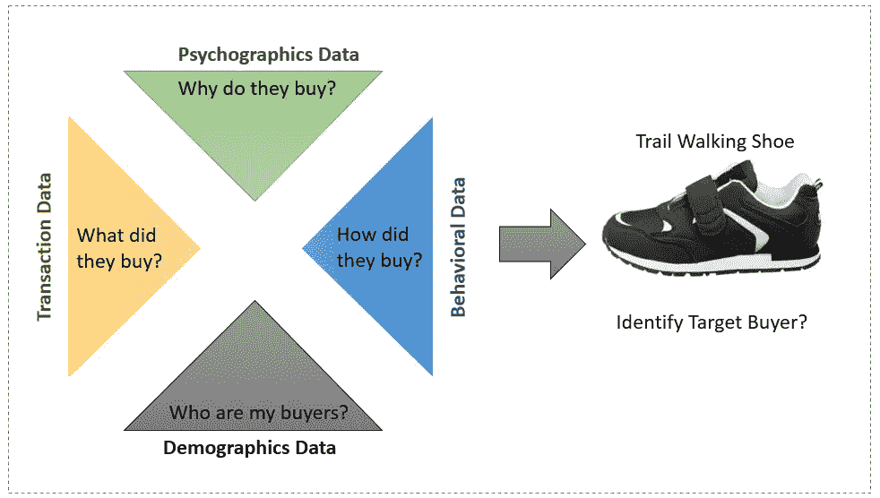
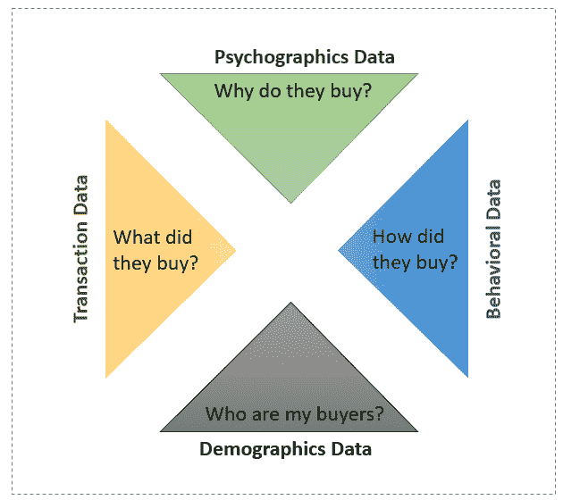
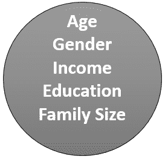
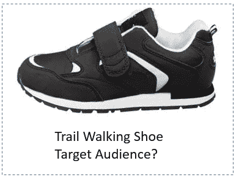
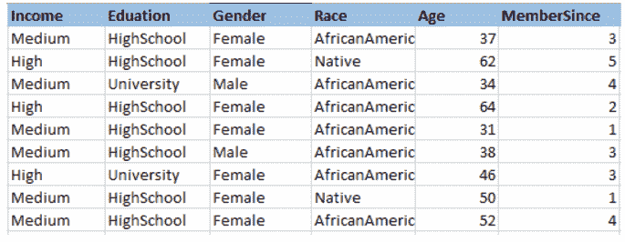
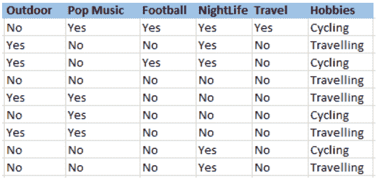

# 预测模型的实用数据扩充技术

> 原文：<https://medium.com/hackernoon/practical-data-augmentation-techniques-for-predictive-models-b51599253c30>

在分析客户购买产品的倾向或客户对营销活动和相关用例的反应倾向时，有四种信息对于创建出色的预测模型非常重要。

1.  谁是我的买家？这通常是带有诸如客户年龄、性别等信息的人口统计数据。
2.  他们为什么购买？这通常是心理数据，其中包含诸如他们是否喜欢旅行、户外活动等信息。
3.  他们买了什么？这通常是在商务系统中捕获的交易数据。
4.  他们是怎么买的？这通常是在商业/日志分析系统中获得的行为数据。

**人口统计数据**显示谁是你的客户。人口统计显示你的受众是谁，包括年龄、性别、教育、职业、收入、婚姻状况、工作、宗教、家庭规模等等。一个简单的思考方式是，一个男性，年龄在 35 到 45 岁之间，已婚，有孩子，家庭收入超过 75000 美元，有体重问题。

**心理数据**帮助你了解他们购买的原因。心理信息可能是你的买家的习惯、爱好、消费习惯、信仰、个性特征、态度、生活方式和价值观。添加这些信息的基本目标是了解我们的产品、服务或品牌如何融入顾客生活。他们的日常价值观、他们每天面临的挑战、他们的犹豫不决&他们的态度通常会影响购买行为。一个简单的思考方式是，用户拥有积极的生活方式，关心自己的外表，饮食健康，重质量轻价格，喜欢工作和个人生活的平衡，喜欢和朋友出去玩。

让我们来看一个零售公司的例子，他们正在寻求推广其新的高端 trail walking 鞋。从人口统计数据来看，这家公司的目标人群可能是年龄在 28 岁至 35 岁之间、平均年收入为 75，000 美元的人。仅仅这些信息并不意味着太多，因为该人口统计中的许多人可能想坐在家里看电视，而不关心在小路上行走。

这就是心理学信息发挥作用的地方。心理图形可以传达这样的信息:你的买家有一份稳定的职业，喜欢旅行，平日经常去健身房，是个超级足球迷，周末会去体育酒吧。

结合人口统计学和心理统计学，你可以更清楚地了解谁购买了你的产品，以及他们购买的原因。购买决定受到一个人的信仰、原则和态度的影响。这就是为什么用人口统计和心理特征来扩充你的数据很重要的主要原因之一。

**采购人口统计数据**

有多种方法获取人口统计数据。这可能是人口统计或个人统计。人口统计就是获取客户所在的邮政编码，并获得邮政编码中的人的适当信息，作为客户统计的代理。与根本没有任何人口统计数据相比，这是一个不错的近似值。这些数据可以从人口普查数据中获得，也可以从 ESRI 这样的供应商那里购买。

另一方面，人们也可以通过从 Experian 等第三方提供商购买个人数据来购买特定的个人资料。这种数据的好处是它是个性化的，但在将客户与其相应的数据唯一对应起来方面确实存在挑战。

**获取心理数据**

这种数据总是很难获得。这些数据可能来自做研究的机构。在最近的过去，这些数据大部分来自像脸书这样的社交媒体网站。喜欢特定品牌、特定名人、特定运动和其他特定页面的客户具有特殊的意义。根据他们访问或喜欢的网页，人们可以将他们描述为喜欢旅行、喜欢流行音乐、热爱夜生活和喜欢科幻电影等的人。

**简单分割示例**

有了这类信息，零售商可以更好地预测和服务他们的客户需求。我将在这方面写一篇单独的文章，但想在这里做一个总结。例如，他们可以

1.  细分市场(KMeans 聚类)，按人口统计和心理特征分类的客户。分析每一个细分市场，了解他们想要什么以及他们如何想要。这有助于他们根据自己的独特需求，更好地服务和定位细分市场。
2.  利用这一点，他们可以进一步了解他们感兴趣的其他产品。我应该开一家新店吗？顾客愿意走多远才能到达我的商店？
3.  此外，根据客户的细分特征，个性化产品和沟通特征。这可能是产品颜色、尺寸、产品图片、最佳通话时间、最佳通话模式等。等等。

在**的总结**中，预测模型受益于收集关于用户的额外信息，这些信息真正捕捉到了客户是谁以及他们为什么想要购买。此类信息有助于提高模型的准确性，并帮助零售商为其最终客户提供个性化服务。记住一个模型和作为学习的输入一样好。捕捉购买者意图的信息越好，模型就越好。