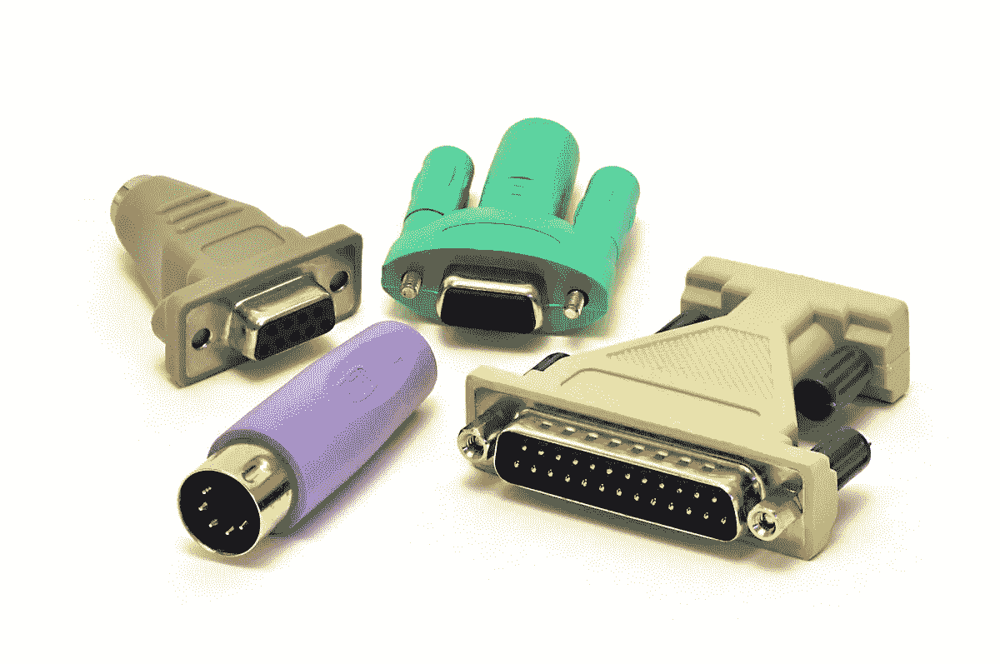
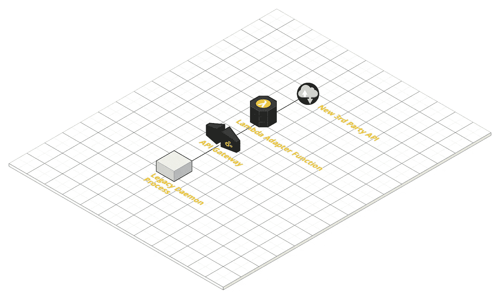
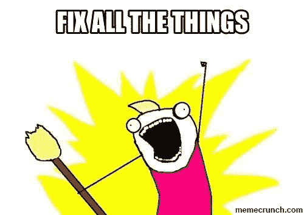
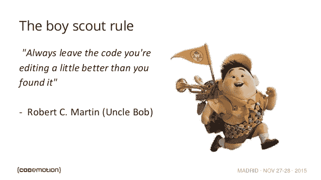

# 如何在遗留软件的混乱中生存和发展的实用技巧

> 原文：<https://medium.com/hackernoon/practical-tips-for-how-to-survive-and-thrive-in-the-chaos-of-legacy-software-343df55d09c8>


虽然我们都喜欢致力于新技术、漂亮干净的代码，并且总是过着轻松的生活——但情况并非总是如此。

在我们职业生涯的某个时刻，我们必须揭开遗留软件系统的面纱，凝视其下的东西…


“Oh wow… Struts 1, SOAP and ANT with no dependency management… Beautiful… 🤮”

我们能做些什么来让这种有点不太好的*情况变得稍微可以忍受一点呢？*

# *docker…docker 所有的东西*

**

*[**Docker**](/@yannmjl/what-is-docker-in-simple-english-a24e8136b90b) 是一个工具，旨在通过使用容器来更容易地创建、部署和运行应用程序。容器允许开发人员将应用程序与它需要的所有部分打包在一起，比如库和其他依赖项，并作为一个包发送出去。*

*将 Docker 整合到一个项目中应该像反射一样成为*，我建议这是你要做的第一件事——甚至在你写任何实际代码之前。**

****举个例子:**你需要维护一个运行在过时的应用服务器上的应用，没有测试，没有依赖管理。您需要与团队中的其他人共享这个软件环境，但是安装依赖项是一项相当大的工作。**

****解决方案:**编写一个`Dockerfile`用于部署应用程序及其依赖项。为与运行环境*(例如开发数据库)*相关的任何东西创建一个 Docker 容器/映像，并使用类似[**Docker-Compose**](https://docs.docker.com/compose/)**的东西在您的多容器开发环境中编排容器。****

******好处:******

*   ****现在，您可以轻松地与团队中的其他人共享软件环境，他们可以相对较快地开始使用应用程序。****
*   ****环境由`Dockerfile`记录，以防需要在其他地方复制。****
*   ****可以针对 Docker 容器编写验收测试，并且可以为应用创建 CI 管道，而无需 CI 服务器要求应用运行于其中的软件环境的任何知识。****
*   ****您已经为生产中应用程序的容器化部署打开了一个选项。****

****这是我过去参与的一个项目中的一个玩具例子。该项目使用 [GlassFish](https://javaee.github.io/glassfish/) 作为应用服务器， [Ant](https://ant.apache.org/) 来构建项目，并且没有依赖管理或单元测试:****

******Dockerfile:******

```
****FROM glassfish:latestLABEL maintainer="andymacdroo"COPY dist/App.war /App.warCOPY lib/mysql-connector*.jar /usr/local/glassfish4/glassfish/domains/domain1/lib/ext/
COPY scripts/configure-glassfish-datasource.sh /configure-glassfish-datasource.sh
COPY scripts/deploy-war.sh /deploy-war.sh
RUN /configure-glassfish-datasource.shEXPOSE 4848 8080 8181# Start asadmin console and the domain
CMD ["/deploy-war.sh"]****
```

****而要构建，只需在项目的目录下运行:
`docker build -t andymacdroo/app .`****

******deploy-war.sh:******

```
****#!/bin/shasadmin start-domain
asadmin -u admin deploy /App.war
asadmin stop-domain
asadmin start-domain -v****
```

******configure-glassfish-data source . sh**:****

```
****#!/bin/shasadmin start-domain
asadmin create-jdbc-connection-pool --user admin  --restype javax.sql.DataSource --datasourceclassname com.mysql.jdbc.jdbc2.optional.MysqlDataSource --property "user=root:password=root:url=jdbc\\:mysql\\://mysql\\:3306/myDB" myDB;
asadmin create-jdbc-resource --user admin  --connectionpoolid myDB jdbc/myDB
asadmin stop-domain****
```

******docker-compose.yml******

```
****version: '3'services:
  mysql:
    image: mariadb:10.3
    container_name: mariadb
    volumes:
      - container-volume:/var/lib/mysql
      - ./data/dump.sql:/docker-entrypoint-initdb.d/dump.sql
    environment:
      MYSQL_ROOT_PASSWORD: root
      MYSQL_DATABASE: myDB
    ports:
      - "3306:3306"
  myApp:
    image: andymacdroo/app:latest
    container_name: app
    ports:
      - "4848:4848"
      - "8082:8080"
      - "8083:8081"
    links:
      - mysqlvolumes:
  container-volume:****
```

****通过这种设置，该环境可以很容易地移植到团队中的其他人，并且完全是一次性的*(您也不需要用过时的软件弄脏自己的开发机器*🤢*)。*****

# ****适配器模式****

****您真的需要在遗留项目中编写任何代码吗？你能完全避免这样做吗？****

****将当前的遗留代码或应用程序视为您无法控制或更改的第三方可能会有所帮助。你能做什么？****

********

****在许多情况下，您可以利用[适配器设计模式](https://sourcemaking.com/design_patterns/adapter)——获取遗留软件输出，并将其转换为新应用程序或您要迁移到的系统可以使用的形式。****

******例如:**您需要迁移一个从队列中获取数据并进行 API 调用的遗留守护进程，以便对另一个第三方 API 进行这些 API 调用。****

*   ****代码没有任何类型的单元测试，非常难以阅读，并且有许多嵌入的业务逻辑和分支。****
*   ****旧系统和新的第三方系统之间的请求主体有很大不同。****

******解决方案:**编写一个适配器函数插入到*传统守护进程*和新的第三方 API 之间——这个适配器的工作是将当前生成的请求体转换成第三方可以消费和理解的形式，并将其转发给第三方。****

****然后，您只需要将遗留流程指向新的适配器函数，剩下的工作就交给它了。****

********

*   *****注意:*考虑使用无服务器平台实现您的适配器，例如 [AWS Lambda 或 Google Cloud 函数。](/@manus.can/serverless-platform-comparison-google-cloud-function-vs-aws-lambda-8e060bcc93b4)****

# ****做脑外科医生，不要做压路机****

********

****接受一个遗留项目并开始彻底改变一切是非常诱人的。****

********

****但是如果没有好的测试*(大多数遗留代码似乎都没有)*，如何保护你不引入缺陷或者在很大程度上改变功能？****

****编写看似缺失或损坏的测试，但如果这不切实际，只改变**必须**改变的内容。****

****想象自己是一名脑外科医生，在一个没有人完全理解的极其复杂的器官上精细地进行显微手术。****

********

> ****你不会真正理解调试一个遗留应用程序的痛苦和焦虑——在你不经意地实施了一个大规模的彻底改变并且在生产中出现了一个关键事件之后，直到它发生在你身上。****
> 
> ****相信我，这不是一次有趣的经历……*😢*****

****并且，如果您正在编写额外的测试…****

## ****TDD —红色、绿色、重构****

********

1.  ****为给定的功能/特性单元编写测试。****
2.  ****运行测试；确保您新添加的测试**失败。******
3.  ****编写通过测试的最少代码量*(这里不关心代码质量)——*运行测试并确保它通过。****
4.  ******重构**你的代码*(现在又关心代码质量了！)*；
    重新运行您的测试，确保您的代码仍然通过*。*****

****[](/@andrewjamesmacdonald/tdd-paint-by-numbers-programming-6e09b89ca35b) [## TDD:通过数字编程绘画

### 规划出你需要编写的测试，实现代码，然后继续下一个测试。最终你会得到一件艺术品。

medium.com](/@andrewjamesmacdonald/tdd-paint-by-numbers-programming-6e09b89ca35b) 

# 开发者的“希波克拉底誓言”:

## 童子军规则


新获得资格的医生通常遵守承诺/誓言:

> “首先不要伤害别人”——首先，不要伤害别人

对于开发者来说，我们应该更进一步，遵循童子军规则:



Boy Scouts believe in leaving the campground cleaner than it was found, developer’s should embrace this with the code they work on

这是因为一个简单的原因:*《破窗理论》*:

> 一扇破碎的窗户，如果长时间不修理，会给人一种被遗弃的感觉。所以又一扇窗户被打破了。人们开始乱扔垃圾。涂鸦出现。严重的结构破坏开始了。在相对较短的时间内，建筑物的损坏超出了所有者修复它的愿望，被遗弃的感觉变成了现实— *詹姆斯·q·威尔逊和乔治·凯林(1982)*

如果我们偷工减料，不努力维护项目，同样的情况会发生在任何代码库上:当机会出现时，避免偿还技术债务。

你希望这最终发生在你的新项目上吗？


所有遗留的代码和软件在某个时候都是作为一个崭新的闪亮的项目开始的。

像对待任何新的闪亮的项目一样对待遗留项目。务实一点，*有时候我们不得不*，但不要把事情搞得更糟。

> 感谢您的阅读。我希望这篇文章为您提供了一些技巧，帮助您克服在遗留应用程序上工作的困难。*😀*****