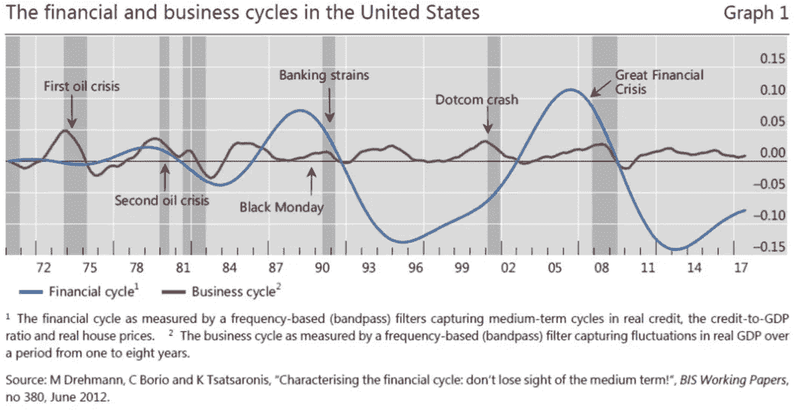

# 黑客经济学

> 原文：<https://medium.com/hackernoon/predator-prey-economics-2b2c0272d472>

如果捕食者-猎物经济学作为一个研究领域存在，它将从 [*资源竞争动力学*](https://books.google.com/books?hl=en&lr=&id=Xu-H0ClCHN8C&oi=fnd&pg=PR5&dq=Evolutionary+Games+and+Population+Dynamics+by+Josef+Hofbauer+and+Karl+Sigmund.&ots=EVUGogzT8f&sig=uSuOiBz52ZnbiRggyWfEbofT0Lc#v=onepage&q&f=false) *的角度解决人类经济互动。* [*【掠食者-猎物】*](http://www.tiem.utk.edu/~gross/bioed/bealsmodules/predator-prey.html) *至少从 1967 年起就被应用于* [*模型*](https://en.wikipedia.org/wiki/Goodwin_model_%28economics%29) *增长周期以及后来，债务 vs 资本，其最直观的用途，考虑到前者以后者为食才能生存。当债务利息的内部收益率(IRR)高于资本的经常性收入时，这种模型的使用甚至更有意义。在这种情况下，它们的“捕食者-猎物”动态产生一个***不稳定的反馈系统。这正是* [*图*](http://www.bis.org/publ/work456.pdf) *1 所传达的结果，也是海曼明斯基 1985 年的* [*金融不稳定假说*](http://www.levyinstitute.org/pubs/wp74.pdf) *所预见的结果:杠杆率与收入之比在一波越来越大的振幅中呈指数增长。然而，在一个由铁杆凯恩斯主义者(不是后凯恩斯主义者* *的* [*)统治的世界里！)，在我们真正的*](https://www.cnbc.com/id/46896156) [*明斯基时刻*](https://en.wikipedia.org/wiki/Minsky_moment) *到来之前，展示我们这一代人的超明斯基周期的每个阶段的图表及其对未来的可怕预测都不会出现，这是唯一合适的。**

**

*[**Bank for International Settlements**](https://www.bis.org/speeches/sp160210_slides.pdf)*

*图表上显示的指数 IRR 函数的循环行为似乎是独立产生的，直到我们使用捕食者-被捕食者动力学来探索相互依赖性。我们发现他们正在追踪一个不稳定的反馈系统[【6】](/@olairet_86089/predator-prey-economics-f5f16b1d4e47#_ftn6)，在经济学中更为人所知的是明斯基的债务与资本的长周期模型[【4】](/@olairet_86089/predator-prey-economics-f5f16b1d4e47#_ftn4)，其中本金+利息(蓝色的信贷与 GDP 之比)追踪捕食者的规模，而资本+收入(红色的 GDP)追踪猎物的规模。巧合的是，只要看一眼图表就能解释为什么格林斯潘和所有后来的 G7 央行行长在 1985 年后开始了他们几乎不加掩饰的降息竞赛。然而，较低的利率并不能阻止系统的杠杆率飙升，在每次金融危机后，中央银行正式(通过 QE)或[而不是](https://www.rstreet.org/2019/01/10/the-fed-is-technically-insolvent-should-anybody-care/)将受损贷款交换为新的主权债务。*

*总之，这张图表与明斯基的长周期模型的惊人吻合表明，在 1971 年 8 月 15 日**，世界发达经济体释放了一个破坏性的反馈系统，现在正接近其最后阶段。然而，要得出这个结论，需要使用我们为分析非人类生态系统保留的方法。因为当涉及人类经济互动，而不是非线性数学时，我们应用政治动机的学说，伪装成科学。一个导致更多观察的事实:***

**科学与非科学的区别在于解释的余地。[【1】](#_ftn1)**

**尽管自亚当·斯密的原始理论以来，经济学引入了许多吸引人的概念，但静态假设只能随机描述人类互动的非线性本质。然而，21 世纪已经过去了 20 年，我们仍然在应用严重不足的算术公式来管理我们的全球资源，尽管我们知道，比如，20 世纪 20 年代开发的一对简单的常微分方程可以帮助我们追踪和理解决定金融和商业周期的高指数和低指数 IRR 相互依赖关系。因此，我们没有让经济学为几十亿人服务，而是让它成为了每个耍蛇人的典型魔杖(除了他强制性的 64，000 支蜡笔——误导指标的例子[【2】](#_ftn2))。**

**奇怪的是，让经济学服从科学的严谨可以拯救数百万人的生命。**

**随着支配经济的真实动态对每个人都变得显而易见，像委内瑞拉、阿根廷或巴西那样的魔术师将很快被认出来。甚至 G7 央行的意图也立即变得透明:例如，在上面的国际清算银行图表中，请注意，自 70 年代以来，美国的金融和商业周期正在追踪一种不稳定焦点的掠食者-猎物动态模式[【3】](#_ftn3)(***一种在最初的冲击*** 后不断偏离平衡的系统)，这在今天被更好地称为明斯基的“长周期”。[【4】](#_ftn4)”**

*** W *我写第一版 i* n *2015 的时候，三个都在* [*倒数 10%*](https://en.wikipedia.org/wiki/List_of_countries_by_real_GDP_growth_rate)**

****好消息是，人类经济学遵循所有生物共有的自然法则，我们已经知道其中一些法则是如何运作的。****

**坏消息是明斯基的“长周期”追踪自上而下控制的捕食者-猎物动态。因此，随着央行/政府的无限救助使得无限掠夺成为可能，捕食者-猎物比率呈指数级上升，直到完全崩溃([明斯基时刻](https://en.wikipedia.org/wiki/Minsky_moment))。虽然在自然界中极其罕见，但 Arditi-Ginzburg 的论文[6]简洁地描述了这一过程:“对于非常高效的捕食者来说，唯一可能的结果是系统的完全灭绝:捕食者在耗尽猎物后灭绝。”幸运的是，在债务对资本的情况下，掠夺者规模崩溃只意味着随着过度债务崩溃，过度资产价格消失，一个全新的周期开始，猎物规模(GDP)最初不受挑战地增长(自下而上受控)，就像自然界发生的那样。**

**除非一个人倾向于感性关联，否则肯定有一百个更好的定义**

**[【2】](/@olairet_86089/predator-prey-economics-f5f16b1d4e47#_ftnref2)[统计需要去除趋势](http://people.duke.edu/~rnau/411home.htm)，因为数据提供者倾向于选择模式(名义、百分比变化、指数、总和、平均值等)。)或参数(价格、时间、相关单位)来支持他们的断言，但可能在统计上不相关或在数学上没有意义**

**[【3】](/@olairet_86089/predator-prey-economics-f5f16b1d4e47#_ftnref3)[洛特卡-沃尔泰拉](http://www.math.harvard.edu/library/sternberg/slides/11809LV.pdf)(1925–26)常微分方程最初被用来研究第一次世界大战后鱼类种群中的捕食-被捕食动力学**

**[【4】](/@olairet_86089/predator-prey-economics-f5f16b1d4e47#_ftnref4)明斯基的“长周期”在国际清算银行的图表中以美国金融周期的大幅波动模式(不稳定反馈系统的特征)为代表，这种模式在几十年中形成，债务占 GDP 的比例随着每次振荡呈指数上升**

**至少从 1967 年理查德·古德温使用科尔莫戈罗夫的版本开始，捕食-被捕食动力学方程就被应用于经济理论中。他们在明斯基的长循环中的应用是由浅田在 90 年代末首先证明的，然后是基恩和其他人**

**[【6】](/@olairet_86089/predator-prey-economics-f5f16b1d4e47#_ftnref6)详见 ardi ti-Ginzburg 1989 年版本的 Lotka-Volterra 的捕食者-猎物动力学( [ratio-dependen](https://sequoian.com/wp-content/uploads/2019/01/Coupling-in-Predator-Prey-Dynamics-Arditi-and-Ginzburg-1989.pdf) t”)**

**进一步阅读[捕食者-猎物经济学-摘要重装！](https://sequoian.com/2017/08/wp-content-uploads-2018-10-predator-prey-economics-reloaded-pdf/)**