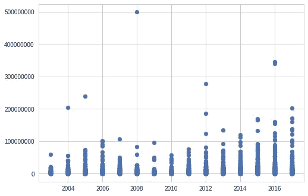
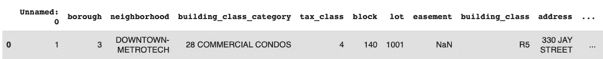
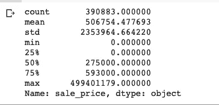
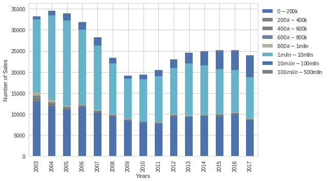
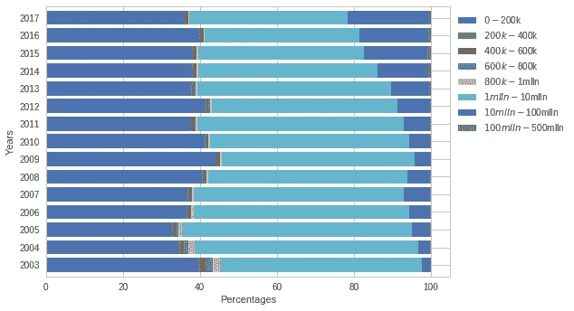
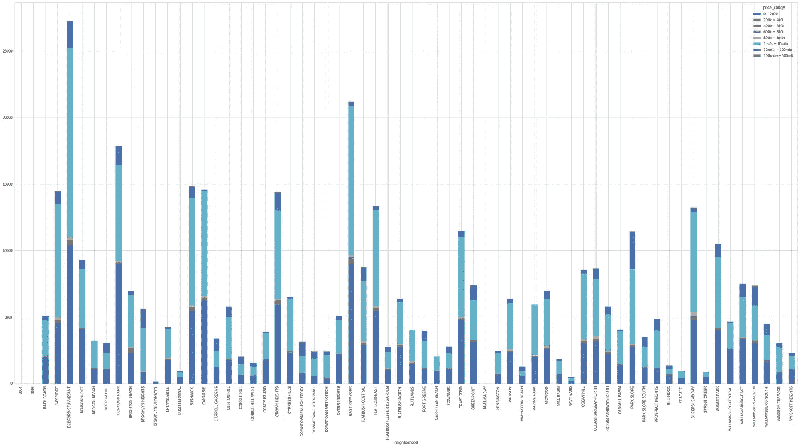
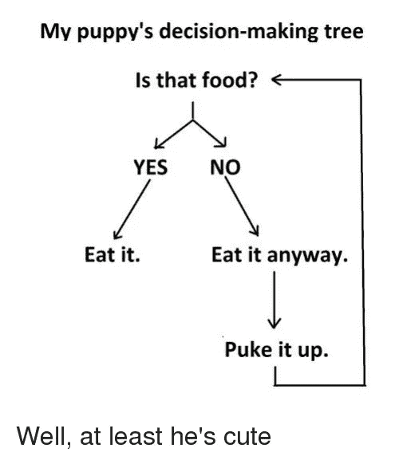
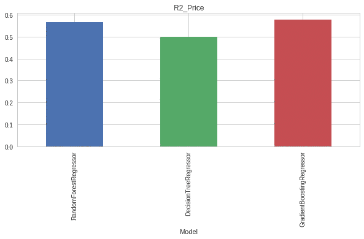
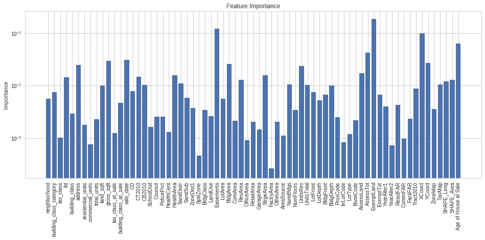

# 用 Python 预测布鲁克林的房价

> 原文：<https://medium.com/hackernoon/predicting-the-price-of-houses-in-brooklyn-using-python-1abd7997083b>

中产阶级化是一个有内涵的术语，可以从正反两方面来看。一方面，中产阶级化提高了房产价值，丰富了现有房主，另一方面，它推高了租金价格，赶走了可能一辈子都住在那个街区的非房主。在过去 20 年左右的时间里，布鲁克林经历了巨大的变化。中产阶级化已经推高了房地产和租金，以至于即使是漫威电影宇宙的美国队长，尽管是一个复仇者，也表示他住不起。


Captain America seemingly looking up in awe at Brooklyn property prices Source: DeadBeatsPanel

为了进行这项分析，我决定下载一个关于 2003 年至 2017 年间布鲁克林房屋销售的数据集，目的是观察 2003 年至 2017 年间的房屋销售价格，可视化布鲁克林最昂贵的街区，并使用和比较多个机器学习模型，根据数据集中的变量预测房屋价格。

**探索数据**

我发现通过可视化房屋销售价格的年度分布来开始我的分析是合适的，这样可以发现潜在的异常值，并更好地理解我的数据集中有趣的趋势。

```
housing_data = pd.read_csv('/content/gdrive/My Drive/Self Learning/Kaggle Projects/Brooklyn Home Sales 2003-2017/brooklyn_sales_map.csv')#scatterplot visualisation
plt.scatter(x=housing_data['year_of_sale'],y=housing_data['sale_price'])
ax =plt.gca()
ax.get_yaxis().get_major_formatter().set_scientific(False)
plt.draw()
```

由于销售价格包含大量数字，y 轴刻度线默认情况下以科学格式返回，带有指数符号。一般来说，我更喜欢用 y 轴刻度线作为标准数字来显示分布。在 matplotlib 库中，刻度标签由一个允许自定义刻度的[格式化程序对象](https://matplotlib.org/gallery/ticks_and_spines/tick-formatters.html)控制。为了获得我想要的结果，我调用了 ScalarFormatter 并关闭了默认的科学符号格式。



House sale prices by year

根据可视化，2003 年至 2017 年间记录的最高销售额是 2008 年的约 5 亿美元。鉴于这种销售是多么的异常，我会假设这是工厂，零售或商业空间。

```
housing_data.sort_values('sale_price').tail(1)
```

出于好奇，我决定深入调查这一异常销售，以了解被收购的财产类型。



Most expensive property sold

这大概是指布鲁克林市中心的一栋建筑中出售的 28 处商业地产，这解释了 5 亿美元的售价。

**汇总统计**

```
housing_data['sale_price'].describe().apply(lambda x: format(x, 'f'))
```

为了更好地研究平均价格、最高价格和最低价格，我返回了 sale price 列上的汇总统计数据，并应用了 lambda 函数，以简单的数字显示统计数据，而不是科学记数法。



Summary Statistics

有趣的是，我发现第 25 百分位的房屋售价为 0 美元。我认为这些要么是记录错误，要么是财产可能通过继承或类似方式从一方转移到另一方。根据这个假设，我得出结论，这些条目与我的分析无关，并继续从我的数据集中过滤掉它们。

```
housing_data = housing_data[housing_data.sale_price > 0]
```

**更多可视化**

我发现堆积条形图对进一步研究我的数据很有帮助。在这种情况下，显示 2003 年至 2017 年期间按价格范围分组的销售价格分布的堆积条形图将使我了解购买的来源(例如，高端豪宅和商业地产销售或中档销售)。

```
bins=[-100000000,20000,40000,60000,80000,100000,1000000,10000000,500000000]
choices =['$0-$200k','$200k-$400k','$400k-$600k','$600k-$800k','$800k-$1mlln','$1mlln-$10mlln','$10mlln-$100mlln','$100mlln-$500mlln']
housing_data['price_range']=pd.cut(housing_data['sale_price'],bins=bins,labels=choices)
```

为了更好地形象化，我首先将销售价格按照定价范围进行分组。不使用 if then 语句， [cut 函数](https://pandas.pydata.org/pandas-docs/version/0.21/generated/pandas.cut.html)允许您将数字放入箱中，并将它们转换为分类值，在本例中，分类值就是价格范围。



House prices by year grouped by price ranges

根据销售年份和价格范围对数据进行分组后，堆积条形图似乎表明大部分销售额在 100 万美元到 1000 万美元之间。为了更好地显示这些年来价格范围内的销售数量，我选择将绝对销售数量转换为百分比，目的是显示在给定的一年中每个价格范围内的销售百分比。

```
def conv(year):
  return housing_data[housing_data['year_of_sale']==year].groupby('price_range').size()
perc_total = [x/sum(x)*100 for x in [conv(2003),conv(2004),conv(2005),conv(2006),conv(2007),conv(2008),conv(2009),conv(2010),conv(2011),conv(2012),conv(2013),conv(2014),conv(2015),conv(2016),conv(2017)]]
year_names = list(range(2003,2018))
housing_df = pd.DataFrame(perc_total, index= year_names)
```

使用上面的代码，我创建了一个函数，并利用列表理解将每年的销售数据转换成百分比。然后，我创建了一个从 2003 年到 2017 年的列标签列表，将这些标签与第一个列表中的百分比进行匹配，并根据这两个列表创建了一个数据框架。这样做创建了一个数据框架，显示了原始数据集中每年按价格范围划分的销售百分比。



Proportion of property sales grouped by price range between 2003 and 2017

从这张图表中，我们可以看到销售额在 1，000 万美元到 1 亿美元之间大幅增长。从个人和商业角度来看，如此大的价格范围涵盖了高度豪华、商业和零售物业范围内的销售，表明财富向布鲁克林的强烈迁移。尽管销售额在 100 万到 1000 万美元之间的比例很高，销售额也增加了 1000 万到 1 亿美元，但 20 万美元以下的销售额仍然相当稳定。尽管布鲁克林正在迅速中产阶级化，但仍有一些房子的价格非常实惠。

由于布鲁克林有许多街区，我想知道哪里的房产最贵和最便宜，至少根据房屋销售数据是这样。为了直观显示这些数据，我使用了 groupby 函数来显示按价格范围分组的房屋销售情况，这些价格范围分布在数据集中呈现的各个街区。



Bedford Stuyvesant 在房屋总销售额方面遥遥领先。仅举几个例子，诸如 Canarsie、East New York、Flatbush East、Sheepshead Bat、Sunset Park、Bushwick 和 Kensington 等地方似乎都有非常高的高价销售集中度(销售额超过 100 万美元)。在

**剔除异常值**后，销售额仍然很高

在我的分析中，我决定剔除异常销售额。因为我想使用回归模型预测房价，所以我认为很难找到一个对正常和异常模式销售都表现良好的模型，后者可能包括多个商业地产(例如 28 个以 5 亿美元售出的商业单元)。我明白这样做会使我的模型无法概括异常的房价，并可能“人为地”提高我的回归模型的性能。

```
def remove_outlier(df, col):
  q1 = df[col].quantile(0.25)
  q3 = df[col].quantile(0.75)
  iqr = q3 - q1
  lower_bound  = q1 - (1.5  * iqr)
  upper_bound = q3 + (1.5 * iqr)
  out_df = df.loc[(df[col] > lower_bound) & (df[col] < upper_bound)]
  return out_df
housing_data = remove_outlier(housing_data,"sale_price")
```

使用上面的代码行，我使用四分位率来检测价格的下限和上限，并从我的数据库中删除它们

**数据清理**

Brooklyn house sales 数据库包含 111 列，其中许多列包含太多 NA 值，对我的分析没有重要价值。在尝试了几个选项后，我选择删除 NA 值为 75%或以上的所有列。

```
threshold = len(housing_data) * .75
housing_data.dropna(thresh = threshold, axis = 1, inplace = True)
```


然后，我继续删除没有添加任何有用信息的列，或者包含与现有列重复的信息的列。

```
housing_data = housing_data.drop(['APPBBL','BoroCode','Borough','BBL','price_range','PLUTOMapID','YearBuilt','CondoNo','BuiltFAR','FireComp','MAPPLUTO_F','Sanborn','SanitBoro','Unnamed: 0','Version', 'block','borough','Address','OwnerName','zip_code'],axis=1)
```

例如，包括行政区列没有任何意义，因为数据集中的所有房屋都在同一个行政区，并且地址是一年建成的列，其中存在重复的现有列。

**清除 NA 值**

在删除了主要由 NA 值组成的列之后，我仍然有包含大量缺失数据(从几千到超过 80 000)的列，我必须决定如何处理这些 NA 值。对于某些列，用模式(例如，邮政编码、学区、警区、卫生区、X 和 Y 坐标)填充缺失值更有意义，因为虽然这些是以数字格式表示的，但它们不是定量的，本质上是由数字表示的分类值，因此找到中间值不会给我提供有用的信息。在其他情况下，用 0 填充缺失值更有意义。例如，如果在代表对某项资产进行变更的年份的列中有一个缺失值，则假设没有进行变更可能更有意义。对于其他分类列，我用其各自列的模态值填充缺失数据，对于其余的数值变量，我混合使用软估算和使用中值填充缺失数据。

```
#if basement data is missing it might be safer to assume that whether or not the apartment/building is unknown which is represented by the number 5
housing_data['BsmtCode'] = housing_data['BsmtCode'].fillna(5)#Community Area- not applicable or available if Na
housing_data[['ComArea','CommFAR','FacilFAR','FactryArea','RetailArea','ProxCode','YearAlter1','YearAlter2']] = housing_data[['ComArea','CommFAR','FacilFAR','FactryArea','RetailArea','ProxCode','YearAlter1','YearAlter2']].fillna(0)
housing_data[['XCoord','YCoord','ZipCode','LotType','SanitDistr','HealthArea','HealthCent','PolicePrct','SchoolDist','tax_class_at_sale','CD','Council']] = housing_data[['XCoord','YCoord','ZipCode','LotType','SanitDistr','HealthArea','HealthCent','PolicePrct','SchoolDist','tax_class_at_sale','CD','Council']].apply(lambda x: x.fillna(x.mode()[0]))#soft impute
from fancyimpute import SoftImpute
feature_arr = housing_data.drop(['OfficeArea','commercial_units','residential_units','ResArea'],axis=1).select_dtypes(include=[np.number])
softimpute = SoftImpute()
housing_data2 = pd.DataFrame(softimpute.fit_transform(feature_arr.values),columns=feature_arr.columns,index=feature_arr.index)#fill in missing values with imputation values
housing_data = housing_data.fillna(housing_data2)
```

使用软估算方法，我选择导入[奇特的估算库](https://pypi.org/project/fancyimpute/0.0.4/)。根据其文档，软估算基于用于学习大型不完整矩阵的[谱正则化算法](https://web.stanford.edu/~hastie/Papers/mazumder10a.pdf)。简单地说，这种方法在每次迭代中使用[奇异值分解](https://machinelearningmastery.com/singular-value-decomposition-for-machine-learning/)计算，进行猜测以填充缺失值。它是专门为处理多维的大数据而定制的——这是我选择这个解决方案的主要原因。软估算背后的机制在我附加到相关关键词的 URL 中有更详细的解释。

```
housing_data = housing_data.apply(lambda x: x.fillna(x.median()) if x.dtype.kind in 'iufc' else x.fillna(x.mode()[0]))
```

对于其余缺失的数据，我编写了一个 if 语句来标识列中对象的数据类型，并在分类/字符串/布尔值的情况下使用模态值填充值，在数值/浮点值的情况下使用中值填充值。

```
housing_data['Age of House at Sale'] = housing_data['year_of_sale'] - housing_data['year_built']
housing_data = housing_data.drop(['year_of_sale','year_built'],axis=1)
```

我没有为销售年份和房屋建造年份创建两个单独的列，而是创建了一个列来显示房屋销售时的年龄。我相信这个栏目包含了销售年份和建造年份栏目共同显示的信息。除此之外，销售年份信息已经显示在销售日期列中(其中包含销售的日期、月份和年份)。

**将分类数据转换为数字数据**

很多机器学习工具只接受数字数据作为输入。为了迎合我的分类列，我编写了一个函数来为我的分类列的每个唯一字符串创建数值。然后，我继续将这些字符串转换成它们的数字表示。

```
#change strings to ints to preprocess for ML algo
def strnums(cols):
  return dict(zip(set(housing_data[cols]),list(range(0,len(set(housing_data[cols]))))))
for columns in set(housing_data.select_dtypes(exclude='number')):
  housing_data[columns] = housing_data[columns].map(strnums(columns))
```

**基线模型**

对于基线模型，我假设试图猜测房屋价格的假设人员将使用集中趋势度量，在这种情况下是猜测数据集中房屋价格的中位数(也许我应该选择线性回归模型)。基线模型可以被认为是常识模型，即。一个不是房地产专家，也不知道任何关于监督机器学习或数据科学的人会用什么来尝试和预测房屋的销售价格呢？

```
from sklearn.dummy import DummyRegressor
from sklearn.metrics import mean_absolute_error
from sklearn.metrics import r2_score
from sklearn.model_selection import train_test_split
features =  list(housing_data.drop(['sale_price'],axis=1)) 
y = housing_data.sale_price
X = housing_data[features]
X_train,X_test,y_train,y_test = train_test_split(X,y,test_size=0.2,random_state=100)
dummy_median = DummyRegressor(strategy='mean')
dummy_regressor = dummy_median.fit(X_train,y_train)
dummy_predicts = dummy_regressor.predict(X_test)
print("Model Accuracy:", dummy_regressor.score(X_test,y_test)*100)
```

为此，我假设每一个猜测都是销售价格的中值，并使用返回该模型的准确性。分数()。这通过在内部将预测值与实际值进行比较来衡量该模型中预测值的准确性。

```
Model Accuracy: -0.00019362576233472595
```

在这种情况下，没有值落在中间值或平均值中

```
print('$',mean_absolute_error(y_test,dummy_predicts))
$ 244809.01786117873
```

每次预测的平均误差约为 244 000 美元。

**从树木到森林**

我选择使用回归树、随机森林和梯度推进来衡量哪个模型会给我这个问题的最佳预测。

**决策树**



Decision tree in decision making

决策树是一种受监督的机器学习算法，可用于分类或回归问题。你可以认为，如果 else 语句，算法使用最佳特征(特征是预测器)将数据集分解成越来越小的子集。经常使用的算法被称为分类和回归树(CART)。对于每个子集，它计算均方误差(MSE)——这是我设定的标准——并选择最小化平方损失误差的分割。该过程在预设的终点(最大深度)停止。该深度应该被优化以减少过度拟合的风险，并找到具有最佳预测能力的深度。

由于决策树在拆分数据时会随机抽取样本甚至数据中的特征，因此设置 random_state 参数允许我控制决策树做出的随机选择，以便在我选择重新运行算法时保持结果的一致性

我选择这个模型是因为它相当容易理解，并且有点类似于一般的决策过程。

**随机森林**

包含此模型的原因与它的工作方式有关。随机森林是建立在回归树上的。Random Forest 运行 n 个回归树，然后将它们组合成一个模型。这里的假设是，一棵树可能会给我们不准确的预测，但当你运行这些树多次，并结合这些预测，你会得到更接近实际值的预测。

**梯度推进回归树**

对于 boosting，这个概念包括将一个弱学习者(在预测我们的结果方面不是很强的特征)变成一个强学习者。Boosting 通过在我们运行的每个回归树中识别弱学习者来实现这一点，为每个观察值分配相等的权重，同时高度关注弱学习者做出的预测和实际值之间的距离，即模型的错误率。使用梯度增强，模型不仅试图减少损失函数(在这种情况下是平方损失误差)，而且还使用误差率(从观察弱学习者中学习到的)来计算误差函数的陡度，使用它来确定如何改变模型中的参数以减少每次迭代的误差。这个过程被执行 n 次。

```
from sklearn.tree import DecisionTreeRegressor
from sklearn.ensemble import RandomForestRegressor
from sklearn.ensemble import GradientBoostingRegressor
models = [RandomForestRegressor(n_estimators=200,criterion='mse',max_depth=20,random_state=100),DecisionTreeRegressor(criterion='mse',max_depth=11,random_state=100),GradientBoostingRegressor(n_estimators=200,max_depth=12)]
learning_mods = pd.DataFrame()
temp = {}#run through models
for model in models:
    print(model)
    m = str(model)
    temp['Model'] = m[:m.index('(')]
    model.fit(X_train, y_train)
    temp['R2_Price'] = r2_score(y_test, model.predict(X_test))
    print('score on training',model.score(X_train, y_train))
    print('r2 score',r2_score(y_test, model.predict(X_test)))
    learning_mods = learning_mods.append([temp])
learning_mods.set_index('Model', inplace=True)

fig, axes = plt.subplots(ncols=1, figsize=(10, 4))
learning_mods.R2_Price.plot(ax=axes, kind='bar', title='R2_Price')
plt.show()
```

我对每个模型的估计和最大深度进行了试验，以找到最佳结果，并创建了一个 for 循环来运行每个模型，训练我的数据并根据每个模型进行预测。然后，我继续绘制 R 平方分数，以表明每个模型的拟合程度。



```
RandomForestRegressor
score on training 0.8163539671493629 
r2 score 0.5679147469969195 DecisionTreeRegressor
score on training 0.5514037201337179
r2 score 0.4986320564265784 GradientBoostingRegressor
score on training 0.8354890542936946 
r2 score 0.5792007036236262
```

梯度提升优于随机森林和回归树，在训练数据上的准确率为 83.5%，在不包括异常值预测的测试数据上的准确率为 57.9%。 [R 平方得分](https://scikit-learn.org/stable/modules/generated/sklearn.metrics.r2_score.html)用于解释数据与模型的吻合程度。

**特征重要性**

并非所有的特征都是同等创建的，为了进一步理解我的模型的底层逻辑，我可以查看每个特征对我的模型的相对重要性。通过这样做，我可以选择将我的模型用作预测器的特征限制为对我的回归树更重要的预测器。理论上，这可以提高我的模型的准确性和速度。

```
regressionTree_imp = model.feature_importances_
plt.figure(figsize=(16,6))
plt.yscale('log',nonposy='clip')
plt.bar(range(len(regressionTree_imp)),regressionTree_imp,align='center')
plt.xticks(range(len(regressionTree_imp)),features,rotation='vertical')
plt.title('Feature Importance')
plt.ylabel('Importance')
plt.show()
```



Feature Importance

从模型中的 69 个特征中，该图显示了对我的模型影响最大的特征的快照。虽然我可以通过将我的模型使用的特征限制为对我的回归模型贡献更大的特征来进一步尝试和优化我的模型，但我选择在这里结束我的分析。

如果你有任何反馈或者只是想享受我选择伟大的丹麦文化和 gif 的能力，请随时联系 Twitter @Emmoemm