# 总统辩论情绪分析与 LSTM，OneVsRest，LinearSVC: NLP 分步指南

> 原文：<https://medium.com/hackernoon/presidential-debate-sentiment-analysis-with-lstm-onevsrest-linearsvc-nlp-step-by-step-guide-b9683e2c8ed9>


Cartooned by Alina Z

***“民情决定一切。”——亚伯拉罕·林肯***

数据来源是俄亥俄州第一场 2016 年共和党总统辩论的数万条推文。给定推文的情绪是什么？是正面的，中性的，还是负面的？正面/负面推文中使用频率最高的词是什么？

您将学习基本的自然语言处理技能，包括:

*   文本预处理
*   标记化
*   使用 TF-IDF 嵌入单词
*   用 LSTM、逻辑回归、OneVsRest、LinearSVC 等建模。
*   使用 F1 分数、精确度、召回率、准确度进行评估

本文末尾将提供 NLP 项目的端到端路线图。

# 加载数据并快速查看数据

```
**import** **numpy** **as** **np** 
**import** **pandas** **as** **pd** **import** **nltk**
nltk.download('stopwords')
**from** **nltk.corpus** **import** stopwords**from** **sklearn.feature_extraction.text** **import** CountVectorizer
**from** **keras.preprocessing.text** **import** Tokenizer
**from** **keras.preprocessing.sequence** **import** pad_sequences
**from** **keras.models** **import** Sequential
**from** **keras.layers** **import** Dense, Embedding, LSTM, SpatialDropout1D
**from** **keras.utils.np_utils** **import** to_categorical
**import** **re**

**from** **sklearn.model_selection** **import** train_test_split, cross_val_score
**from** **sklearn.linear_model** **import** LogisticRegression
**from** **sklearn.svm** **import** LinearSVC
**from** **sklearn.multiclass** **import** OneVsRestClassifier
**from** **sklearn.linear_model** **import** RidgeClassifier
```

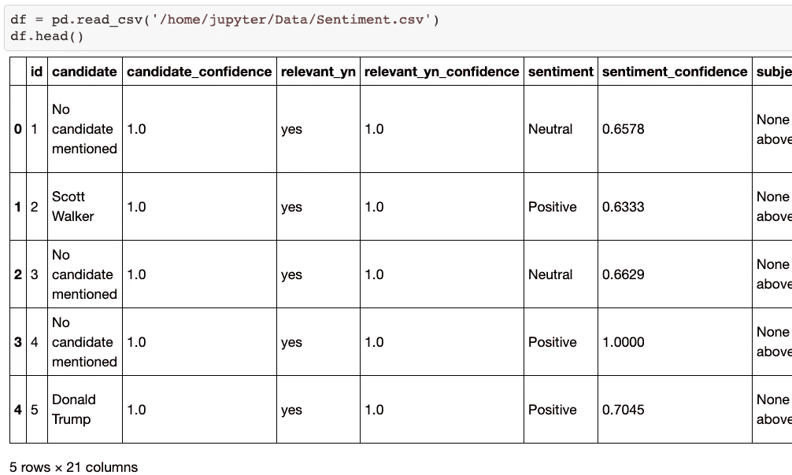

数据集中有 21 列。我们这里只保留“文本”和“感悟”这两个栏目。

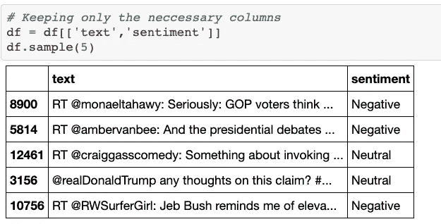

数据集的形状。我们有 13871 行记录。

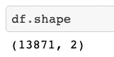

“情绪”列中有 3 个唯一值。请注意，数据集是不平衡的，这意味着每个类别的记录数量不相等。


从数据集中随机检查一条推文。

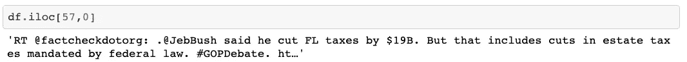

# 将数据集分成随机的训练、验证和测试子集

" [train_test_split](https://scikit-learn.org/stable/modules/generated/sklearn.model_selection.train_test_split.html) "是 scikit-learn 中一种方法，将数组或矩阵拆分成随机的训练和测试子集。

```
X_train, X_test, y_train, y_test = train_test_split(df['text'], df['sentiment'], test_size=0.33, random_state=42)X_train, X_val, y_train, y_val = train_test_split(X_train, y_train, test_size=0.2, random_state=42)
```

现在我们有 3 个子集:训练、验证和测试。X_train 包括推文，y_train 包括相应的情绪。

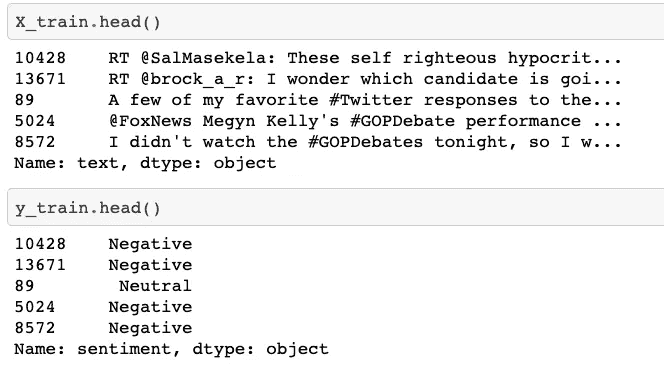

# 文本预处理

为文本预处理定义一个函数 text_prepare，该函数处理以下任务:

*   用输入文本中的空格替换“REPLACE_BY_SPACE_RE”中的符号
*   从输入文本中删除“错误符号”中的符号
*   用“rt”和“http”扩展停用词列表
*   从文本中删除停用词

按如下方式处理训练数据集中的文本。

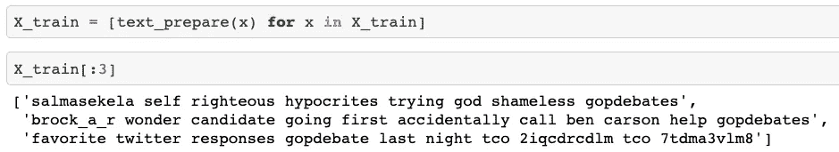

应用于验证和测试数据集。

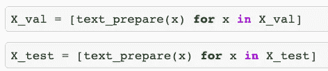

## 最常见的词是什么？

对于每个单词，计算它们在训练数据集中出现的次数。对词典进行分类，找出前 10 个常用词。

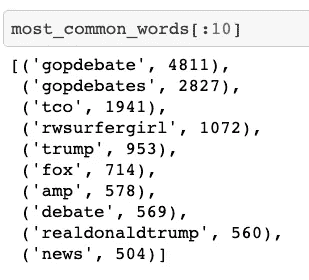

# 使用 TF-IDF 嵌入单词

机器学习算法处理数字数据，我们不能使用提供的文本数据，如“@JebBush 说他削减了 190 亿美元的 FL 税”。在将文本数据输入模型之前，我们需要将它们转换成数字向量，这被称为“单词嵌入”。

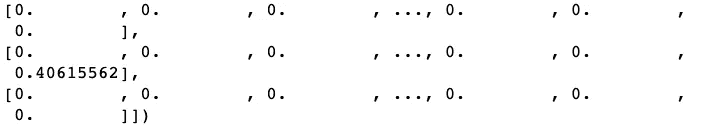

vectorization

## TF-IDF

TF-IDF 方法(词频逆文档频率)通过考虑收集的整个 tweets 数据集中的总词频来扩展词袋框架。与词袋相比，TF-IDF 惩罚了过于频繁出现的词，并提供了更好的特征空间。

*   使用 scikit-learn 中的类[tfidf 矢量器](https://scikit-learn.org/stable/modules/generated/sklearn.feature_extraction.text.TfidfVectorizer.html)
*   过滤掉过于罕见的单词(出现次数少于 5 个标题)
*   过滤掉过于频繁的词(出现在 90%以上的推文中)。
*   使用 2 克和 1 克

文本->矢量

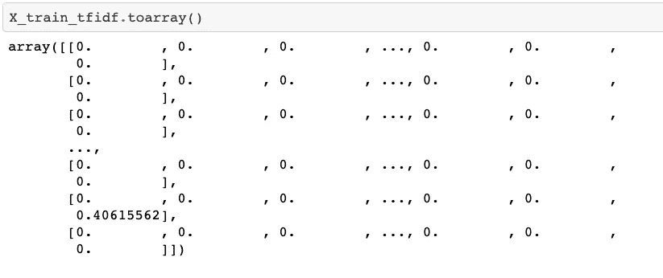

最后，我们准备尝试不同的模型。

# 第一个模型:逻辑回归

使用 sklearn.linear_model 中的 LogisticRegression

```
LogisticRegression(C=1.0, class_weight=None, dual=False, fit_intercept=True, intercept_scaling=1, max_iter=100, multi_class=’warn’, n_jobs=None, penalty=’l2', random_state=None, solver=’warn’, tol=0.0001, verbose=0, warm_start=False)
```

交叉验证平均准确率 67.86%，标准差 0.38。

# 第二种模式:LinearSVC

从 sklearn.svm 调用 LinearSVC

交叉验证平均准确率 63.76%，标准差 0.45。

# 第三款:OneVsRest

从 sklearn.multiclass 调用 OneVsRestClassifier

OneVsRestClassifier 的评估

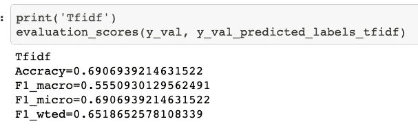

评估标准的解释可在本[文件](https://scikit-learn.org/stable/modules/model_evaluation.html)中找到。F1-micro 是首选是首选，因为我们班不平衡。微观和宏观平均值之间的差异可以在这个[环节](https://datascience.stackexchange.com/questions/15989/micro-average-vs-macro-average-performance-in-a-multiclass-classification-settin)找到。

# 第四款:LSTM 与 Keras

回想一下，我们之前已经导入了 keras 库。

```
**from** **sklearn.feature_extraction.text** **import** CountVectorizer
**from** **keras.preprocessing.text** **import** Tokenizer
**from** **keras.preprocessing.sequence** **import** pad_sequences
**from** **keras.models** **import** Sequential
**from** **keras.layers** **import** Dense, Embedding, LSTM, SpatialDropout1D
**from** **keras.utils.np_utils** **import** to_categorical
```

将文本预处理的输出保存在另一个 pandas 数据框“X”中。

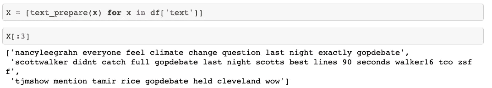

使用 keras 的 Tokenizer

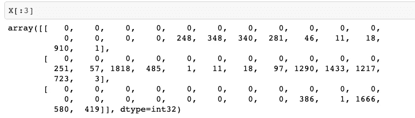

创建 LSTM 模型

注意激活函数和优化器 adam。

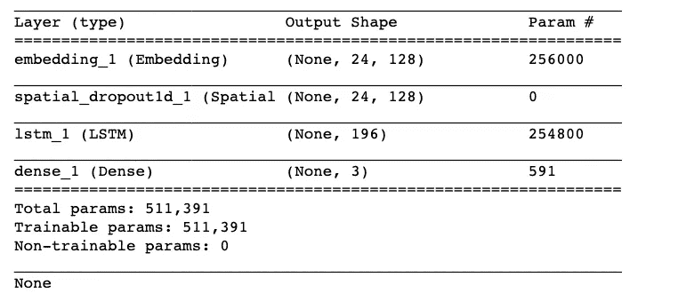

对预测列“情绪”进行编码(正面、中性、负面)

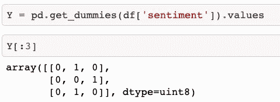

为 20 个时代训练 LSTM 模型

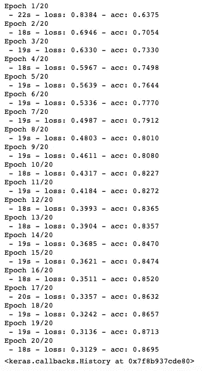

恭喜你。您刚刚学习了自然语言处理的基本技术，包括:

*   文本预处理
*   标记化
*   使用 TF-IDF 嵌入单词
*   用 LSTM、逻辑回归、OneVsRest、LinearSVC 等建模。
*   使用 F1 分数、精确度、召回率、准确度进行评估

本项目使用的数据来源可以在这个[链接](https://www.kaggle.com/crowdflower/first-gop-debate-twitter-sentiment#Sentiment.csv)找到。

NLP 项目的**路线图可以在这个[链接](https://drive.google.com/file/d/17-3G1W-Ag1Ql-CI_VGDIk9YxiXzAZm8Z/view?usp=sharing)下载。**

下一步就是和猫玩，弄脏你的手。不，我是说编码。祝你好运。


Sentiment Analysis on Lourdes (my cat)