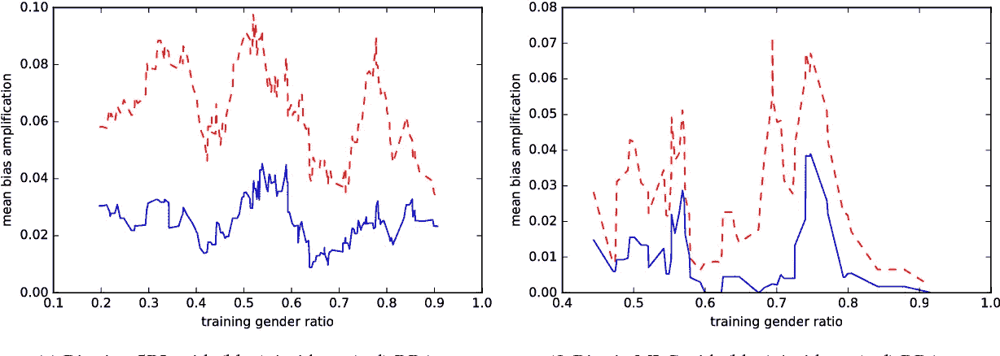
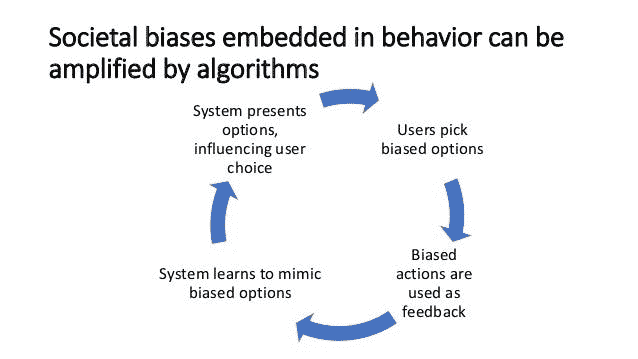
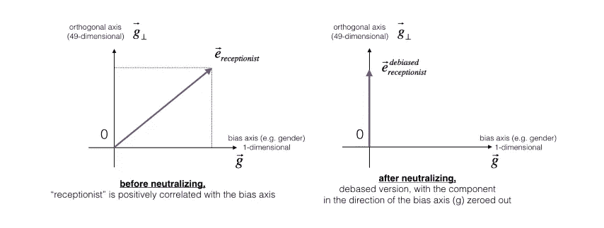
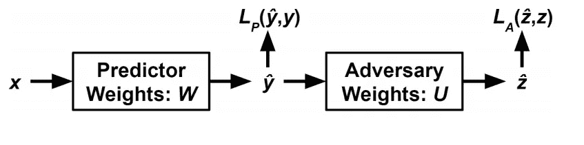

# 防止人工智能系统通过对抗性学习放大偏见

> 原文：<https://medium.com/hackernoon/preventing-ai-system-from-amplifying-bias-with-adversarial-learning-bd5e224f5a31>

## 对抗学习中偏见的介绍、原因及解决方法



**说到放大偏差，我们首先想到的问题是，AI 系统是如何放大偏差的？**

判别或生成模型是偏差放大的原因。因为判别模型更像是“黑箱”,只学习回答特定的训练数据集。

**下一个问题是，什么是判别模型，它是如何导致偏见的？**

判别模型也称为条件模型，它试图仅根据观察到的数据来训练模型，同时学习如何从给定的统计数据中进行分类。判别模型，如神经网络、逻辑回归、SVM、条件随机场。

**那么，人工智能算法是如何放大偏差的？**

**现在，让我们以单词嵌入偏差为例，它是放大偏差的来源。**

机器学习系统的力量不仅预示着巨大的技术进步，也带来了社会危害的风险。流行的单词嵌入算法表现出刻板偏见，例如性别偏见。这些算法在机器学习系统中的广泛使用，从自动翻译服务到简历扫描仪，可以在重要的背景下放大刻板印象。尽管已经开发了测量这些偏差和改变单词嵌入以减轻它们的有偏差表示的方法，但是缺乏对单词嵌入偏差如何依赖于训练数据的理解。给定在语料库上训练的单词嵌入，特定偏差度量方法识别对语料库的扰动将如何影响所得嵌入的偏差。这可以用来追溯单词嵌入偏差的来源，追溯到原始训练文档。



Fig shows how certain cultural context of information learned by Athe I system leads to bias

**它们如何影响？**

如果执行分类任务，他们可能会接受最大化分类准确性的培训。这意味着模型将利用任何有助于提高数据集准确性的信息，尤其是数据中存在的任何偏差。

例如，让我们看看一个实时自动化招聘平台的案例研究，它是如何影响候选人而不进入工作的。

**“亚马逊抛弃了人工智能招聘工具，该工具偏爱从事技术工作的男性。”**

**怎么发生的？**

该公司的实验性招聘工具使用人工智能给求职者打分，从一颗星到五颗星不等，就像购物者在亚马逊上给产品打分一样。“他们真的希望它是一个引擎，我会给你 100 份简历，它会分出前五名，我们会雇用他们。”


Amazon recruitment System bias against women

但到 2015 年，该公司意识到其新系统并没有以性别中立的方式对软件开发工作和其他技术职位的候选人进行评级。这是因为亚马逊招聘平台中的“**人工智能模型”是通过观察 10 年间提交给该公司的简历模式来训练申请人的。大多数来自男性，这导致了男性在整个招聘平台上的主导地位。**

**如何处理人工智能(NLP)系统中性别中立方式的偏见？**

单词嵌入模型已经成为广泛的自然语言处理(NLP)应用中的基本组件。然而，在人类生成的语料库上训练的嵌入已经被证明继承了反映社会结构的强烈的性别刻板印象。

嵌入是将离散变量(例如单词、地区、URL)投影到多维实值空间的强大机制。已经开发了几种强有力的方法来学习嵌入。一个例子是跳格算法。在该算法中，周围的上下文用于预测单词的存在。不幸的是，许多真实世界的文本数据都有一个微妙的偏差，机器学习算法会隐式地将它包含在从该数据创建的嵌入中。这种偏差可以通过使用学习到的嵌入来执行单词类比任务来说明



现在，让我们讨论一下减轻偏见的最有效的对抗性学习。

# 对抗性学习如何有助于减轻偏见？

对抗法消除了嵌入中的一些偏见，它基于这样一种思想，即那些嵌入旨在用于预测基于输入𝑋的一些结果𝑌，但是在公平的世界中，该结果应该与一些受保护的变量𝑍.完全无关如果是这样的话，那么了解𝑌并不会帮助你更好地预测𝑍。这个原理可以直接转化为如下图所示的两个串联网络。第一次尝试使用𝑋作为输入来预测𝑌。第二次尝试使用𝑌的预测值来预测𝑍.如下图所示，



The architecture of Adversarial network

然而，简单地训练基于∇𝑊𝐿1 的 w 中的权重和基于∇𝑈𝐿2 的𝑈中的权重实际上不会实现无偏的模型。为了做到这一点，你需要在𝑊's 更新函数中加入这样一个概念，即𝑈在预测𝑍.时应该不会比机会更好你可以实现这一点的方式类似于生成敌对网络(GANs) ( [Goodfellow 等人 2014](http://papers.nips.cc/paper/5423-generative-adversarial-nets) )训练其生成器的方式。

除了∇𝑊𝐿1，你还把对∇𝑊𝐿2 的否定纳入了𝑊's 的更新函数。然而，有可能∇𝑊𝐿1 正在改变𝑊，通过使用你试图保护的有偏见的信息来提高准确性。为了避免这一点，你还加入了一个术语，通过将∇𝑊𝐿1 的成分投射到∇𝑊𝐿2.，来移除它一旦将这两个术语合并，𝑊的更新函数就变成了:

∇𝑊𝐿1−𝑝𝑟𝑜𝑗(∇𝑊𝐿2)∇𝑊𝐿1−∇𝑊𝐿2

对如何将敌对网络合并到机器学习模型中的描述是非常通用的，因为该技术通常适用于任何类型的系统，这些系统可以根据预测𝑌的输入𝑋来描述，但是可能包含关于受保护变量𝑍.的信息只要你能构造相关的更新函数，你就能应用这种技术。然而，这并不能告诉你太多关于𝑋、𝑌和𝑍.的本质在单词类比任务中，𝑋 =𝐵+𝐶−𝐴和𝑌=𝐷.不过，要弄清楚𝑍应该是什么样子，要稍微复杂一点。为此，请参考 Bulokbasi 等人的一篇论文。艾尔。他们开发了一种无监督的方法来从单词嵌入中去除性别语义。

**现在，我们将深入探讨使用对抗性学习来减轻偏见的实现部分**

第一步是选择与试图消除的偏见类型相关的词对。就性别而言，选择像“男人”、“女人”、“男孩”、“女孩”这样的词对，它们在语义上的唯一区别就是性别。这些词对可以计算它们的嵌入之间的差异，以在嵌入的语义空间中产生大致平行于性别语义的向量。对这些向量执行主成分分析(PCA ),然后给出由所提供的性别化单词对定义的性别语义的主要成分。因此，让我们定义用于执行嵌入的主要组件的函数，

```
def find_gender_direction(embed,
                          indices):
  """Finds and returns a 'gender direction'."""
  pairs = [
      ("woman", "man"),
      ("her", "his"),
      ("she", "he"),
      ("aunt", "uncle"),
      ("niece", "nephew"),
      ("daughters", "sons"),
      ("mother", "father"),
      ("daughter", "son"),
      ("granddaughter", "grandson"),
      ("girl", "boy"),
      ("stepdaughter", "stepson"),
      ("mom", "dad"),
  ]
  m = []
  for wf, wm in pairs:
    m.append(embed[indices[wf]] - embed[indices[wm]])
  m = np.array(m)# the next three lines are just a PCA.
  m = np.cov(np.array(m).T)
  evals, evecs = np.linalg.eig(m)
  return _np_normalize(np.real(evecs[:, np.argmax(evals)]))# Using the embeddings, find the gender vector.
gender_direction = find_gender_direction(embed, indices)
print "gender direction: %s" % str(gender_direction.flatten())
```

一旦完成了嵌入差异的第一个主成分，开始把单词的嵌入投射到它上面。这个预测可以作为对手试图根据𝑌.的预测值预测的受保护变量𝑍现在让我们来看看对性别维度有最大负面影响的单词。

```
words = set()
for a in analogies:
  words.update(a)df = pd.DataFrame(data={"word": list(words)})
df["gender_score"] = df["word"].map(
    lambda w: client.word_vec(w).dot(gender_direction))
df.sort_values(by="gender_score", inplace=True)
print df.head(10)
```

现在让我们来看看那些在性别维度上有最大*正面*投射的单词。

```
df.sort_values(by="gender_score", inplace=True, ascending=False)
print df.head(10)
```

# 训练模型

训练敌对网络是困难的。他们很敏感，如果接触的方式不对，他们很快就会爆发。必须非常小心地以足够慢的速度训练两个模型，以便模型中的参数不会发散。实际上，这通常需要显著降低分类器和对手的步长。将对手的参数初始化为极小也可能是有益的，以确保分类器不会过度适应特定的(次优)对手(这种过度适应会很快导致发散！).也有可能的是，如果分类器太擅长于对对手隐藏受保护的变量，那么对手将强加发散的更新以努力提高其性能。解决方法有时是实际上增加对手的学习速率以防止发散(这在大多数学习系统中几乎是闻所未闻的)。在我的 [**GitHub**](https://github.com/rashmimarganiatgithub/preventing_bias_adversarial) **，**中可以找到相同的单词嵌入的去偏置模型，请查看它以重现实验。下面是训练模型的代码。

```
class AdversarialEmbeddingModel(object):
  """A model for doing adversarial training of embedding models."""def __init__(self, client,
               data_p, embed_dim, projection,
               projection_dims, pred):
    """Creates a new AdversarialEmbeddingModel.Args:
      client: The (possibly biased) embeddings.
      data_p: Placeholder for the data.
      embed_dim: Number of dimensions used in the embeddings.
      projection: The space onto which we are "projecting".
      projection_dims: Number of dimensions of the projection.
      pred: Prediction layer.
    """
    # load the analogy vectors as well as the embeddings
    self.client = client
    self.data_p = data_p
    self.embed_dim = embed_dim
    self.projection = projection
    self.projection_dims = projection_dims
    self.pred = preddef nearest_neighbors(self, sess, in_arr,
                        k):
    """Finds the nearest neighbors to a vector.Args:
      sess: Session to use.
      in_arr: Vector to find nearest neighbors to.
      k: Number of nearest neighbors to return
    Returns:
      List of up to k pairs of (word, score).
    """
    v = sess.run(self.pred, feed_dict={self.data_p: in_arr})
    return self.client.similar_by_vector(v.flatten().astype(float), topn=k)def write_to_file(self, sess, f):
    """Writes a model to disk."""
    np.savetxt(f, sess.run(self.projection))def read_from_file(self, sess, f):
    """Reads a model from disk."""
    loaded_projection = np.loadtxt(f).reshape(
        [self.embed_dim, self.projection_dims])
    sess.run(self.projection.assign(loaded_projection))def fit(self,
          sess,
          data,
          data_p,
          labels,
          labels_p,
          protect,
          protect_p,
          gender_direction,
          pred_learning_rate,
          protect_learning_rate,
          protect_loss_weight,
          num_steps,
          batch_size,
          debug_interval=1000):
    """Trains a model.Args:
      sess: Session.
      data: Features for the training data.
      data_p: Placeholder for the features for the training data.
      labels: Labels for the training data.
      labels_p: Placeholder for the labels for the training data.
      protect: Protected variables.
      protect_p: Placeholder for the protected variables.
      gender_direction: The vector from find_gender_direction().
      pred_learning_rate: Learning rate for predicting labels.
      protect_learning_rate: Learning rate for protecting variables.
      protect_loss_weight: The constant 'alpha' found in
          debias_word_embeddings.ipynb.
      num_steps: Number of training steps.
      batch_size: Number of training examples in each step.
      debug_interval: Frequency at which to log performance metrics during
          training.
    """
    feed_dict = {
        data_p: data,
        labels_p: labels,
        protect_p: protect,
    }
    # define the prediction loss
    pred_loss = tf.losses.mean_squared_error(labels_p, self.pred)# compute the prediction of the protected variable.
    # The "trainable"/"not trainable" designations are for the predictor. The
    # adversary explicitly specifies its own list of weights to train.
    protect_weights = tf.get_variable(
        "protect_weights", [self.embed_dim, 1], trainable=False)
    protect_pred = tf.matmul(self.pred, protect_weights)
    protect_loss = tf.losses.mean_squared_error(protect_p, protect_pred)pred_opt = tf.train.AdamOptimizer(pred_learning_rate)
    protect_opt = tf.train.AdamOptimizer(protect_learning_rate)protect_grad = {v: g for (g, v) in pred_opt.compute_gradients(protect_loss)}
    pred_grad = []# applies the gradient expression found in the document linked
    # at the top of this file.
    for (g, v) in pred_opt.compute_gradients(pred_loss):
      unit_protect = tf_normalize(protect_grad[v])
      # the two lines below can be commented out to train without debiasing
      g -= tf.reduce_sum(g * unit_protect) * unit_protect
      g -= protect_loss_weight * protect_grad[v]
      pred_grad.append((g, v))
      pred_min = pred_opt.apply_gradients(pred_grad)# compute the loss of the protected variable prediction.
    protect_min = protect_opt.minimize(protect_loss, var_list=[protect_weights])sess.run(tf.global_variables_initializer())
    sess.run(tf.local_variables_initializer())
    step = 0
    while step < num_steps:
      # pick samples at random without replacement as a minibatch
      ids = np.random.choice(len(data), batch_size, False)
      data_s, labels_s, protect_s = data[ids], labels[ids], protect[ids]
      sgd_feed_dict = {
          data_p: data_s,
          labels_p: labels_s,
          protect_p: protect_s,
      }if not step % debug_interval:
        metrics = [pred_loss, protect_loss, self.projection]
        metrics_o = sess.run(metrics, feed_dict=feed_dict)
        pred_loss_o, protect_loss_o, proj_o = metrics_o
        # log stats every so often: number of steps that have passed,
        # prediction loss, adversary loss
        print("step: %d; pred_loss_o: %f; protect_loss_o: %f" % (step,
                     pred_loss_o, protect_loss_o))
        for i in range(proj_o.shape[1]):
          print("proj_o: %f; dot(proj_o, gender_direction): %f)" %
                       (np.linalg.norm(proj_o[:, i]),
                       np.dot(proj_o[:, i].flatten(), gender_direction)))
      sess.run([pred_min, protect_min], feed_dict=sgd_feed_dict)
      step += 1

def filter_analogies(analogies,
                     index_map):
  filtered_analogies = []
  for analogy in analogies:
    if filter(index_map.has_key, analogy) != analogy:
      print "at least one word missing for analogy: %s" % analogy
    else:
      filtered_analogies.append(map(index_map.get, analogy))
  return filtered_analogiesdef make_data(
    analogies, embed,
    gender_direction):
  """Preps the training data.Args:
    analogies: a list of analogies
    embed: the embedding matrix from load_vectors
    gender_direction: the gender direction from find_gender_directionReturns:
    Three numpy arrays corresponding respectively to the input, output, and
    protected variables.
  """
  data = []
  labels = []
  protect = []
  for analogy in analogies:
    # the input is just the word embeddings of the first three words
    data.append(embed[analogy[:3]])
    # the output is just the word embeddings of the last word
    labels.append(embed[analogy[3]])
    # the protected variable is the gender component of the output embedding.
    # the extra pair of [] is so that the array has the right shape after
    # it is converted to a numpy array.
    protect.append([np.dot(embed[analogy[3]], gender_direction)])
  # Convert all three to numpy arrays, and return them.
  return tuple(map(np.array, (data, labels, protect))
```

对抗方法有助于减少单词嵌入中的偏差，并且可以很好地推广到其他领域和任务。通过试图对对手隐藏受保护变量，机器学习系统可以减少系统中隐含的关于受保护变量的有偏见的信息量。除了特定的方法之外，在这个主题上还有许多变体，可以用来实现不同程度和类型的去偏置。

希望你喜欢阅读这个故事，并发现它是有帮助的。谢谢你。