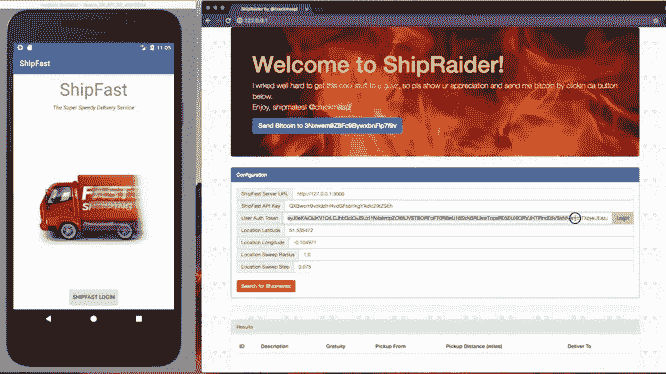

# 防止移动应用和 API 滥用

> 原文：<https://medium.com/hackernoon/preventing-mobile-app-and-api-abuse-a3c50c72efc2>

## OWASP 应用安全加州 2019 讲座

ShipFast 和 ShipRaider 在第六届年度 [OWASP 应用安全加州会议](https://2019.appseccalifornia.org/)上再次亮相，在[防止移动应用和应用程序接口滥用](https://appseccalifornia2019.sched.com/event/GS4Q/preventing-mobile-app-and-api-abuse)中扮演防御者和攻击者的角色。

AppSec California 是一个很棒的会议，有很多有趣的演讲和与会者，我有没有提到它是一月底在圣莫尼卡的海滩上举行的？大多数演讲都是录像的，包括我自己的:

随着 ShipFast 推出其具有隐藏 API 密钥和 OAuth2 用户授权的移动应用程序，我们开始讨论现有的安全威胁以及如何应对它们。在这一过程中，TLS、证书锁定、HMAC 呼叫签名、应用程序强化、白盒加密、应用程序证明等增强了 ShipFast 的安全态势，但 ShipRaider 也将努力尝试中间人攻击、应用程序反编译和调试、利用框架和其他反向工程技术，以继续利用 ShipFast 的 API。这份关于移动攻击和应对措施的快速概述展示了保护您的移动应用程序和 API 后端所需的深度防御技术。

ShipFast 和 ShipRaider 由 [CriticalBlue](https://approov.io) 开源，并在 [github](https://github.com/approov/shipfast-api-protection) 上提供，包括一些[额外的攻防场景](/approov/shipfast-api-protection-walkthrough-part-1-d00810b4138dgithub)。如果你想更深入，你将获得一个完整的开源例子和一些额外的家庭作业。对移动 API 保护的更全面的[概述可能是学习该材料的良好准备。](https://hackernoon.com/mobile-api-security-techniques-682a5da4fe10)

感谢阅读！有关移动 API 安全性的更多信息，请查看。