# 主成分分析——无监督学习模型

> 原文：<https://medium.com/hackernoon/principal-component-analysis-unsupervised-learning-model-8f18c7683262>

*了解如何训练和评估无监督的机器学习模型 Jillur Quddus(首席技术架构师、多语言软件工程师和数据科学家)在本文中的主成分分析。*

有许多真实世界的使用案例，其中可能用于训练模型的可用特征的数量非常大。一个常见的例子是经济数据，并使用其成分、股票价格数据、就业数据、银行数据、工业数据和住房数据来预测**国内生产总值** ( **GDP** )。这种类型的数据被称为具有高维度。尽管它们提供了许多可用于对给定用例建模的特征，但高维数据集增加了机器学习算法的计算复杂性，更重要的是还可能导致过度拟合。

过度拟合是**维度诅咒**的结果之一，它正式描述了在高维空间中分析数据的问题(这意味着数据可能包含许多属性，通常是数百甚至数千个维度/特征)，但该分析在低维空间中不再适用。

通俗地说，它描述了以模型性能为代价的额外维度的价值。**主成分分析** ( **PCA** ) 是一种 ***无监督*** 技术，用于预处理和降低高维数据集的维度，同时保留原始数据集固有的原始结构和关系，以便机器学习模型仍然可以从中学习并用于做出准确的预测。

# 电影推荐系统

为了更好地理解 PCA，我们来研究一个电影推荐用例。我们的目标是建立一个系统，可以根据历史用户社区电影评级向用户提供个性化的电影推荐。

我们将在案例研究中使用的历史用户社区电影评级数据是从 GroupLens 下载的，group lens 是明尼苏达大学的一个研究实验室，收集电影评级并在 https://grouplens.org/datasets/movielens/公开下载。出于本案例研究的目的，我们将单个 ***电影*** 和 ***收视率*** 数据集转换为一个数据透视表，其中 300 行代表 300 个不同的用户，3000 列代表 3000 部不同的电影。

这个转换后的管道分隔数据集可以在 GitHub 存储库中找到，位于[https://GitHub . com/packt publishing/Machine-Learning-with-Apache-Spark-Quick-Start-Guide/tree/master/chapter 05/data/movie-ratings-data，称为 movie-ratings-data/user-movie-ratings . CSV](https://github.com/PacktPublishing/Machine-Learning-with-Apache-Spark-Quick-Start-Guide/tree/master/Chapter05/data/movie-ratings-data%20and%20is%20called movie-ratings-data/user-movie-ratings.csv)。您还可以在[https://github . com/packt publishing/Machine-Learning-with-Apache-Spark-Quick-Start-Guide/blob/master/chapter 05/chp 05-02-principal-component-analysis . ipynb](https://github.com/PacktPublishing/Machine-Learning-with-Apache-Spark-Quick-Start-Guide/blob/master/Chapter05/chp05-02-principal-component-analysis.ipynb)找到本文的代码文件。

我们将研究的历史用户社区电影评级数据集的示例如下:

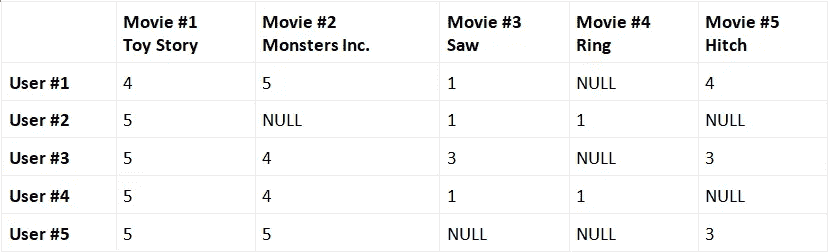

在这种情况下，每部电影都是不同的特征(或维度)，每个不同的用户都是不同的实例(或观察)。因此，该示例表表示包含 5 个要素的数据集。然而，我们的实际数据集包含 3000 部不同的电影，因此有 3000 个特征/维度。此外，在现实生活中，并非所有用户都会对所有电影进行评级，因此会有大量的缺失值。这样的数据集，以及用来表示它的矩阵，被描述为 ***稀疏*** 。这些问题会给机器学习算法带来计算复杂性和过拟合可能性方面的问题。

要解决这个问题，请仔细查看前面的示例表。看起来给电影#1(玩具总动员)高评分的用户通常也给电影#2(怪物公司)高评分。例如，我们可以说，用户#1 是所有计算机动画儿童电影粉丝的代表*，因此我们可以向用户#2 推荐用户#1 历史上评价较高的其他电影(我们使用来自其他用户的数据的这种类型的推荐系统被称为**协作过滤**)。*

*在高层次上，这就是 PCA 所做的事情——它识别高维数据集中的典型表示*，称为**主成分**，以便原始数据集的维度可以减少，同时保留其底层结构，并且在更低的*维度中仍然具有代表性！然后，这些缩减的数据集可以被输入到机器学习模型中，以正常进行预测，而不必担心缩减原始数据集的原始大小会产生任何不利影响。因此，我们现在可以扩展 PCA 的形式定义，从而我们可以将 PCA 定义为对较低维度的线性子空间的识别，其中原始数据集中的最大方差得以保持。***

***回到我们的历史用户社区电影评级数据集，我们可以寻求创建一个新的功能，以某种方式将电影#1 和电影#2 结合起来，而不是完全消除电影#2。扩展这个概念，我们可以创建新功能，其中每个新功能都基于所有旧功能，然后根据这些新功能在预测用户电影评级方面的帮助程度对它们进行排序。一旦排序，我们可以删除最不重要的，从而导致维数减少。那么 PCA 是如何实现的呢？它通过执行以下步骤来实现这一点:***

***1.首先，我们对原始的高维数据集进行标准化。***

***2.接下来，我们获取标准化数据并计算协方差矩阵，该矩阵提供了一种方法来测量我们所有的特征如何相互关联。***

***3.计算完协方差矩阵后，我们再找到它的 ***特征向量*** 和对应的 ***特征值*** 。特征向量代表主要成分，并提供了一种理解数据方向的方法。相应的特征值表示该方向的数据有多少变化。***

**4.然后，特征向量基于它们相应的特征值以降序排序，之后，选择顶部的 ***k*** 特征向量，表示在数据中找到的最重要的表示。**

**5.然后用这些 ***k*** 特征向量构造一个新的矩阵，从而将原始的 ***n*** 维数据集缩减为缩减的 ***k*** 维。**

# **协方差矩阵**

**在数学中，**方差**指的是一个数据集如何展开的度量，通过每个数据点的平方距离之和***【Xi】***，从均值 ***x-bar*** ，除以数据点总数***【N】***来计算。这由以下公式表示:**

**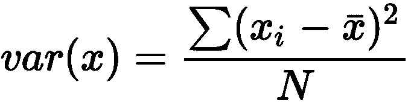**

****协方差**指的是两个或多个随机变量(在我们的例子中，我们的自变量)之间的相关性有多强的度量，并针对变量 ***x*** 和 ***y*** 对 ***i*** 维度进行计算:**

**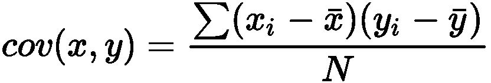**

**如果协方差为正，这意味着独立变量正相关。如果协方差是负的，这意味着自变量是负相关的。最后，协方差为零意味着独立变量之间没有相关性。这里，我们计算所有变量之间的协方差。**

**一个**协方差矩阵**是一个对称方阵，其中一般元素( ***i*** ， ***j*** )是协方差， ***cov(i，j)*** ，在自变量 ***i*** 和 ***j*** 之间(与****之间的对称协方差相同注意，根据定义，协方差矩阵中的对角线实际上只代表那些元素之间的 ***方差*** 。******

**协方差矩阵如下表所示:**

**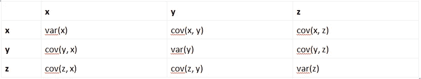**

# **单位矩阵**

**单位矩阵是一个正方形矩阵，其中沿主对角线的所有元素都是 1，其余元素都是 0。当我们需要找到一个矩阵的所有特征向量时，单位矩阵是很重要的。例如，一个 3 x 3 的单位矩阵如下所示:**

**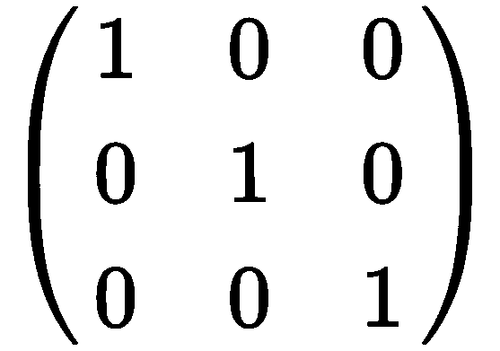**

# **特征向量和特征值**

**在线性代数中，特征向量是一组特殊的向量，当对其应用线性变换时，其*方向保持不变，仅改变一个 ***标量*** 因子。在降维的情况下，特征向量代表主要成分，并提供了一种理解数据方向的方法。***

**考虑一个矩阵， ***A*** ，维数为(***m***x***n***)。我们可以将 ***A*** 乘以一个向量， ***x*** (根据定义，维数为 ***n*** x 1)，结果得到一个新的向量， ***b*** (维数为 ***m*** x 1)，如下所示:**

**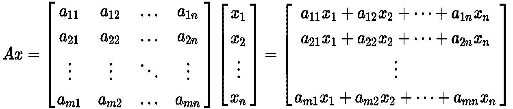**

**换句话说，**

**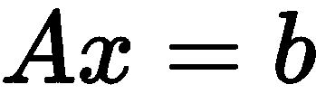**

**但是，在某些情况下，生成的矢量， ***b*** ，实际上是原始矢量， ***x*** 的缩放版本。我们称这个标量因子 ***λ*** ，在这种情况下，上面的公式可以改写如下:**

**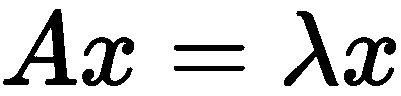**

**我们说 ***λ*** 是矩阵 ***的一个 ***特征值*** 一个******x***是与 ***λ*** 相关联的一个*特征向量。在降维的情况下，特征值表示数据在那个方向上有多少方差。***

**为了找到一个矩阵的所有特征向量，我们需要为每个特征值求解以下方程，其中 ***I*** 是与矩阵 ***A*** 维数相同的单位矩阵:**

**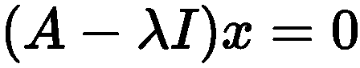**

**一旦找到协方差矩阵的所有特征向量，就按照它们相应的特征值降序排列。由于特征值表示该方向上数据的方差，因此有序列表中的第一个特征向量表示从原始数据集中捕获原始变量中最大方差的主分量，依此类推。例如，如下图所示，如果我们要绘制一个具有两个维度或特征的数据集，第一个特征向量(按重要性排序将是第一个主成分)将代表两个特征之间最大变化的方向。**

**第二特征向量(按重要性排序的第二主分量)将代表两个特征之间第二大变化的方向:**

**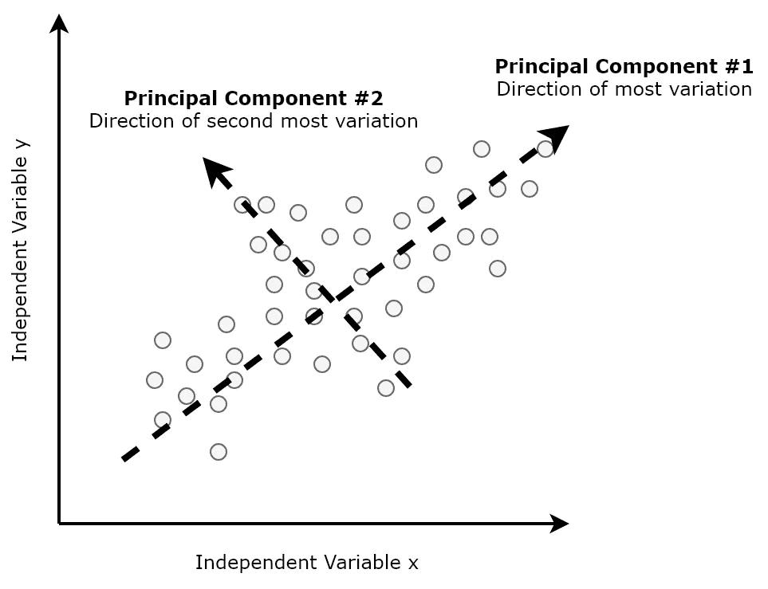**

**为了帮助选择主成分的数量， ***k*** ，以从特征向量的有序列表的顶部进行选择，我们可以相对于*轴上的累积解释方差来绘制***【x***轴上的主成分数量，如下图所示，其中解释方差是该主成分的方差与总方差(即所有特征值之和)之间的比率:***

**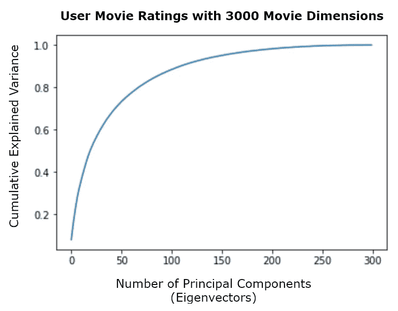**

**以此为例，我们将选择大约前 300 个主成分，因为这些主成分描述了总共 3，000 个数据中的最大变化。最后，我们通过将原始数据集投影到 ***k*** 维空间构建一个新的矩阵，该空间由选择的特征向量表示，从而将原始数据集的维数从 3000 维降低到 300 维。这种预处理和简化的数据集然后可以用于正常地训练机器学习模型。**

# **Apache Spark 中的 PCA**

**现在让我们回到我们转换后的管道分隔的用户社区电影评级数据集`movie-ratings-data/user-movie-ratings.csv`，它包含 300 个用户对 3，000 部电影的评级。我们将在 Apache Spark 中开发一个应用程序，该应用程序试图降低数据集的维数，同时使用 PCA 保留其结构。为此，我们将经历以下步骤:**

**1.首先，让我们使用下面的代码将转换后的、管道分隔的用户社区电影评级数据集加载到 Spark 数据帧中。得到的 Spark 数据帧将有 300 行(代表 300 个不同的用户)和 3，001 列(代表 3，000 部不同的电影加上用户 ID 列):**

```
**user_movie_ratings_df = sqlContext.read.format('com.databricks.spark.csv').options(header = 'true',inferschema = 'true', delimiter = '|').load('<Path to CSV File>')print((user_movie_ratings_df.count(),len(user_movie_ratings_df.columns)))**
```

**2.我们现在可以使用`MLlib`的`VectorAssembler`生成包含 3000 个元素的`MLlib`特征向量(代表 3000 个特征)，就像我们之前看到的那样。我们可以使用以下代码来实现这一点:**

```
**feature_columns = user_movie_ratings_df.columnsfeature_columns.remove('userId')vector_assembler = VectorAssembler(inputCols = feature_columns,outputCol = 'features')user_movie_ratings_features_df = vector_assembler.transform(user_movie_ratings_df).select(['userId', 'features'])**
```

**3.在我们使用 PCA 降低数据集的维数之前，我们首先需要标准化我们之前描述的特征。这可以通过使用`MLlib`的`StandardScaler`估算器并将其拟合到包含我们特征向量的火花数据帧来实现，如下所示:**

```
**standardizer = StandardScaler(withMean=True, withStd=True,inputCol='features', outputCol='std_features')standardizer_model = standardizer.fit(user_movie_ratings_features_df)user_movie_ratings_standardized_features_df =standardizer_model.transform(user_movie_ratings_features_df)**
```

**4.接下来，我们将缩放后的特征转换成一个`MLlibRowMatrix` 实例。A `RowMatrix`是一个没有索引的分布式矩阵，其中每一行都是一个向量。为此，我们将缩放后的要素数据框转换为 RDD，并将 RDD 的每一行映射到相应的缩放后的要素矢量。然后，我们将这个 RDD 传递给`MLlib`的`RowMatrix()`(如下面的代码所示)，产生一个 300 x 3,000 维的标准化特征向量矩阵:**

```
**scaled_features_rows_rdd =user_movie_ratings_standardized_features_df.select("std_features").rddscaled_features_matrix = RowMatrix(scaled_features_rows_rdd.map(lambda x: x[0].tolist()))**
```

**5.现在我们已经有了矩阵形式的标准化数据，我们可以通过调用由`MLlib`的`RowMatrix`公开的`computePrincipalComponents()`方法来轻松计算顶部的 ***k*** 主成分。我们可以如下计算前 300 个主成分:**

```
**number_principal_components = 300principal_components = scaled_features_matrix.computePrincipalComponents(number_principal_components)**
```

**6.既然我们已经确定了前 300 个主成分，我们可以将标准化的用户社区电影评级数据从 3000 维投影到只有 300 维的线性子空间，同时保留与原始数据集的最大差异。这是通过使用矩阵乘法并将包含标准化数据的矩阵乘以包含前 300 个主成分的矩阵来实现的，如下所示:**

```
**projected_matrix = scaled_features_matrix.multiply(principal_components)print((projected_matrix.numRows(), projected_matrix.numCols()))**
```

**生成的矩阵现在具有 300 x 300 的维度，证实维度从最初的 3，000 减少到仅 300！我们现在可以正常地使用这个投影矩阵及其 PCA 特征向量作为后续机器学习模型的输入。**

**7.或者，我们可以直接在包含我们的标准化特征向量的数据帧上使用`MLlib`的`PCA()`估计器，生成一个新的数据帧，其中包含一个包含 PCA 特征向量的新列，如下所示:**

```
**pca = PCA(k=number_principal_components, inputCol="std_features",outputCol="pca_features")pca_model = pca.fit(user_movie_ratings_standardized_features_df)user_movie_ratings_pca_df = pca_model.transform(user_movie_ratings_standardized_features_df)**
```

**同样，这个新的数据帧及其 PCA 特征向量然后可以用于正常地训练随后的机器学习模型。**

**8.最后，我们可以通过访问 PCA 模型的`explainedVariance`属性，从 PCA 模型中提取每个主成分的解释方差，如下所示:**

```
**pca_model.explainedVariance**
```

**得到的向量(300 个元素)表明，在我们的例子中，主成分的有序列表中的第一特征向量(因此是第一主成分)解释了方差的 8.2%；第二个解释 4%，以此类推。**

**在本例中，我们展示了如何使用 PCA 将用户社区电影评级数据集的维度从 3000 维减少到仅 300 维，同时保持其结构。然后，得到的精简数据集可用于正常训练机器学习模型，例如用于协同过滤的分层聚类模型。**

***如果你觉得这篇文章很有趣，你可以通过 apache spark 快速入门指南* [*探索机器学习*](https://www.amazon.com/Machine-Learning-Apache-Spark-Quick/dp/1789346568) *将包括机器学习、深度学习神经网络和自然语言处理在内的高级分析与包括 Apache Spark 在内的现代可扩展技术相结合，从大数据中实时获得可操作的见解。* [*使用 Apache Spark 快速入门指南进行机器学习*](https://www.packtpub.com/big-data-and-business-intelligence/machine-learning-apache-spark-quick-start-guide) *可以帮助你熟悉通过应用机器学习算法来处理大量数据的高级技术。***