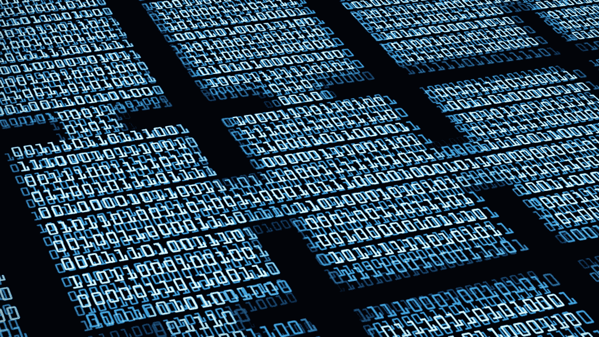
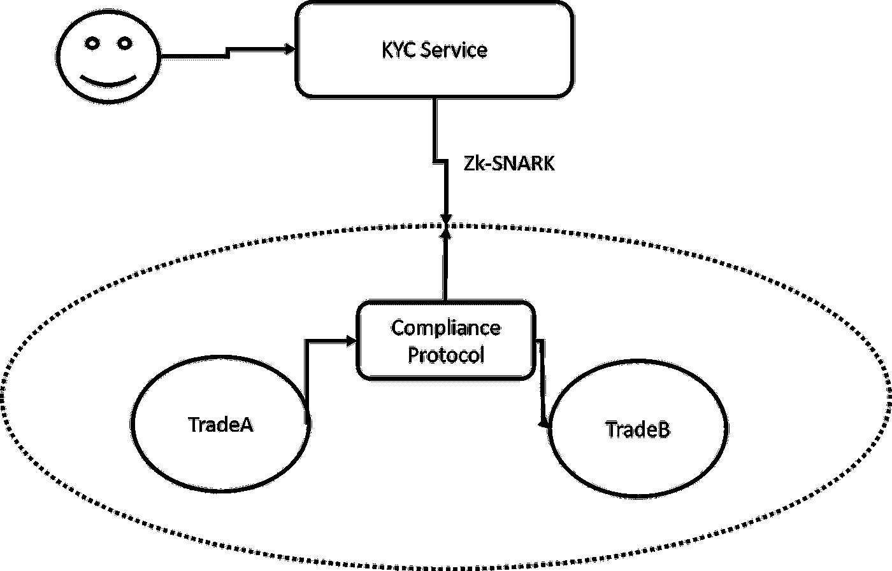

# 私有和兼容:关于零知识证明和安全令牌协议

> 原文：<https://medium.com/hackernoon/private-and-compliant-about-zero-knowledge-proofs-and-security-token-protocols-3a46a853e48d>

隐私是当前一代安全令牌解决方案中缺失的要素之一。在加密令牌中引入监管和合规模型引入了身份层，挑战了加密货币的许多假名和匿名概念。然而，安全令牌有自己的一套隐私要求，这些要求在很大程度上被生态系统所忽略。认为证券代币交易的所有方面都应该在公共分类账上披露不仅是天真的，而且实际上违背了证券业中许多最完善的合规模型。最近，我一直在探索使用零知识技术在安全令牌协议中实现更健壮的隐私层的想法。我想通过这篇文章来探讨其中的一些想法。

# 身份挑战

证券交易受了解客户(KYC)等法规的约束，这些法规要求参与者披露身份。然而，这些限制主要是基于试图证明投资者遵守特定安全要求的断言，而不是基于知道投资者本身的身份。换句话说，身份合规性更多的是证据而不是知识，了解这种差异对于在安全令牌应用程序中启用一组新功能至关重要。

从概念上讲，身份可以表示为一系列唯一定义一个人或实体的断言。使用数学术语，我们可以将恒等式表示为一个函数，该函数将一系列声明作为输入，输出关于这些声明的断言。关于恒等函数的一个有趣的性质是它是可逆的。换句话说，总有一个反函数，利用这个恒等式和一个特定的主张可以证明这个主张是真是假:

*恒等函数:f(c1，c2，…cn) → I*

*证明函数:p(I，CX)à→{真，假}*

在安全令牌的上下文中，上面描述的两个功能对应于建立特定方的身份的过程中的两个主要步骤。

1) **身份创建:**在这一步中，可信方编辑关于投资者的信息，并基于这些声明创建身份表示。例如，KYC 提供商可以收集投资者的身份或财务文档，并声明他遵守特定的法规。

2) **身份证明:**在交易期间，验证投资者合规要求，以批准或拒绝转账。

在当前一代安全令牌平台中，身份创建步骤由可信 KYC 提供者启用，而身份证明步骤通常由从安全令牌智能合约调用的集中式服务来实施。

虽然这个模型对于许多用例来说足够简单，但是对于其他用例来说却有着难以置信的局限性。这些限制中的大部分都与该模型所施加的集中化程度有关。您不仅需要信任 KYC 提供者在入职过程中颁发您的身份，还需要信任安全令牌提供者在交易过程中维护合规性。虽然身份创建步骤显然需要一个可信方来声明投资者的身份，但身份证明阶段可以保持相对分散，这为各种有趣的场景打开了大门。

想象一下，如果我们可以将一方的身份声明放在链上，使其可以被不同的协议使用，同时保持底层方的完全隐私。该模型将允许验证过程利用区块链共识机制的健壮性，并被原生地合并到其他加密协议中。

移动 KYC on-chain 等合规模式的想法是一个活跃的研究领域。如何实现这一点的最有趣的想法之一依赖于利用零知识证明等技术来断言链上投资者的身份声明，而不披露底层身份。

# zk-SNARKs？

如果你在加密领域，你可能知道 zk-SNARKs 是 zCash 等加密网络的底层协议，所以我不会用交互的数学细节来打扰你。重要的是要认识到 zk-SNARKs 可以应用于多个分布式分类帐。一些著名的例子包括[法定人数](https://www.jpmorgan.com/global/Quorum)，或者[阿兹特克协议](https://www.aztecprotocol.com/)以太坊区块链。

基本上，zk-SNARKs 抽象了证明者和验证者之间的交互。在交互中，证明者试图向验证者证明关于其身份的某些断言。在安全令牌的上下文中，我们可以想象投资者在不披露其身份的情况下证明诸如认证或流动性级别之类的断言。

关于 zk-SNAKRs 的动态已经写了很多，但更有趣的是看看它直接适用于安全令牌世界的好处:

1.  **完备性**:如果陈述为真，并且验证者和证明者诚实，则证明被接受。
2.  可靠性:如果陈述是假的，除非有很小的概率，否则欺骗证明者无法说服诚实的验证者这是真的。
3.  零知识:如果陈述为真，验证者除了陈述为真的事实之外，不会学到任何东西。
4.  **简洁**:证明的大小需要足够小，能够在几毫秒内被验证。
5.  **非交互式**:只有一组信息被发送给验证者进行验证，因此验证者和验证者之间没有来回通信。
6.  **论证**:计算上合理的证明:合理性反对利用多项式时间，即有界计算的证明者。
7.  【知识的 :没有证人(证明陈述所需的私人输入)，证据无法构建。

# ZK-标记和安全令牌

将 zk-SNARKS 的一些原则应用于安全令牌，我们可以想到一个模型，其中关于特定投资者或实体的断言通过 zk-SNARK 函数进行处理，并作为安全令牌智能合约的一部分进行存储。断言可以包括公民身份、流动性水平、认证和许多其他内容。

在交易期间，投资者将充当证明者，而合规协议将充当验证者。基于特定的 zk-SNARKs 断言，不同的安全令牌可以具有不同的遵从性要求。遵从协议验证特定的断言，而不必访问交易中涉及的不同方的身份。

使用 zk-SNARKs 间接分散了安全令牌传输的遵从部分。这个小小的改变带来了巨大的好处，因为现在该协议可以在其他 DApps 中使用，而不必信任负责发行的安全令牌平台。

# 实施思路

今天，为安全令牌实现 zk-SNARKs 是可能的。在以太坊区块链中，像 [ASTEC](https://www.aztecprotocol.com/) 这样的协议可以直接在以太坊 DApps 中实现 zk-SNARKs。来自 Quorum 的参考实现是另一种选择。

# Zk-SNARKs 你应该知道的替代品

Zk-SNARKs 并不是安全令牌协议中实现知识隐私的唯一选择。在区块链实现中，有几种替代方案正在获得关注，它们可以无缝地适应安全令牌协议。以下是我最喜欢的一些:

**CryptoNote &环签名:**区块链隐私的祖师爷之一，[crypto note](https://downloads.getmonero.org/whitepaper_annotated.pdf)(crypto night)是 Monero 背后的协议。从概念上讲，CryptoNote 利用一种称为可追踪环签名的加密技术来混淆分散网络中一组节点之间的消息。CryptoNote 协议的改进已经证明能够产生高度的匿名性，同时在可扩展的水平上操作。在安全令牌的上下文中，CryptoNote 可用于加强安全令牌交换的特定部分的隐私。

**zk-STARKS:** 根据我们的三角形理论，zk-Snarks 的挑战之一是难以大规模应用，因为证明的复杂性与数据库的大小成线性比例。今年早些时候，来自以色列技术学院[的 Eli-Ben Sasson 教授发表了一篇备受期待的论文](https://eprint.iacr.org/2018/046)，描述了 zk-Snarks 的一种更快的替代方案，他决定将其命名为 zk-Starks(以保持混乱)。Ben Sasson 教授在论文中解释说,“zk-SNARKs 使用公钥(非对称)加密来建立安全性。相反，zk-STARKs 需要一种更精简的对称加密技术，即抗冲突散列函数，从而消除了对可信设置的需求。这些相同的技术也消除了 zk-SNARKs(和 BulletProofs)的数论假设，这些假设计算量很大，容易受到量子计算机的攻击。这使得 zk-STARKs 的生成速度更快，并且是后量子安全的。”

**TEE:**可信执行环境(TEE) 已经成为区块链科技公司卸载机密计算的一种流行方式。诸如[英特尔软件保护扩展(SGX)](https://software.intel.com/en-us/sgx/details) 隔离代码执行、远程证明、安全供应、数据安全存储和代码执行的可信路径等技术。在 tee 中运行的应用程序受到安全保护，几乎不可能被第三方访问。安全令牌可以使用 tee 来卸载核心区块链的隐私计算。

**安全多方计算:**恩尼格玛区块链背后的协议，[安全多方计算](https://en.wikipedia.org/wiki/Secure_multi-party_computation) (SMC)是一种加密技术，允许针对一组输入执行计算，同时保持输入的私密性。SMC 可用于安全令牌交换中的各方，以交换有关信息的断言，同时保持实际信息的私密性。

在安全令牌中使用 zk-SNARKs 实现安全遵从的想法很复杂，但肯定是一个需要探索的领域。该模型不仅在安全令牌交易中引入了急需的隐私级别，而且实现了分散化级别，从而为加密证券交易中的新场景打开了大门。