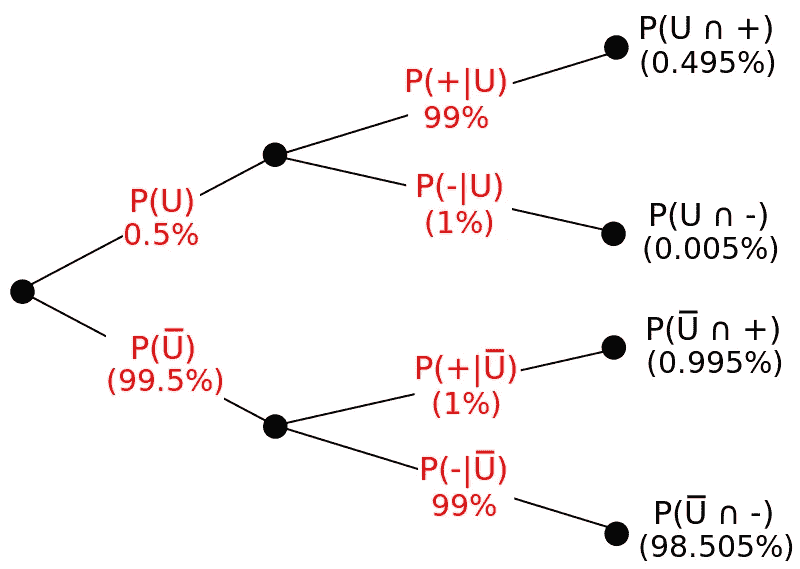

# 机器学习的概率

> 原文：<https://medium.com/hackernoon/probability-for-machine-learning-ed4b62e897f9>

source : [https://en.wikipedia.org/wiki/Bayes%27_theorem#/media/File:Bayes_theorem_drugs_example_tree.svg](https://en.wikipedia.org/wiki/Bayes%27_theorem#/media/File:Bayes_theorem_drugs_example_tree.svg)

嗨伙计们！！在这篇文章中，我将讨论我用来解决基于概率的问题的技巧和提示，我还将讨论概率的概念在统计学和 ML 中的应用。

注意:【这篇文章仅仅是关于概率和概率，而不是关于使用概率的 ML 算法。但是我向你保证，读完这篇文章后，你会对阅读和理解充满信心…