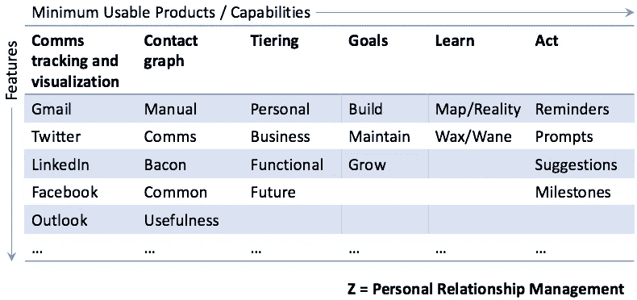
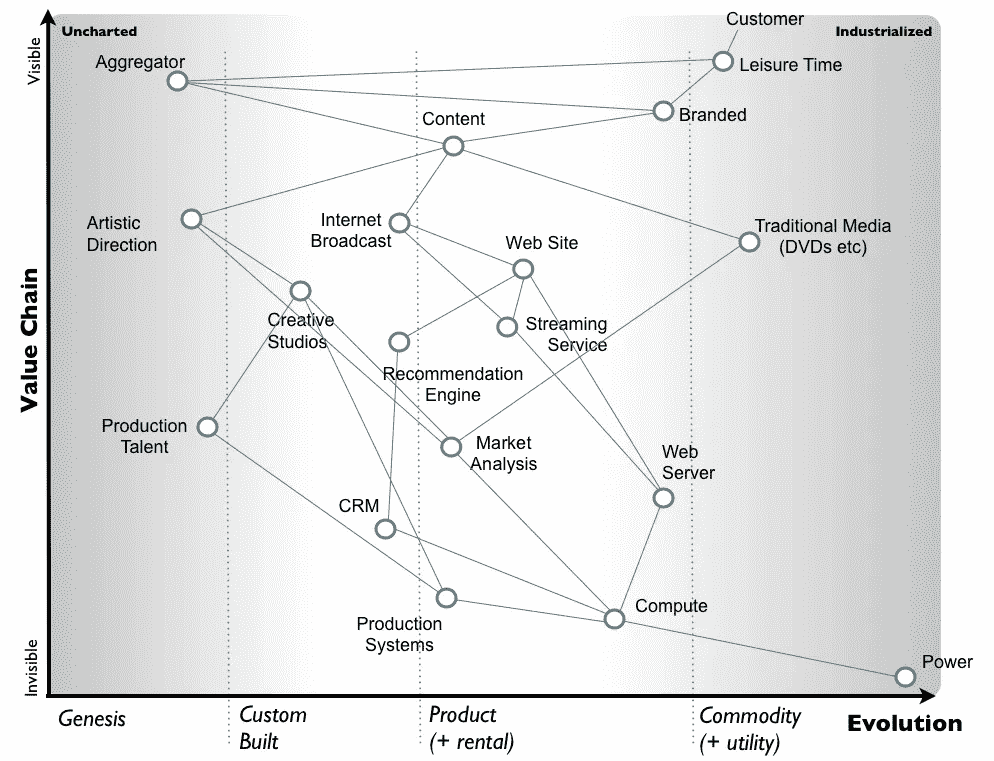

# 工程师产品 102:决策和策略

> 原文：<https://medium.com/hackernoon/product-102-for-engineers-e1b8b4e82fa3>

# 如何打造你想要的产品而不被淘汰出局

*编程注意事项:本帖是一系列不定长的产品话题中的 n 篇，主要面向* [*初创期*](https://hackernoon.com/tagged/startup) *人群，主要是领导，主要来自非 GTM 背景。末尾有一个列表。*

# 视觉和注意力分散

皮里茨的专业人士会告诉你，在银行里需要大量的前期资本和储备来等待多年的时间。]在你有好的产品之前。

*注:一个可怕的产品很容易在几个月后问世。这可能在一段时间内对一些市场有效，但最终这些品牌在较大的投资组合中是低利润的亏损领导者，或者它们的增长受到严重限制，或者它们会破产。*

那我们现在要做什么？我们做杜松子酒。

在制造威士忌的过程中，我们的一些产品可以制成杜松子酒——这种酒的销售利润很高，足以让项目在桶中成熟、找到特性的同时保持运转。[无意冒犯杜松子酒和杜松子酒爱好者！]

## *举例！*

以下是科特基[关于优步的重复](http://kottke.org/13/10/powers-of-ten-for-startups) [迈克尔·沃尔夫](https://www.quora.com/profile/Michael-Wolfe)【括号内注释我的】:

> 如果你认为优步是一家在几个城市运营的城市汽车公司，那它并不大。**【琴酒。]**
> 
> 如果你认为优步在几十个城市主导甚至发展着城市汽车市场，那么这个市场会变得更大。(数据点:现在旧金山的优步黑车比优步开始之前的所有黑车都多)。**【杜松子酒。】**
> 
> 如果你认为优步正在吸纳出租车市场，那么这个市场会变得相当庞大。**【杜松子酒。】**
> 
> […]
> 
> 如果你把优步想象成一台巨大的超级计算机，指挥着全世界数以百万计的人和物品的运送(物理世界的思科)，你会得到可能是世界上最大的公司之一。**【威士忌。】**

对于创始团队来说，一个相当常见的事情是在一些中间步骤上分心，满足于较小的市场，或者陷入追逐早期收入和用例的困境，这些都不会导致他们的最终目标。

这不一定是坏事！这可能是一个完全合法的商业和人生决策，转到我们在构建下一件大事的过程中发现的东西上。

# 战略和模式

我们如何让自己保持在正确的轨道上？我们如何知道我们正在构建我们想要构建的东西，解决我们想要解决的问题，为我们想要服务的用户服务？

可以说，这就是路线图的目的，但它们很少超出近期，并且随着时间的推移越来越模糊。

*注意:路线图很好！我们仍然需要某种路线图来组织我们的产品开发，周复一周，月复一月，季复一季等等。*

我们需要某种产品策略，这相当于目标和实现这些目标的决策原则:

*   我们试图解决的**核心问题**是什么？
*   我们想要帮助的人是谁？
*   我们如何看待**将**转化为产品？
*   这如何分解为创造和提供价值的最小组成部分？
*   什么是**可能的路径**以及从一无所有到包含这些组件的产品的组合顺序？
*   我们没有在建造什么？我们会对什么人说不？
*   我们能否**根据我们的走向市场(GTM)模型测试**我们打造的每样东西——例如，它是否能帮助我们生存下去:更好地营销、销售更多、获得下一轮融资等？
*   我们建造的每样东西都让我们朝着我们的愿景前进了吗？

注意:任何产品策略都存在于某个市场的环境中，最好还有一个商业策略。一个产品策略！=经营策略。为此，你需要 [*营销*](https://hackernoon.com/tagged/marketing) *+销售+分销+产品+运营+现金流的目标和原则。*

## *举例！*

这里有一个模型。像所有模型一样，它既有[错误，也有](/@aneel/all-models-are-wrong-d0d95da49027)有用。

左上角是我们开始的地方。z 是产品形式的最终目标，也就是右下角的“产品愿景”。z 可能应该被视为悬挂在右下角的一个附加单元格，但这看起来很奇怪，所以\_(ツ)_/。】

这些列是相加在一起的特征。顶行是它们加起来的总和:能力，或者甚至是产品，它们本身是有价值的。每个*都有*要在去 z 楼的路上建。

属于第一行的东西的标准是[最小可用产品(MUP)](/@aneel/minimum-usable-product-f80d5d588fc1#.3zkt8tjmf) ，这是 z 所需功能的*子集*。它还应该是最小上市可行性(MVP！)，意思是有人会为此买单。希望那些是*一样的东西*。如果不是，我们就要重新考虑我们关于这个世界的理论了。

*注意:是的，我奇怪地使用了 MVP，因为任何真正愿意为你的 MVP 付费的人通常都不是使用这个术语的标准..如果你认为“生存能力”有任何意义的话，这很有趣..*

我们可以深入每一列并构建最大化(？)可用产品。这是最重要的商业决策。我们应该在每一列的某个深度画一条线，显示 MUP 的结束和更好的产品的开始。

*要问的问题*

*   我们设计的最小可用深度是否真的足以让目标用户**体验价值**？
*   最小可用深度是否足以让产品达到上市可行性——我们可以针对它营销、销售和**结束业务**？如果没有，还有多远？
*   对于客户或业务来说，比*更深入的*是否值得**？**
*   这些是按最佳顺序排列的**最佳**能力吗？

理想的情况是在每个专栏中找到一些东西，提供足够的有形价值和积极的体验，让人们愿意为此付费。这有助于为我们前进的方向提供市场验证，并有可能提供一种选择，即建立一个运行率业务，在此基础上继续实现我们的最终愿景。

任何让我们更接近 Z 的路径都是好的和有效的。任何不这样做的道路，或者让我们完全偏离通往 Z 的道路，都是糟糕和无效的。这是全公司都在咬牙切齿的事情。

## *举例！*

在特定市场及其价值链的竞争动态背景下，明确确定我们的产品战略的一个好方法是使用沃德利地图。

这不适合胆小的人。参考下面的阅读列表。

## 举例！

任何给定的产品或功能应该做两件事之一:

*   增加现有的收入流:添加可深化现有用例价值的功能
*   创建新的收入流:通过添加新的使用案例或新渠道所需的功能来拓宽收入流。

如果路线图上的任何东西没有实现这些目标中的一个，它就会被丢弃。

*注意:维护、修复漏洞、偿还技术债务和成本优化都可以说是维护或改善现有收入流。*

## 一切都是假设

走向市场是检验我们假设的*感知机制*——如果没有人会为它买单(或者给我们钱来建造它)，那么我们就无法活着去建造另一天。

## **最终备注**

我们总是可以更深入和/或更广泛。

我们可以在原地停下来，抛弃我们认为会跟随的一切，为了建立一个新地方的新愿景。

但是那个新地方必须从我们现在所在的地方*到达*。我们建造的每样东西都会关上一些门，打开另一些门。做完全不连续的事情几乎是不可能的。

> 我们今天建造的东西限制了我们明天能建造的东西。

## 本系列中的帖子

*   [面向工程师的产品 101](/@aneel/product-101-for-engineers-83ef7260cbf1)
*   [工程师用产品 102](/@aneel/product-102-for-engineers-e1b8b4e82fa3)
*   [最小可用产品](/@aneel/minimum-usable-product-f80d5d588fc1)
*   [产品、营销和管理期望的艺术](/@aneel/product-marketing-is-managing-expectations-da963d36abea)

## 营销相关系列(和模板)

*   [工程师营销 101:功能介绍](/@aneel/marketing-101-for-engineers-ee9e7fcb1a51)
*   [工程师营销 102:打造漏斗](/@aneel/marketing-102-for-engineers-ddf3b7fa61e6)
*   [工程师营销 201:信息传递&定位](/@aneel/marketing-201-for-engineers-b28147fdb59d)
*   [面向工程师的营销 202:发布](/@aneel/marketing-202-for-engineers-launching-9437aa0e4961)
*   [工程师市场营销 203:销售支持](/@aneel/marketing-203-for-engineers-sales-enablement-e47662ca996a)
*   [面向工程师的营销 204:创造需求](/@aneel/marketing-204-for-engineers-generating-demand-27200085320c)
*   [工程师营销 301:战略&策划](/@aneel/marketing-301-for-engineers-strategy-planning-2e4473fcc879)
*   [工程师营销 302:招聘营销人员](/@aneel/marketing-302-for-engineers-hiring-marketers-a3a6d4355a03)
*   [面向工程师的营销 303:定价框架](/@aneel/marketing-303-for-engineers-pricing-frame-aa71c8860a2b)
*   [工程师营销 401:GTM 阶段](/@aneel/marketing-401-for-engineers-stages-of-going-to-market-6adcedc64e17)
*   [针对工程师的营销 402:诊断&故障排除](/@aneel/marketing-402-for-engineers-diagnostics-troubleshooting-d946a337c258)
*   [工程师营销 403:解答创始人常见问题](/@aneel/marketing-403-for-engineers-office-hours-bf4d2d0b5f56)
*   [工程师销售 101:功能介绍](/@aneel/sales-101-for-engineers-6fcd1b49cffa)
*   [针对工程师的 PR 101](/@aneel/pr-101-for-engineers-7cd116cc5347)
*   [工程师分析师关系 101](/@aneel/analyst-relations-for-startups-101-ea9338cb13ed)
*   [基本消息模板【谷歌文档】](https://docs.google.com/document/d/1neA71qCSeV3xH1Dpbtcy67m3v2ETmmB_Qq02ckkKUiQ/edit?usp=sharing)
*   [基本漏斗指标模板【谷歌表单】](https://docs.google.com/spreadsheets/d/11r4tHm_es6Tl4DItNUc_KzNdyvrmbbRmb38CJPLCvRU/edit?usp=sharing)
*   [基本发布时间表模板【谷歌文档】](https://docs.google.com/document/d/13Zscb5sX9ggjpWf05Ka-oj5wulC3Kb9z0LyMEQesnzM/edit?usp=sharing)
*   [基本战斗卡模板【谷歌文档】](https://docs.google.com/document/d/1dOCKhE1Ufmwp7bXeQTBCkST7NPwiCPJ2oyWEdpQut1g/edit?usp=sharing)
*   [详细战斗卡模板【谷歌文档】](https://drive.google.com/open?id=1EC3Lq6Z_IVrZKR4-jHgnc5-e3krZw4bA5Z-HAOJlH10)
*   [基本营销日历模板【谷歌表单】](https://docs.google.com/spreadsheets/d/1nXr0IqwnhQsUi_D83ecPXsIyDdiTkpNZ66piRkayPsA/edit?usp=sharing)
*   [基本营销阶梯模板【谷歌表单】](https://docs.google.com/spreadsheets/d/17EfTQp_21WomJ9cwiM4ian9M2QRcbM17_d3DilGNThY/edit?usp=sharing)

## **阅读清单**

*   西蒙·沃德利 OSCON 2015 主题演讲:[情况正常，一切都必须改变](https://www.youtube.com/watch?v=Ty6pOVEc3bA)
*   西蒙·沃德利:[价值链图谱介绍](https://blog.gardeviance.org/2015/02/an-introduction-to-wardley-value-chain.html)
*   尤金·卫:[看不见的渐近线](http://www.eugenewei.com/blog/2018/5/21/invisible-asymptotes)
*   本汤普森:[战略研究](https://stratechery.com/)
*   我: [AWS Lambda —战略性使用产品的一课](/@aneel/aws-lambda-a-lesson-in-using-product-strategically-185217e042e8)
*   我:[工程师营销 101](https://link.medium.com/wYMiRpRRwU)
*   我:[工程师营销 102](/@aneel/marketing-102-for-engineers-ddf3b7fa61e6)
*   我:[工程师销售 101](https://link.medium.com/kQGS7wLRwU)