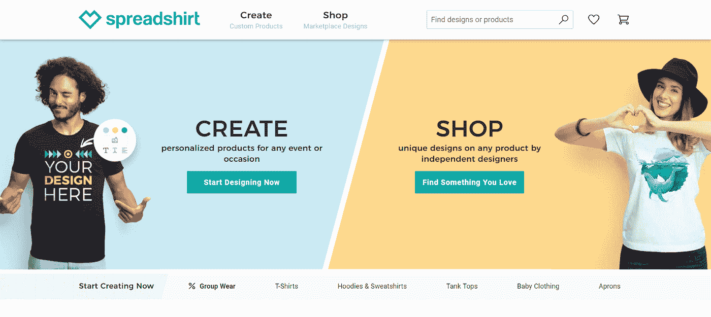
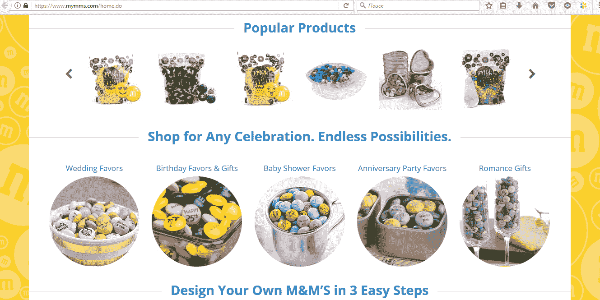
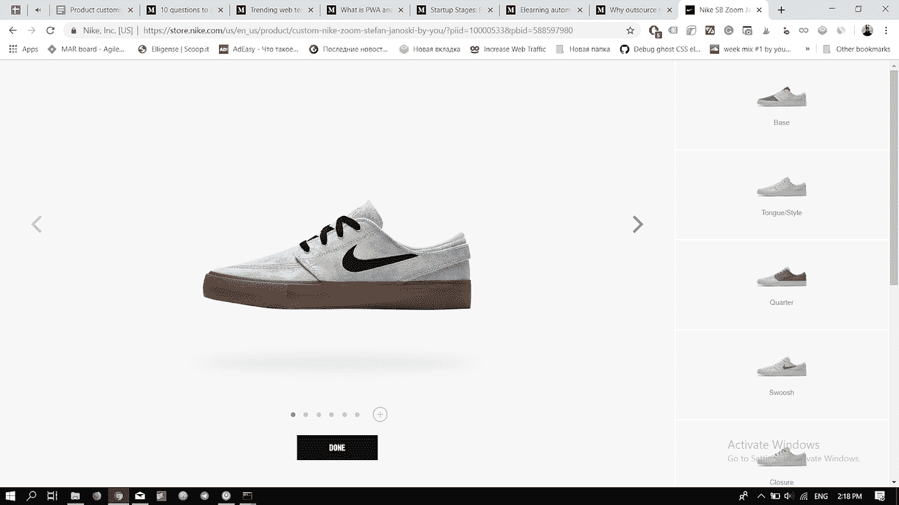
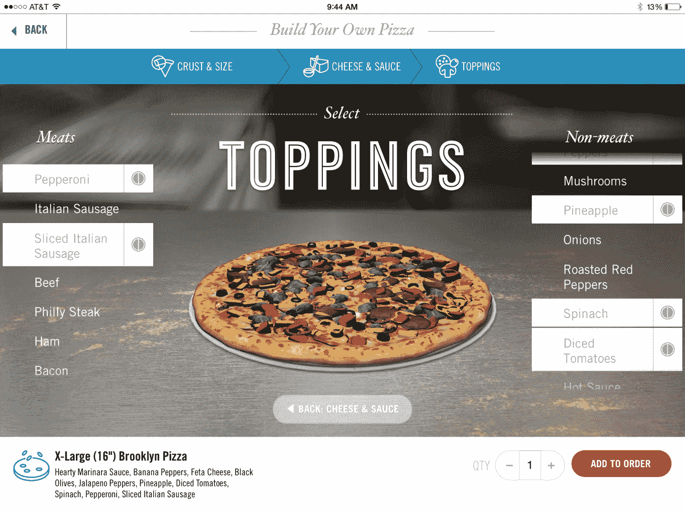
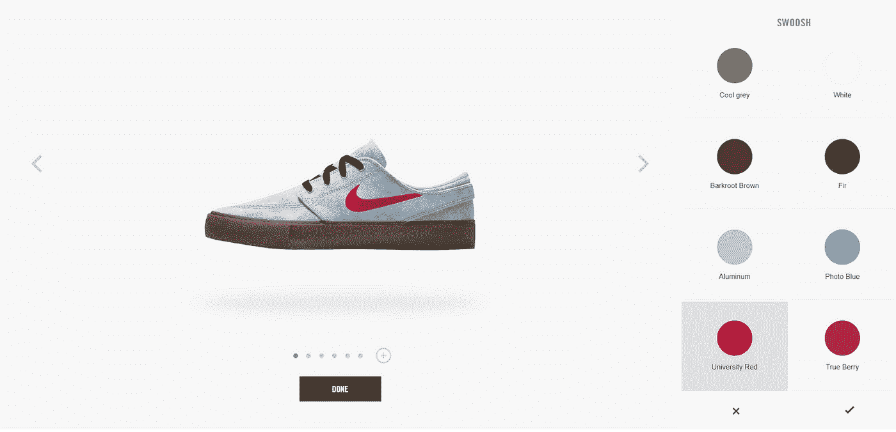

# 电子商务中的产品定制实施[包括示例]

> 原文：<https://medium.com/hackernoon/product-customization-implementation-in-ecommerce-examples-included-a25392fc6758>

产品定制正在成为电子商务行业的一股热潮。这种与消费者合作的模式允许公司为顾客提供机会，以获得根据个人意愿制造的产品。这种模式使大规模生产的商品适应特定消费者的需求。这是由于他们的部分变化，完善，并添加额外的元素。

# 在哪些电子商务领域可以实施产品定制？

实施定制的消费市场的主要领域:

*   印刷、纪念品和礼品——日历、相册、照片壁纸、记事本等。

spreadshirt.com

*   食物——巧克力、糖果、蛋糕和糕点。比如 [Mymms](https://www.mymms.co.uk/configurator.do?customerType=B2C) 可以让你定制 M & M 的糖果。您可以在单个包中应用表情、字母和日期。

[mymms.co.uk](https://www.mymms.co.uk/configurator.do?customerType=B2C)

*   有印花的衣服——t 恤、运动衫、棒球帽。
*   根据个人尺寸制作的服装——衬衫、罩衫、套装、裙子、连衣裙。例如，[博柏利](https://www.burberry.com/)品牌在其网站上提供订购风衣的机会。T4 的 Indochino 项目专注于西装和衬衫。
*   鞋子。大部分鞋品牌都有定制选项，[耐克](https://www.nike.com/nike-by-you)，[匡威](https://www.converse.com/shop/custom-shoes)，[吉罗蒂](https://girottishoes.com/custom-made)，应有尽有。

*   配饰——钱包、手袋、手机壳、笔记本电脑包、皮带、眼镜、珠宝等。比如有主人名字的手机壳或者眼镜。
*   家具和内饰。例如，宜家提议打造你梦想中的厨房。
*   交通工具——自行车、摩托车和汽车。例如，汽车制造商 Toyota、Mercedes、Porsche、Range Rover(颜色、车轮、内饰、可选设备等)网站上的配置器。).

Landrover customization

*   计算机设备——成套设备、贴纸等。例如，戴尔建议组装一台具有所需特性的计算机。
*   餐饮业。例如，棒约翰提供收集他们自己的比萨饼的机会。

Domino’s pizza customization

今天，几乎所有的公司都有可能提供定制服务，如果他们的产品允许的话。此外，标准产品和定制产品在价格和交付时间上的差异不再显著。

# 客户为什么爱产品定制？

定制商品需求增加的原因如下:

*   消费者希望“鹤立鸡群”，穿“独一无二”的衣服。
*   购买这类产品往往是为了吸引眼球或显示某种社会地位。(例如带有挑逗性印花的 t 恤)
*   这类产品通常带有享乐主义的主题，应该会给所有者带来积极的情绪和愉悦(例如，带有喜爱颜色的字母组合手机壳)。
*   定制商品是创意礼物的好选择。
*   增加消费者的自我重要性(“我和其他人不一样”，“我买得起…”等)。).
*   自我表现，反映自己的风格。
*   手工市场推动了定制化。然而，手工制品往往比定制的更贵。

定制商品的消费者形象是这样的:年龄在 20 岁以上，使用先进数字技术和小工具的进步创新者，紧跟现代潮流，有自己的观点，倾向于看起来不像“其他人”，愿意为最适合他们的商品支付更多的钱。在许多方面，这幅画像与 Y 和 z 一代代表的描述相呼应。

然而，越来越多的老一辈和年轻一代的人采用它。定制和个性化成为一件平常的事情。

# 你应该在你的电子商务网站上实现产品定制吗？

为了让您了解是否需要实施产品定制模型，请回答四个基本问题:

1.  您的产品可以定制吗？如前所述，对于这类产品，不仅理性成分很重要，情感成分也很重要。在他们使用的背后，也有机会享受拥有一个产品，展示它，展示一些东西，或者通过使用这样的产品作为礼物来唤起积极的情绪，等等。并不是所有的产品都能给消费者提供这样的机会。例如，在配件市场，定制是与消费者建立情感联系的好方法。
    在面粉或牛奶市场，由于商品本身的简单性和消费者对它们的情感约束，定制是不可能的。
2.  **谁会购买这些产品？**你要了解目标受众是否会经常购买此类产品。在这种情况下，您在产品定制功能开发上的投资回报可能是负的。
3.  **您能提供多少定制选项？**例如，有多少种颜色、风格、装饰选项等。你能为消费者提供吗？但请记住，更大的选择并不意味着更好的客户体验。你提供的选择越多，消费者就越难完成购买。
4.  **实施定制模式需要多少成本？**您应该计算所有成本，从制造和交付流程优化开始，到您的电子商务网站上产品定制功能开发的成本结束。

> 顺便说一句，如果你想知道在你的电子商务网站上实现产品定制需要多少钱，在这里问一下。

# 如何实现产品定制

## 外包给开发人员

如果你想为你的电子商务网站用户提供深度定制和最好的用户体验，你应该雇佣一个开发团队，如果你没有内部团队的话。

你可能有兴趣了解[在外包开发之前要问](/elligense-team/10-questions-to-ask-before-hiring-a-development-team-5691a15f7ecc)什么问题，以及为什么[外包给乌克兰](/elligense-team/10-questions-to-ask-before-hiring-a-development-team-5691a15f7ecc)是个好选择。

Nike 从头开始建立了它的产品定制页面，因为它允许创建高级和直观的产品定制体验。此外，不要忘记品牌和差异化，你可以创建一个独特的网页，消费者会记住和崇拜。

Nikeid 鞋电子商务产品定制软件示例

从技术的角度来看，我们在[相关的](https://relevant.software/)电子商务开发公司建议借助现代前端框架，如 Vue.js、Angular 或 React(耐克使用这一个)来构建这个解决方案。如果你想用 3D 渲染你的产品，并能旋转它，使用 Three.js。

从头开始创建产品定制功能是一个很好的想法，但它需要大量的资金，而大多数电子商务商店都没有。对于那些仍在创业的人，我可以推荐他们选择下一个选项。

## 购买 SaaS 电子商务产品定制软件

在您的电子商务中，产品定制实施的一个更快、更便宜的选择是购买现成的配置器。它通常作为你的 CMS (Wordpress，Shopify，OpenCart，Bigcommerce)的一个插件或者一个 SaaS 解决方案提供。

作为每月订阅(每月 19-99 美元)，它比从头开始构建要便宜得多。一个好的产品定制师会为你提供所有必要的功能。

这种解决方案对于那些希望快速起步的小公司和那些希望了解产品定制如何影响转化率的人来说是很好的。然而，如果你是一家大公司，我们强烈建议你选择第一个选项。

# 结论

产品定制是与你的消费者建立情感联系的一个很好的方式，并成为比另一个电子商务商店更大的东西。

如果您决定实现这个特性，有两种方法可以实现:从头构建(对于较大的公司)或者购买一个现成的解决方案。

咨询电子商务开发商并决定哪种选择最适合你的商店，这总是一个好的选择。免费填写[在这里联系相关软件](https://relevant.software/contact-us/)。