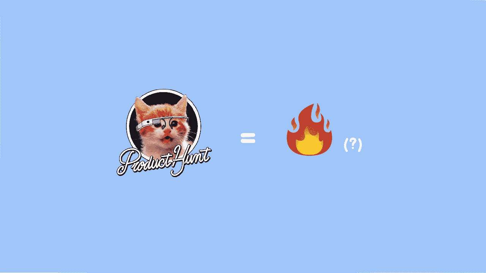
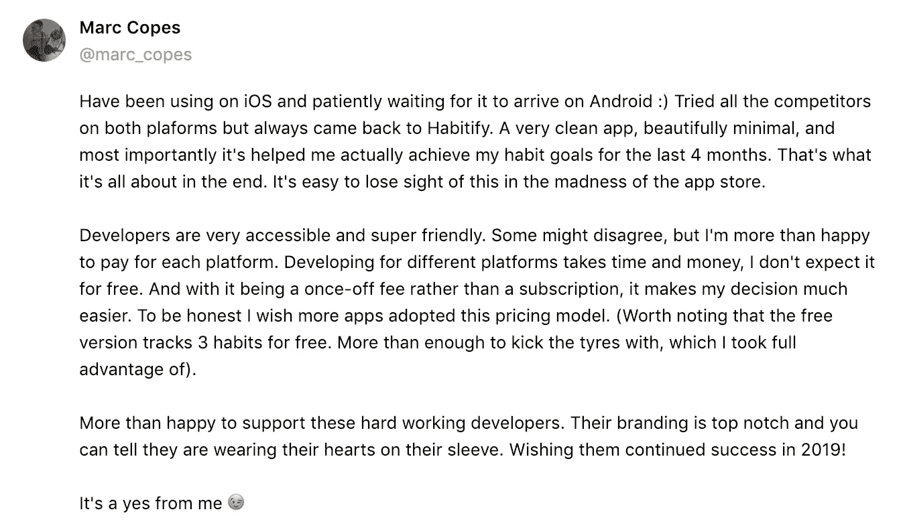
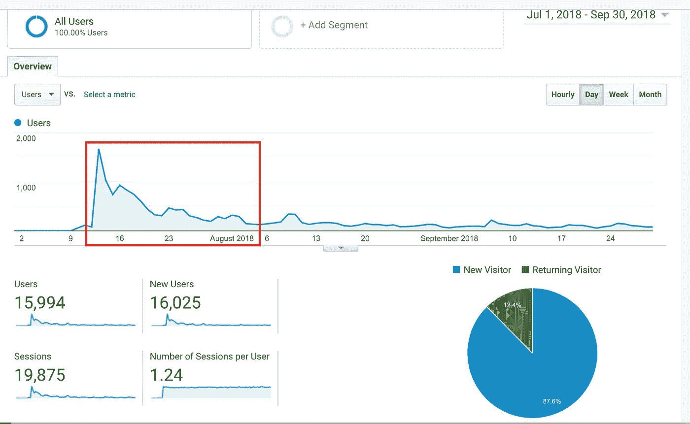
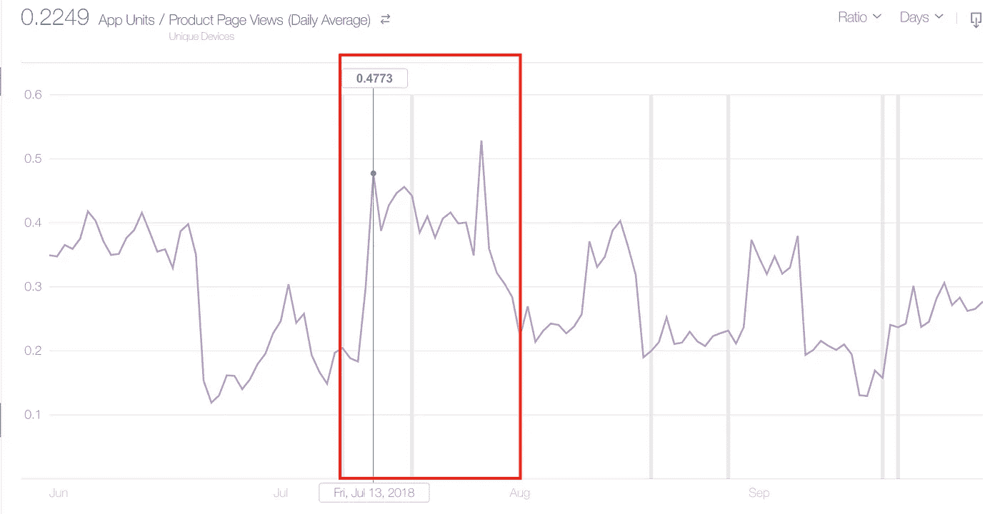
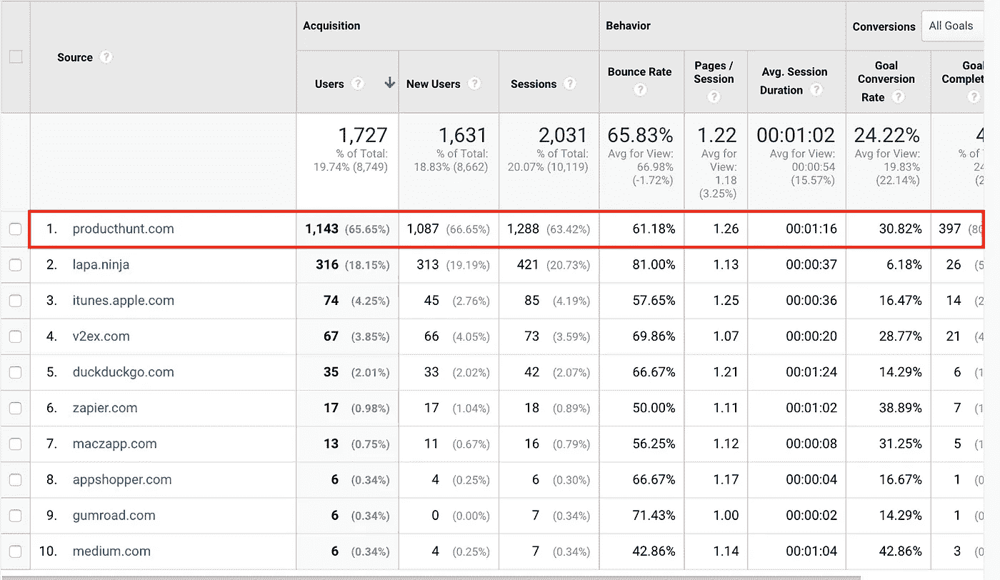
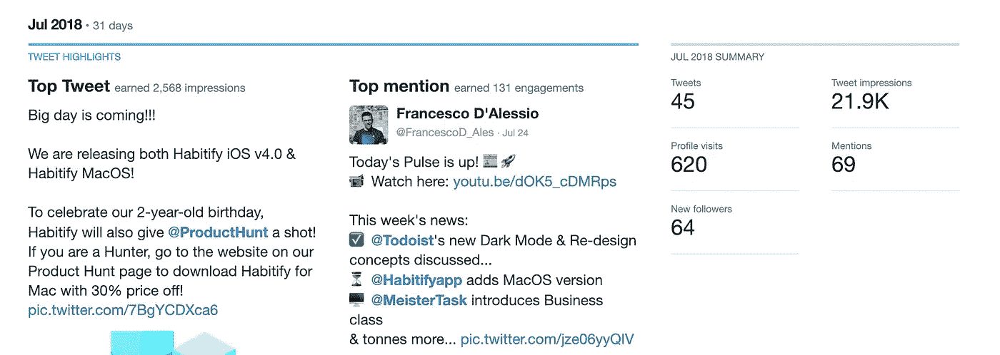
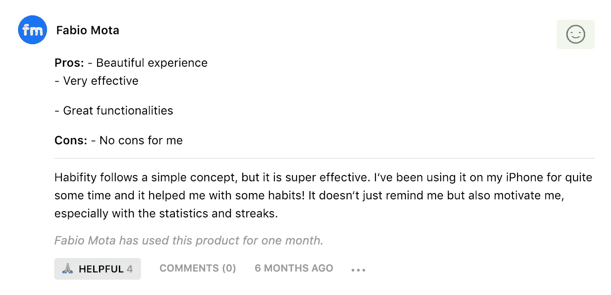
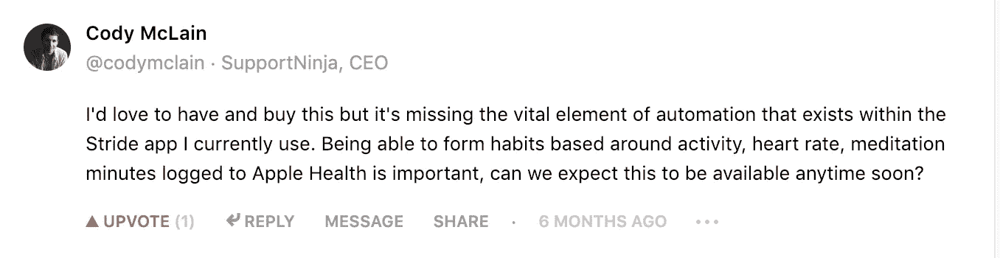

# 产品搜寻:值得大肆宣传吗？

> 原文：<https://medium.com/hackernoon/product-hunt-is-it-worth-the-hype-c1b78f45be11>

## 这很大程度上取决于你的目的。

嗨，

我是彼得，哈比提和 T2 的创造者。

上个月是我 2018 年第五次发布产品搜索。在这个过程中学到了很多东西，我想分享我所经历的所有磨损和泪水，希望能帮助像我一样的其他制造商。

# 什么是产品搜寻？

> “Product Hunt 每天都会推出最好的新产品。这是一个产品爱好者分享和研究最新移动应用、网站、硬件项目和技术创造的地方”——产品搜索

基本上，产品搜索是制造商展示他们产品的地方，也是普通人每天用新的创新更新自己的地方。

产品搜索的魅力在于它的今日页面，这里列出了制造商当天推出的所有产品。

所有制造商的梦想是让他们的产品出现在“流行”页面上，并最终成为前五名，因为他们将出现在 PH 的时事通讯中，获得更多的注册和反馈。

# 为什么会有炒作？

争夺冠军的竞赛如此具有挑战性，以至于它很快在互联网上成为病毒。“每日应用”徽章就像是新推出产品的信誉证明，所以人们对此非常关注。

因此，它给人一种印象，如果你是一个创造者，你必须知道并在 PH 上发布一次。

在我看来，PH 有其独特性，只适合某些用途。如果你是一名创客，你在犹豫是否值得在 PH 上推出一款应用，以下是我的答案:

# 是的。

*   *如果*你想为你的新产品获得一些动力，接受其他制造商的反馈和建议。

你很可能会被像[瑞安·胡佛](https://medium.com/u/c2146664c8e4?source=post_page-----c1b78f45be11--------------------------------)、[本·托塞尔](https://medium.com/u/1e799dd24f88?source=post_page-----c1b78f45be11--------------------------------)、[尼克·阿布泽德](https://medium.com/u/cae170cb45a4?source=post_page-----c1b78f45be11--------------------------------)这样的 PH 团队注意到……他们肯定会问一些尖锐的问题来挑战你，或者干脆用致命的可爱猫咪来转发你的产品🙀🙀。

*   *如果*你想获得非常铁杆的用户，他们会毫不犹豫地给你坦率诚实的反馈(就像我的情况),并得到一些非常知名的有影响力的人的注意，这些人后来可能会成为你的忠实拥护者。
*   *如果*你想知道你现在的用户有多爱你(🤣).

就我而言，我真的很惊讶收到了我最忠实的用户的大量评价。这真的很感人，也很令人惊讶，因为他们以前从来没有告诉过我。

Thanks [Marc Copes!](http://www.copestylin.com)

# 号码

*   如果你想给你的网站带来可持续的有机流量。即使是 PH 上最受欢迎的产品也不得不让位于新的产品。该列表每天更新，所以从技术上来说，即使是最热门的产品也不会永远留在那里。
*   *如果*你不爱猫(Product Hunt 是爱猫人士社区，你不知道吗？(看[他们的吉祥物](https://www.google.com/url?sa=i&source=images&cd=&cad=rja&uact=8&ved=2ahUKEwjoyZzx_-LfAhVGw7wKHXbGBqAQjRx6BAgBEAU&url=https%3A%2F%2Fthenextweb.com%2Finsider%2F2018%2F01%2F19%2Fmuch-needed-research-shows-effectively-launch-product-product-hunt%2F&psig=AOvVaw0C9RFTeh_IkFr3irnYQiKV&ust=1547202306049465)！)
*   如果你想大规模扩大你的客户群。从我们的经验来看，PH 的魅力在于它将你与你以后可以依赖的某些关系(媒体、有影响力的人、超级用户)联系起来，而不是吸引成千上万的新注册。

# 以下是我们从两次成功的 PH 发布中获得的数字，供您参考

在你走近猫之前，我只想确定一件事。

如果你的产品已经获得了成千上万的登陆页面访问和成千上万的下载，这篇文章*不适合你*(我担心如果你继续下去，你会嘲笑我的数字……)

但是，如果你是一个独立开发者，正在寻找一种方式来获得更多的公众关注，那么，你可能想看看在 PH:)

## **😸登陆页面流量激增(macOS 发布版的 Habitify)**

*   发布当天有 1，665 次访问
*   7 天内 8818 次访问
*   14 天内有 11，958 名用户
*   14 天内 3000 美元的销售额(iOS 和 macOS)

The red box indicates PH launch after effects.

由于 mac App Store 在我们推出时没有提供分析，所以很难衡量流量的质量。让我们假设对 macOS 感兴趣的用户也有一部 iPhone，并且他们访问了 App Store。

In the period of Jun-Sep, this launch’s traffic has a significantly higher conversion rate.

PH 流量有**近 31%** 的转化率，上线后 14 天测。几乎比[行业平均转化率](https://unbounce.com/average-conversion-rates-landing-pages/)高出 8 倍！

I don’t know why there’s traffic coming from zapier.com…

同样的奇迹发生在推特上！

有史以来第一次，Habitify 仅在 7 月份(我们的发布月)就达到了 2 万次展示，与之前每月 3 次 4K 相比，这是一个巨大的数字！

我们的发布引起了弗朗切斯科·德阿莱西的兴趣🙏)所以我们也很幸运地被他特写了！你可以在这里查看。

## **😸了解我的产品的利弊**

> PH 是一个很好的地方，因为你会收到积极的和 n̶e̶g̶a̶t̶i̶v̶e̶积极的反馈。

没有负面反馈这种东西，因为每条评论都会让我们对用户有更多的了解。

例如，对于 Habitify macOS，我们意识到它对于关心易用性的用户来说足够简单和时尚:

Thanks @Fabiomotach!

但与此同时，我们知道对于关心功能的用户来说，Habitify 还有很长的路要走。

Thanks [Cody McLain](https://medium.com/u/b9d820d89c87?source=post_page-----c1b78f45be11--------------------------------)!

## **😸新的联系。宝藏。**

我发布的主要策略是找到尽可能多的 Habitify 支持者，并一个接一个地要求他们帮助推广产品。结果证明效果是微不足道的，但我得到了别的东西。

我很惊讶地意识到 Twitter 是一个非常酷的平台，可以交朋友，认识同一领域的人。通过活跃在 Twitter 上，我知道我的一些用户非常热衷于查看我的推文并转发它们！(感谢[齐米凯恩](https://medium.com/u/aca16c4204be?source=post_page-----c1b78f45be11--------------------------------)和[伊森](https://medium.com/u/ff630c42c391?source=post_page-----c1b78f45be11--------------------------------)！)

然而，第二次发布(Android 版 Habitify)并不成功。(我已经在**这篇文章**中解释过了)

*   登陆页面的 450 次访问
*   1337 应用程序安装
*   14 天内 500 美元的销售额

不算太坏，考虑到一年中的这个时候(12 月 22 日)大多数人开始放松他们的家庭和假期。尽管如此，如果不是因为我们的错误，情况可能会更好…

—

只有你能说产品搜索发布值不值得。我建议看看你自己的产品和你的时间表(同样，如果你爱不爱猫🐈)

产品搜寻投放需要时间和精力。这不是一次性的游戏。绝对不是你想作弊的地方。

嗯…

好吧。

好吧。

我想过出轨，好吗？但是由于因果报应，我自己的肮脏意图适得其反，所以，不，不要在家里尝试。这是一个关于*尽管我的应用程序拥有第二高的 upvotes，却被严重惩罚到第五名的故事！*

 [## 产品搜索:C . a . t——每日应用的终极方法。

### 由《学习产品猎取 h̶a̶r̶d̶的幼稚方式》一书的作者彼得撰写

hackernoon.com](https://hackernoon.com/product-hunt-c-a-t-the-ultimate-approach-for-app-of-the-day-361b9193dde1) 

—

如果你认为你至少从这篇文章中得到了一些价值，其他人也可能会这样认为，你的分享会受到很大的赞赏。

*如果你对这篇文章有任何问题，请在评论中留下:)如果你的产品即将在 PH 上发布，并且想要客观的反馈，你可以随时通过@tiepvuvan 给我发消息::*

—

## **“产品搜寻:值得大肆宣传吗？”这是我在做了 5 年独立开发人员后，从产品开发、市场营销、团队管理到客户管理，学到的一系列无穷无尽的经验教训中的第一篇。**

## **👏如果你想收到更多这样的帖子，请告诉我:)**