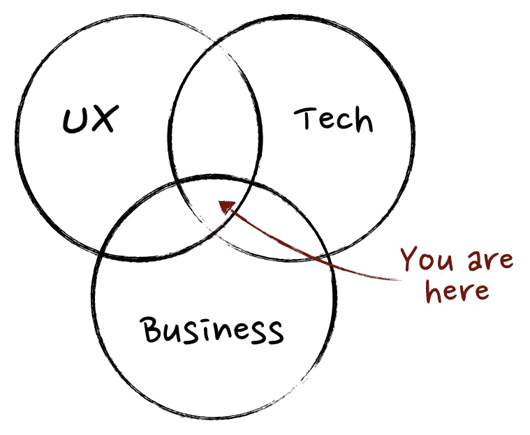

# 无人谈论的产品管理技能；)

> 原文：<https://medium.com/hackernoon/product-management-skills-no-one-talks-about-5d50debfb815>

## 让我告诉你一个产品管理行业对你隐瞒的秘密，或者没有说出来——我们不太在乎硬技能。还有什么硬技能？写一个 PRD？做用户访谈？了解 UX？了解商业和技术？

这里有比你看到的更多的东西。除了 UX、商业和技术，这也是成为更好的产品经理所需要的。

几年前，当我开始我的产品管理职业生涯时，几乎每一个谷歌搜索上，“*项目经理做什么？*"或 [*成为一名优秀的 PM 需要具备哪些技能？*](https://www.productschool.com/blog/product-management-2/must-have-product-management-skills/) “把我降落在维恩上！这个文恩:

Source: [What, exactly, is a Product Manager?](https://www.mindtheproduct.com/2011/10/what-exactly-is-a-product-manager/)

维恩图告诉你产品经理坐在技术、设计和商业的交叉点上。这个维恩很好地洞察了我需要做什么和学什么。因此，我开始疯狂地囤积这些学科的书籍，并在不到一年的时间里阅读了至少 50 多本书。那段时间，我甚至创下了单周读完三本书的个人记录。以下是我那时的脸书邮报，晒晒一些 ***自恋，有限世界观的荣耀*** :

 [## 塔鲁纳·曼昌达

### 1 周。3 本书。

www.facebook.com](https://www.facebook.com/photo.php?fbid=10212037128460692&set=a.10216936995754312&type=3&theater) 

然后，现实来袭！或者我可以说，我投入其中。

花了相当多的时间来制造产品，流了眼泪(字面上的意思),花了很多艰难的日子才明白产品管理不仅仅是商业、UX 和技术。事实上，商业、UX 和技术只是产品管理工作的一部分。

> 从本质上来说，PM-ing 是一项需要勇气、持续不断的耐心、持续不断的情感斗争，并且仍然保持快乐的工作！

我在产品管理行业工作了将近四年，与国内一些最聪明的人一起开发并合作了一些非常成功的产品，在此过程中，我学到了很多东西。所有这些都来自犯错误、失败以及在一天工作结束时产生“我希望我处理得更好”的想法的纯粹经验。现在知道了更好的样子。

这是:

# 第一课:产品经理不能悲伤。

你可能会说很奇怪？经前综合症不能悲伤？这是否意味着我们必须保持快乐？这有什么关系？

项目经理生活中典型的一天并不是坐在海湾的一个角落里，默默地、深思熟虑地编写产品需求文档。相反，这是一个充满 UX、科技和商业人士不断推动的一天。典型的一天是大量的会议、对话、大量的协调，以及来回的想法和异议。

PM-ing 是一种销售电话永无止境的销售工作。每时每刻都是表演时间！在这份工作中，一天之内，你将不得不与数十个不同的利益相关者互动，他们有着不同的性情、个性、动机以及不同的需求和情绪状态。那么，在任何时候，你怎么能承受闷闷不乐、郁郁寡欢或不在最佳、最兴奋的状态呢？那么你怎么能承受悲伤呢？你怎样才能在那些大大小小的销售会议中取得胜利呢？这些会议都很累，筋疲力尽，或者一点都不热情。

快乐是关键，宝贝。字面上。

# 第二课:不，产品不是你的宝贝

你会经常听到相反的说法——产品是你的宝贝。你必须照顾它，养育它，像爱护自己的孩子一样爱护它。引用的理由是，你必须给它无私的爱，24X7 无偏见的关注，以及血汗——就像你对自己的孩子做的那样。

那是不对的！原因不止一个，而是两个。

第一，你有没有考虑过谋杀自己的孩子？你能接受对你孩子的批评吗？

如果不是，那就不要再把这个产品当成你的宝贝了。不是的。它是一种产品。你必须努力工作以获得成功，并且在情感上完全超脱。最重要的是，像对你的孩子一样对它有感情。

第二，一个孩子可能需要 24X7 的关注，一个产品，为了它自己的利益，不需要。

有时候，你必须关闭才能倾听。跳出框框，能够跳出框框思考。把自己从产品的现状中抽离出来，以便能够为它找到一片蓝海。

## 我为什么这样说？

产品管理是一个不断改进产品的过程。这也是放弃坏想法、坏产品和功能的旅程，有时甚至是在它们不按预期工作时放弃它们。对你的产品有感觉会让你对所有对你产品的批评视而不见。有时，这也可能使你处于守势，无法以正确的态度接受反馈或用户的声音。所有这些都是糟糕的产品管理的秘诀。

所以，今天，为了你自己的利益和产品的利益，看看产品的本来面目——解决客户需求的生意。

# 第三课:寻求即时满足？也许找另一份工作

虽然在前面的一点中，我将产品管理比作销售工作，但这里的关键区别在于，在工作日结束时没有满足感。推销已经开始，销售已经完成，但是背景中没有硬币的声音。

你刚刚打的那个销售电话不会在今天、明天，甚至六个月后达成交易。

> 产品不是一笔销售交易，或者一份合同，或者几行代码，或者一个设计。这是一段旅程。

一段持续不断的旅程。你知道最糟糕的是什么吗？你没有签订合同，你没有营销它，你没有编写那段代码，你没有设计它(在大多数传统的 PM 工作中是*),因此在一天工作结束时完成某件事情的满足感是很难得的。非常罕见！*

*然而，您将不断地进行改进、迭代、产生见解、优化，并在每一点上做出正确的决定——这是一个永无止境的循环！*

*产品管理需要持续不断的耐心来完成事情。不断学习，不断迭代。并且得到结果，然后结果再次成为另一组优化的起点。*

*所以，如果你正在寻找立竿见影的效果，也许这并不适合你。*

> *旁注:过于耐心也是不好的。作为一个项目经理，你还必须表现出强烈的行动倾向，并有足够的耐心让你的产品尽快上市。*
> 
> *太多矛盾的想法？谁说会很容易？*

# *第四课:学会寻求真相，而不是验证*

*作为一名项目经理，你通常被期望提出一些非常好的想法来解决用户的问题，这些想法比现有的解决方案要好至少 4 倍。在这个旅程中，你需要对问题陈述进行大量研究，研究你在为谁解决这个问题，这个问题有多大，现有的解决方案是什么。*

*此外，在这一过程中，许多经前综合症患者倾向于在途中建立一个关于可能的解决方案的假设。一旦完成，他们试图用更多的研究来支持它，研究特定的解决方案能在多大程度上解决用户的问题。在这个过程中，文档被放在一起，产品假设被创建，远景被写下来，一些影响分析被完成。*

*到目前为止一切顺利！一旦到了这个阶段，在花了几周(或者几个月)的时间试图找到一个问题陈述的解决方案之后，很自然地就会喜欢上你的解决方案。这就是问题的开始。一旦他们执着于一个解决方案，经前综合症倾向于从周围的每个人那里寻求对他们思维过程的认可，而不是寻找真相。对这个想法的投资导致依恋，依恋导致你的防御机制启动——绝对是人类的！*

*在这种时候，我会这样做——与其四处打听某件事是否可行，不如让人们告诉你你的想法可能失败的三个原因。不要退而求其次，求三个犀利的理由。一旦你这样做了，并且只和 10 个人交谈，你就会有 3X10 个视角——那就是 30 个不同于你的视角去思考和思考。*

*这里的问题是——仍然使用你最好的判断。并不是所有这 30 个观点都是正确的、重要的或可以立即实现的。这个练习的想法只是为了让自己可以寻求真理，而不是满足于验证。*

# *第五课:*“但是我已经尽了力”综合症**

*这是最重要的一课。可能是最短的。我一开始说产品管理行业不太在乎硬技能。这也意味着，如果产品没有问世，那么最闪亮的产品需求文档，或者产生的最有价值的见解都无关紧要。*

*在游戏的早期，我很容易受挫，而且很早。我给自己的借口(*令人惊讶的是，这么多年来，我一直为那些信任我的判断并给我很大自主权的老板工作，因此“我给自己的借口”*是，“ ***但我已经尽了我的一份力量……***”。我写了产品需求文档，我做了客户访谈，我做了所有的技术讨论，我做了这个，我也做了那个…但事实是，产品还没有出来。*

*作为产品经理，你们实际上是整个演出的指挥者。你不能做一部分事情，然后坐在围栏上看事情。*

*你必须真的投入进去，才能赢。这意味着，作为产品经理，你不必完成任何事情，也不必继续前进。你必须坐在整个过程中——帮助工程师解决她遇到的问题，获得足够的见解来设计精彩的体验，成为产品的拥护者，帮助营销和销售人员更好地了解产品，更好地做他们擅长的事情。本质上，旅途中的任何一个细节都是你的责任。而你的位，大到不足以称为“位”。*

# *第六课:艺术家，不要为自己制造产品！*

*我们经常陷入“每个人都和我们一样”的偏见。我们开始相信世界上有两种人——和我们一样的人，和和我们不一样的人。显然，每个和我们一样的人都像我们一样思考、操作和行为。这意味着，如果我有这个问题，其他人，我认为和我一样的人，也有这个问题。这个问题如此之大，如此之广，它需要一个解决方案。当它出来的时候，你会听到的是，"*来，拿走我的钱！我一直如坐针毡地等待这个产品的问世。**

*只是，那不会发生。*

*撇开哲学不谈，上述情况意味着，我们开始相信，在这个世界上，我们的问题太大，没有商业价值。我们带着如此大的热情开始解决我们自己的问题，以至于我们从来没有查看隧道和正确估计市场。我们没有环顾四周，看看是否有我们可能没有意识到的解决方案存在！也许比我们的假设做得更好。*

*由于这是我们自己的问题，我们也错误地倾向于相信我们对问题了如指掌，如果问题真的存在，我们不需要听别人说——甚至深入隧道。*

*不要那样做——不要为自己制造产品。走出隧道，做足够的研究:*

*   *如果你所面临的问题被足够多的人所面临，并从中获取商业价值*
*   *如果问题大到可以解决*
*   *如果解决方案已经存在，您的解决方案将对现有解决方案做出什么样的增量改进*

> *侧注:脸书是数字时代历史上最成功的产品之一，它诞生于某人解决自己的痒处。但是这种渴望有足够的市场，而且很快很早就形成了。知道界限在哪里，做足够的研究。*

# *第七课:发布不是庆祝的时候*

*坦白:我已经做了太多次了。*

*数周的研究，数周的执行，数周的出货准备。发布日期终于到了——难道我们不应该休息一下吗？庆祝吗？*

*当然，我们有。*

*唯一的问题是，我们中的许多人把这个庆祝活动看得太重了。我们认为已经完成了。我们认为*【从此幸福快乐】*就在这里。*

*就像我们在婚姻中一样？但事实上，结婚的日子才是努力真正开始的时候。就像婚姻一样，从你开始分享真实空间的那一天起，你和你的产品之间关系的真正考验就开始了——这个想法不再是，它是一个真实的产品，有时有形状和形式。*

*一旦你的产品公之于众，你就知道这几个月的研究和努力到底意味着什么。不管你的解决方案的最初假设是否适合你的客户群。你说的话是否会在银行里赚到钱。这次发射实际上是一些严肃工作的开始。*

*因此，尽管对你的发布大喊大叫感觉很棒是可以的，但庆祝的时间是当第一个客户使用你的产品时，当第一张工资支票到达银行时，当更多的客户使用该产品时，更多的工资支票到达银行时！*

*当假设成立，你的产品符合市场需求时，就是庆祝的时候了。当你的客户成为你的营销人员和销售人员时，你就该庆祝了。*

> *旁注:庆祝是好的。庆祝里程碑也很好。但是要知道你在庆祝中传达了什么信息——不管是“我们实现了，我们完成了”还是“我们正在为新的篇章欢呼”!*

*附:亲爱的读者，我很想听听你不寻常的、以前不为人知的产品管理课程。在下面的评论区分享一下吧。此外，如果你喜欢你刚刚读到的，一定要推荐它，并与你的网络分享。*

*tarunawrites@gmail.com*你可以通过推特@taruna2309 和电子邮件联系我**