# 15 部漫画中的产品噩梦

> 原文：<https://medium.com/hackernoon/product-nightmares-in-15-comics-a28ae659cd4f>

在产品开发部门工作很棒。然而，有时它可能是一个颠簸的旅程。公司中的产品职位是个人努力和组织结构的交叉点。这是结构和你自己的认知偏见之间的激情舞蹈。有时候很难分辨障碍的根源在哪里。我们都见过产品人员抱怨结构限制，而事实上原因是他们自己的行为。反之亦然，当有才华的个人遇到阻碍创新的官僚主义障碍时。

然而，我们每天都面临着挑战和有趣的情况。我想对产品负责人、产品经理和他们的团队遇到的挑战开一点玩笑，所以我画了一些简单的漫画。创作涂鸦是我心中非常珍视的爱好，但它不是我的主要工作。我现在已经在一个产品里面快五年了。这是一个令人惊奇的角色，它不断敦促你提高你的分析能力和人际交往能力。但是当你开始权衡用户需求、紧迫的截止日期、公司目标和团队需求时，你肯定会犯一些错误。自怜片刻后，你站起来，抖掉肩上的灰尘，拥抱那些不愉快的步伐，因为它们迫使你走出舒适区，在职业和个人方面成长。

所以，让我们从一个有趣的角度来看待这些小挑战。这里有 15 幅关于开发数字产品时你能期待什么的漫画。

# 明确的优先事项

保护团队不受干扰…还有你自己。

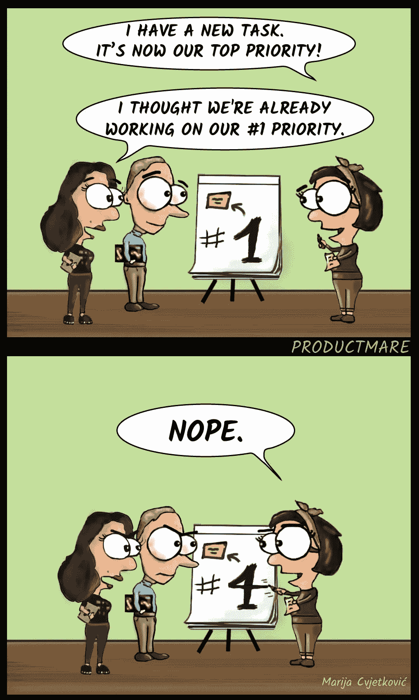

Now would be a great time to run.

## **下钻背井眼。**

你的“待办事项”栏需要一些春季大扫除，否则你将无法为你的团队提供清晰的愿景和明确的冲刺目标。

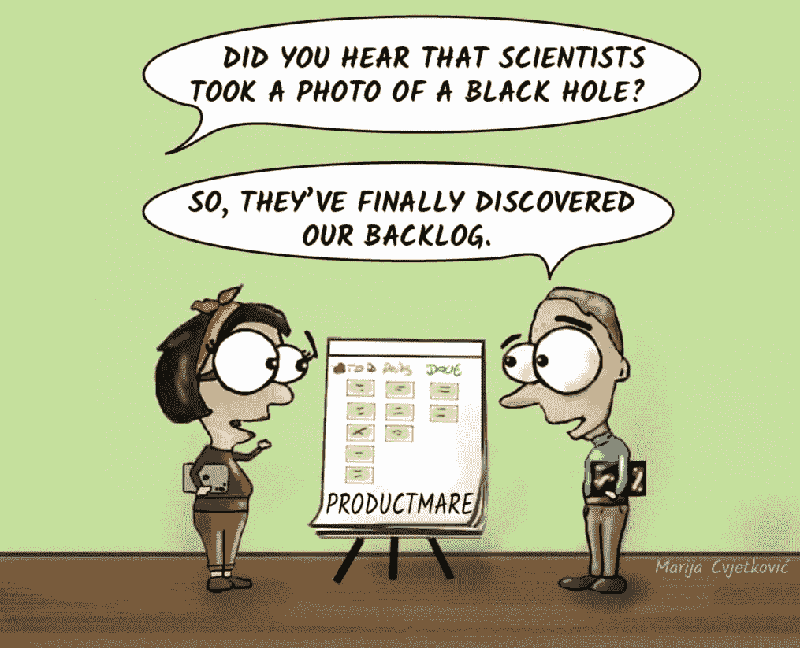

Ouch.

是的，很难对所有很酷的想法说“不”。但是如果你把所有的事情都积压下来，它会像放在水槽里几个星期的脏盘子一样臭。你会失去注意力。

## 所以，你没有冲刺目标。

这是你的工作，但如果它溜走了呢？

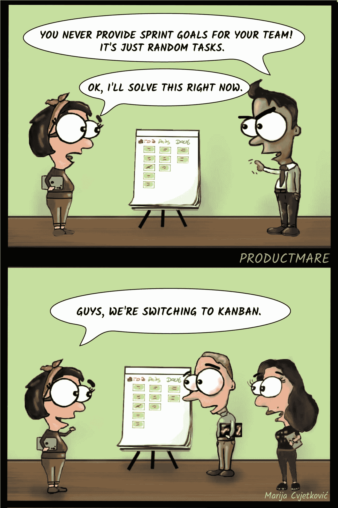

Phew, that was easy.

## **所有那些会议。**

你的日历满了吗？

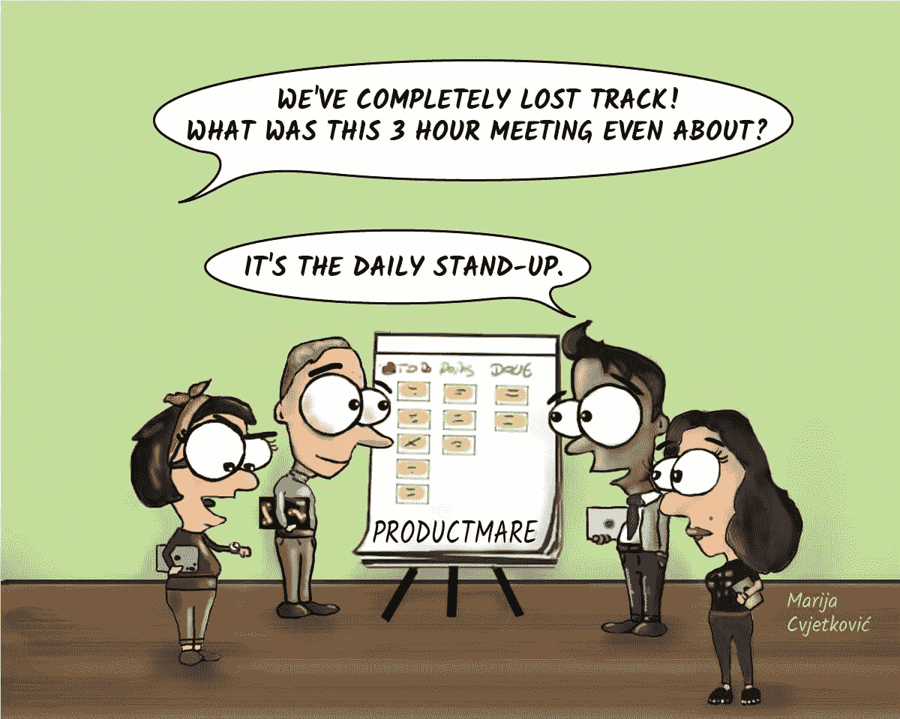

We have so much to talk about.

# 利益相关者管理

## 问题，而不是解决方案。

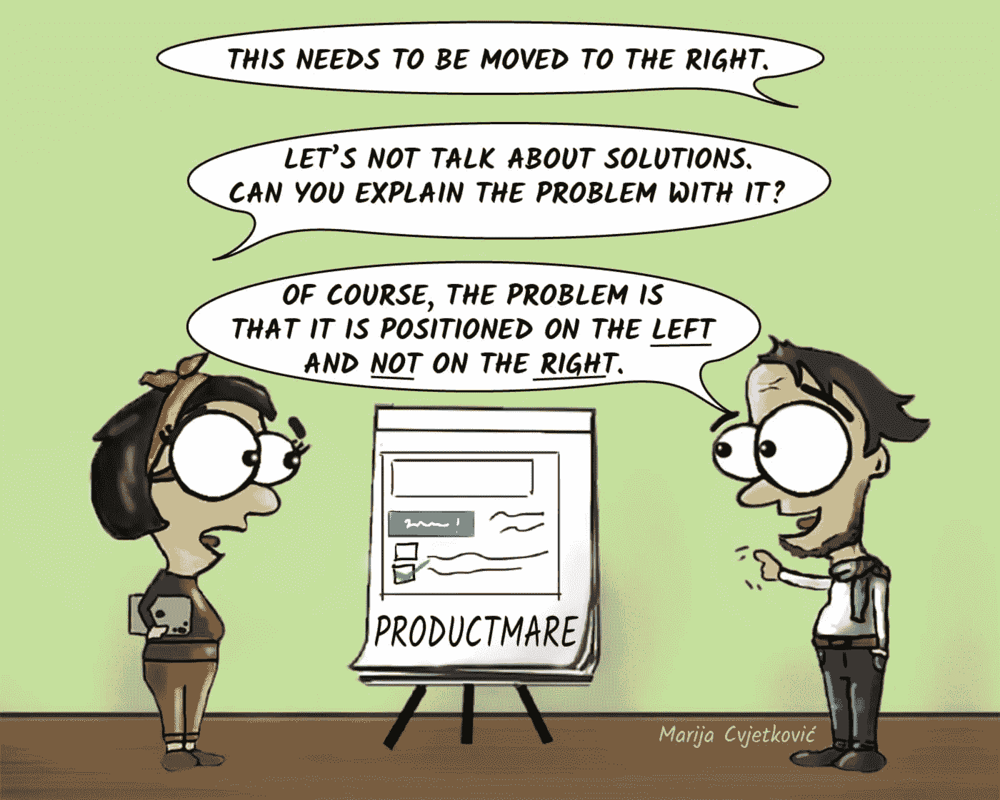

It’s only a 5 minute thing for you, right?

利益相关者很难站在问题的角度思考问题，所以找到你内心的苏格拉底，试着问一堆“为什么”。

## 你会违背诺言吗？

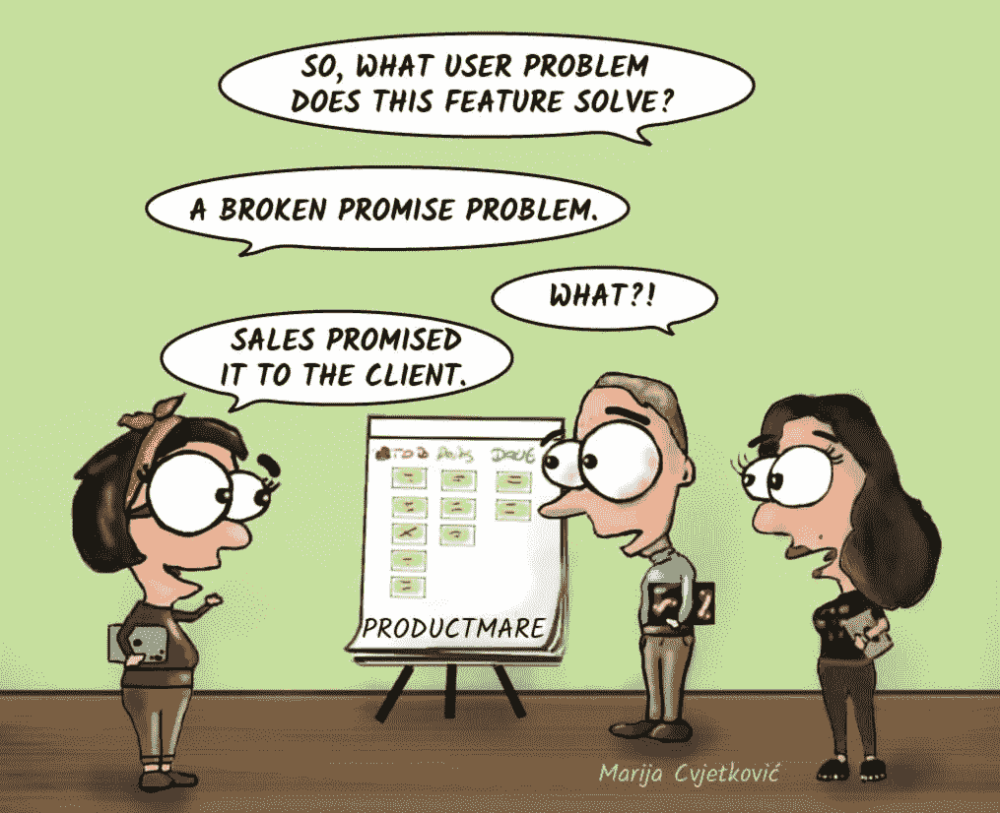

Will you keep it?

你应该远离销售驱动的开发。一定要看看[梅丽莎·佩里](/@melissaperri)，她从一个有趣的角度探讨了产品销售关系。

## 总是要数字

躲在复数后面不会成功，但许多人会尝试。

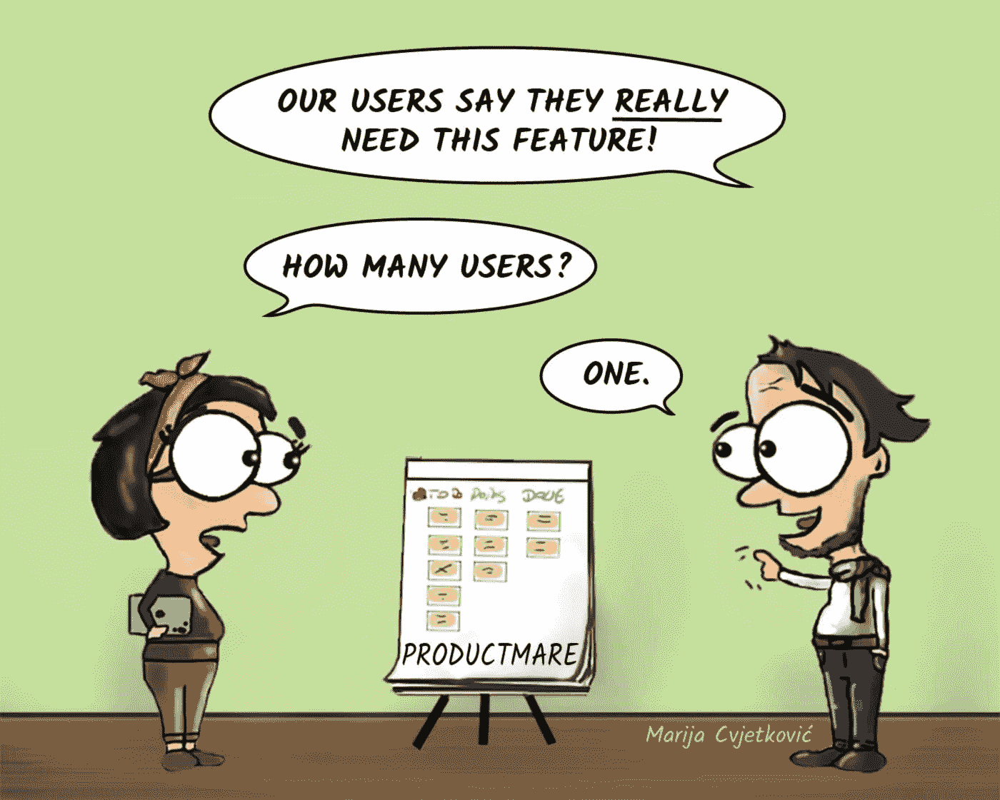

But what if he’s a big influencer?

## 哦，再检查一下那个号码。

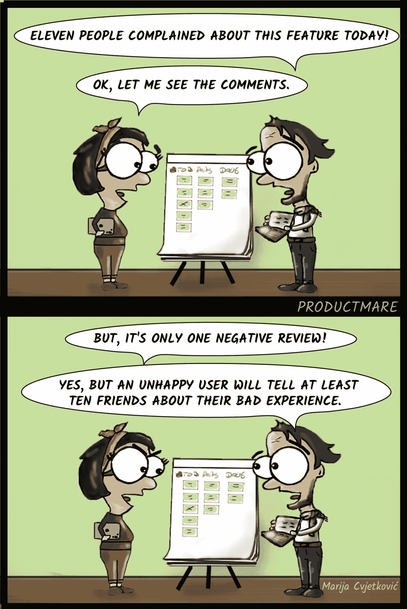

Never too careful.

可爱的确认偏见。它不断地让我们倾向于支持我们已经相信的反馈。

渐渐地，你会发现如何处理这样的需求。你需要仔细倾听并理解反馈，但最终你的工作是从整体的角度考虑这些要求。反馈总是有用的，但是你应该努力提高质量和数量。

## 冰山一角。

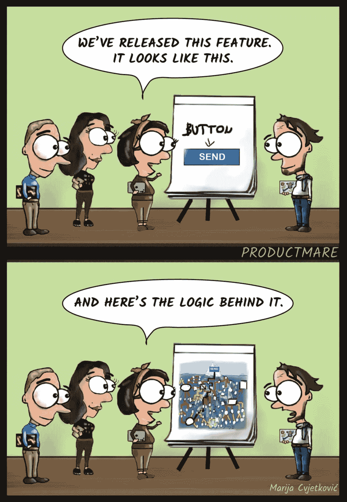

It looks so easy on the surface.

你的工作是理解你的产品背后的复杂性和所有的依赖关系。但是非技术人员会倾向于只关注产品的可见方面。学习如何以易于理解的方式呈现复杂的实体是很有用的。作为一个有社会学背景的漫画家，我发现自己一直在画抽象的系统。复杂性的视觉表现确实有助于向听众传达观点。

在 Jimmy Janlén 的书[“敏捷蔻驰的工具箱—可视化示例”](https://leanpub.com/agiletoolbox-visualizationexamples)中可以找到可视化模式的很好的例子。这本书是为 Scrum 大师和敏捷教练准备的，但是它让你一瞥不同的可视化技术。它会激发你画出你的作品并使之形象化。不需要高级绘图技能。

# 测试一切。

## **只差一个 MVP。**

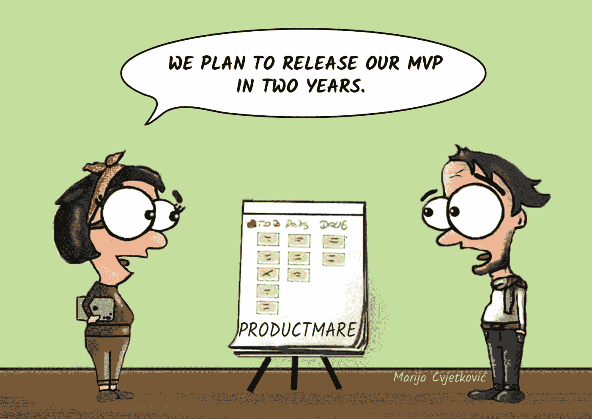

Sometimes the “M” stands for “maximum”

当然，你以前见过类似的东西。当我们的用户清楚地看到未完成的工作时，他们会怎么想？然而，MVP 测试不是开启强迫症和完美主义模式的时候。如果你想测试什么，它需要是一个更简单的测试。

## 假门测试。

如果你的产品有一定的声誉，它可能听起来像一个有争议的工具，但它可以有替代的用途。

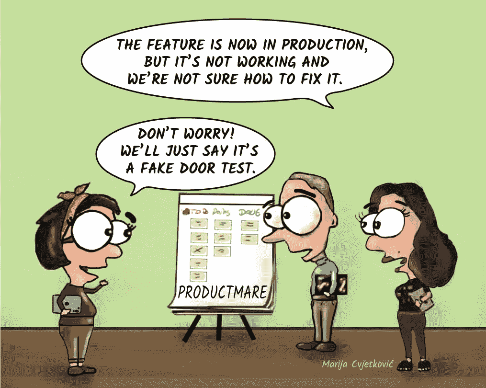

So fake it faked itself.

## 产品发现。

因为用户不会咬人，但研究可以。

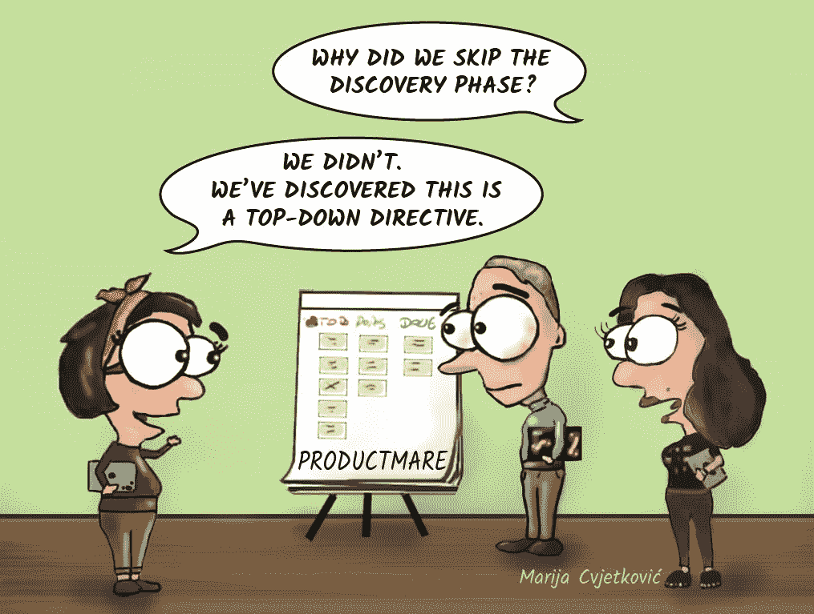

At least we tried.

一些团队抱怨他们没有足够的资源或自主权来进行研究。在你开始之前，先了解你的操作空间是什么。应该有足够的场地供你玩耍。有不懂的地方，要开诚布公的问。最好向你的上级公开组织的局限性。

如果你想更深入地探索发现主题，马蒂·卡根的书《T4 的灵感》是一本很好的读物。卡甘推荐了杰克·纳普、约翰·泽拉特西和布雷登·科维茨在《冲刺》一书中描述的方法，所以一定要去看看。此外，请关注特蕾莎·托雷斯，她对探索有着深刻的见解。

# 结果跟踪和庆祝。

## 我们发货了！

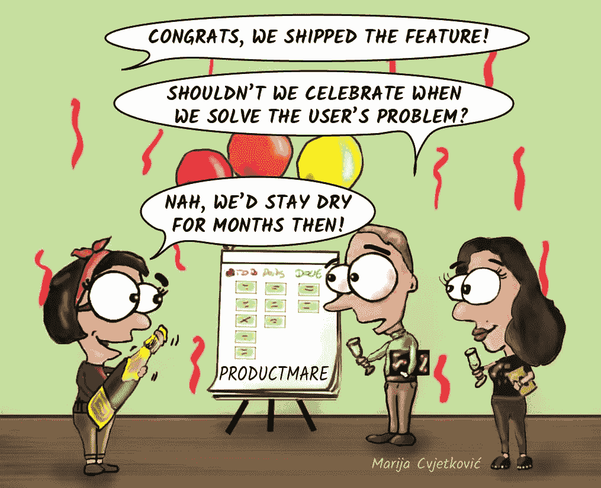

是延迟满足的问题。你和你的团队在没有多巴胺的情况下努力工作了这么久。发布一个功能就像自豪地向你的动物王国展示一个新生的辛巴。每个人都需要为自己的工作感到有价值，但是很容易忘记你最初开始遇到的问题。你只需继续你的小功能工厂中的下一个功能。

你应该为出货感到高兴，并鼓励你的团队发泄情绪。互相击掌，为你们的努力工作举杯，因为这些小小的仪式让团队更加团结。但是明天，你的注意力应该回到你想要完成的结果上。

## 我不是机器人。

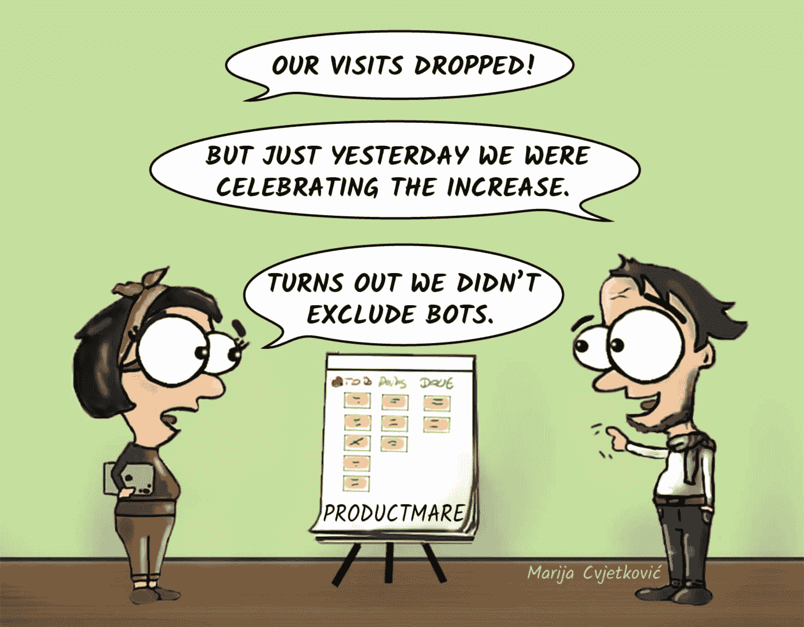

你可能不想歧视可怜的机器人，因为结果太好了。不过话说回来，机器人不会为你的产品买单。

你可以在 Google Analytics 中使用 bot 过滤，或者使用更新的 bot 库提取你的内部跟踪。更简单的方法是提出一个“bot 流量被过滤了吗？”质疑你的接受标准，而不是给你快乐的团队一盆冷水。

暂时就这样了。感谢您的阅读。这是我的第一个媒体帖子，所以我将非常感谢任何反馈。

我将这个卡通系列命名为“Productmare ”,我计划画更多的卡通系列，因为产品世界有很多可以从中获得灵感的场景。所以敬请期待，更多的漫画正在路上！