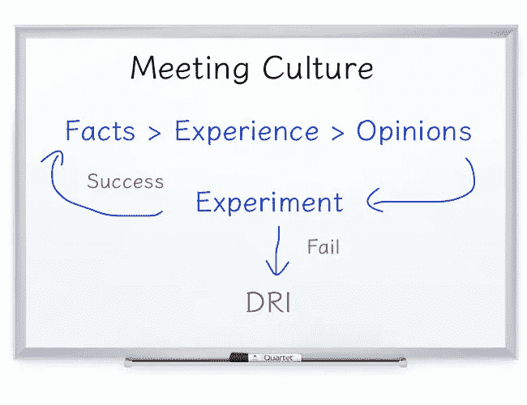

# 具有事实、观点和经验的高效会议文化(FOE)系统

> 原文：<https://medium.com/hackernoon/productive-meeting-culture-with-facts-opinions-and-experience-foe-system-60bdd8fd2a56>

会议很重要。句号。为什么？

*   它征集最好的想法，并引发关于这些想法的优先次序的讨论

更重要的是，它促进了:

*   归属感——参与者感觉被咨询和倾听
*   协调——想法被拒绝的参与者收到有意义的反馈，并达成一致意见
*   透明度——参与者了解公司内部正在发生的事情及其原因

有许多会议的最佳实践，它们很容易理解，但很难执行。原因是:

*   政治
*   冲突

我相信我们可以通过实践 FOE[meeting](https://hackernoon.com/tagged/meeting)[culture](https://hackernoon.com/tagged/culture)来改善这些问题。

# 什么是仇和文化？

FOE 代表事实、观点和经验。

FOE 规定，会议中做出的决定必须基于 FOE 的命令:

事实>经验>观点

当 FOE 不能提供指导时，由[直接负责人](https://www.forbes.com/sites/quora/2012/10/02/how-well-does-apples-directly-responsible-individual-dri-model-work-in-practice/)(苹果)或[责任区](https://wavelength.asana.com/workstyle-aors/)人(Asana)做出决定。

请继续阅读，了解更多详情。

同时，把上面的打印出来，贴在你会议室的墙上，没有人会再害怕开会了！

# FOE 如何使会议富有成效？

地球之友以两种方式提供帮助:

1.  它定义了会议前的约定规则，因此每个出席会议的参与者都默认同意遵守这些规则
2.  接洽规则清晰客观，从而在促进会议进展的同时最大限度地减少不必要的冲突

# 对敌的客观而清晰的定义

为了明确会议文化，FOE 需要正式定义。

## 事实

当精通该主题的 80%的人(如果你愿意，可以选择不同的数字)给你相同的答案时，这是一个“事实”，例如，前 10 个互联网搜索结果中有 8 个反映了相同的观点，或者显示了确凿的经验数据。

警告:

*   小心确保你问的问题没有偏见，提出的假设是准确的
*   小心确保答案的来源没有偏见。在 Twitter 上调查你的追随者可能会有偏见，因为他们和你有共同的观点

## 经验

当无法找到事实/数据时，经验最丰富的人的建议应该最重要。

警告

*   确定最有相关经验的人依赖于准确评估我们所处的情况，以及与此相关的假设

## 意见

互联网时代，人人都有观点，狗也是！

每个有意见的人都应该:

*   进行简单的实验来验证她/他的观点
*   对于成功的实验，增加支出以证明其可扩展性
*   对于不成功的实验，根据之前实验的发现进行调整，然后重新运行

这些实验指南鼓励那些可以用最少的预算快速证明的观点。这反过来鼓励灵活地重复想法，而不是有一个大的、不灵活的、令人毛骨悚然的目标。

# 责任止于此——DRI

简而言之，DRI 是负责一个项目的人。她必须:

*   了解项目的当前状态
*   确保所有关键绩效指标(KPI)都在正轨上
*   识别可能影响项目的潜在问题
*   组织并获取及时完成项目所需的所有资源

由于 DRI 承担了所有这些负担，当地球之友不能指导决策时，她有最后的发言权。

# 结论

会议文化主要通过以下方式清除政治和不必要的冲突:

*   清晰客观的会议规则
*   让任何人都能找到事实、获得经验或验证自己的观点，从而推动一个想法实现公司的最大利益，而不管他们的工作职责是什么

你怎么想呢?请留下问题和反馈。