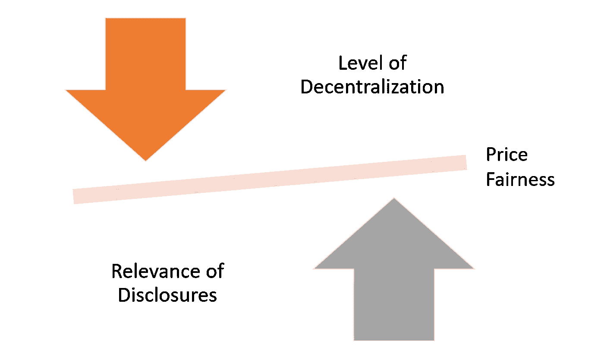
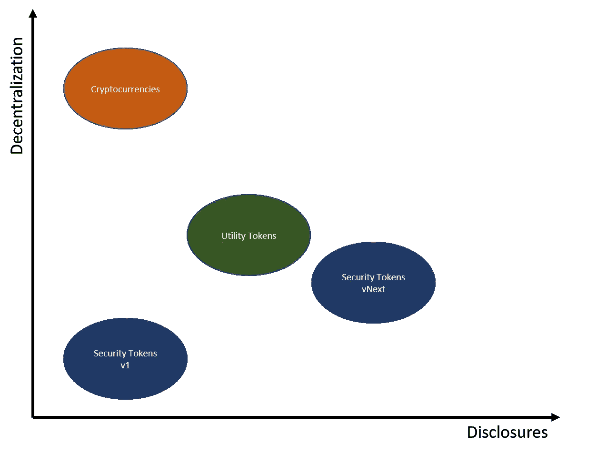
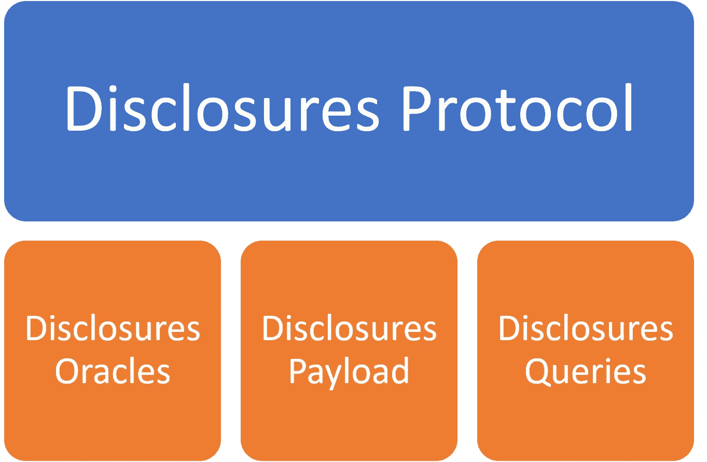

# 可编程披露和安全令牌

> 原文：<https://medium.com/hackernoon/programmable-disclosures-and-security-tokens-656857ad27b4>

我们经常听到安全令牌社区中的声音，声称我们需要更好的项目来改善加密证券市场的势头。我经常发现这种观点有点目光短浅，因为我不相信仅仅是代币发行的质量就足以在安全代币生态系统中实现做市和流动性。在我看来，为了成为一种相关的金融机制，安全令牌仍然缺少一些基本的构件。在这些构件中，披露和信息对称机制是在安全令牌市场中实现任何程度的公平所必需的。过去，我曾公开支持披露和安全令牌。今天，我想探讨一下这个领域的一些新想法，我认为这些想法可能与当前一代的安全令牌平台相关。

在安全令牌的上下文中，公开协议的相关性在概念上似乎是显而易见的。在缺乏关于加密资产的相关信息的情况下，我们怎么可能期望达成公平的定价和交易模型呢？然而，我相信这只是争论的一小部分。毕竟，我们有像比特币这样没有真实披露模型的产品，它们实现了公平的市场价格，也有像债务抵押债券(CDO)这样的工具，它们拥有大量相关信息，价格完全失控。虽然信息披露肯定有助于公平的市场动态，但它们也需要强大的分销和消费模式才能有效。

# 披露、分权和网络效应之间的摩擦

我最近发现一个非常有趣的想法，那就是把安全令牌中的公开作为去中心化和网络效应的补充。本论文的核心原则是*在给定的加密网络中，披露的相关性与其去中心化水平*之间存在线性相关性。这篇论文与信息不对称的传统经济模型形成对比，但似乎很适合于加密网络。

关于信息披露和信息不对称的传统思维方式源于乔治·阿克洛夫等经济学家的工作。作为诺贝尔经济学奖的获得者，阿克洛夫创立了关于金融市场信息不对称的最全面的理论之一。在 1970 年一篇名为[“柠檬市场”](https://en.wikipedia.org/wiki/The_Market_for_Lemons)的论文中，阿克洛夫考虑了一个拥有二手车质量私人信息的卖家的例子。一个买主想买一辆汽车，但又渴望为它支付一个“公平”的价格。更具体地说，假设有九辆不同的汽车，每辆汽车都有“公平”价值，分别为 100 美元、200 美元……900 美元。由于买家无法观察质量，低质量汽车的车主总是声称他们出售的是价值 900 美元的高质量产品。一个公平的价格将反映市场的平均质量，在这种情况下是 500 美元。然而，在这种情况下，汽车价值超过 500 美元的卖家发现这样的价格太低，因此退出市场。平均价格必须下降到 300 美元，诱导更多的退出，等等。因此，除了价值 100 美元的质量最差的汽车之外，没有卖家愿意出售买家愿意购买的汽车！

阿克洛夫关于信息不对称的理论为信息披露的必要性提供了有力的证据。然而，在没有任何正式披露机制的情况下，我们如何解释像比特币或以太坊这样达到相关公平水平的金融资产？我们可以证明，在以太坊这样的网络中，对信息的访问是完全不对称的，因为以太坊基金会的核心团队不仅拥有不成比例的信息访问权限，而且他们还可以影响网络的行为。以太坊如何可能实现市场公平？答案与以太坊网络的去中心化程度有关。在充分分散的生态系统中，价格公平是通过网络参与者的行为实现的，而不是通过信息流实现的。在一个分散的生态系统中，任何不公平的行为都会被其他网络参与者平衡，而不必依赖于一个集中的权威。从这个意义上说，在一个足够分散的生态系统中，信息披露不如在集中的市场中重要。

安全令牌正在基于具有最小网络影响的相当集中的模型发展。在这种情况下，信息披露可能会对市场的公平性起到关键作用。从不同加密资产的角度来看，信息披露和分散化水平之间的关系可以用下图来说明:

如果安全令牌曾经演化为一个网络生态系统，那么披露的重要性可能会被相应的网络效应所平衡。目前，披露仍然是安全令牌的基础构造块，应该由区块链协议来实现。如前所述，发布信息只是等式的一部分，我们只需要有效的机制来消费这些信息。

# 可编程披露

安全令牌的可编程公开的思想依赖于作为区块链协议的一部分的建模信息共享工作流，该工作流可以在安全令牌发行和转移期间使用。为了实现公平的市场交易，安全令牌公开不仅应该被人类使用，还应该被协议使用。如果我们考虑当前安全令牌平台的集中化水平，这个概念就变得有点棘手，因为使用网络参与者来验证信息的模型根本不可用。虽然我并不声称对安全令牌披露的端到端协议有具体的想法，但有几个原则似乎是所有模型的共同标准:

**Disclosure Oracle:**该组件表示发布关于安全令牌的离线、公开可用的重要信息的可信实体。披露先知应该能够按需或按计划收集信息，并将其与相应的加密安全相关联。

**披露有效载荷:**要真正实现可编程，披露信息需要以一种允许索引和查询的格式进行编码。pdf 等非结构化数据格式对于实现可编程披露几乎毫无用处。

**披露查询模型:**为了在安全令牌转移中使用，披露必须在协议级别可访问。要做到这一点，我们需要一种机制来查询和访问编码在披露有效载荷中的信息。

这三个组件:oracles、有效负载和查询模型，构成了安全令牌公开协议的基础。取决于安全令牌生态系统的组成，可以以不同的方式对公开过程中的参与者之间的特定交互进行建模。TruSet 等协议的一些思想可能适用于安全令牌。

在安全令牌市场的当前状态下，披露仍然是一个未解决的问题，也是生态系统发展的主要障碍之一。披露不应仅仅局限于发布文档，我们的目标应该是可以整合到安全令牌协议中的可编程模型。在支持安全令牌的半集中式生态系统中，披露应被视为下一代安全令牌平台的基本构建模块之一。