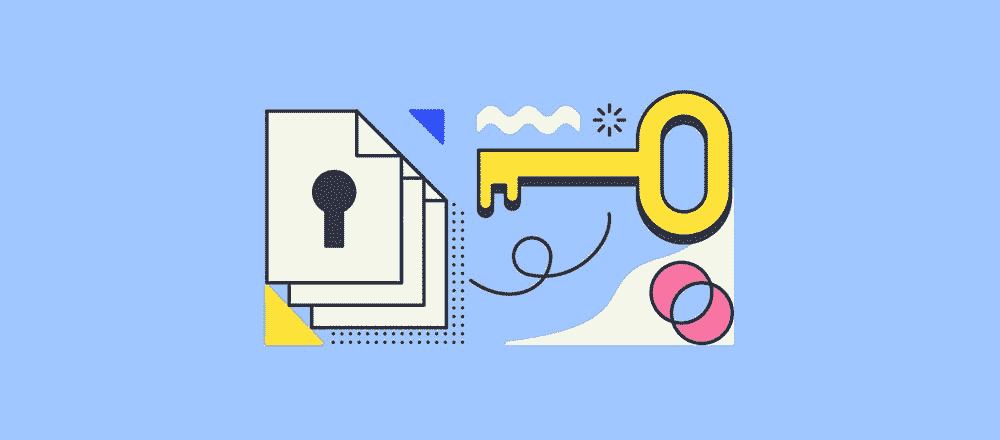
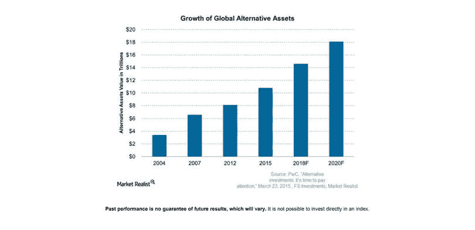
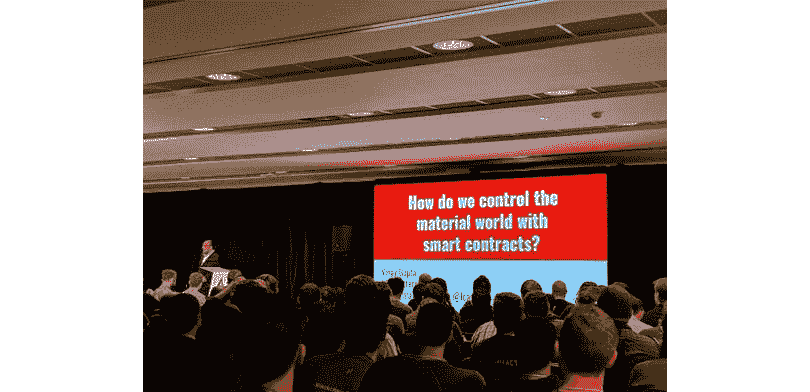
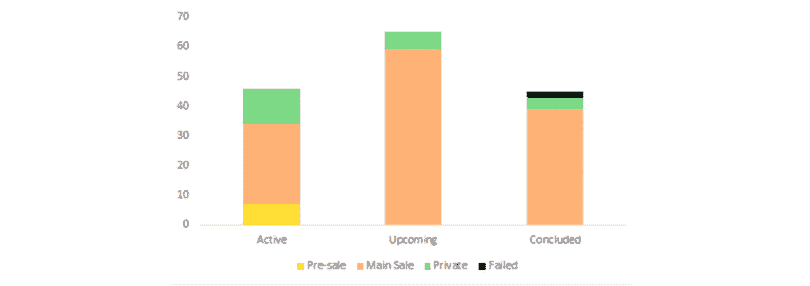

# 可编程所有权:安全令牌对个人意味着什么

> 原文：<https://medium.com/hackernoon/programmable-ownership-what-security-tokens-mean-for-individuals-d18a7f56e088>

所有权投资，或更广为人知的“股权”，是购买投资，如股票、房地产、收藏品或整个企业，目的是让你成为相关公司或资产的部分所有者。当你投资的价值上升时，你与其他所有人分享这一增长。

没有人能保证会有收益，更不用说会有多少，但由于证券法，你作为投资者受到保护，如果它下跌，你也将分担损失，给你一个良好的风险回报平衡。这是特权投资者用来确保他们保持富有的“以钱生钱”工具。

没错。没有变得富有；保持富有。因为投资者应该提供年收入超过 20 万美元或净资产超过 100 万美元的证明，才能获得“认证”并参与这些交易。是你吗？如果是这样，那么你一定已经拥有一些相当成功的公司的股票。如果没有，那就继续读下去，因为多亏了区块链技术，任何类型的投资者都可以进行以下投资:

*   蓝山基金会让你有可能成为一个真正采矿作业的共有人，只需 247€(约 280 美元)
*   [Brickblock](https://www.brickblock.io/) 让你成为德国一处价值 200 万€房产的所有者之一
*   [7Pass](https://www.7passtoken.com/) 与你分享其大麻生意利润
*   韦斯特坎能源公司让你直接拥有他们收购的石油和天然气

[https://marketrealist.com/2018/02/investment-options-consider-volatile-market/](https://marketrealist.com/2018/02/investment-options-consider-volatile-market/)

这些投资机会多年来一直对主流投资者关闭。在这篇文章中，我们将了解这些公司和许多其他公司如何向全球投资者开放传统行业，以及其中的奥妙。(剧透预警:一个都没有！)如果你想深入了解如何投资任何一家上市公司，我们将在本文后面的部分一一介绍。

# 共享经济:成为共有人

我们已经通过与其他所有者分享收益和损失开始了关于所有权和风险管理的对话。这不仅仅是说所有权投资让你成为合法的共有人。作为个人，你将与另一个和你一样的人分享资产的所有权。然而，投资金额可能不同，这转化为百分比(你拥有基础资产或企业的百分比)，但是根据所有权协议，每个所有者的权利是相同的。

共有人之间的关系可能有所不同，财务和法律义务也因情况而异。例如，关于不动产，共有人的法律概念是由[共同租赁或共同租赁](http://e)界定的。同样，银行账户或经纪账户的共有人也受到严格的程序和法律约束。当该账户关闭时，所有共有人都必须参与。

*区块链能以编程方式施加所有权约束吗？*

目前大部分所有权是通过签订[所有权协议](https://definitions.uslegal.com/o/owners-agreement/)获得的；纸质文件。这没什么不好，但是在今天的数字环境下，这种过去的神器还高效吗？我们声称生活在一个全球化的世界中，但当涉及到共同所有权交易时，所有相关方需要找到自己在同一个房间才能参与进来。否则，为了成为交易的一部分，他们必须带一个中间人；担任[交易承销商](https://investinganswers.com/dictionary/u/underwriting)的金融机构。当然，作为中间人，他们会同时收取佣金。从投资者的角度来看，每一分钱都很重要，因此漫长而昂贵的投资过程可能会破坏交易。

[https://blog.goodaudience.com/blockchain-ownership-e46a5cc7d921](https://blog.goodaudience.com/blockchain-ownership-e46a5cc7d921)

但是我们知道，区块链可以用来自动执行合同条款，以执行可信的交易，而不需要第三方，在我们的情况下是金融机构。除此之外，区块链还可以作为参与者之间交易的记录，成为所有权的最终证明。将区块链包括在该过程中增加了更高的安全性并降低了成本。此外，它可以将单个资产的所有权“数字分割”成所需的多个部分(令牌)。

上市公司股票形式的部分所有权是一个长期存在的概念。股票已经让消费者有机会获得公司的部分所有权。区块链带来的新奇之处在于，它是分配这些复杂资产所有权的一种直接而便捷的方式，给予企业家和发明家比以往更多的金融机会。由于数字代币比纸质合同更容易获得，流动性更强，因此它为吸引更多创业者的资金提供了机会，这可能会引发一场技术革命。

代币作为融资工具是否合法？

这一切开始于[两个佛罗里达州的公司被告](https://consumer.findlaw.com/securities-law/what-is-the-howey-test.html)提供了大片柑橘林土地的房地产合同。购买者将成为土地的所有者，但由于他们大多数不是农民，没有任何农业专业知识，他们可以选择将土地借给被告，被告可以收获、汇集、销售柑橘并分享利润。很划算，对吧？无论如何，这一行动被美国证券交易委员会(SEC)视为非法。他们发现“购买-借出-股份”合同实际上是一种投资合同，应该作为证券登记。

就在这起丑闻之后，SEC 开发了一种测试，可以用来确定某项交易是否属于投资合同。这种测试一直沿用至今，被称为“[豪威测试](https://consumer.findlaw.com/securities-law/what-is-the-howey-test.html)”。这基本上就是豪威测试所要问的问题:

*   是钱的投资吗？
*   投资的是普通企业吗？
*   是否有从发起人或第三方的工作中获利的预期？

听起来很像我们之前谈论的“所有权令牌”，对吗？代币是一种投资合同，代表资产(如企业)的合法所有权。可在区块链内核实的所有权。它成功地通过了豪威测试。这就是为什么它被称为安全令牌，如果所有的法规都得到适当满足，那么这些令牌就有非常强大的用例。

“不可避免的是，安全代币将像比特币改变货币一样改变股权，因为它们为所有者提供了直接、流动的经济利益和加快的收益交付。SPICE Venture Capital 的创始人卡洛斯·多明戈(Carlos Domingo)在[说](https://thehill.com/opinion/technology/377592-security-tokens-could-be-the-next-big-thing-in-cryptoassets)每一种所有权都可以被令牌化，这是一个价值数万亿美元的巨大市场。

# 如何通过区块链成为业主？

当企业主可以分发相关令牌时，他们通常会运行一个[安全令牌产品(STO)](https://www.ccn.com/what-is-an-sto/) 。投资者可以像交易任何加密货币一样交易这些零股；以他们认为合适的方式积累、持有和出售。最终目标是持有代币，直到真正的资产公开交易，就像股票一样，这一事件可能会使代币的价值立即增加。个人投资者在哪里可以找到这样的机会？

第一个也是最令人惊讶的一个来自“[蓝山基金会](https://www.bluehillfoundation.com/)”，它负责 BHF 代币的预售。这些将被交换为 BHM 代币，其持有“蓝山矿”的共同所有权(0.00000004%)，蓝山矿是一个大型采矿作业，预计拥有亚洲最大的铜矿储量之一(位于蒙古国)。BHF-代币适用于所有类型的个人投资者。它们不受监管，遵循 FINMA 和 SEC 的条款和条件，并将在 the B . H.Mining 期间兑换为完全受监管的 BHM 代币(一对一)。BHM 代币将以 0.45 美元的价格在交易所上市，但今天 BHF 代币可以以优惠价格购买。

在这一过程结束时，你将成为“蓝山矿山”的部分所有者，这是一种数字化、资产支持的可编程所有权形式。“蓝山矿业”旨在利用向市场销售原材料所产生的部分利润，以及他们未来的“蓝山平台”，一个交易矿产资源的点对点平台，来创造可持续增长。目前，下一个重要步骤是获得 STO B . h . mining-SEC 的监管机构(欧洲监管机构、FINMA、SEC)的批准。但即使在极不可能的情况下，监管合规不被批准，投资者也将从向股市出售“蓝山矿”中获得补偿。

对于那些对房地产感兴趣的人来说， [Brickblock](https://www.brickblock.io/) 正在开发一个智能合约平台，用于出售和投资房地产等令牌化资产。投资者可以用其他加密货币购买资产证明(PoA)令牌，这使其所有者有权获得基础资产的利润。它可以被视为砂浆资产(房地产)和智能合约驱动的加密基金之间的联系。通过取消中间商，Brickblock 降低了投资成本，实现了更简化的流程。请记住，该过程尚未最终确定，令牌无法转换为菲亚特；该功能计划于 2019 年第四季度推出。

随着大麻产业目前的蓬勃发展， [7Pass](https://www.7passtoken.com/) 的团队专注于如何将大麻的积极作用传递给人们，并为选定的企业家提供资本，以在该领域开创和发展自己的企业。这为你作为个人投资大麻行业的一系列新兴公司提供了机会。通过将他们的股份令牌化，7Pass 提供了一个安全令牌，即 7Pass 令牌，它使你成为他们公司的股东，并让你直接获得投资回报。尽管他们承诺识别和建立大麻市场领导者，但在立法不协调、新生的金融基础设施和很少或没有运营历史的公司方面，他们还有很长的路要走。

与 B.H .基金会类似， [WestCan Energy](http://westcanenergy.com/) 向个人投资者开放了一个传统领域，该公司将收购和开发高质量、被低估的油气资产。然后，通过使用标准的油田开发技术，他们可以经营油田，以最大限度地提高石油采收率。它们的运营资金来自一种资产支持证券，由收购的石油和天然气资产的市场价值支持。该令牌赋予所有者对基础石油和天然气商品价值的直接权利。但由于安全令牌受美国、加拿大和其他司法管辖区的监管，因此这一机会只对这些地区的合格投资者开放。

# 谁将从这个机会中受益？

安全代币正在成为众筹的首选模式，为个人投资者打开了新的投资机会。它们像 IPO 一样受到监管且安全，但对企业家和投资者来说，它们的价格也更便宜。取消中间商带来了经济上的好处。然而，金融机构将履行比交易承销更多的职能。他们还负责吸引投资者的兴趣、高安全级别的保险以及合规性监管。也就是说，如果没有他们的参与，作为投资的安全代币会带来更大的风险。

[https://www.inwara.com/report/security-token-offerings](https://www.inwara.com/report/security-token-offerings)

不管批评者如何，区块链正在向各种各样的人开放“可编程所有权”。在声明投资市场将无法成功取代传统金融机构之前，我们需要等待和观察这些担忧是否有任何依据。袖手旁观会让你错过只有早期用户才能获得的最佳机会。但是，到最后，决定权还是在你手中！