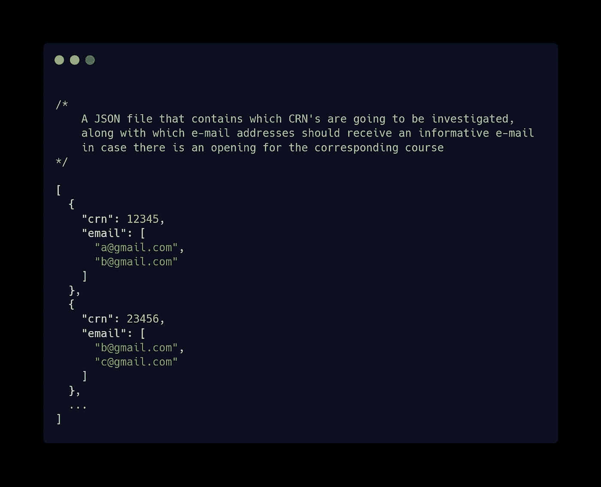
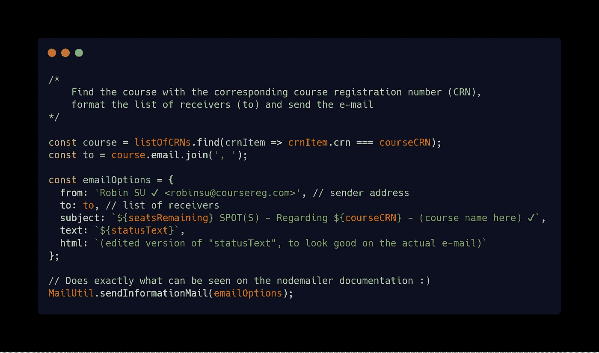

# 为个人利益编程

> 原文：<https://medium.com/hackernoon/programming-for-personal-benefits-662f8469f430>


Photo by [James Pond](https://unsplash.com/@lamppidotco?utm_source=medium&utm_medium=referral) on [Unsplash](https://unsplash.com?utm_source=medium&utm_medium=referral)

**免责声明**:这篇文章的目的不是关注编程的任何道德方面。它的目的不是教育，也不是鼓舞人心的。这仅仅是一个关于编程如何成为简化日常生活的有用技能的典型故事，以及我对我的工作的感激之情的展示。

在我获得学士学位的大学，内部 web 系统有相当多的性能问题，这些问题在课程注册期间达到高峰。每学期开学，学生早早起床，尝试登录注册系统。由于系统不能同时处理所有的学生，只有一部分幸运的学生可以登录并注册他们的课程。

对于一个普通学生来说，当他们能够登录时，他们想要注册的课程已经满员了。发生这种情况主要是因为课程的容量非常有限，学生因为他们的专业学位而不允许在那天参加课程，或者已经参加课程的人正在为他们还不能登录的朋友留一个位置。只有当登录尝试次数减少时，系统才能按预期运行。

对于大多数注册系统表现不佳的学校来说，这可能是一个标准问题。然而，问题是，无法注册一门课程会妨碍那些试图注册更高水平课程的学生，甚至更糟的是，那些试图毕业的学生。这些人最终不得不参加暑期课程，或者至少再延长一个学期。

几天前的晚上，我收到了我姐姐的一条信息，她是同一所大学的新生。她告诉我，一名学生创建了一个应用程序，可以跟踪一门课程有多少名额，并向希望获得任何空缺通知的学生发送电子邮件。它不能解决无法登录的问题。然而，当付诸实践时，人们会立即被告知有空位，并可能注册他们的课程，使他们能够按时完成学业。要实现这一点，开发人员只需要一个课程注册号列表，以及学生的电子邮件地址。

对你的同学来说，这当然是一件非常好的事情。

…

对吗？*啊哈*。

显然，他为学生想学的每门课程索要了 50 土耳其里拉(截至本文撰写之时，50 土耳其里拉大约是 10 美元)。例如，如果一名学生想要了解心理学课程、数学课程和数学课程必备的应用数学部分的座位可用性，他(她)需要向开发商支付 30 美元，这在当前的土耳其经济中是一笔相当大的金额。

更糟糕的是，不能保证那门课程会有空缺。如果没有人放弃这门课程，那就太不幸了。\_(ツ)_/


> 虽然我尊重为创建应用程序所投入的时间和精力，以及提供这种盈利服务的决定，但我觉得每门课程收取 10 美元不过是在剥削那些别无选择、只能付费才能注册某些课程的人。

不用说，当我姐姐问我是否可以帮她支付开发商 3+课程的费用时，我非常生气。我度过了一个平静的星期六晚上；我想我应该看看如何构建这样一个应用程序:真的有多难？

有几件关键的事情我必须去调查:

1)了解如何从课程注册网站获取课程座位信息

2)能够定期(即每 x 分钟)检查可用性信息

3)向学生发送关于课程可用性的信息性电子邮件

由于我在学士学位期间使用了几年相同的注册系统，我已经知道在哪里可以找到我需要的信息:课程总容量、已经注册的人数以及剩余座位数。在跳转了几个链接后，它被证明是可以用简单的[网页抓取](https://bit.ly/2tFKI95)来管理的。

这方面的唯一挑战是调查课程页面的 HTML 是如何布局的。在我动手做了一段时间之后，我能够使用 Node.js 以及 npm 包 [**cheerio**](https://github.com/cheeriojs/cheerio) 和[**request-promise**](https://github.com/request/request-promise)收集必要的信息。这个过程有点丑陋，但我能够在屈服于冒名顶替综合症之前鼓起我的力量，这要感谢蜘蛛侠系列中的这些明智的话:

> 糟糕的 HTML 带来了糟糕的文档查询。
> 
> 本·帕克

在我能够接收到必要的信息之后，我必须确保它能够被定期处理。注册高需求的课程是一场与时间的赛跑，所以我们越频繁地查看是否有空缺越好。

我在谷歌上快速搜索了一下如何做到这一点，这让我想到了 cron job 的概念。简而言之，它是一个用于安排所需命令在特定时间/间隔运行的实用程序。我将在文章的最后列出一些参考资料，以帮助学习更多关于 cron 作业和编写运行它们的命令的知识。

为了将脚本添加为 cron 作业，在我的 Ubuntu 终端中，我运行了

```
crontab -e
```

…我添加了以下几行，以便脚本每分钟运行一次(注意#是用来注释一行的)

```
# Uncomment the line below before registration starts, so the script can run every minute
# */1 * * * * node ~/Desktop/Code/robin/crawl.js
```

这个脚本基本上加载了一个 CRN 的列表，以及要通知的电子邮件地址。



The list of Course Registration Numbers (CRNs)

在爬取相应课程的网站后，存储总座位数、已坐座位数和可用座位数以供进一步比较。在下一分钟，脚本检查与前一分钟相比是否有任何不同。如果没有变化，学生不会收到通知(或者说是垃圾邮件)。

我必须采取的最后一步是看看如何从我的节点脚本发送电子邮件。我之前接触过 [**节点邮件**](https://nodemailer.com/about/) ，所以在创建了一个发送邮件的 Gmail 账户后，我继续使用了这个软件包，可以在它的文档中看到。



Forming the e-mail object that will be passed onto nodemailer

添加了一个简单的缓存机制，以便我只在检查的最后一分钟有实际变化时才发送电子邮件，整个过程花费了我大约 4-5 个小时。

周一早上，关键时刻到了。在课程注册期正式开始之前，我要求提供一份电子邮件地址和课程注册号码的列表。在开始前一分钟，我取消了启动定期检查的那一行的注释。

到了第二天，多亏了电子邮件通知，我妹妹才得以注册了 5 门课程，这使她不仅能够注册作为她专业学位核心先决条件的课程，还能随心所欲地改变自己的时间表。基于这一成功的执行，我感到更有动力对这一应用程序采取下一步行动，即将它公之于众，并免费与学生们分享。

这是我热爱软件开发的一部分。我遇到了一些我认为有问题或者可以更好处理的事情。我做了一些研究，把一些非常基本的东西放在一起，看着它发挥作用。

在仅仅 3 年的职业经历中，我找到了在全职工作之外承担许多玩具项目的机会。我处理的大多数玩具项目都是出于紧急需要，就像这个故事一样。他们中的大多数甚至没有太大的挑战性；一切都可以归结为做研究，并在过程中努力学习好的实践。

通过构建这些项目，我学到了不同的技术和设计模式，但我最欣赏的品质是更深入的调查和提出更好的问题。这是否让我成为一个更好的软件开发人员是有争议的，但是我觉得这些品质让我的日常生活变得更好。

我喜欢这样的事实，我可以出于好奇或仅仅为了好玩而练习我的手艺，并让它为我或他人带来积极的价值。

我喜欢失败。我基本上接受了这样一个事实:我失败得越多，做得就越少。

我喜欢仅仅出于一丝好奇就能鼓起我的决心，我喜欢我能以此谋生。

这些和许多其他激励因素帮助我自信地鼓励人们开始编程。

我热爱我的工作。

感谢您阅读我的(第一篇)文章！

*正如我承诺的，下面是我在调查 cron 时发现的一些有用的链接。*

【https://cron-job.org/en/】*一种用于服务免费 cron 作业执行的服务*

*一篇了解更多概念的好文章可以在这里找到*[](https://www.ostechnix.com/a-beginners-guide-to-cron-jobs/)**。**

*https://crontab.guru/*[*一个帮助你可视化 cron 命令输出的网站*](https://crontab.guru/)**