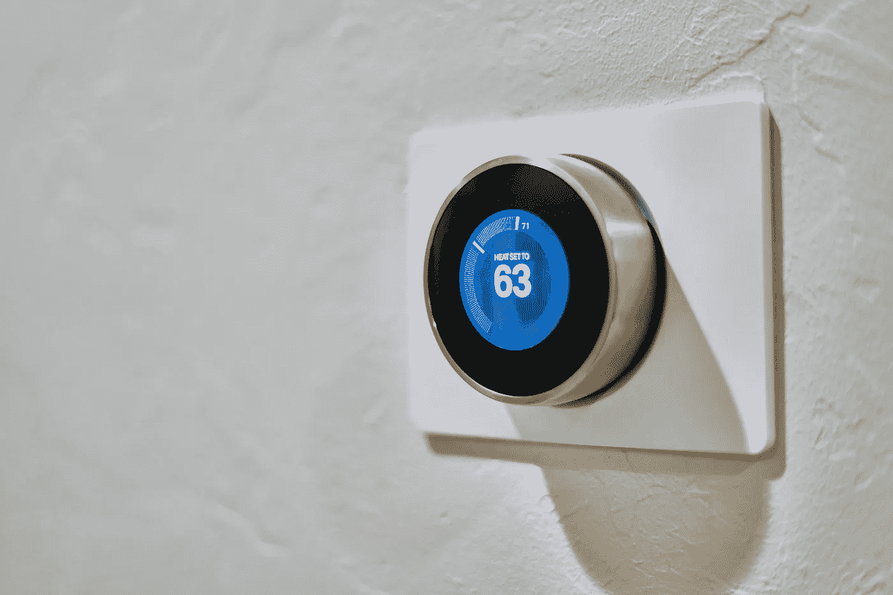

# 物联网实施需要学习的编程语言

> 原文：<https://medium.com/hackernoon/programming-languages-to-learn-for-iot-implementation-4e2d01216e52>

Photo by [Ben Kolde](https://unsplash.com/photos/d6dxQwmxV2Q?utm_source=unsplash&utm_medium=referral&utm_content=creditCopyText) on [Unsplash](https://unsplash.com/?utm_source=unsplash&utm_medium=referral&utm_content=creditCopyText)

# 物联网的未来

简单来说，物联网就是日常使用设备的互联网。大多数常见的物联网设备可以像客厅智能灯一样简单，也可以像机器人一样复杂。

重要的是，由于这些大多是我们日常使用的设备，它们收集数据。作为物联网一部分的每一台设备都在收集成吨成吨的数据。我们都很清楚，如果处理得当，数据比世界上所有其他东西都更有价值。数据是我们的世界在未来一段时间和永远都会存在的东西。

Photo by [Dan LeFebvre](https://unsplash.com/photos/RFAHj4tI37Y?utm_source=unsplash&utm_medium=referral&utm_content=creditCopyText) on [Unsplash](https://unsplash.com/?utm_source=unsplash&utm_medium=referral&utm_content=creditCopyText)

你的恒温器可以很容易地设置在 x 温度，只要你愿意，每天都可以。复杂的是，假设今天是周五或者某人的生日，你已经喝了一晚上了。恒温器将像正常情况一样打开。但是当一个复杂的物联网程序启动时，它会意识到你会宿醉，并计算出你通常在这种情况下醒来的时间。在这样的日子里，你甚至可能喜欢水有点冷或有点热，一个复杂的物联网系统可以根据从你的数据中收集的个人偏好为你量身定制。

无数的智能设备相互连接，从相邻设备获取相关信息。这就是物联网，智能设备的互联网。最近有一场关于物联网市场如何在未来 15 年内达到 20 万亿美元估值的骚动。

人们可能会认为这是一种夸张，我们相信，如果到那时我们有能力，聪明的数据科学家和开发人员，20 万亿美元是可能的。每个行业都在沉迷于物联网的用途和优势，但开发适用于物联网的硬件可能会变得困难。

Photo by [Alain Pham](https://unsplash.com/photos/WMdKyKpmYDI?utm_source=unsplash&utm_medium=referral&utm_content=creditCopyText) on [Unsplash](https://unsplash.com/search/photos/money?utm_source=unsplash&utm_medium=referral&utm_content=creditCopyText)

# 物联网已经应用于:

## 家

没有多少人在家中采用智能物联网设备。在当前的场景中，智能家居比普通的物联网灯泡和恒温器高出许多水平。我们现在拥有的物联网智能家居还处于基础开发阶段，还有更多的东西有待开发。大多数人认为物联网是创新的缩影，但它甚至还没有开始。

## 网格规划

每个城市都基于电网、食物、水、电、液化石油气。第一次现代化是在我们根据日常必需品规划城市的时候。物联网将很快改变一切。智能电网将取代普通电网，提供更先进的服务和节约成本。

## 工业自动化

自动化席卷了各行各业，并被物联网设备放大。一个简单的物联网传感器可以判断的因素大大提高了生产率，降低了成本。物联网的所有类型的行业看起来都很好。

## 智能城市

智能城市不仅仅是智能家居和电网，与一般的智能家居甚至电网相比，智能城市有着异常高的要求。智能城市必须每隔 10 英尺安装各种传感器。成本和实施都阻碍了智能城市实现物联网能够提供的功能。

## 健康

无数的健康设备将很快全天候实时检查我们的生命体征。预防措施比试图治愈要好得多。目前的设备可以检查我们的心率，去年 9 月，苹果推出了手表系列 4，它可以在短短 30 秒内做一次心电图。未来正在改变，Apple Watch 只是一个开始。与单个设备及其生成的数据相比，拥有许多设备的智能物联网技术可以在巨大的级别上识别风险。这些设备将在延长人类寿命方面发挥重要作用。

## 零售

零售细分为线上和线下零售，在这两种情况下，通过物联网生成的数据仍然至关重要。为了生存，分析顾客行为的需求对零售商来说越来越重要。物联网行业正在采取措施来改善客户关系并保持业务持续发展。

Photo by [Roberto Nickson](https://unsplash.com/photos/ghOKyQAAe4k?utm_source=unsplash&utm_medium=referral&utm_content=creditCopyText) on [Unsplash](https://unsplash.com/?utm_source=unsplash&utm_medium=referral&utm_content=creditCopyText)

# 物联网实施的编程语言

## c 语言

c 是有史以来最具标志性的编码语言之一！开发于 1972 年的 C 语言已经成为几乎所有编程语言的基础。有些人认为 C 是老派和过时的，但它在编程时提供的控制是异常的，这使它成为物联网的一个很好的选择。

## 计算机编程语言

由于 Python 主要用于编写 web 应用程序，所以你只能在顶级网站开发公司中找到优秀的 Python 开发人员。在一家 [Python web 开发公司](https://semidotinfotech.com/services/python-development-company)，大部分工作都是构建 web 应用程序，但人们现在意识到 Python 对于物联网有多好。复杂的性质、简单的语法和庞大的框架库使 Python 成为物联网开发的绝佳选择。

## Java 语言(一种计算机语言，尤用于创建网站)

Java 的属性使其成为物联网开发中最受信任和喜爱的语言。Java 是一种面向对象的语言，是在初级编程语言的基础上建立起来的。JVM 和 Java 的一次编写，随处运行的特性使得 Java 成为物联网相关开发的绝佳选择。

## Java Script 语言

人们认为 JS 前端开发服务是 JavaScript 在图表上最多的。然而，事实并非如此。JavaScript 具有能够在设备之间操作的基本特性，这使得它成为用于物联网开发服务的有价值的竞争者。

## 服务器端编程语言（Professional Hypertext Preprocessor 的缩写）

PHP 正慢慢被接受并适应用于物联网开发的微服务。PHP 主要是在 C 上实现的，这使得它们成为物联网开发中一个很好的组合。

# 结论

正如我们所讨论的，物联网的未来比其他任何东西都要光明。世界正在慢慢意识到对物联网的需求，并慢慢进入互联设备的自动化世界。未来都是关于个性化和辅助机械和设备。但我们相信，我们还远远没有达到超级舒适的程度，当物联网变得智能，然后它可以以各种可能的方式为人类服务时，我们就会获得这种高度舒适。