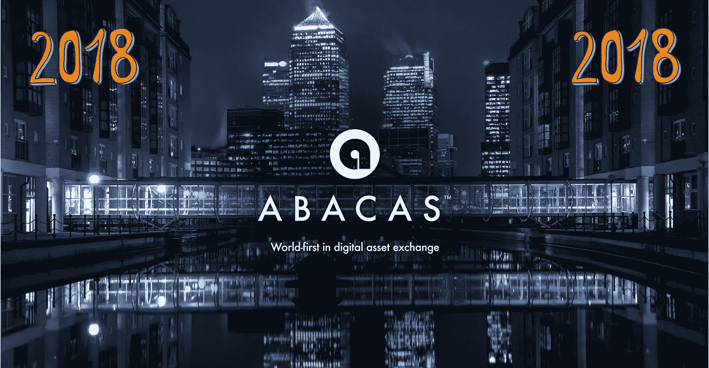
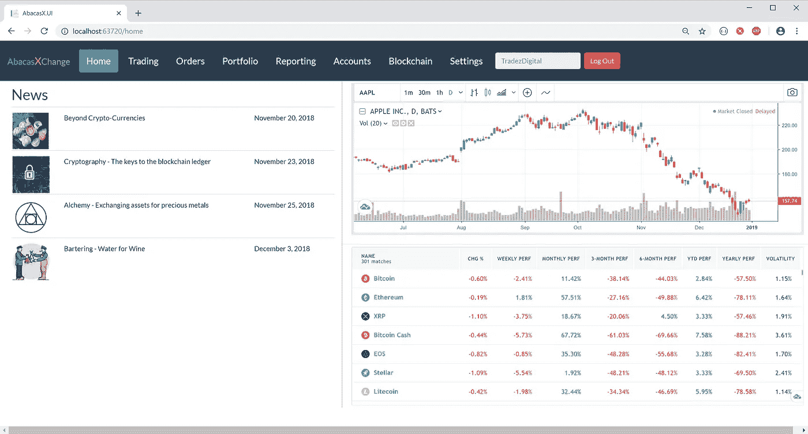
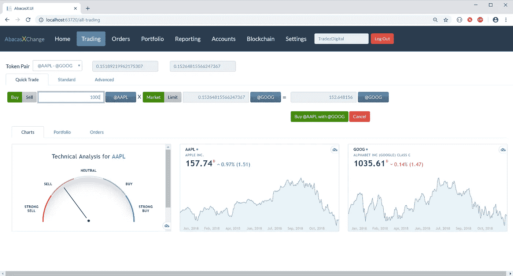
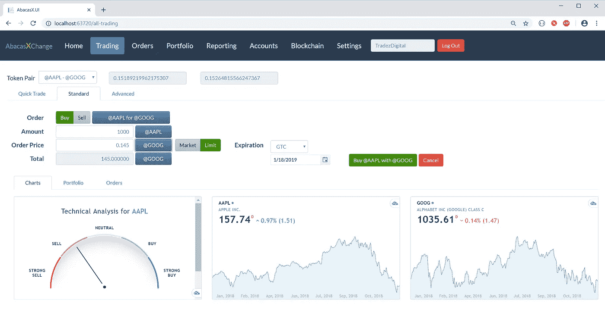
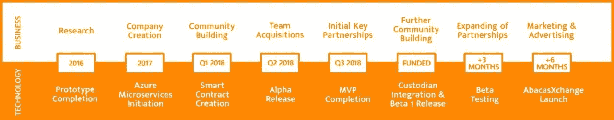

# Abacas 在 2018 年的进展

> 原文：<https://medium.com/hackernoon/progress-of-abacas-in-2018-8a03c2dac92c>

阿尔伯特·爱因斯坦曾经说过，“只有两样东西是无限的，宇宙和人类的愚蠢……”好吧，我还要加上第三个，AbacasXchange 的进步。该项目正在不断发展，团队在 2018 年除了证明这一点之外什么也没做。在接下来的段落中，我将分析几个不同领域取得的进展。

# 法律合规性-进展/合作伙伴/进入 SEC 计划

金融行业充斥着重重管制。一家成功的金融科技公司应该完全合规，Abacas 是如何做到这一点的一个很好的例子。

Abacas 在 2018 年成功跨越了许多法律和合规门槛。美国是世界上最大的消费市场，也是 AbacasXchange 即将推出的地方。幸运的是，**我们设法获得了反洗钱许可，在美国**和海外合规经营。

洗钱者可以不择手段来掩盖他们的踪迹。重要的是要认识到，在这个过程中，他们可以利用合法金融机构的正常活动。如果合法业务被用于洗钱(即使是非自愿的)，它可能会不符合《银行保密法》(BSA)/反洗钱(AML)的要求。 **Abacas 已采取安全措施来防止这种情况，通过提供两个关键的战略合作伙伴关系来帮助 BSA/AML。** 
abacas exchange 将提供各种各样的资产，其中一个关键部分是由可信的第三方保管这些资产。例如，苹果股票可以转换成代币。虽然股票将被托管，但代币将在交易所本身进行交易。**考虑到这一点，Abacas 已经与战略基础设施合作伙伴签署了两项托管协议(更多协议还在后面)。[托管协议](https://www.investopedia.com/terms/c/custodial-agreement.asp)只是代表实际所有人持有资产或财产的一种安排。**

此外，**abacas exchange 成为 SEC FinHub 计划的一部分，**该计划的创建是为了支持加密、区块链、ICOs 和 FinTech 创新。[fin hub](https://www.sec.gov/news/press-release/2018-240)将使 Abacas 能够直接与 SEC 工作人员就创新想法和发展进行交流。不用说，这对我们的项目来说是一个很好的机会。

建立一个通用的资产交易所绝非易事，但这个团队已经为这项雄心勃勃的事业做好了准备。如上所述，完全合规是我们长期成功的重要因素。在 2018 年**期间，Abacas 收到了美国法律顾问**关于运营权的关键意见指导，并且**Abacas exchange 软件成功通过了向美国主要监管机构报告合规性**的审查。

[特雷西公司](https://tracyfirm.com/)和[帝国环球](https://empireglobal.partners/)都在 2018 年成为阿巴卡斯的合伙人。前者为我们公司提供美国合规方面的咨询，而后者是国际证券交易委员会法律顾问。

该团队不仅在确保法律合规性方面做得很好，而且产品本身在 2018 年期间也得到了专业开发。

# 建立一个独特的交流-产品开发过程

尽管一些公司只是通过营销噱头来获得最初的吸引力，但长期的成功取决于产品的高质量。这就是为什么 AbacasXchange 专注于客户满意度，团队在建设交易所时考虑到了未来。

Abacas 在 2018 年参与了一些重要的合作伙伴关系。正如 Mark VanRoon 所说，“我们只选择了那些能够利用 AbacasXchange 的优势，同时提供互惠互利，增强两家公司客户的用户体验的公司。”

Invox Finance 就是这样一个合作伙伴。通过这种合作关系，AbacasXchange 上提供的资产池正在扩大。由 Invox Finance 提供的碎片化贷款是加入我们独特生态系统的下一批资产。Abacas 的客户将获得短期和中期资本，Invox Finance 的客户将受益于增加的流动性。

资产池从未停止增长。去年，Abacas 与 Korporatio 合作，将在交易所提供 Smart 公司的股票。精明公司(SC)是政府认可的合法道。它使企业家能够创建完全合法的区块链实体，并受益于投票和股份转让等传统功能。

AbacasXchange 上的所有资产都将被令牌化。在这种情况下，一个关键的合作伙伴是令牌化平台[可替换物](http://www.fungible.network/)。他们的使命是将全球范围内的所有资产令牌化，这使得 fungible.network 非常适合。

此时，您可能会问自己“所有这些听起来都很棒，但是 Abacas 会是什么样子呢？”嗯，在 2018 年期间，我们投入了大量的时间和精力进行开发。从附上的截图可以看到结果。

Home Screen

主屏幕设计得非常人性化。客户可以了解他们感兴趣的最新消息。更重要的是，人们可以选择一个特定的图表，并看到资产的表现随着时间的推移。

Quick Trade screen

交易部分将允许您在 3 个选项中进行选择:快速交易、标准交易和高级交易。各种图表帮助你得到一个简要的概述，并表明它是否是一个好主意出售。

Standard Trade Screen

只有背后有一个热切的社区，开发这样一个伟大的平台才有意义。Abacas 在这方面取得了重大进展。

# 壮大社区

强大的社区是区块链创业成功的先决条件。Abacas 在 2018 年成为所有主要社交媒体的一部分，并参与了关于金融界未来的讨论。不提所有渠道，我们的推特粉丝增长了 7000 多人。一个拥有数千名成员的电报频道也随之诞生。

AbacasXchange 拥有忠实的支持者，大使计划只是验证了这一说法。如果你曾经想加入像 Abacas 这样的大公司，现在就是你的机会。大使计划于 2018 年 8 月启动。非常欢迎有好主意和知道如何帮助 Abacas 的人。
你可以在这里报名:[https://abacasexchange.com/ambassador-sign-up/](https://abacasexchange.com/ambassador-sign-up/)

2018 年创作了大量内容。这包括图片、视频、采访、测验和文章。你可以去 abacas exchange[博客](https://abacasexchange.com/blog/)了解最新消息。

# 聪明的头脑一起工作(团队成长)

没有 Abacas 团队，所有这些伟大的成就都是不可能的。正如史蒂夫·乔布斯常说的“商业上的伟大成就从来不是由一个人完成的。它们是由一群人完成的。”

在这一年中，**我们从 3 名成员发展到 19 名成员** (3 个核心团队、7 名大使和 9 名顾问)。AbacasXchange 是一个雄心勃勃的项目，需要聪明的头脑来执行。马克·万伦和文斯·斯莫尔一直是这家公司的引擎。他们是建设者，提供事实和结果，而不仅仅是希望。*Wouter Bijl*2018 年加入 Abacas，现任公共事务主管。他发起了一项大使计划，并通过该计划吸引了大多数大使。

每个大使都有特定的角色，并推动项目向前发展。如果你想了解更多，你可以去 https://abacasexchange.com/team/。下面您可以看到他们的姓名和角色列表:

*   特里斯坦·比勒维德
*   罗伯特·施密特
*   斯托扬·弗拉霍夫斯基
*   丘克斯·加布里埃尔
*   *凯·布洛杰斯*
*   *迪维·索德*
*   让·何塞·加西亚·莫利纳

成功的公司是在专家的帮助下建立起来的。2018 年，Abacas 吸引了许多背景惊人的顾问。你可以去 https://abacasexchange.com/team/[网站](https://abacasexchange.com/team/)阅读更多关于他们的信息

*   丹·拉赫曼
*   大卫·王
*   Raghunathan Muralidharan (Murali)
*   让·巴普蒂斯特·塞贝
*   迪伦·阿特韦尔-杜瓦尔博士
*   莫汉·甘地·蓬纳甘蒂
*   亚当·梅日文斯基
*   迭戈·德诺塔里斯
*   查尔斯·艾夫斯

# 最后的话

Abacas 在 2018 年取得了巨大的进步，绝对不会止步于此。我们对 2019 年感到非常兴奋，并希望实现更大的里程碑。

Future Roadmap

感谢您花时间阅读这篇文章！任何反馈(积极的或消极的)都将不胜感激。

[*敬请关注*](https://t.me/ABACASXCHANGE_ABCS) */* [*推特*](https://twitter.com/AbacasXchange) *或* [*脸书*](https://www.facebook.com/AbacasExchange)