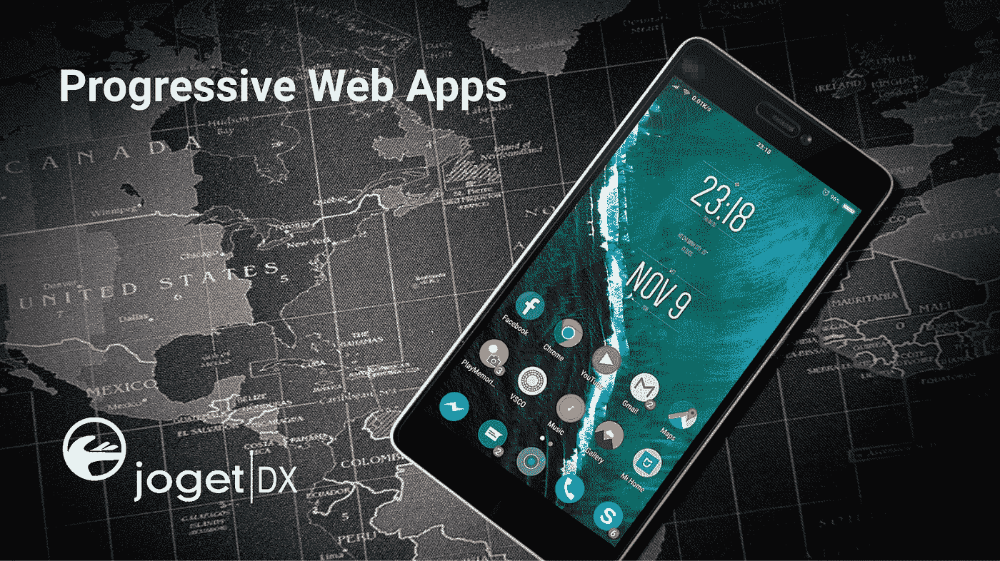
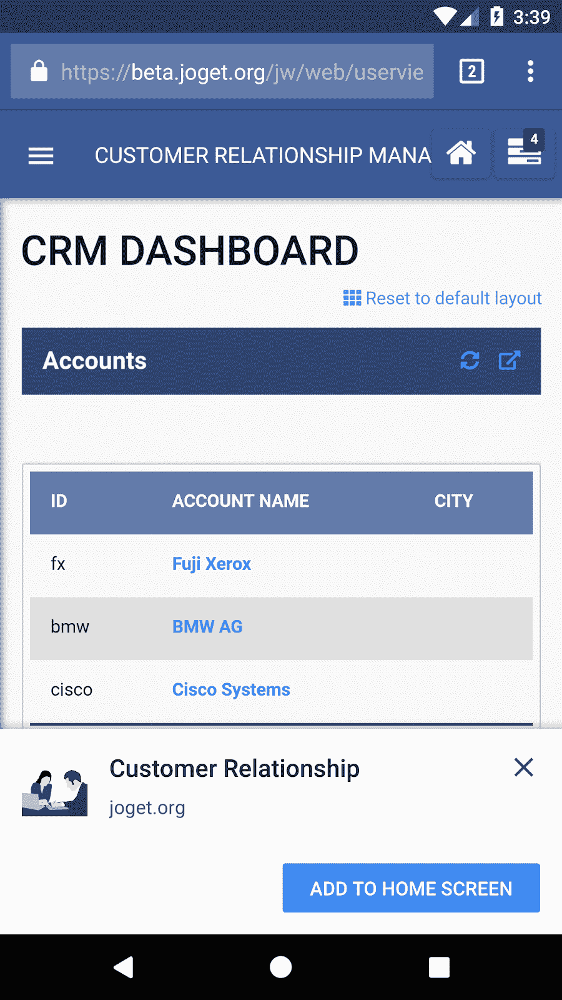
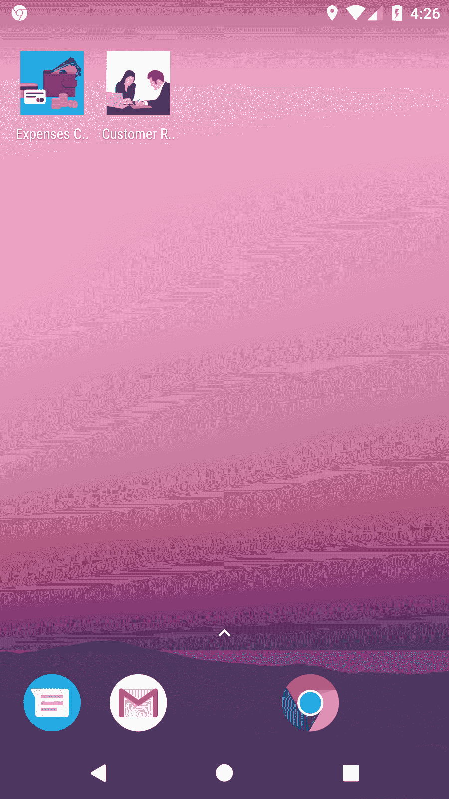
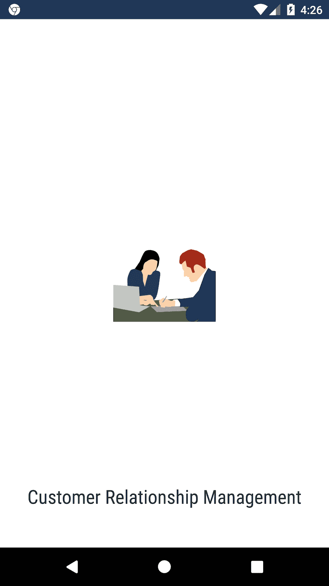
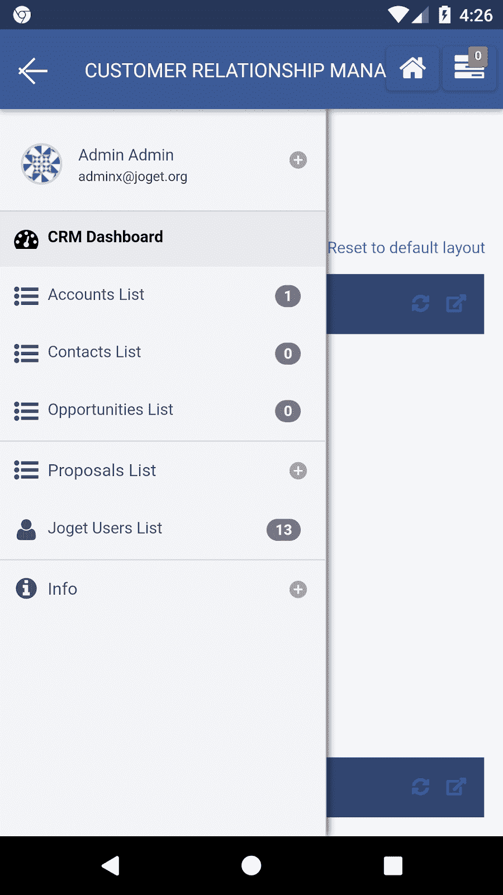
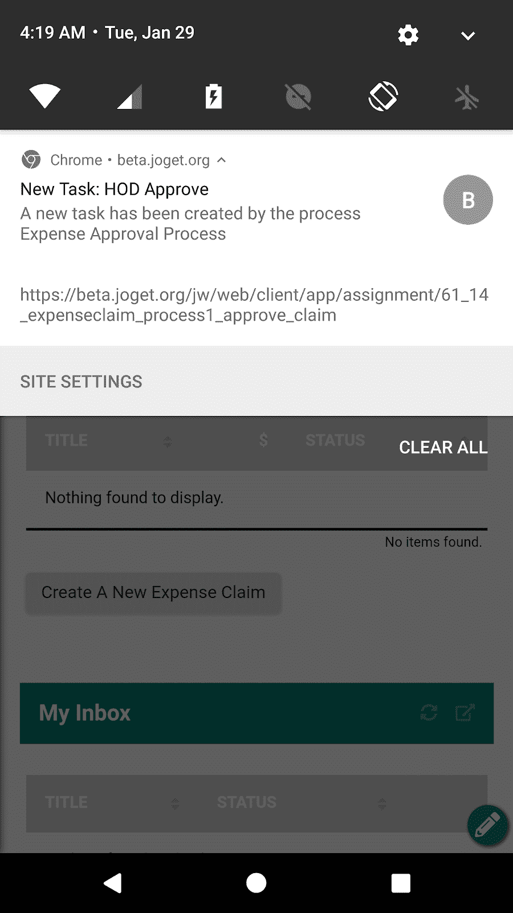
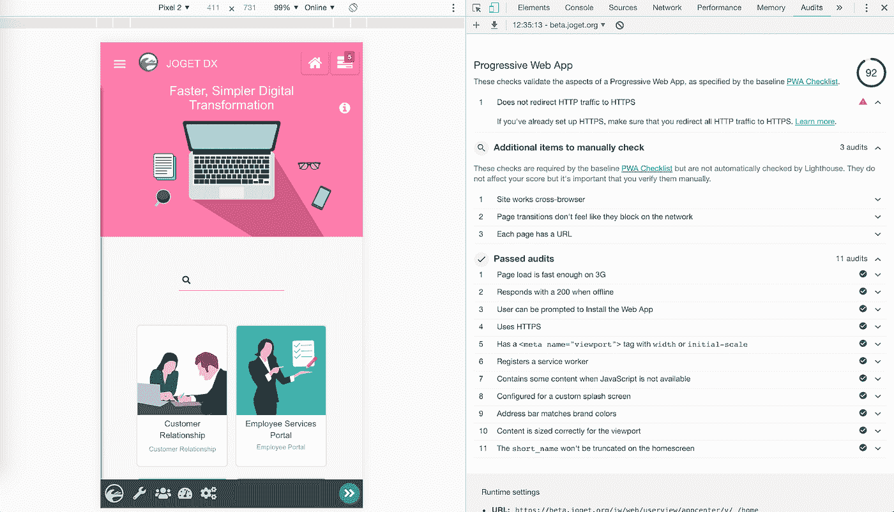

# 渐进式网络应用:苹果应用商店，谷歌 Play 商店，很高兴认识你

> 原文：<https://medium.com/hackernoon/progressive-web-apps-apple-app-store-google-play-store-it-was-nice-knowing-you-728a00350e67>

苹果应用商店和谷歌 Play 商店的末日来临了吗？这个标题显然有点夸张，但说真的，新一波移动技术[的时代已经到来。2018 年，Twitter 宣布已经开始提供其移动](https://hackernoon.com/tagged/technology) [PWA 作为其主站点](https://arstechnica.com/gadgets/2018/09/progressive-web-apps-moving-mainstream-as-twitter-makes-its-mobile-site-the-main-one/)。PWA？那是什么？

[渐进式网络应用(PWA)](https://developers.google.com/web/progressive-web-apps/) 是移动应用和网络的未来，由业内重量级人物推动，尤其是谷歌。通过添加到主屏幕、离线支持、推送通知等功能，PWA 提供了接近原生移动应用的用户体验。

以下是 PWA 的工作原理。假设您有一个也符合 PWA 的客户关系管理(CRM)应用程序。你只需在手机浏览器中使用普通网址访问该应用程序。如果你不止一次访问该应用程序，PWA 会提示你“添加到主屏幕”，这基本上相当于“安装”该应用程序。

Add to Home Screen Prompt

安装后，PWA 图标将作为应用程序出现在您的手机中。启动该应用程序将显示一个闪屏，然后该应用程序将显示在一个完整的窗口中，没有浏览器导航栏。

PWA Icons

PWA Splash Screen

PWA User Experience

随着应用程序的平稳过渡和快速页面加载，PWA 和本机应用程序用户体验之间的界限变得模糊，特别是当它支持后台推送通知和一些离线功能时。

Background Push Notification Support in PWA

各种平台中的 PWA 支持一直在改进。Android 上的 Chrome 已经支持 PWA 很久了，而苹果在 iOS 11.3 中加入了 [PWA 支持。但是…总是有但是，不是吗？为了获得 PWA 的资格，谷歌提供了一份](/@firt/progressive-web-apps-on-ios-are-here-d00430dee3a7)[渐进式网络应用清单](https://developers.google.com/web/progressive-web-apps/checklist)。清单详细列出了所需的标准，还有一长串需要通过审核的项目。Chrome 浏览器嵌入了一个名为 [Lighthouse](https://developers.google.com/web/tools/lighthouse/) 的开发工具，该工具可以自动审计 web 应用的 PWA 合规性。灯塔基线审计包括以下检查:

1.  3G 上的页面加载足够快
2.  离线时以 200 回应
3.  可以提示用户安装 Web 应用程序
4.  使用 HTTPS
5.  具有带宽度或初始比例的标签
6.  注册一个服务人员
7.  包含一些 JavaScript 不可用时的内容
8.  为自定义闪屏配置
9.  地址栏匹配品牌颜色
10.  内容的大小适合视口
11.  short_name 不会在主屏幕上被截断
12.  网站工程跨浏览器
13.  页面转换感觉不像在网络上阻塞
14.  每个页面都有一个 URL

下面的屏幕截图显示了 Lighthouse Progressive Web App 审计的示例结果:

Lighthouse Progressive Web App audit

因此，尽管 PWA 的承诺和效用非常诱人，但开发 PWA 应用程序通常不是一件容易的任务，尤其是在处理作为 PWA 关键部分的[服务人员](https://developers.google.com/web/fundamentals/primers/service-workers/)时。

认识到 PWA 在未来几年的重要性， [Joget DX](https://blog.joget.org/2018/12/introducing-joget-dx-next-generation.html) 应用程序自动整合了 PWA 功能(包括服务人员),因此所有应用程序都将符合 PWA 基准，而无需额外的步骤。Joget DX 是一个[开源](https://hackernoon.com/tagged/open-source)应用平台，用于更快、更简单的数字转换(DX)。通过无代码/低代码方法，Joget DX 允许任何人(无论是商业用户还是技术用户)快速构建成熟的企业应用程序。PWA 之前的截图实际上显示了一个 Joget DX 应用程序，使用可视化拖放方法开发。

要了解更多关于 Joget DX 的信息，请查看 [Joget DX 介绍文章](https://blog.joget.org/2018/12/introducing-joget-dx-next-generation.html)。