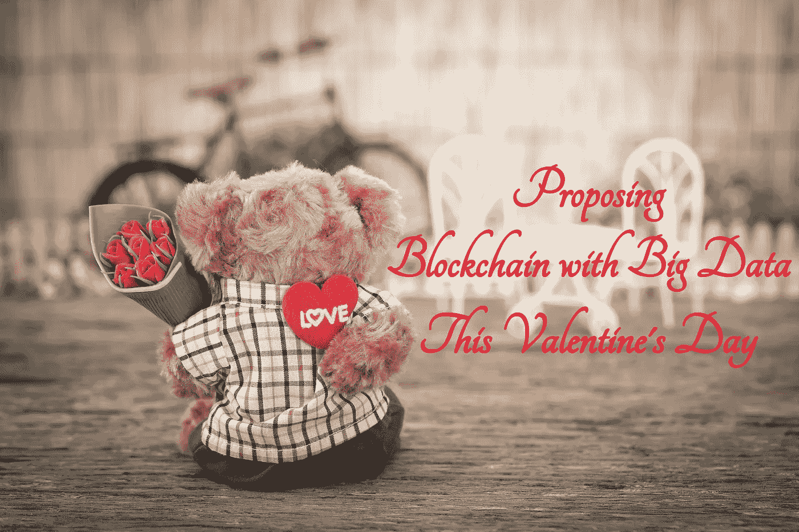

# 这个情人节用大数据提出区块链

> 原文：<https://medium.com/hackernoon/proposing-blockchain-with-big-data-this-valentines-day-f03f0b435bb5>

**“爱在空气中”，**这是丘比特、求婚、爱情和承诺的月份。不，这个博客不是关于爱情的建议，当然，也不是点击诱饵。但是，既然是情人节这个月，那就让我们试试最热门的技术，也就是**大数据和区块链的配对吧。**

**首先，让我们研究一下可能的完美一对的简介:**

# 大数据

> “2027 年，全球大数据市场软件和服务收入预计将增长 1030 亿美元。”

根据 [Gartner，](https://www.gartner.com/it-glossary/big-data/)

> “大数据是高容量、高速度的数据，拥有各种信息资产，需要经济高效、创新的信息处理形式来增强洞察力和决策能力。”

这意味着它拥有大量复杂的数据集，必须对这些数据集进行处理和分析，以获取有益于业务的有用信息。

## 大数据的某些基本原则

*   指的是随时间呈指数级增长的海量数据
*   它不能用传统的数据处理技术来处理
*   包括数据挖掘、数据存储、数据分析、数据共享和数据可视化

# 区块链

> “在全球范围内，全球区块链市场规模预计将在 2023 年增长 233 亿美元。”

根据 [Gartner，](https://www.gartner.com/it-glossary/blockchain/)

> 区块链是网络中所有参与者共享的加密签名的、不可撤销的交易记录的扩展列表。每个记录都包含一个时间戳和指向以前事务的引用链接。有了这些信息，任何有访问权限的人都可以追溯属于任何参与者的交易和历史。

简单来说，区块链是一个跨计算机网络共享的数据库。一旦添加了记录，就很难更改并确保数据库的所有副本都是相同的；网络保持持续的检查。

## 区块链的某些基本原则

*   不需要中央网关守护设备来验证交易和认证来源—这是由多个节点独立完成的
*   多个贡献者可以从任何位置同时修改数据库。
*   如果节点损坏/受损；网络的其余部分不受影响
*   每个贡献者审核分类帐并促进其他贡献者之间的信任

因此，这里的议程是要了解，如果大数据和区块链技术**正确地相互刷卡，**它们能成为完美的匹配吗？让我们来找出答案。

# 区块链+大数据:这是天作之合吗？

> 到 2030 年，区块链账本中包含的[数据](https://www.mo-data.com/turning-bitcoin-mining-into-big-data-mining/)可能价值高达全球大数据市场的 20%，并产生高达 1000 亿美元的年收入。

大数据和区块链都高度普及；它们对很多人都有吸引力，也是业内很多人的最佳选择。他们每个人都在突飞猛进地进步。

但是任何关系的发展都必须建立在三个重要的支柱上，即**透明、安全和友谊。**所以，任务就是要知道，如果让这两个成为绝配，他们是否有能力在这些支柱上建立关系？

# 安全性:

大数据的问题在于，出于隐私考虑，目前所有的数据湖和池要么是隐藏的，要么暴露在有限的数据中，担心被泄露。但是，为了将数据转化为有价值的信息，数据流必须是真实的和防篡改的。

这就是区块链的用武之地，区块链最基本的目的是提供**安全和防篡改的数据账本。**区块链包含记录交易的数字“区块”链。每个块都与其前后的所有块相连，这使得篡改单个记录变得困难。如果被盗，黑客需要更改该块的记录以及与之相关的记录，以避免被发现。

因此，如果区块链成为大数据的情人，科技公司可以向更多当代人开放湖泊，而不用担心数据泄露。

# 透明度:

大型数据池和湖的另一个问题是**“暗数据”**(没有被使用的信息)的数量。有些数据科学家无法访问，有时是因为数据不完整或过时，有时是因为数据的格式不可读。

但是，在区块链技术形成的分布式账本的帮助下，数据科学家可以分析数 Pb 的原始非结构化数据，并提供所有需要的信息，减少黑暗数据的数量。此外，区块链将过滤数据，并仅使用所有节点都认可的真实数据，这使得分析更好，大数据更有效。

# 陪伴:

当前存储数据的基础架构效率低下。它依赖于云存储等第三方，这导致了一些问题，如扩展、重复数据、因大量数据导致的性能下降、隐私风险、高价格等。

区块链技术让存储变得高效。在分布式网络的帮助下，文件被分解并分布在多个节点上。文件被加密，这使得其他节点不能加入网络。防止了文件丢失和数据冗余，并且只有在传输数据出错的情况下才存储额外的副本。区块链存储成本[可以将云计算的价格](https://blog.sia.tech/why-blockchains-are-the-future-of-cloud-storage-91f0b48cfce9)降低 50% -100%之间。

# 区块链和大数据的融合:我们为什么要关心？

*   利用大数据和区块链，**检测实时欺诈的过程变得很容易**。有了区块链，人们不能修改数据的记录；因此，大数据可以利用其分析技能来发现欺诈活动。
*   在大数据和区块链的配合下，公众的社交数据可以使用区块链轻松**转移，而不会影响严格的“隐私政策”。**
*   损坏的数据没有进入链的空间，因为它与机器上的其他数据不匹配。区块链和大数据使**更高质量和精确数据的收集和分类成为可能。**
*   随着区块链和大数据的采用，企业可以**获得信任，因为他们的个人数据是安全和隐私的。**
*   区块链有可能**将数据货币化**，公司之间可以直接分享、出售和提供他们的数据和见解。
*   数据分析师更喜欢挖掘**社会数据**来洞察**关键的加密货币趋势。**这有助于组织发现强大的人口统计信息。
*   区块链和大数据有助于简化对数据的访问。不同部门的用户可以拥有分析所需的数据。这**简化了数据访问和分析的工作流程和时间周期。**
*   它**提高准确性**并为企业提供丰富而**可靠的洞察力**。
*   数据情报服务和区块链正在兴起，并帮助金融机构、政府和其他组织揭示隐藏的数据模式。

# 已经尝试并测试了其兼容性的行业

*   [**Omnilytics:**](https://omnilytics.co/)Omnilytics 是一个领先的时尚和美容市场情报平台，为销售、营销和商品销售提供可操作的见解。该公司旨在将区块链与大数据分析相结合，为他们的智能合同、数据交换和其他协议和 API 提供支持。将区块链与大数据结合使用提供了新的信任、诚信和透明度，因为数据合作伙伴可以跟踪其数据的性能。
*   [**出处:**](https://www.provenance.org/) 出处是一个帮助品牌和零售商通过透明建立客户信任的平台。该平台使用大数据和区块链技术，以安全、可信和可访问的方式收集和共享关键产品信息。
    通过这个平台，顾客可以获得关于产品由什么制成、来自哪里等经过验证的信息。零售商从产品跟踪和向顾客提供新信息中获益。
*   [**Storj:**](https://storj.io/)Storj 是一个用于分散式云对象存储的平台，即经济、安全、易用和私有。它使用客户端加密，因此数据所有者可以信任这一点，并且只能访问他们的文件。如果断电或数据中心损坏，该算法可确保数据分布足够广泛，以保持高可用性。

# 前进的道路

区块链和大数据提供了理想组合所需的所有品质。大数据和区块链的协同，真的可以让运营变得快速、安全、灵活、透明。与区块链一起，对生成的数据执行的大数据操作可以帮助改善业务，并带来大量机会。然而，还有更多的探索，这只是冰山一角！