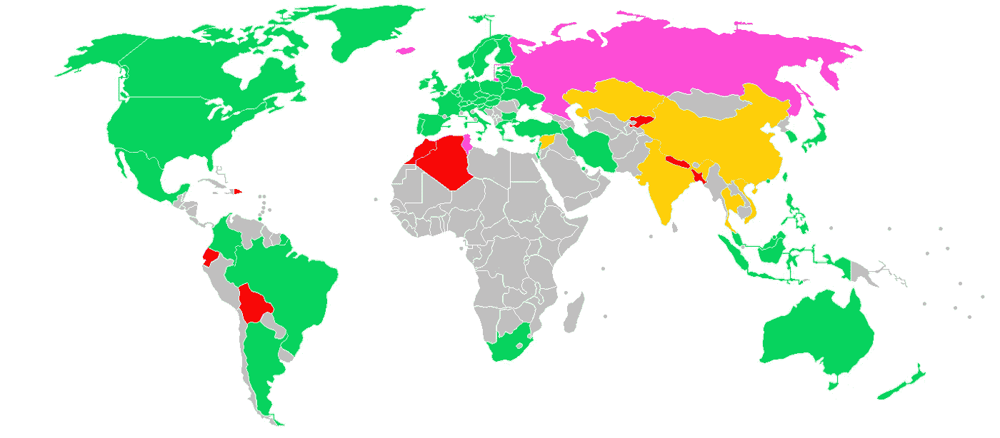

# 利弊:你如何选择在哪个加密友好的司法管辖区开办你的公司？

> 原文：<https://medium.com/hackernoon/pros-cons-how-do-you-choose-which-crypto-friendly-jurisdiction-to-start-your-company-in-df4e0b239aa8>

如果你正在创办一家区块链公司，那么你需要选择一个能给你带来成功和盈利机会的司法管辖区。

为了决定选择哪个司法管辖区以及存在哪些利弊，我询问了专门研究加密的律师和加密创始人，了解选择一个加密友好的司法管辖区的利弊。

如果你对更专业的问题感兴趣，比如你应该为 STO 选择哪个司法管辖区，那么你可以在这里阅读更多: [STO/ICO 法律服务](/geekforge-academy/sto-ico-legal-services-86a4bef06a35)

下面是大家的回答。(这个话题是#10kqachallenge 系列的一部分，我在这里采访不同领域的专家。我们的目标是接触并采访 10，000 名专家。更多关于挑战的信息可以在这里找到: [formula.geekforge.io](http://formula.geekforge.io)

对于每个管辖区，我都引用了几位专家的话，在我看来，这些专家提供的信息是最有用的。

讨论的司法管辖区:

1.  [T5【马耳他】T6](#8f6d)
2.  [**美国**](#b7e9)
3.  [**瑞士**](#05e9)
4.  [**直布罗陀**](#ceed)
5.  [T21 加拿大](#fca0)
6.  [**立陶宛**](#1087)
7.  [**爱沙尼亚**](#5b61)
8.  [**以色列**](#aa57)
9.  [**新加坡**](#25cb)
10.  [**港**](#435c)
11.  [**阿联酋**](#44fe)
12.  [**日本**](#7c50)
13.  [**韩国**](#8318)

请注意，这些采访仅针对语法和拼写进行了编辑。

# **马耳他:**

[**保罗·菲利斯**](https://www.linkedin.com/in/paul-felice-mamotcv/) **—律师事务所** [**迈克尔·基普里亚努律师事务所**](http://kyprianou.com)

*最近颁布的规范马耳他区块链和加密行业的法律建立了法律框架，使企业家能够在一个已经做好准备迎接行业发展带来的不可避免的挑战的管辖区启动他们的项目，这个行业仍处于起步阶段，其他管辖区尚未涉足。新法律在促进商业发展的同时，保持了市场的完整性，确保了透明度，从而也是最重要的，保护了投资者。在潜在投资者信任的管辖区组建公司无疑将有助于项目的成功。唯一想到的缺点是漫长的许可过程和银行业务可能有点困难。然而，这是一个目前正由几个新的支付服务提供商解决的问题，因此决不是不可逾越的障碍。最后，在实施正确的税收结构时，马耳他的公司税率低至 5%，这一事实对于寻求完美环境来启动项目的公司来说无疑是一个巨大的优势。*

## [**贝佩**](https://www.linkedin.com/in/beppedegiorgio/)**——*商业律师*** [***加纳多拥护者***](https://www.ganadoadvocates.com/)

*除了马耳他有利的公司税收制度外，马耳他的区块链法律还提倡自愿认证制度，这有望转化为有效的、量身定制的金融监管形式，市场参与者可以据此选择最适合其业务的制度。此外，专门设立了一个新的主管机构(马耳他数字创新局)，以监督马耳他的技术安排，并支持马耳他发展成为创新的区块链和人工智能倡议的卓越中心。*

在马耳他开业的另一个主要优势是实施定制的“金融工具测试”,赋予主管当局引入法律过滤器的权力，适用于发行人、代理人和服务提供商(如加密交易所、经纪人、托管人等)。)以确定 DLT 资产是否符合电子货币、金融工具、虚拟金融资产或虚拟代币的资格。这一新制度通过提供适用于 ICO 白皮书的最低披露要求(就内容和格式而言)的蓝图，并通过概述与虚拟金融资产有关的广告和营销方式，以及确定该领域的服务提供商是否需要马耳他金融服务监管机构的许可，来保护投资者的权利。

## [**乔纳森·加利亚**](https://www.linkedin.com/in/jonathan-galea-5421419a/)**—**[**区块链咨询**](http://www.bca.com.mt) 董事总经理

*马耳他的主要卖点在于，迄今为止，它仍是世界上唯一一个针对分布式总账技术的利用和开发提供全面监管框架的司法管辖区。我们不仅建立了监管区块链金融方面的框架，即交易所和 ico，而且还在世界上率先建立了监管机构，以确保 DLT 系统的技术质量达到标准。像所有其他司法管辖区一样，银行设施仍然是一个问题，但希望随着立法的引入，银行将更愿意接受受监管的业务。*

## [***马里奥***](https://www.linkedin.com/in/mariofrendo/) **—律师事务所** [**冈兹&律师事务所**](http://gonzi.com.mt)

作为世界上第一个全面规范分布式账本技术领域的司法管辖区之一，马耳他受到了该领域爱好者的广泛关注。凭借有利的公司和税收结构、有利于商业的思维模式和积极主动的劳动力，马耳他巩固了其在欧盟内作为这方面最具前瞻性的国家之一的地位——并不仅开始监管“虚拟金融资产”(cryptoassets)，还监管更广泛的“创新技术安排”概念。对于初创公司和较小的实体，专业和监管费用，以及其他特定的成本和支出可能被视为一种负担，你宁愿没有。但在搬迁你的企业到马耳他，你可以放心一个可靠的印章批准证明你的区块链企业。

## [**泰莎·谢姆布里**](https://www.linkedin.com/in/tessa-schembri/)**—**[**WH 合伙人**](http://whpartners.eu) 见习律师

*马耳他是第一个引入适用于区块链生态系统及其各种使用案例的整体立法的欧盟辖区。马耳他已经成为区块链行业许多大型企业的首选管辖区，并进一步确立了其作为一个中心的地位，为这些企业的蓬勃发展提供了理想的生态系统。马耳他管辖区支持一个由平衡的法律和监管框架支撑的亲商环境。除此之外，马耳他在国际商务中处于战略地位，提供了绝佳的税务规划机会。*

*不幸的是，缺乏当地银行对马耳他区块链公司的支持仍然是“区块链岛”实现其真正潜力的障碍。*

# **美国:**

## [Robert Mao](https://www.linkedin.com/in/robertmao/)——arc block 的创始人& CEO

在美国区块链创业的最终好处是加入这里的尖端技术社区。区块链技术仍然处于早期阶段，所以对于一个创业公司来说，拥有大量有才华的工程师和志同道合的人真的很重要。ArcBlock 是一个基金会区块链应用平台，我们置身于西雅图的技术中心，与所有云计算巨头和区块链初创公司仅几步之遥。从工程角度来看，这是一个无与伦比的优势。

另一方面是成本，从招聘到法律、合规和财务，一切都比在欧洲或亚洲建立团队更昂贵。但我想说，靠近科技中心是值得的，与硅谷相比，西雅图可能是区块链创业公司更好的地方。

## [**珍妮·所罗门**](https://www.linkedin.com/in/jeanne-solomon-3919805/) **—合伙人**[**CKR·劳 LLP**](https://www.ckrlaw.com/)

*我认为这取决于公司在区块链/加密领域的具体业务，以及公司打算在哪里运营，在美国注册是否有意义。*

***优点:***

*如果公司计划在美国开展业务，在美国成立公司会更容易；许多投资者喜欢投资美国实体，所以这些是在美国注册的重要原因。美国一些州对区块链越来越友好；例如，威斯康星州有各种现有的和待决的立法，促进区块链。特拉华州也通过了一些对区块链友好的立法，还有其他一些州也值得考虑合并。*

***缺点:***

*在美国注册可能会包括更高的税收(取决于考虑中的替代司法管辖区)和在美国注册的潜在额外成本。*

# 瑞士:

## [**弗朗茨·阿尔贝里尼**](https://www.linkedin.com/in/franz-alberini-6124731/) **—兰斯合伙人****的管理合伙人**

*****优点:*****

***首先，随着 2018 年 2 月 ICO 指引的发布以及随后的 FINMA 文件，瑞士从一开始就处于区块链监管的前沿。那么，瑞士是世界上最稳定的国家之一，在欧洲国家内部的深度不确定时期，公司和企业家可以享受更容易规划他们的业务的好处。瑞士也是世界上最强大和稳定的经济体之一，人民的生活水平非常高。此外，国家面积小，这使它能够建立一个制度，使人们能够与政府机构和当局建立直接关系。事实上，在金融管理局、小型企业管理局和其他机构分发的所有文件中，都突出强调了经营者可以直接联系有关当局开展业务，在大多数情况下，正是这个当局在活动过程中领导他们，使他们完全遵守法律。需要考虑的最后一点是，如果在瑞士，公司可以从基本上所有的州的低税收中受益，那么楚格加密谷为区块链公司提供了相当于 14.6%的固定税收。***

*****缺点:*****

**有意在瑞士立足的企业家和公司必须应对非常高的企业成本，比如租用办公室或支付员工工资。此外，必须考虑到，如果从一方面来说，有可能轻松地直接面对机构是一个很大的机会，从另一方面来说，这带来了成本的进一步增加。同样的观点也适用于监管。如果从一个角度来看，有一定的指导方针和固定点从法律的角度提供了确定性，从另一个角度来看，这意味着需要尊重更多的履行，因此，公司需要更多的成本。**

## **[**格雷戈里·克莱克**](https://www.linkedin.com/in/gregory-clerc-ll-m-tax-1462797/) **—奥博森·叶步司律师事务所****

*******优点:*******

****在区块链/加密公司方面，瑞士可能拥有最丰富的经验。****

*****-有利的税收和金融法规*****

*****-非常稳定的政治环境*****

*****-积极的投资环境*****

*****-随着“税收改革和 AHV 融资”(通常为 2020 年)，公司的利得税税率将大幅下降(尤其是在某些州，如日内瓦)*****

*******缺点:*******

*****-与其他州相比，法规更多。然而，我们认为法规是必不可少的，瑞士的法规非常令人鼓舞*****

*****-对商业财富的资本收益征税*****

## ****[**格雷戈里·艾劳德**](https://www.linkedin.com/in/gregoryaillaud/) **—瑞士区块链法律事务所区块链律师******

*****瑞士提供了稳定一致的司法管辖区和有利的税收环境，在这种情况下，监管机构 FINMA 相对容易接近，可以引导运营商进行合规项目。总的来说，我们发现 FINMA 选择通过教育来执行，而不是更积极的通过镇压来执行，正如我们目前在某些管辖区看到的那样，有时甚至是追溯性的。*****

*****在选择合适的注册地时，税收不应是主要因素。认真的项目首先要考虑自己想在哪里经营，自己的市场会在哪里。2018 年 2 月发布的 FINMA 指南有助于将瑞士置于加密国家的顶端，然而，立法者需要加快步伐，以跟上澳大利亚等国家的步伐，并保持领先地位。*****

## ****[**埃米利奥·科尔多瓦**](https://www.linkedin.com/in/emilianocordoba/) **—独立国际律师******

****有一个巨大的密码社区和专业公司，拥有大量高质量的人才库。Crypto Valley Association 是一个致力于将瑞士打造成加密和区块链领域的世界领导者的组织，该组织主办各种活动，并与政府沟通以改进立法。所谓的“密码谷”(Zug)是以太坊、Tezos 和 Monetas 的所在地。****

****在楚格成立加密公司的一个重要好处是它的税率，对加密公司来说是最低的。****

*****瑞士于 2018 年 2 月发布了 ico 指导说明，并于 2019 年推出了特别的金融科技牌照。2017 年十大 ico 中有四家在瑞士注册成立。*****

****我想说的唯一缺点是生活成本和专业人士的费用，银行也仍然不愿意为密码事务和 ico 开户，尽管这正在慢慢改善。****

*****我也写过一篇关于 ICO 的文章:*[*https://city wire . ch/news/legal-brief-what-you-need-know-on-icos/a 1121818*](https://citywire.ch/news/legal-brief-what-you-need-to-know-about-icos/a1121818)****

## ****[**伊夫·内什佩卡**](https://www.linkedin.com/in/yvesnespeca/) **—合伙人**[**NGS rechtsanwlte AG**](http://ngs-legal.ch)****

*****瑞士目前的立法对加密很友好，预计会有进一步的积极发展。(严肃的)顾问积累了大量的专业知识，他们可以从法律和技术的角度有效地帮助实施项目。有一个很大的加密创业社区，信息流非常好。瑞士各级当局已经普遍熟悉加密技术，互动也相当简单。最后，但同样重要的是，瑞士有一个非常有利的税收框架。作为一个缺点，我可能不得不提到 FINMA 并不总是在提交答复方面很快。*****

# ******直布罗陀:******

## ****[**马克·x·埃吕尔**](https://www.linkedin.com/in/marc-ellul-ba734a28/)**—[埃吕尔&公司](https://www.ellulco.com/practice-area/fintech)执行合伙人******

*******优点:*******

****直布罗陀是一个加密友好的司法管辖区，专业人士和银行了解这个领域。****

****我们是世界上第一个引入法律和全面框架来监管区块链商业的国家。这是 DLT 提供者制度，例如，在这一制度下，可以管理密码交换。****

*****我们的法律要求对数字资产的贡献者进行客户尽职调查和反洗钱检查。我们为自己设定了高标准，目的是吸引高质量的加密业务，并保持我们作为质量管辖区的声誉。*****

*******缺点:*******

*****如果在直布罗陀开展业务，不对加密客户进行客户尽职调查和反洗钱检查的企业将触犯法律。任何通过业务方式存储或转移属于客户的数字价值的公司都需要从我们的监管机构获得金融服务许可证(DLT 提供商许可证)。*****

*****许多人认为反洗钱检查和监管是积极的，但有些加密企业不想承担遵守这些规定的责任。直布罗陀不是这种生意的地方。*****

## ********—**[**壁垒律师事务所**](http://www.ramparts.eu/) 创始人******

*****与加密运营商合作的客户和利益相关方有理由期望这些运营商满足关键领域的最低标准，包括:保护客户资产、反洗钱、公平对待客户；并确保对这些经营者使用的资产和控制系统进行审计。*****

*****直布罗陀是欧洲著名的电子商务和金融科技中心。我们有一个对区块链友好的政府和一个金融服务监管机构，它竭尽全力为该部门建立良好的监管，以鼓励最好的公司在直布罗陀设立公司。我们在直布罗陀还有数千名在支持国际跨境电子商务业务方面经验丰富的工人和专业人士。这里的居民还受益于英国的法律制度和对个人和公司有利的税收制度(例如，低所得税和无资本利得)。*****

*****2018 年，直布罗陀推出了 DLT 提供商制度，以鼓励使用 DLT 技术的交易所、托管人、经纪人和其他专业人士在直布罗陀获得许可。许多运营商希望受到监管，以向市场提供更大的信心，即他们受到谨慎管理，例如，客户资产受到旨在保护他们免受损害的原则和规则的约束。此外，所有 DLT 提供商都必须履行全面的反洗钱义务，这增强了市场和主要利益相关方的信心。在这里获得许可还可以更容易地访问银行关系(这是加密领域的一个主要问题)。[查看此处了解更多信息和潜在报价:*[*https://www . ramparts . eu/why-should-crypto-operators-exchange-and-custoders-get-a-DLT-licence-in-Gibraltar/*](https://www.ramparts.eu/why-should-crypto-operators-exchanges-and-custodians-get-a-dlt-licence-in-gibraltar/)*]*****

****我也试着去想一些关于在直布罗陀发展的负面因素……但是真的没有。:)****

## ****[**斐瓦斯奎兹**](https://www.linkedin.com/in/philipvasquez/)**——**联想到 [TSN 法](http://www.tsnlaw.com/) &方正**[**水坝**](http://dam.gi/)******

*****在直布罗陀开业有几个很好的理由，主要是*****

*****(1)自 2018 年 1 月起，分布式账本技术(DLT)的特定法规允许这些业务在规范和良好的环境中运营，以及*****

*****(2)与银行和顾问一起存在支持此类业务运营的基础设施。*****

*****直布罗陀于 2014 年开始在 DLT 开展工作，现在我们看到了一个不断发展的生态系统。直布罗陀在这一特定时刻的不利方面是“英国退出欧盟”的不确定性，这涉及英国的离开，因此也涉及直布罗陀离开欧盟。然而，在欧盟层面不存在关于区块链或加密货币的法规，因此英国退出欧盟的任何影响将不同于依赖通行证的其他公司或行业，例如保险或银行。*****

## ****[**【Omri Bouton】**](https://www.linkedin.com/in/omribouton/)**—哈桑斯国际律师事务所** [**实习律师**](http://hassans.gi)****

*****直布罗陀为区块链/加密业务提供了一系列独特的优势。《DLT 条例》于 2018 年 1 月生效，为欧洲的区块链企业提供了首个专门的监管框架。作为首批推动者之一，直布罗陀成为了金融科技行业的核心枢纽，托管了许多领导者，如 eToro、CEX、TokenMarket、Huobi、Covesting 和 Xapo。这些公司的存在使司法管辖区及其机构获得了有用的经验，并为金融科技业务开发了专用产品，例如银行服务。*****

****关于潜在的负面因素，英国退出欧盟会被大多数人视为主要关注点。****

*****然而，DLT 法规并非源自欧盟法律，因此不受英国退出欧盟的影响。该许可证不可转让，但允许被许可人在任何不禁止这些服务的司法管辖区内经营和提供服务。DLT 执照证明了公司的稳定性和质量。证明您的企业已经采取了充分的措施来保护消费者和打击反洗钱，这一点非常重要。它让消费者感到欣慰，也让潜在的投资者、银行和其他合作伙伴感到欣慰。*****

# ****加拿大:****

## ****[**Denko mance ski**](https://www.linkedin.com/in/denko-manceski-2648407a/)**—**[**Viewly**](http://view.ly)联合创始人兼首席执行官****

*****1。我们选择加拿大是因为法律更成熟，更重要的是，更稳定。一些国家(如斯洛文尼亚)不断改变关于加密的法律，这给企业带来了不确定性。*****

*****2。与一些随机的离岸岛屿相比，加拿大是一个声誉很好的国家，这改善了公司的形象。人们意识到，它不是一个隐藏在世界上不为人知的地方的黑幕公司。人们也更乐意与这样的公司合作。*****

*****3。税(GST) %是体面的。*****

## ****[亚伦·格林豪斯](https://www.linkedin.com/in/agrinhaus/)—[格林豪斯律师事务所](http://grinhauslaw.ca)的律师****

*******优点:*******

*****稳定的国家，强大的经济，高技能的劳动力，尤其是区块链技术的领导者，低公司税率，以及获得投资资本的渠道。*****

*******缺点:*******

****如果你从事证券交易，监管可能需要更多的启动资金和更多的时间，税率很低，但不像一些离岸司法管辖区那样为 0。****

# ****立陶宛:****

## ********—律师********

****在立陶宛只有成立区块链/加密公司的好处！可以强调的是，立陶宛不仅是拥有最多 ICO 和人均 ICO 筹资额的国家，也是欧洲金融科技市场的惊人门户。****

****政府、商业银行和投资者都被对 ICO 和区块链的积极态度团结在一起。区块链企业、企业家和投资者受益于国家对 ICO 和区块链的积极态度。Lituania 是世界领先的密码监管机构之一。****

*****立陶宛中央银行为欧盟为加密公司设计的金融许可证提供了一个沙箱计划(第二轮 LBChain 已经开始),并与经济和财政部长一起，他们一直提醒立陶宛是一个创新、创业和杰出商人不断取得令人印象深刻的成果的国家。*****

*****Invest Lithuania、维尔纽斯区块链中心、维尔纽斯科技园(波罗的海的硅谷)、Rise Vilnius 以及立陶宛新兴创业公司的其他机构和创新金融科技中心的协同作用，使创业公司和专家能够联系起来，使他们能够解决各种挑战，平衡金融科技的机会和风险。*****

****对于区块链/加密/金融科技初创公司来说，立陶宛是最酷的地方——在过去十年中，该国已经筹集了超过€1.5 亿英镑的资金，而在过去 18 个月中，€通过 ico 筹集了 6 亿英镑，这充分说明了立陶宛成功的创业生态系统。****

## ****[**塔达斯·布洛塔**](https://www.linkedin.com/in/tadas-bulota-ll-m-0214465/) **—立陶宛** [**布洛塔法律**](https://bulotalegal.eu/) **执行合伙人******

*****立陶宛是领先的金融科技中心之一，也是拥有逾 5 亿潜在消费者的欧洲门户。立陶宛银行通过专业的指导、顺畅的授权和前瞻性的监管，为金融科技新人提供快速许可程序。欢迎金融科技公司和创业公司测试由立陶宛银行创建的技术和监管沙盒 LBChain，以加速区块链解决方案在金融业的开发和应用。*****

*****然而，立陶宛监管机构对加密货币和 ICO 持有保留意见，因为银行、支付机构和其他金融参与者不应提供与加密货币相关的服务或参与其发行。*****

## ****[**大流士·朗维纳斯**](https://www.linkedin.com/in/darius-lengvinas-a87570103/) **—律师、** [**律师事务所联合创始人**](https://www.lawthis.com/)****

*****我认为选择立陶宛成立区块链/加密公司有以下优点:*****

*******创新&反应灵敏的中央银行*** *:立陶宛有非常合作和管理良好的立陶宛银行。在 2017-2018 年的加密热潮中，该银行过去每天至少召开几次会议，讨论新的 ICO 项目，并就收到的有关项目符合各自国家法律的询问提供官方立场。尽管这是一家国有机构，但世行代表总是帮助区块链项目更好地了解立陶宛市场的特殊性。此外，该银行还管理着自己的区块链项目，称为 LBChain，并积极发起其他倡议。*****

*******人物&知识*** *:你几乎找不到一家营销或 IT 公司没听说过区块链及其价值。立陶宛人民热衷于学习新技术的一切，他们创造非凡事物的巨大愿望总是使我们有别于其他国家。我可以向你保证，用不了多久就会找到一位区块链专家为你提供必要的专业建议。*****

****另一方面，我也可以挑出一个主要的缺点:****

*******持牌机构&crypto****:2017 年 10 月 10 日，立陶宛银行陈述了对虚拟货币的立场，并指出金融市场参与者(银行、电子货币机构、支付机构等。)不应参与任何与虚拟货币相关的活动或提供与虚拟货币相关的服务，除非此类与虚拟货币相关的活动与服务提供商的主要金融活动相分离。不幸的是，这种监管机构的方法阻止了一些有前途的与加密相关的金融科技公司获得在立陶宛提供金融服务的许可证。*****

# ******爱沙尼亚:******

## ********——**母舰[首席法务官](https://mothership.cx/)******

****爱沙尼亚政府一直在寻找利用新技术的方法。它提供的优势之一是电子居留，允许世界各地的人在爱沙尼亚远程开设和经营公司。您可以在网上申请授权和申报纳税，完全没有官僚主义的麻烦(您可以在这里了解更多:[*https://investinestonia . com/business-in-爱沙尼亚/establishing-company/establishing-a-startup/*](https://investinestonia.com/business-in-estonia/establishing-company/establishing-a-startup/)*)。*****

****对于资产为加密货币的公司，爱沙尼亚也有非常优惠的税收制度。爱沙尼亚没有传统的企业所得税。相反，利润一经分配就要纳税(税率为分配利润的 14%或 20%)。如果公司的资产是价值可能快速增加或减少的不稳定资产，这一点尤其重要。例如，比特币的价值在 2017 年飙升，为任何持有比特币的人创造了巨额利润。然而，随之而来的是大幅下降。因此，在征收传统企业所得税的司法管辖区，公司最终不得不为已经蒸发的利润缴纳企业所得税。在爱沙尼亚，这不会发生。****

## ****[**Risto Rütel**](https://www.linkedin.com/in/risto-r%C3%BC%C3%BCtel-a2549813/)**—监管合规负责人** [**恒丰萨瑟兰北欧/波罗的海业务集团**](https://www.eversheds-sutherland.com)****

*******优点:*******

*****爱沙尼亚先进的电子社会和有利的商业环境使得该管辖区在从事 ico 或以其他方式运营加密货币的实体中非常受欢迎。据称，爱沙尼亚的人均初创企业数量在世界上排名第二，这证明了该国为各种类型的公司提供了支持性的生态系统。爱沙尼亚 e-Residency 大大提高了做生意的便利性，它向来自世界各地的申请人提供政府颁发的数字身份证，这使它成为数字游牧者、自由职业者和初创公司的理想选择。数字身份证使电子居民能够利用爱沙尼亚提供的大多数电子社会服务，这使其对包括虚拟货币在内的各种商业领域的企业家具有吸引力。有可能在几个小时内建立一个完全在线的公司，并从任何地方远程操作它。纳税和申报义务也可以通过互联网履行。对留存利润和再投资利润不征收企业所得税。*****

*******缺点:*******

****爱沙尼亚实际上并没有从其他大多数国家中脱颖而出，主要的不利因素是仍然围绕着加密世界的监管不确定性。尽管爱沙尼亚金融监管局提供了一些指导方针，但仍有许多不明确之处，监管当局决定宁可谨慎行事，谨慎决定要求公司获得许可证并发放许可证。这意味着获得必要的许可证可能需要一些时间和精力。然而，这样做的好处是，如果你从爱沙尼亚 FSA 获得了执照，这将提供一个质量标志。****

## ****[**斯文安东**](https://www.linkedin.com/in/svenanton/) **—律师事务所担任** [**SEB 潘克**](http://sebgroup.com)****

*****当然，主要原因是爱沙尼亚允许加入欧盟。如果一个人在爱沙尼亚建立了自己的企业，并且遵守爱沙尼亚的法律，那么该企业可以不受限制地进入所有欧盟国家。*****

*****为什么要在爱沙尼亚开展区块链/加密业务的一些一般原因(也与其他欧盟国家相比)是巨大的 IT 基础设施(例如* [*电子居留*](https://www.eas.ee/?lang=en) *、* [*电子政务程序*](https://e-estonia.com/solutions/e-governance/) *)和广泛使用的英语，例如申请所需许可证的法律和所有程序都是英文的。在这里查看例如爱沙尼亚法律行为:*[*https://www.riigiteataja.ee/en/*](https://www.riigiteataja.ee/en/)*。*****

****在我看来，一个非常具体的原因(有时被认为是反对的原因)是爱沙尼亚有非常有经验和值得信赖的当局。老实说:不允许吹牛。我们的银行在反洗钱/KYC 事务上也非常严格。我们知道创新型经济会产生很多风险，我们已经做好了应对这些风险的准备。有时，企业抱怨很难获得许可证，但在我的实践中，我认为这不是不必要的官僚主义，而是企业本身不了解自己(我有一个案例，一家韩国公司希望申请电子货币许可证——这与加密无关，因为电子货币完全是另一种服务)。****

****让我担心的是对加密/区块链业务的总体负面态度。那是因为比特币，比如我们国家银行行长的地位，比特币，以太坊等等都是“满满的空气”。区块链总是与比特币联系在一起。所以这是爱沙尼亚的主要缺点，但在我看来，不仅仅是爱沙尼亚有这个问题。事实上，爱沙尼亚正在举行越来越多的关于区块链技术的大型会议，对区块链的偏见正在改变，例如[*【https://moontec.io/】*](https://moontec.io/)****

## ****[**尼古拉·德姆丘克**](https://www.linkedin.com/in/mykdem/)**—**[**NJORD 律师事务所律师**](http://njordlaw.com)****

*****爱沙尼亚是一个区块链技术和密码友好的司法管辖区，因为:*****

*****(i)尽管区块链的商业模式缺乏透明度和监管，但当局和监管机构将区块链视为机遇，而非风险*****

*****(二)爱沙尼亚官僚机构单薄，绝对不是监管过度的辖区*****

*****(三)爱沙尼亚当局平易近人，大多乐于助人*****

*****(四)爱沙尼亚当局准备用英语交流*****

*****(五)获得“加密许可证”:加密货币兑换和加密货币钱包服务；*****

*****(六)爱沙尼亚电子居留系统使管理爱沙尼亚公司和与当局沟通变得容易*****

*****(vii)独特的企业所得税制度(只要资金留在公司，就没有所得税)*****

*******缺点:*******

****(一)银行不愿与密码相关业务合作。虽然，我们必须承认，最近对《商业法典》的修订使得区块链技术相关的初创公司也更容易获得金融服务(ii ),但没有专门的法规来解决智能合同和区块链问题。实践在一定程度上受高级别工作组的实践指南的指导****

## ****[**普里特·马丁森**](https://www.linkedin.com/in/priitm/) **—职称总监，** [**普华永道**](https://www.pwc.com/) 政府技术&数字化转型负责人****

*******优点:*******

*   *****2018 年关闭 30+ico，正在筹备 40+ico*****
*   ****爱沙尼亚通过 ico 筹集的资金在欧洲排名第三****
*   *****对留存利润和再投资利润征收 0%的企业所得税*****
*   *****电子居留计划——政府颁发的数字身份证，授予在爱沙尼亚的虚拟居留权。在可信的欧盟环境中轻松启动和管理全球业务*****

*******缺点:*******

*   *****爱沙尼亚尚未颁布任何关于 ico 的具体法规或投资者保护。*****
*   ****开一个银行账户既困难又昂贵。****

# ****以色列:****

## ****[**塔米尔·霍多洛夫**](https://www.linkedin.com/in/tamir-hodorov/)**—**[**霍多洛夫律师事务所律师**](http://www.hodorov.legal/)****

*******优点:*******

*   ****在一份长达 150 页的文件中，以色列证券管理局承认 ico 并使其合法化，只要它们符合证券法，表达了类似于美国 SEC 的立场。****
*   *****作为创新技术公司，区块链公司可以从以色列创新局获得高达 7%的税收优惠(16%而不是 23%)*****
*   *****以色列被视为“在岸”管辖区，因为以色列符合国际反洗钱标准，并在国际 FATF 中享有“观察员”地位。*****

*******缺点:*******

*   *****税收是个人的，即 ICO 的收入是不免税的；ICO 就像服务/产品的批量销售一样被征税，但有一些警告。*****
*   ****与我们的阿拉伯邻国进行贸易的一些禁令——接受伊朗、叙利亚或黎巴嫩投资者(这些国家已被正式宣布为敌国)的资金是非法的。****

## ****[**Abraham Tzur**](https://www.linkedin.com/in/abrahamtzur/)**—加密货币、技术和商业律师******

*****总的来说，以色列的情况与其他国家类似，以色列仍在学习区块链环境和法规，直到今天还不清楚。现在，当围绕 ico 的“炒作”结束时(尽管我确实相信我们会看到更多 ico，但狂野西部已经结束)，我确实建议我的客户仅在需要区块链技术时才将其融入他们的产品。*****

*****关于在以色列的利弊，这是一个非常棘手的问题，因为法规不明确(一般来说，我们公司建议客户在马耳他和爱沙尼亚等其他司法管辖区成立代币发行机构)。*****

## ****[**罗伊·凯达**](https://www.linkedin.com/in/roy-keidar-833a451/) **—特别法律顾问** [**伊加尔·阿农&科**](http://www.arnon.co.il/)****

*****多年来，以色列一直是科技初创公司的理想之地，从这个意义上讲，区块链的科技公司也不例外。当涉及到通过向投资者出售代币(ICO)来筹集资金时，事情变得更加复杂。鉴于以色列证券监管机构提出的担忧和“对加密银行系统不友好”,大多数以色列企业家不会出售以色列公司的代币，而是会寻求在直布罗陀或瑞士等提供更大透明度和确定性的司法管辖区成立外国公司。因此，我们通常会看到一种法律结构，将一家开发和销售技术的以色列公司与另一家管理 ICO 的外国公司结合在一起。这两家公司将建立商业关系。随着监管机构认识到区块链技术的潜力，这种情况可能会在不久的将来发生变化，从而表现出愿意采用各种工具，如“沙箱”，以允许以色列公司在保护公众利益的同时进行创新。*****

# ******新加坡:******

## ****[**佐藤智明**](https://www.linkedin.com/in/tomoaki-sato-086a0555/)**—**[**母星**](http://starbase.co) 创始人****

*******优点:*******

****非常友好的金融科技环境。大众理解密码是突破技术。****

*****——几家有隐情的大小律师事务所和会计师事务所。*****

*****-几家区块链/加密/金融科技孵化机构。*[*https://singaporefintech.org/*](https://singaporefintech.org/)*[*https://www.access-sg.org/*](https://www.access-sg.org/)*****

******-非常酷的居住环境。方便，干净，每个官方文件都是英文的，友好，有聪明的人。******

******-如果你住在自己的国家，你不需要成为新加坡居民来建立和经营新加坡公司。******

******-创建一家新加坡公司非常容易，而且有在线系统可以创建和维护。******

********缺点:********

******-新加坡也已经是世界上最大的传统金融中心之一，监管情况可能会发生变化。******

******-存在严格的反洗钱规则，因此使用你的平台的加密货币持有者需要 KYC。(这也是亲)。******

## *****[**【王】**](https://www.linkedin.com/in/yingyu-wang/) **—导演于** [**泰勒·温特斯 Via LLC**](http://www.taylorvintersvia.com/)*****

******新加坡不仅是一个生活和做生意的好地方，也是 DLT 的全球金融中心之一。新的法律法规正在颁布。政府和民间社会对此也很感兴趣。然而，一个实际困难是与银行打交道。一旦适当的许可制度于今年实施，这种情况可能会改变。******

## *****[**谭剑锋**](https://www.linkedin.com/in/gavin-tan/) **—法律顾问** [**立志资本**](http://aspire-cap.com)*****

*****新加坡作为区块链金融中心受欢迎的一个关键因素是，新加坡监管机构对区块链科技采取了渐进、宽松但积极的监管方式。监管机构的明确指导进一步加强了高度的立法明确性，例如，新加坡金融管理局定期发布关于允许或禁止代币发行的指导说明。监管机构也关注区块链企业面临的实际困难。新加坡金融管理局积极与银行合作，确保区块链公司更容易开设银行账户——这是全世界区块链公司面临的一个非常现实的问题。*****

*****此外，新加坡拥有一个繁华的区块链生态系统，适合寻求资本和合作伙伴的区块链公司。最大的区块链峰会——Consensus&block show——选择在这里举办。*****

*****另一方面，新加坡是一个小国，又是一个相对年轻的区块链中心，所以很难聘请到区块链的技术人才。*****

## *****[**Malcolm Tan**](https://www.linkedin.com/in/malcolmtan/)**—**[**Gravitas CEO 兼创始人。财务**](https://gravitas.financial/)*****

********优点:********

******1 新加坡有一个非常“亲加密”的政府和进步且包容的法律，特别是 2019 年 1 月 14 日通过的新支付服务法案。******

******2。新加坡是全球领先的经商之地。它有一个非常开放的商业环境。******

******3。在新加坡注册公司既快速又划算——我们通常会在 1 到 3 天内帮助客户注册一家新的加密公司。******

********缺点:********

******很快将有一个新的监管制度——支付服务法案于 2019 年 1 月 14 日通过，并可能于 2019 年 7 月至 2019 年 12 月生效。******

******新加坡的生活成本更高，员工成本也更贵。******

******新加坡的银行不欢迎与加密相关的活动，因此开立一个银行账户会很困难。******

# *******香港:*******

## *****[**丹妮拉·洛格菲**](https://www.linkedin.com/in/danilalogofet/) **—合伙人** [**赫伯特·史密斯·弗里希尔斯**](http://www.herbertsmithfreehills.com/)*****

******优点:相当进步的监管者发布关于处理加密和区块链项目的性质和方式的有用指导，缺乏严格的监管。******

******缺点:很难为初创公司开设银行账户，已宣布的未来密码交易所的许可要求，包括沙盒制度，都不明确，可能过于严格。******

## *****[**帕德莱格·沃什**](https://www.tannerdewitt.com/our-people/padraig-walsh/) **—合伙人**[**tannerdewitt.com**](https://www.tannerdewitt.com/)*****

*****任何地点是否适合作为开展和经营业务的地点，总是取决于业务的性质。香港也不例外。在某些方面，香港是一个非常简单和方便的经营场所。成立公司是一个简单的过程(除了开立银行账户)。税收制度简单明了，对大多数地方来说比较有利。在金融服务等行业之外，监管或政府监督相对较少。有一个独立的、国际知名的法院系统和仲裁中心。有很好的电信网络和基础设施。从香港到亚洲大部分地方都很方便，你就在中国的家门口。此外，作为一个金融服务中心，如果合资企业寻求将金融机构作为投资者或客户，那么它就离香港的金融机构集群很近。这是一个真正的国际城市，是一个非常方便的生活和工作的地方。以上是一些加分点。*****

******特别是在区块链和加密领域，香港政府采取了务实但总体上积极的态度。区块链被认为是一项非常有前途的技术，香港政府主办了一些会议，展示区块链科技企业在香港的故事。香港有几家领先的区块链和加密咨询公司，许多项目正在积极进行中。与其他地方不同，加密货币没有禁令。许多密码交易所选择香港作为经营或提供服务的地点。证券及期货事务监察委员会(Securities and Futures Commission)宣布，将推出一个监管沙盒，以评估未来是否以及如何监管加密交易所。在香港管理或营销的基金，如果有超过 10%的管理资产投资于加密资产，需要得到证券及期货事务监察委员会的批准。总的来说，香港已经表明，它对适当的区块链和加密企业的业务是开放的，并且已经制定了一个监管路径，表明这些企业将如何在香港合法地经营。******

*****香港是国际金融服务中心。加密领域的许多企业尤其需要考虑它们是否从事需要香港证券及期货事务监察委员会(或其他监管机构)批准的活动。此外，如果活动与加密货币的发行或交易有关，发行或进行交易的人将需要考虑证券法律和法规是否适用，并且他们必须满足所需的合规标准。在监管和执法方面，香港不是一个好惹的地方。香港不会欢迎可疑的企业或企图逃避适当的合规标准的企业。这个地方更适合由经验丰富的高管创办的企业，这些高管明白，在受监管的环境中经营需要正直和诚信的适当标准。*****

## *****[**大卫·梅雷迪思**](https://www.linkedin.com/in/davidmeredithlawyer/)**—**[**哈内斯**](http://harneys.com) 的联合管理合伙人*****

*****对区块链/加密公司来说，香港是个好地方，因为迄今为止，香港一直是一个宽松的监管环境。其自由放任的广东商业文化培育了一个支持新公司的生态系统。香港是名副其实的全球金融中心，是区内重要的区块链/密码产业会议的主办地。它还拥有运转良好的风险投资机制，为新想法注入资金。有了这样的投入，世界上最大的加密货币交易所之一 Bitfinex 这样的公司成为另一端也就不足为奇了。目前的风险在于，香港政府是否会采取过度谨慎的姿态，或许也是因为认识到 mainland China 方面对加密货币的彻底禁止。中国在政治、经济和社会上容忍香港和澳门以不同的方式做很多事情。见证澳门的博彩业。还可以见证 mainland China 是如何随心所欲地关闭内地游客进入赌场的闸门的。但加密货币实际上是一种不同的风险。香港作为一个制造业中心和国际贸易转口港发了大财。这根本不会对 mainland China 构成风险，香港的第二财富作为中国和世界资本流动的中介也不会构成风险。事实上，在过去的 30 年里，资本中介的角色促进了 mainland China 巨大的经济增长，也让我们外交上称之为“人脉广泛”的人相当轻松地发了财。但事实是，加密货币作为赌博的媒介时，代表着巨大的社会不稳定风险，但却没有提供政府控制的好处，这正是加密货币的要点，也是内地当局所憎恶的。如果他们能够在资本账户保持关闭的情况下，将内地赌客挡在加密赌场之外，或许对内地的目的来说就足够了。*****

## *****[**刘海伦**](https://www.linkedin.com/in/helen-liu-07471225/) **—国际律师&企业家*******

*****香港是一个全球金融中心，拥有强大的基础设施和稳定的投资者需求。进入繁荣的加密/区块链网络相对容易。由于其紧凑的规模，当地社区定期与来自其他亚洲和世界各地的游客聚集在一起。这为本地和海外人才创造了无数的机会，也为风险投资和亚洲融资带来了巨大的知名度。注册公司的途径简单、快捷、廉价，而且居住在香港以外的外国人也可以申请。这种感觉是一个真正的协作社区和一个在这个领域仍然监管宽松的司法管辖区。这与香港监管环境受到密切关注的变化形成了对比，因为中国在 2017 年禁止加密货币，而香港的公众意识运动去年警告了投资 ico 和加密货币的危险。此外，最近 sto 的受欢迎程度上升，导致证监会发布通知，澄清其对数字资产的监管立场。总体而言，香港监管机构采取了谨慎但开放的态度，主要侧重于保护和告知投资者，而不是关上大门，香港仍是在这一领域注册的首选司法管辖区。*****

# *******阿联酋:*******

## *****[**埃斯特万·范古尔**](https://www.linkedin.com/in/estebanvangoor/) **—管理合伙人** [**自营交易加密商品**](http://megalodon.ae)*****

********优点:********

*   ******阿联酋非常看好区块链技术，并看到了该技术在不同领域(如身份识别)的应用潜力。你可以看出阿联酋政府有一个区块链战略，他们的目标是使用区块链技术进行数字交易，人们将获得一个唯一的识别号码，指向他们在区块链的信息。后者预计每年可节省 3.98 亿份印刷文件和 7700 万个工时。******
*   *****在阿联酋注册一家区块链公司有很多好处，因为这里有一个很大的社区，有很多聚会，人们可以在那里分享他们的经验，并就与区块链/加密相关的问题进行合作。此外，还将提供关于区块链的大学课程。*****
*   ******阿联酋的另一个积极举措是“迪拜区块链中心”，旨在将区块链思想领袖、开发者、投资者和教育工作者聚集在一起。******
*   ******对于与加密相关的公司，阿联酋也是一个积极的管辖区，因为有一个与加密相关的大型社区和聚会。该地区的人们对加密(特别是比特币和以太坊)感兴趣。此外，从监管角度来看，阿联酋是加密监管方面的先驱，即金融监管机构宣布了即将出台的加密立法，阿布扎比全球市场(“ADGM”)已经启动了加密资产框架，监管现货加密资产活动，例如来自 ADGM 的(加密)交易所、托管人和中介(代理/经纪人)提供的活动。后者有助于在阿联酋成立一家与加密相关的公司。******

******作为一个骗子，很难想出一个，因为我在阿联酋工作时在这里没有遇到过骗子。******

## *****[**伊哈布·阿贾**](https://www.linkedin.com/in/ihab-arja-12207415/) **—高级助理/商务&航空专家*******

******凭借政府推动的举措，如阿联酋区块链战略 2021 和迪拜区块链战略，阿联酋在区块链的国际发展中发挥着不可或缺的作用。因此，羽翼未丰的区块链公司将参与创造未来，探索和评估最新的技术创新，展示提供更无缝、安全、高效和有影响力的国家体验的机会。没有管理这类活动的专门立法。******

# *******日本:*******

## *****[**肯·川井**](https://www.linkedin.com/in/ken-kawai-40aab2aa/) **—合伙人** [**安德森·森&友常**](http://amt-law.com)*****

********优点:********

******稳定清晰的监管环境:日本于 2017 年率先建立监管加密货币的法律框架，并赋予加密货币支付手段的地位。日本将在不久的将来引入安全令牌/令牌化安全法规和钱包/保管法规。由于成文法有明确的规定，日本的区块链/密码公司不会因政府突然改变监管立场而受到影响。此外，成熟的大公司，如主要金融机构、机构投资者更喜欢适度监管的环境，而不是无监管的环境。******

*****区块链公司的运营成本是合理的:在东京，有很好的区块链社区。可以以合理的价格雇佣优秀且有能力的区块链工程师。此外，东京的生活成本比硅谷、纽约、伦敦、上海和新加坡等其他大城市要低。*****

********缺点:********

*****对于初创公司来说，遵守法规的成本很高:虽然加密货币的法规并不太严格，但对于初创公司来说，遵守适用法规的成本很高，如果他们想出售代币的话。*****

*****开一个银行账户并不容易:所有银行中的大多数都不愿意为密码公司开户。*****

## *****[**安东尼·洛雅克**](https://www.linkedin.com/in/anthonylojac/) **JD、** PhD **—创始人&团队负责人**[**English 4 crypto . jp**](http://english4crypto.jp/)*****

******日本是世界第三大经济体，对加密货币的认知和使用水平最高。******

*****但是，初创公司一直缺乏足够的风险投资资金，整体基础设施也不成熟，目前加密收益的税率高达 55%。除了复杂的语言和文化障碍，由于加密货币交易所一再遭到黑客攻击，监管环境尤为严峻。*****

*****尽管日本市场极具吸引力，但目前在日本成立一家加密初创公司并不明智。*****

# *******韩国:*******

## *****[**洪玉良**](https://www.linkedin.com/in/hongyul-harry-ryoo-8a095b56/)**——**合伙人[李&柯](http://www.leeko.com)*****

*******优点:**区块链和加密货币是韩国最热门的话题之一，所以你很容易就能找到渴望与你合作的人。由于韩国政府没有专门监管区块链或加密行业，你可以在韩国比其他国家更容易建立一个企业。*****

*******反对意见:**如你所知，韩国政府目前对 ico 或与加密货币相关的融资持极其消极的态度，因此你将面临在韩国吸引投资者的困难以及韩国政府无形的行政限制。此外，随着人们对区块链和加密货币的兴趣越来越高，编码工程师往往会向未来的雇主要求更高的工资或福利，这意味着你可能需要支付比多年前更多的钱。*****

## *****[苏继红](https://www.linkedin.com/in/hongs/)—[杜森律师事务所](http://www.dusonlaw.com)合伙人、律师*****

## ********优点:********

*   ******我相信韩国公众对加密货币，尤其是比特币的认知水平非常高。与大多数国家相比，在韩国经营以区块链技术为基础的企业要容易得多。******
*   ******韩国的加密领域非常活跃——有许多加密初创公司，甚至是大公司(Kakao、LINE 等。)都在做密码生意；公众对投资加密资产非常积极。******
*   ******总体而言，韩国政府对区块链科技公司很友好。******

********缺点:********

*   *****韩国政府对 ico 的政策非常消极。*****
*   ******韩国涉及加密的法律法规不明确且不可预测。******

## *****关于作者:*****

*****基里尔·希洛夫——geek forge . io 和 Howtotoken.com 的创始人。采访全球 10，000 名顶尖专家，他们揭示了通往技术奇点的道路上最大的问题。加入我的**# 10k QA challenge:**[geek forge 公式](https://formula.geekforge.io/)。*****