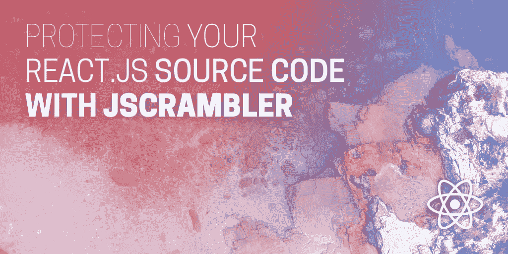
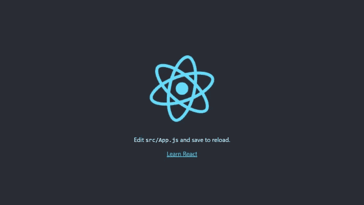
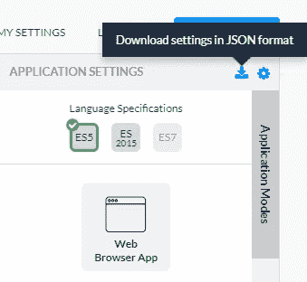
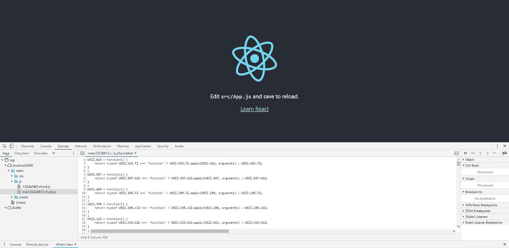

# 如何用 Jscrambler 保护你的 React.js 源代码

> 原文：<https://medium.com/hackernoon/protecting-your-react-js-source-code-with-jscrambler-52d837edc582>

[](https://blog.jscrambler.com/protecting-your-react-js-source-code-with-jscrambler/?utm_source=medium.com&utm_medium=referral)

[React.js](https://reactjs.org/) 是最流行的 JavaScript 库之一。2018 年“JavaScript 现状”调查将 React 列为首选的[前端框架](https://2018.stateofjs.com/front-end-frameworks/overview/)，65%的受访者表示他们已经使用过它，并将再次使用。

凭借其优雅的编程风格、丰富的包生态系统和良好的文档，React 已经找到了驱动大型企业应用程序的方法。具体来说，开发者调查发现**使用 React 的受访者中有 18%为拥有超过 1000 名员工的公司工作**。

众所周知，JavaScript 的本质意味着它不能被加密，很容易在客户端被访问，甚至被篡改。

> *因为 React 支持企业级应用，所以需要企业级安全解决方案，如*[*js crambler*](https://jscrambler.comhttps://blog.jscrambler.com/protecting-your-react-js-source-code-with-jscrambler/?utm_source=medium.com&utm_medium=referral)*。*

本教程将在几分钟内解释如何将 Jscrambler 无缝集成到 React 的构建过程中。您将学习如何使用最先进的多态混淆技术，以及密码锁和自我防御功能来保护 React 源代码。

# 先决条件

将 Jscrambler 正确集成到 React 构建过程中只需要做两件事:**创建 React 应用**和**配置 Jscrambler** 。我们将在下面强调这两者。

# 如何创建 React 应用程序

出于本教程的目的，我们将使用一个`create-react-app`样板应用程序。首先，我们需要使用 npm 来安装它:

```
npm i -g create-react-app
```

这将下载`create-react-app`并使用最新 React 版本所需的所有依赖项进行全局安装。

现在，我们准备创建样板应用程序，它将作为本教程的基础。使用以下命令创建这个新应用程序:

```
create-react-app react-jscrambler-boilerplate
```

安装完成后，我们可以运行新创建的样板应用程序:

```
cd react-jscrambler-boilerplate
npm start
```

我们新的 React 应用程序将在开发模式下运行，并出现在`localhost:3000`。在进入下一步之前，检查是否一切就绪。有关`create-react-app`入门的更多帮助，请参见[官方文档](https://reactjs.org/docs/create-a-new-react-app.html)。



我们的 *React* 应用程序的基础项目结构如下:

```
react-jscrambler-boilerplate/
|-- package-lock.json
|-- package.json
|-- yarn.lock
|-- build/
| |-- static/
| | |-- css/
| | |-- js/
| | |-- media/
|-- node_modules/
|-- public/
|-- src/
```

*   `package.json`包含所有与 npm 相关的配置，如依赖关系、版本和脚本。
*   `src`目录展示了应用程序的所有源代码。然后构建源代码并打包到`build`目录中。构建完成后，我们受保护的 HTML 和 JavaScript 文件将放在这里。

# 如何配置 Jscrambler

Jscrambler 的所有配置将驻留在一个文件中:`.jscramblerrc`。因此，我们需要创建这个文件来指定我们希望使用的转换。

最快的方法是通过 Jscrambler 网络应用。在那里，创建一个新的应用程序。现在，在*应用模式*选项卡中，选择语言规范和应用类型。接下来，选择您想要的转换(检查*模板*和*微调*选项卡)。在本教程中，我们将选择*模糊*模板。如果您在这些步骤上需要帮助，请参考我们的[指南](https://blog.jscrambler.com/jscrambler-101-how-to-use-the-cli/)。

现在，我们只需下载一个包含所有这些配置的 JSON 文件，它将只用于快速获得所需的设置。



现在，让我们在 React 项目的根文件夹中创建一个名为`.jscramblerrc`的新文件。打开我们刚刚下载的`jscrambler.json`文件，将其内容全部复制到`.jscramblerrc`文件中。之后我们只需要给`.jscramblerrc`增加两个新段，分别是`filesSrc`和`filesDest`(见下文)。您最终的`.jscramblerrc`文件应该是这样的:

```
{
 "keys": {
   "accessKey": <ACCESS_KEY_HERE>,
   "secretKey": <SECRET_KEY_HERE>
 },
 "applicationId": <APP_ID_HERE>,
 "filesSrc": [
   "./build/**/*.html",
   "./build/**/*.js"
 ],
 "filesDest": "./",
 "params": [
   {
     "name": "whitespaceRemoval"
   },
   {
     "name": "identifiersRenaming",
     "options": {
       "mode": "SAFEST"
     }
   },
   {
     "name": "dotToBracketNotation"
   },
   {
     "name": "deadCodeInjection"
   },
   {
     "name": "stringConcealing"
   },
   {
     "name": "functionReordering"
   },
   {
     "options": {
       "freq": 1,
       "features": [
         "opaqueFunctions"
       ]
     },
     "name": "functionOutlining"
   },
   {
     "name": "propertyKeysObfuscation"
   },
   {
     "name": "regexObfuscation"
   },
   {
     "name": "booleanToAnything"
   }
 ],
 "areSubscribersOrdered": false,
 "applicationTypes": {
   "webBrowserApp": true,
   "desktopApp": false,
   "serverApp": false,
   "hybridMobileApp": false,
   "javascriptNativeApp": false,
   "html5GameApp": false
 },
 "languageSpecifications": {
   "es5": true,
   "es6": false,
   "es7": false
 },
 "useRecommendedOrder": true,
 "jscramblerVersion": "5.<X>"
}
```

因为我们是通过 Jscrambler Web 应用程序直接获得这些信息的，所以我们的`accessKey`、`secretKey`和`applicationId`字段已经被填充了。如果您希望手动检索它们，请参考我们的[指南](https://blog.jscrambler.com/jscrambler-101-first-use/)。

值得注意的是，`params`部分指定了将用于保护 React 应用程序的转换。**您可以通过在 Web 应用程序中选择或手动设置来手动选择这些选项**。您可以在这里找到所有可用转换[的文档。](https://docs.jscrambler.com/code-integrity/documentation/transformations)

您也可以更改`filesSrc`来匹配您需要/想要保护的文件。对于我们的例子——以及所有的 React 应用——我们建议保护`.html`和`.js`文件。当然，随着对项目的更好理解，你可以确定什么是关键的和必要的保护。

通过使用`filesDest: './'`，我们发送保护的文件将被它们的保护版本覆盖。

# 在构建过程中集成 Jscrambler

使用 CLI 可能是生成您的版本的最常见方式。我们将使用样板应用程序来展示如何将 Jscrambler 集成到构建过程中。

我们与 *Jscrambler* 集成的第一步是安装 [Jscrambler API 客户端](https://github.com/jscrambler/jscrambler/tree/master/packages/jscrambler-cli)。只需运行:

```
npm i jscrambler --save-dev
```

为了通过 CLI 将 Jscrambler 集成到我们应用程序的构建过程中，我们需要在`package.json`的*脚本*部分创建一个 CLI 钩子。该部分应该如下所示:

```
"scripts": {
  "start": "react-scripts start",
  "build": "react-scripts build && jscrambler",
  "test": "react-scripts test",
  "eject": "react-scripts eject"
},
```

特定的`"build": "react-scripts build && jscrambler"`钩子将在构建过程完成后触发`jscrambler`命令。

为了使这个命令可执行，**我们需要确保我们之前创建的** `**.jscramblerrc**` **文件在我们项目的根文件夹**中。

我们现在已经准备好通过 CLI 保护我们的代码并构建我们的应用程序:

```
npm run build
```

这将在`build/static/`上创建受保护的生产文件。

你完了！现在，您所有的 HTML 和 JavaScript 文件都受到 Jscrambler 的保护，可以防止代码窃取和逆向工程。请记住，您可以随时微调您的保护措施，以管理最终的性能损失。如果是这样，一定要按照我们的[教程](https://blog.jscrambler.com/jscrambler-101-code-annotations/?utm_source=medium.com&utm_medium=referral)来。

**注意:**如果你已经弹出了你的项目，你也可以使用 Jscrambler [webpack 插件](https://github.com/jscrambler/jscrambler/tree/master/packages/jscrambler-webpack-plugin)来保护文件。

# 测试受保护的 React 应用程序

最后一步，让我们检查应用程序是否在新保护的源代码下成功运行。首先安装所需的依赖项:

```
npm i -g serve
```

接下来，让我们简单地将应用程序构建文件部署到本地开发服务器:

```
serve -s build
```

现在，您应该能够在终端上看到，您可以在两个端口上运行这个服务器。一个是公开可用的，另一个是特定于您的机器的。

打开提供的 URL，您的应用程序将在浏览器中启动。

现在，您可以查看受保护文件的外观。这可以简单地通过打开浏览器的调试器并从“Sources”选项卡打开文件来实现。受保护的代码应该如下所示:



# 结论

毫无疑问， *React* 是大众的最爱，从个人开发者到大型企业。

如果您正在构建具有敏感逻辑的 React 应用程序，想要防止**逆向工程、许可违规和篡改**，像 Jscrambler 这样的安全解决方案是必须的。

将 Jscrambler 集成到 React 的构建过程中很简单，并且能够使用最复杂的**多态混淆**、**代码锁**和**自我防御**功能来保护您的代码。

这一切都带有高级支持，因此如果您有任何问题，请务必[联系我们](mailto:support@jscrambler.com)！

*原载于* [*Jscrambler 博客*](https://blog.jscrambler.com/protecting-your-react-js-source-code-with-jscrambler/?utm_source=medium.com&utm_medium=referral) *。*