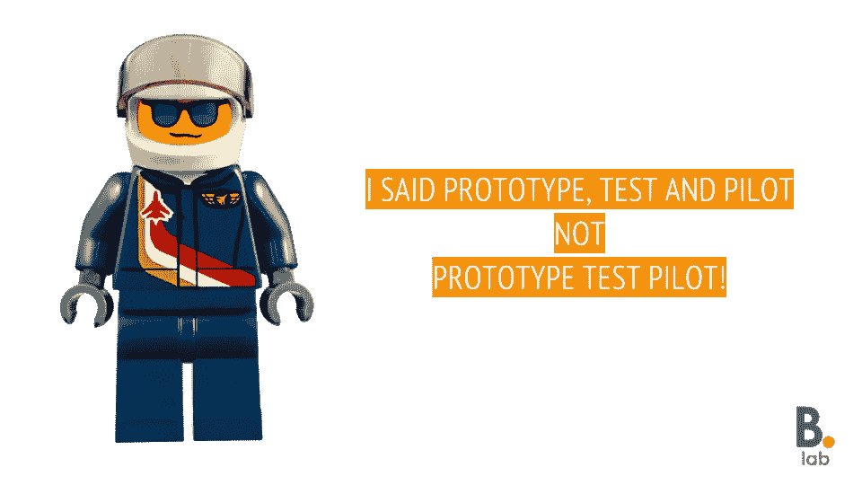
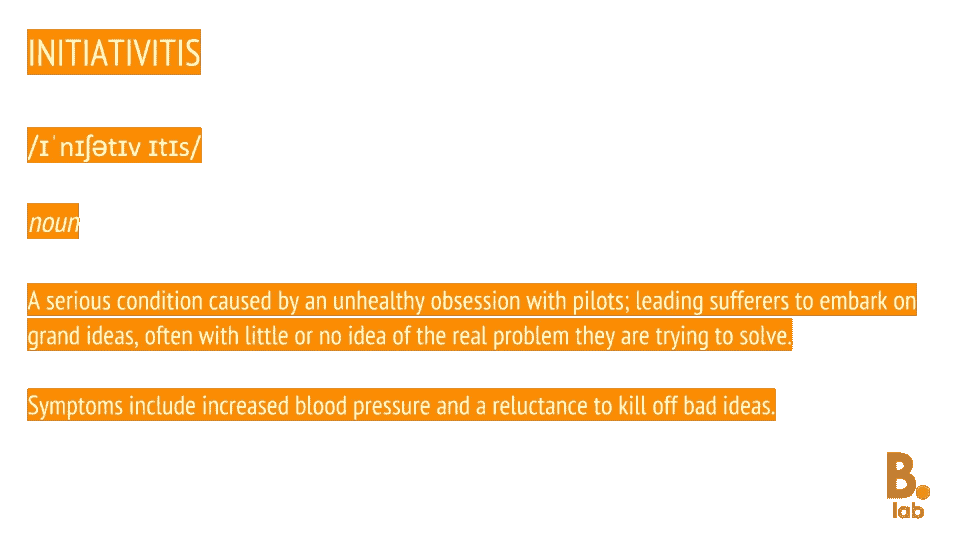
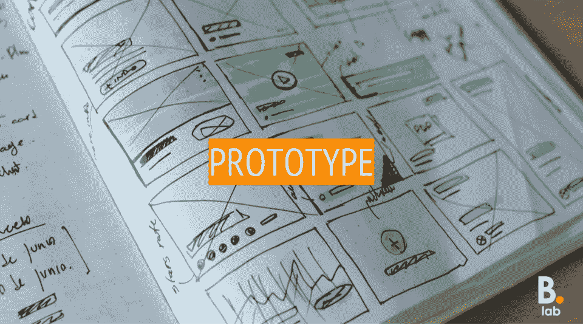
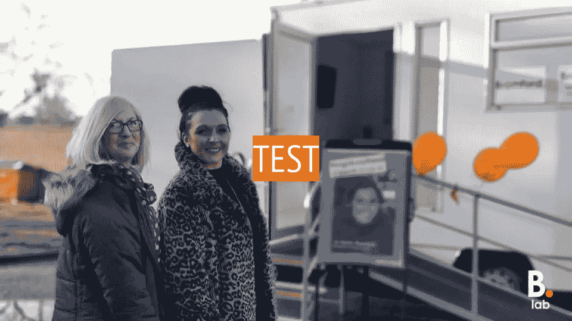
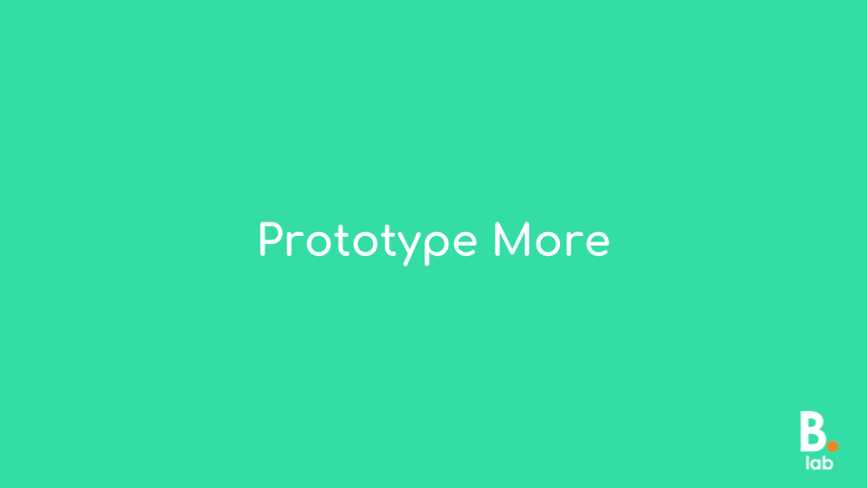

# 原型多，测试多，试点少。

> 原文：<https://medium.com/hackernoon/prototype-more-test-often-pilot-less-5bdf131fcac1>

## 原型、测试和试点有什么区别？

所以，让我从一开始就说，如果你碰巧看到这一页，想了解更多关于这个小家伙的信息，那你来错地方了。这不是一篇关于*原型试飞员*的博文，这是一篇关于原型、测试和飞行员的博文。更具体地说，原型、测试和试点之间的差异。

当我们对 2018 年进行[布罗姆福德实验室回顾时，我们看到去年最受欢迎的帖子实际上是](http://www.bromfordlab.com/lab-diary/2018/12/24/happy-holidays-lab-in-review-2018)[汤姆](https://twitter.com/ThomasHartland)早在 2015 年写的一篇名为[“测试和试点之间有什么区别？”](http://www.bromfordlab.com/labblogcontent/2015/7/22/tests-vs-pilots?rq=test%20and%20pilot)。基于汤姆的帖子持续受欢迎，这似乎是很多人都在问自己的问题。事实上，作为一个内部设计和创新部门，这是一个贴近我们内心的问题，所以我们认为，在新的一年开始时，我们可能会重温这个主题，并刷新我们对原型、测试和试点的定义。

该实验室存在的主要原因之一是为了减少布罗姆福德确诊的初始感染病例。在过去的几年里，我们与同事一起，通过引入结构化创新方法以及重复应用结构化设计流程(包括问题定义、原型制作、创意产生、测试和试点)等方式，实现了这一目标。尽管如此，我们仍然经常被问到这个问题——为什么？

> 为什么我们不能继续做事情呢？“为什么我们需要测试某些东西——出去试一试不是更快吗？”

提示闪烁的红灯和克拉克森。拉下百叶窗，封锁大楼——我们有一个急性倡议的病例！虽然看起来获得结果的最快方式是直接进行试点，但事实上，这种方式往往需要更长时间才能找到正确的解决方案，或者在极端情况下，甚至会导致糟糕的想法被放大。最好的方法是使用原型和测试来快速了解问题的更多信息，安全地失败，尽早扼杀坏主意，并快速前进。

“但是原型、测试和试点只是同一件事的不同说法，对吗？”

不，原型制作、测试和试运行是不同的工具，具有非常不同的目标和结果:

正如 Tom 在他的原始帖子中所述，虽然表面上他们可能感觉是一样的，但原型和测试在他们处理事情的方式上与飞行员几乎是截然相反的。

**原型制作**

原型是一种灵活的工具，可以在设计过程的不同阶段使用。在最基本的情况下，原型制作可以像在想法产生会议期间绘制草图或建模一样简单——创建一个“人工制品”来帮助创造性思维或帮助交流想法。但是原型也可以用来测试一个想法；不是通过创建一个更小的服务或产品的工作版本，而是通过测试许多不同的组成部分，甚至抽象地思考，以便开始揭示使用服务或产品的感觉。一般来说，原型是关于快速学习的，作为一种设计工具，它可以分为两个不同的类别:低保真度和高保真度。

**低保真度原型制作**

低保真度原型可以采取以下形式:

*   记事板制作
*   草图
*   建模(使用乐高或工艺材料——想想《回到未来》中[布朗博士的“粗糙”模型](https://www.youtube.com/watch?v=V6zPT8K_qaU))。
*   屏幕模型

低保真度原型制作快速、廉价且一次性，使得快速收集反馈和动态迭代概念成为可能。使用低 fi 原型可以让你用最少的时间和精力感受到一个服务或产品是如何工作的；关注设计的细节要晚得多，并且需要不同形式的测试。

**高保真原型制作**

高保真原型看起来更像一篇完成的文章，尽管就测试而言，它仍然是一种相当“快速和肮脏”的做事方式。不久前，我们与 [co-op digital](https://digitalblog.coop.co.uk/) 合作，帮助他们深入了解他们正在考虑开发的一项服务。我们设计了一套人工制品，让这项服务看起来真实，并花了一天时间在我们布罗姆福德的一个地方敲门。通过与人们谈论“服务”，并要求他们购买“看起来真实”的东西，我们获得了大量的知识，这导致了这个概念几乎立即被扼杀。不需要进一步的测试，更不用说试点了。co-op digital 团队反复思考，最终提出了一个完全不同的服务方案。

**测试(概念验证)**

测试更进一步。一旦原型有助于形成一个想法，测试可以用来获得概念证明(POC)；测试关于某物如何工作或使用的假设，主要目的是证明(或否定)一个解决方案是可行的。

测试是一种对问题进行更详细研究的方法，具有开放性和对变化做出快速反应的灵活性。从一个最初的假设开始，测试团队将一个测试计划拉到一起，并自由地改变和迭代这个概念，直到收集到足够的证据来满足所需的目标。然而，证据可以采取的形式各不相同，从较软的定性洞察到较硬的事实和数字。

测试的关键是从“刚好够用”的洞察力开始，并在过程中收集其余的信息。通常，试图在测试开始时将所有细节准备就绪意味着它永远不会起飞，或者更糟的是变成飞行员——而且是一个信息不灵通的飞行员。

测试有助于将你从思考的位置转移到了解的位置。

测试允许你在最小的洞察力的基础上获得一个松散的想法，并通过迭代和学习将它转化为一个健壮的提议；在安全可控的环境中测试一个概念的临界点。测试的结果是一个新的视角:

*   系统——什么样的组织结构和流程将支持服务？
*   人员—交付服务需要哪些角色、技能和行为？
*   信息——传达什么信息，采用什么格式？
*   物理—交付服务需要什么产品或环境？

**试点(最低可行产品)**

不是每个原型都可以进行测试，也不是每个测试都可以进行试点。原型和测试就像看门人一样，确保只有定义良好的概念才能进行试验。试点是在现实生活中检验想法的最佳方式。因此，试点的主要目的是更好地了解服务或产品将如何在现场使用。正如 Tom 在他的原始帖子中解释的那样，试点项目评估整个组合服务，并且通常在一个延长的时间框架内进行，这样你可以发现你在测试阶段可能错过的交互；重新加入“噪音”来看看你的想法是否站得住脚，同时也寻求发现结果的有力证据。

测试和飞行员的主要区别在于飞行员是静态的。一旦试点开始，服务或产品的工作方式就不能改变。与原型或测试不同，试点项目更多的是关于稳健的评估，而不是学习。中途改变试点项目的运作方式会危及评估的完整性。

Tom 最初帖子中的一些最重要的内容在今天仍然适用，就像最初写的时候一样:

*   不要陷入迷恋一次有多少飞行员在飞行的陷阱。
*   让更多笨拙的飞行员出现不是一种荣誉，而是不珍惜自己时间的表现。
*   未经评估，不得在业务中实施或扩展试点项目。
*   如果你不想让这个想法失败，那么一开始就没有必要尝试。

**原型多，经常测试，试点少**

原型将帮助你设计更好的测试，而更好的测试会带来更多的“[好的失败](http://www.bromfordlab.com/labblogcontent/2018/5/2/solving-world-peace-with-a-baby-a-st-bernard-a-satchel-the-learning-from-failure-roadshow)”、更少的资源浪费、更好的结果和更明智的飞行员。

随着新的一年的到来，往往会有一系列新的决心，所以今年为什么不忘记把钱浪费在你永远不会使用的健身房会员上，并下定决心在 2019 年只做三件简单的事情:

【www.bromfordlab.com】最初发表于**。**