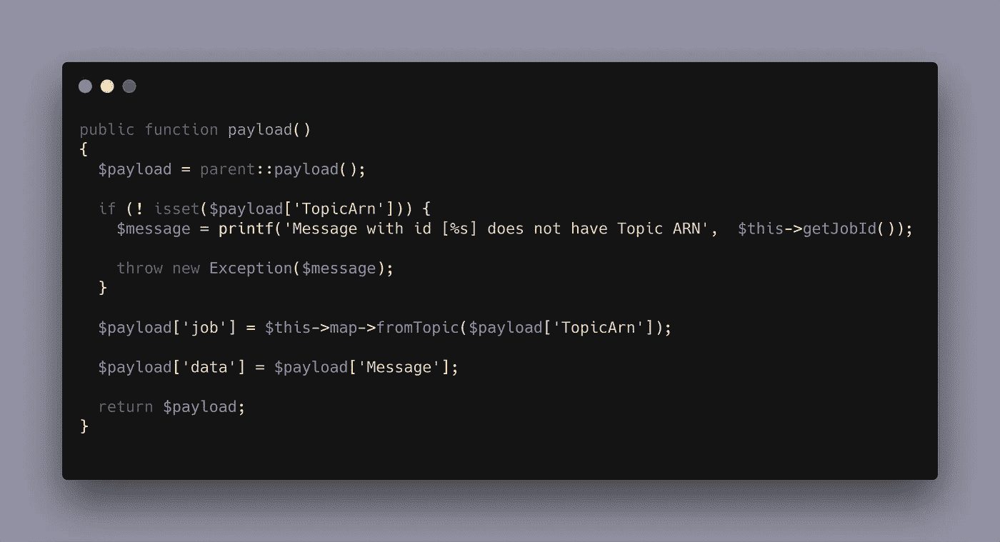

# 带有 AWS SNS、SQS 和 Laravel 的 Pub/Sub

> 原文：<https://medium.com/hackernoon/pub-sub-with-aws-sns-sqs-and-laravel-ed9f7e1bd79>

发布/订阅是建立微服务通信的一个很好的机制。通过专注于定义感兴趣的好的、可靠的主题，微服务可以来去自如，而不会破坏整个生态系统。AWS 提供了两个很好的服务来帮助构建一个高度可伸缩、可靠和可恢复的发布/订阅系统:**简单通知服务**和**简单队列服务**。

## 微服务通信简介

当服务 A 通过直接调用与 B 通信时，我们可以推断出 A 与 B 之间存在依赖关系。如果 B 暂时不可用或处于重负载下，可能会破坏 A 的稳定性。

编写耦合微服务通常意味着处理两个世界的最坏情况。相反，如果系统像一个整体一样建造，它将仍然是相互耦合的，但是没有分布式系统的问题。在 monolith 上，组件永远不会不可用或不可达，通信只需要一次函数调用或对象实例化。通过将两个服务分开，它们变得相互独立，代价是创建一个分布式系统。

对于发布者/订阅者系统，系统 B 有可能在没有直接耦合的情况下跟踪(或订阅)发生在 A 中的事件。发布/订阅系统成为一个代理，充当双方之间的契约。如果系统 A 开始衰退，它可以被一个更新、更智能、更好的版本完全取代，而不会影响 B，如果 A 发布的消息仍然可以被尊重或保持向后兼容的话。

## 为什么是 SQS？

AWS 简单通知服务是发布者通知事件发生的地方。该通知发生在主题为的**上。从此刻起，SNS 可以通过 **http** 、 **https** 、 **email** 、**短信**、 **sqs** 和 **lambda** 通知订阅者。有了 HTTP(S)协议，两个服务可以通过 SNS 相互通信，根本不需要 SQS。那么，为什么要把 SQS 扯进来呢？**

当使用 HTTP(S)作为 SNS 的订阅协议时，如果无法联系到订阅者或订阅者的响应出错，AWS 将提供重试。然而，这种模型所能达到的效果有相当大的局限性。如果订阅者有 bug 并且根本无法处理通知，就要特别注意。在补丁发布之前，可能会有大量通知丢失。但是，当订阅 SNS 主题的 SQS 时，AWS 将保证发送到 SQS。也许如果 SQS 的工人/消费者有一个错误，它将无法处理消息，但是消息可以在队列中停留长达 14 天，并且仍然可以被传递到死信队列。这种机制提供了一种更安全的选择，永远不会丢失消息。一些微服务的工作前提是消息总是可以被重放，但是如果一些订阅者已经处理了那些事件呢？当然，重放系统是一个有效的选择，只要订户是幂等的。对于本文，我将主要关注避免消息丢失。

## 拉勒韦尔工人报

Laravel 有一个开箱即用的队列系统，并提供了一个可以与亚马逊 SQS 通信的本地驱动程序。当向 SQS 推送消息时，Laravel 会在消息中存储足够的信息，使工人能够正确理解和处理*作业*(消息)。但是，当从 SNS 插入的 SQS 获取消息时，该消息将缺少`job`属性，工作系统使用该属性来知道要处理哪个作业。如果只有两个系统通过 SNS 进行通信，人们可能会认为发布者系统可以指定`job`键，这样 Laravel 订阅者就知道该做什么。不幸的是，这严重违反了发布/订阅系统，因为发布者需要知道订阅者的实现细节。它也不适用于两个或更多的订阅者，除非我们希望所有的订阅者都有相同的作业名称空间来处理主题事件。

为了解决这个问题，一个有趣的选择是将 SNS `Topic ARN`绑定到一个特定的工作类别。每当来自主题*用户认证*的新消息被发送到 SQS 时，Laravel worker 系统应该使用类`ProcessUserAuthenticatedJob`。为此，有必要创建一个定制的 Laravel 队列驱动程序。我决定把这个自定义驱动叫做`sns`，给人一种来自 AWS SNS(通过 SQS)的工作信息的感觉。

## 履行

在服务提供商中，我们可以在 Laravel 的容器上挂接一个`afterResolving`事件。这样，每当第一次从容器中解析出`QueueManager`类时，我们就可以确保向它添加我们的自定义驱动程序。

`JobMap`类负责将主题 ARN 映射到作业处理程序。

给名为`sns`的`QueueManager`的回调应该返回一个`Illuminate\Queue\Connectors\ConnectorInterface`的实现。在这里，我决定从`SqsConnector`扩展，以便利用 Laravel Worker 系统已经提供的`getDefaultConfiguration()`方法。除了借用那个方法之外，实际上并不需要这个继承。

按照 Laravel 的接口，队列连接器应该返回一个队列对象。因为我们希望处理来自 Sqs 的消息，所以从 Laravel 的`SqsQueue`对象继承并覆盖`pop`方法要容易得多。

使队列对象工作的其他东西已经从`SqsQueue`类中出来了。注意，我们已经从服务提供者加载了`queue.map`，将其发送到`SnsConnector`、`SnsQueue`，现在我们将它注入到`SnsJob`。

*注意:我们可以很容易地使用服务定位器/门面策略来从工作本身内部自动解析映射，我个人对此没有任何问题。但是，如果您在一个不喜欢 Facade 的多样化团队中工作，显式依赖注入允许作业类不依赖/耦合到外部资源。*

最后，使用`SnsJob`类，我们可以从 Laravel 提供的`SqsJob`扩展到默认的来自 Sqs 的工作消息的正常工作流，同时覆盖`payload`方法来注入`job`属性。这就是`queue.map`配置发挥作用的地方。每当特定的 Sns 主题向队列注入消息时，我们可以指示 Laravel 运行哪个作业。

## 试验

为了确保一切按预期运行，我们可以在本地利用 [localstack](https://github.com/localstack/localstack) 和`SQS`容器。配置 Localstack 超出了本文的范围，不在讨论之列。我想运行的测试看起来有点像下面的类。

`setUp`方法将消息推送到 localstack SQS 容器。测试蓝图可以翻译为:
- Arrange:在 Laravel 的配置系统
上的`queue.map`中添加 SNS 主题- Act:调用 Laravel 的队列工作者系统。
-断言:检查消息是否被正确获取。

`message.json`的内容可以在下面看到。

最后一个缺失的部分是`ProvidesSqs`特性，它有助于为我们需要的尽可能多的测试类设置 localstack 集成。

当`sendMessageToSqs`被调用时，它将:

*   创建一个 AWS Sqs 客户端。
*   在 localstack 上创建新的 Sqs。
*   清除队列，以防有来自先前测试的消息。
*   向队列发送消息
*   配置 Laravel 队列系统默认使用`sns`驱动。
*   将 Laravel 队列系统配置为处理来自该队列的消息。

就这些了。

## 结论

汇总所有内容，我们有:

*   向 AWS SNS 发布消息的外部系统。
*   订阅 SNS 主题的队列
*   一个 Laravel 项目对在后台处理这些消息感兴趣
*   为 Laravel Worker 创建新的`sns`驱动程序的服务提供商
*   组装工作者系统的 SnsConnector、SnsQueue 和 SnsJob
*   使用 localstack 编写测试的 ProvidesSqs 特征。

需要注意的一点是:您不能使用`sns`驱动程序将**消息推送到队列中。这是一个只读进程，它将依靠`TopicARN`键来决定运行什么作业。**

希望你喜欢这篇文章和技术细节。如果您有任何问题[请在德勒金的 Twitter](https://twitter.com/DeleuGyN) 上找到我。