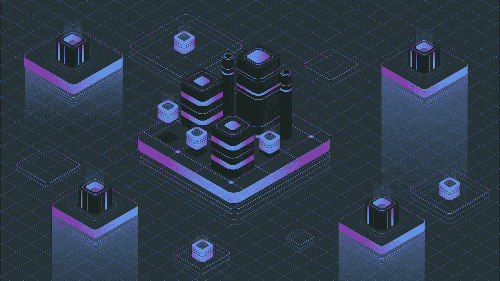
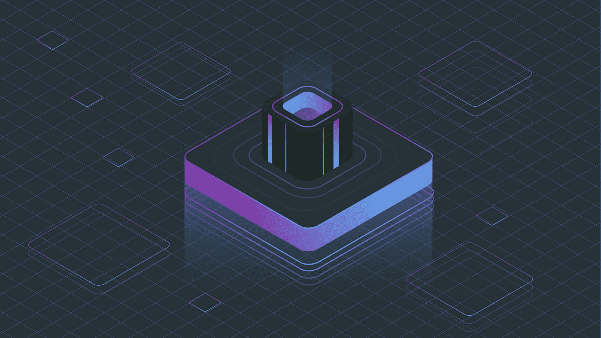

# 公共与私人区块链:妥协的理由

> 原文：<https://medium.com/hackernoon/public-and-private-blockchains-an-argument-for-compromise-6f6d74f77af6>

随着关于区块链的承诺是否会兑现以及何时兑现的辩论愈演愈烈，一场次级辩论正在酝酿，这场辩论的核心是区块链的去中心化本质。

一开始，区块链被设计成完全去中心化的、公众可访问的账簿，消除了那种可以给劣币贴上好标签、让全球经济陷入瘫痪的中介。它们被设计成透明和开放的价值交换工具，有望彻底改革金融交易，将数字货币推进到一个新时代。投资涌入，尽管 2018 年兴趣减弱，但普华永道报告称，2018 年前五个月 ico 融资 137 亿美元。

然后，人们意识到该技术可以应用于其他数据处理领域。事实上，尽管金融服务在 2017 年占所有区块链用例的 82%，但这一数字在 2018 年几乎减半至 46%(T2 高德纳)。不同行业的不同领导者开始意识到，通过利用区块链的分布式总账，他们可以为行业创造更好的互联环境，增加数据共享，这意味着增加价值。

事实上，最近的一份 Forrester 报告强调了这种互联的价值，该报告指出，企业可以从提高互联性的解决方案(如区块链)中获得 3 倍的投资回报。

然而，尽管数字显示了积极的一面，但并不是所有人都在区块链圈子里开心。

企业多年来积累的数据是他们的专利，也是有价值的商业秘密。分享可能意味着关心，但对于这些商业巨兽来说，向第三方和竞争对手开放他们的数据似乎更像是疯狂。但是也许有一种方法可以让企业利用区块链而不与更广泛的公众分享数据。区块链社区的一些人可能会生闷气，认为这意味着集中一项本来是去中心化的技术，但是，正如那句老话所说:你不可能一直取悦所有人(或者你能吗？).

> 于是就有了列兵区块链。

*“对于私有和许可，我会使用内部网类比，公共网络我会使用互联网类比，”* ***约翰·惠兰，桑坦德银行区块链实验室主任***

那么在实践中有什么区别呢？有些人把它比作内部网/互联网，但是当互联网带来如此多的价值而内部网几乎被遗忘的时候，私人区块链的价值在哪里呢？

随着数据成为新的石油，闭门造车提供有偿访问有很大的价值。甚至与私人生态系统的互联也可以通过促进更高效和有效的互动来加速增长，并在客户面前更快地推出产品。此外，允许网络成员访问数据意味着可以在一定程度上控制数据流，从而导致非法披露和发布到公共领域的罪责。

但有一个问题:私有链不是分散的，所以它回避了一个问题，为什么一个公司要引入一个私有的区块链而不是成熟的、遗留的数据库技术？在不支持互不信任的各方合作的情况下，实施区块链毫无意义，这本质上是一个私人区块链:受信任的各方被邀请参与其中，所有常规法律合同都在外部签署和执行。

虽然私有链是可扩展的，但它们很容易被非区块链科技公司取代。它们是为解决某一特定情况而创建的，但并不是完全分散的，它们不利于形成一个分布式互联网络。再一次，回到内部网/互联网的类比，私人区块链将永远是一种内部网，因为它们没有被设计成任何人都可以加入的大规模互联网络的一部分。

然而，在**混合许可环境**中存在增值，其中有一个开放访问的公共区块链，它与仅是会员的专有、私有区块链合并。

> *“公共链和私有链的互联实际上创造了一个非常强大的网络。每一条链都以指数级加强着另一条链。”* ***亚历克斯·巴特林，纽约梅隆银行的区块链牵头***

因此，事实证明，区块链能给企业带来的价值不是私有或公共网络的零和问题，而是介于两者之间。因此，总部设在区块链的平台需要努力提供解决方案，提供可整合的、灵活的网络，以满足企业私人和公共方面的需求。这可以通过在基础设施级别合并开放和关闭的区块链分类账来实现，以便支持公共和私人交易。Gartner 预测，这种公共/私有网络渗透可能还需要近十年才能实现。我认为，只要主流平台正在努力实现混合网络，就不需要太长时间。

**总有“但是”**

这里的问题是，仅仅创建混合网络并不能解决企业采用区块链的所有问题。业务需求决定了采用特定的解决方案不仅可以提高流程效率，还可以灵活地满足未来技术进步的需求，从而避免供应商锁定。

此外，如果某个区块链解决方案不能与遗留系统集成，那么说服公司通过转换到新技术来彻底检查他们的系统将是一个困难的壮举(如果不是不可能的话)。(在这里，我甚至不提各组织的部门如何能够提供有效和可接受的要点，说明它们如何以及为什么无法从目前的系统转换到以区块链为基地的系统。)。)

一般来说，新技术的集成分三个阶段进行:

1.  对照当前系统衡量
2.  并发运行并与当前系统集成
3.  完全切换到新系统

考虑到这些阶段以及供应商锁定风险，我们得出结论:可行的企业区块链解决方案不应该只是混合的公共/私有网络，还应该能够与当前的 IT 系统互操作，能够与现有的解决方案集成，并且经得起未来考验，能够与新的创新技术集成。

在这些问题得到解决之前，绝大多数区块链企业仍将处于试点或开发模式。此外，当企业可能会发现一种经过验证的遗留数据库技术可能是更好的选择时，他们应该采用私有区块链解决方案吗？正如其他网络一样，区块链网络提供的价值越大，参与的人就越多(梅特卡夫定律)。

很明显，互联性对企业至关重要，这是区块链网络的核心。然而，由于大多数基于区块链的应用程序目前只在专用网络上运行，互连的好处大大减少了。

这就是为什么最好的解决方案是介于两者之间的:一个折衷的混合解决方案，将公共和私有数据管理结合起来。

安德烈·朱琳是 Insolar 公司的首席执行官和联合创始人。

*Insolar 是一个开源的企业级区块链平台，支持公司之间的无缝交互和分布式信任驱动的新增长机会。*