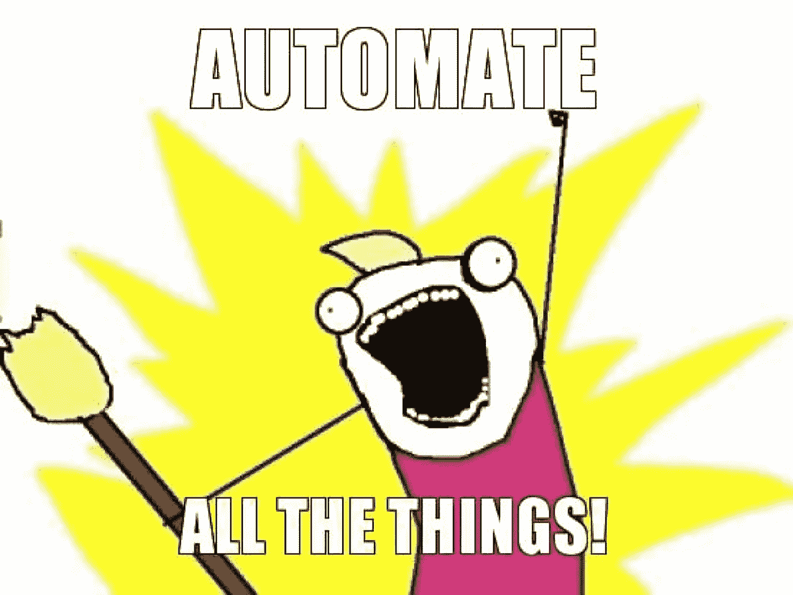
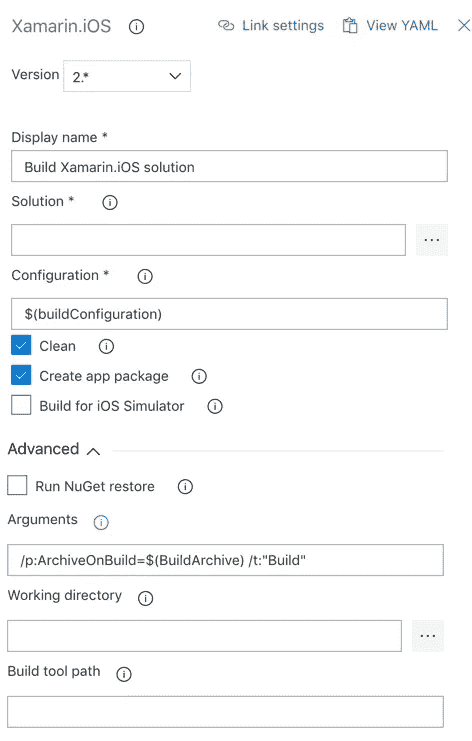
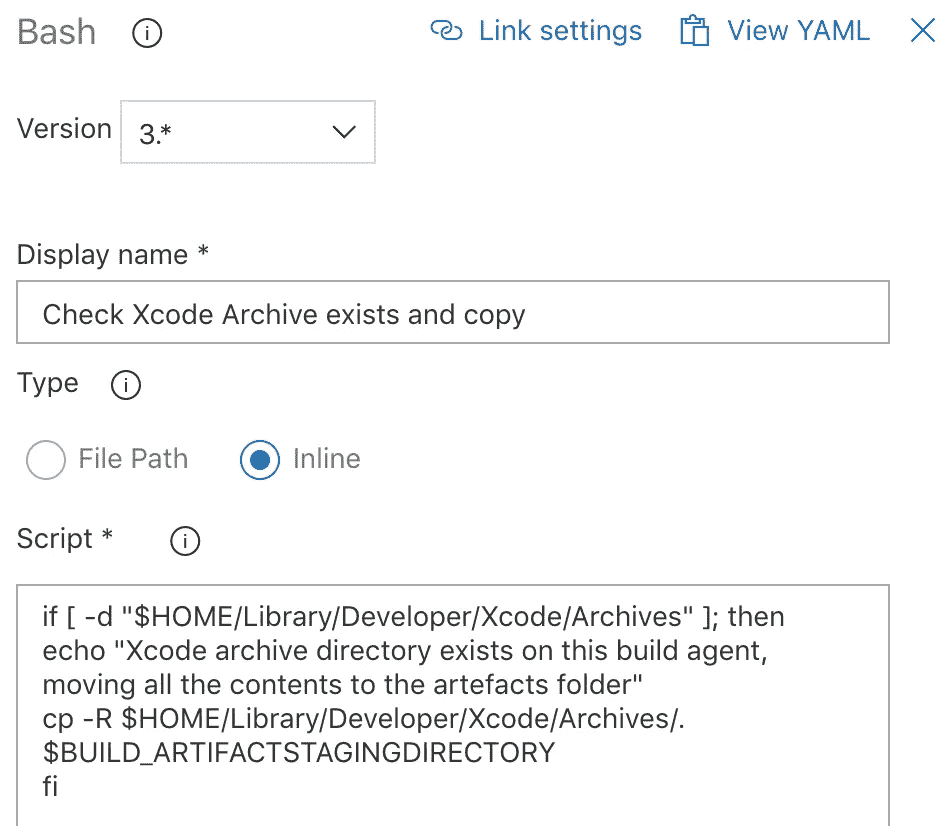
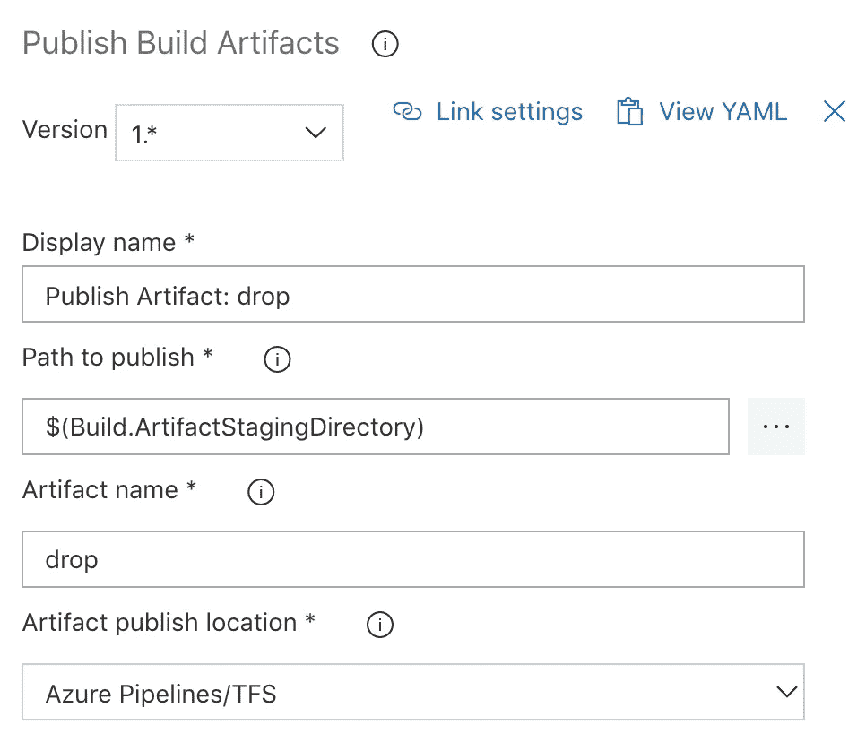
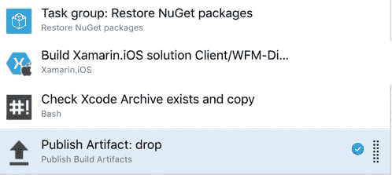
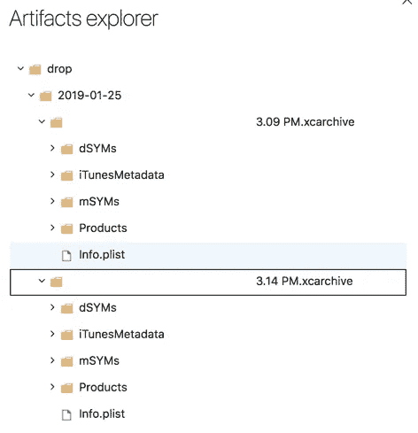

# 使用 Xamarin iOS 在 Azure Dev Ops 中发布 XCode 归档

> 原文：<https://medium.com/hackernoon/publishing-an-xcode-archive-in-azure-dev-ops-with-xamarin-ios-948190680b1f>

使用 Azure Dev Ops？有没有想过如何用 Xamarin iOS 发布 Xcode 归档，而不仅仅是 IPA？如果是这样的话，那么这个简短的指南会帮助你走向自动化的辉煌。



# 步骤 1-配置 Xamarin.iOS 任务以生成归档文件

首先，您需要一个指向您的解决方案文件的 Xamarin iOS 构建任务。一旦您构建了解决方案并生成了 ipa 文件，您将需要进一步定制这个构建步骤。下面的[链接](https://docs.microsoft.com/en-us/xamarin/ios/troubleshooting/questions/create-xcarchive)记录了定制您的构建命令以生成归档文件的过程，但是为了简单起见，让我们将其分解。

```
msbuild /p:Configuration=Release /p:ServerAddress=10.211.55.2 /p:ServerUser=xamUser /p:Platform=iPhone /p:ArchiveOnBuild=true /t:"Build" MyProject.csproj
```

您可以愉快地忽略所有参数，只有两个除外，它们是:

*   ArchiveOnBuild 是告诉 Microsoft Build (MSBuild)系统是否实际生成归档文件的主布尔值。
*   根据这个 [Xamarin 形成的](https://forums.xamarin.com/discussion/comment/156635/#Comment_156635)的“构建”将运行构建目标。显然，ArchiveOnBuild 命令对正在运行的目标有一些依赖性，因此必须将它作为一个额外的命令包含进来。

将此付诸实践，下面是一个截图和一个 Xamarin iOS 构建任务的相关 YAML，该任务将输出一个归档文件。您可能会注意到，我已经用一个用户变量定义了 ArchiveOnBuild 参数。这样做是因为我不需要一直生成一个归档文件，这可能会增加几分钟的构建时间。如果你短期内不会发布到 app store，只在你需要的时候配置它是值得的。



What the Xamarin iOS build task looks like in Azure Dev Ops

```
variables:
  buildConfiguration: 'Release'
  BuildArchive: 'false'
steps:
- task: XamariniOS@2
  displayName: 'YOUR_NAME_FOR_BUILD_TASK'
  inputs:
    solutionFile: 'YOUR_PATH_TO_SOLTION_FILE'configuration: '$(buildConfiguration)'clean: trueargs: '/p:ArchiveOnBuild=true /t:"Build"'
```

# 步骤 2 -将 XCode 档案从档案目录复制到工件文件夹中

现在您已经获得了由构建机器生成的 XCode 归档文件。是时候将它复制到您的工件文件夹中了，这样您就可以实际使用它了。为此，您需要在 Xamarin iOS 构建任务之后直接添加一个 bash 任务，下面是 bash 任务的 YAML。

```
steps:
- bash: |
   if [ -d "$HOME/Library/Developer/Xcode/Archives" ]; then
   echo "Xcode archive directory exists on this build agent, moving all the contents to the artefacts folder"
   cp -R $HOME/Library/Developer/Xcode/Archives/. $BUILD_ARTIFACTSTAGINGDIRECTORY
   fi
  displayName: 'Check Xcode Archive exists and copy'
```

下面是这个 bash 脚本的功能分解:

*   首先，我们检查归档目录是否确实存在于构建代理上。根据[文档](https://docs.microsoft.com/en-us/xamarin/ios/troubleshooting/questions/create-xcarchive)，“$ HOME/Library/Developer/Xcode/Archives”是 Xcode 档案的输出目录。这一步是有益的，因为它不会试图复制任何东西，如果你没有作出存档。
*   给定使用我们的自定义 MSBuild 参数构建的解决方案，此文件夹将存在。所以我们打印出我们正在做的事情，然后递归地将整个目录复制到我们的工件暂存目录。需要注意的重要一点是，由于云中的构建服务器不维护任何文件，因此这个目录中只有一个归档文件。如果您有一个自托管的构建代理，那么在此之后做一些清理是一个好主意，这样归档文件在每次运行之后都会被删除。



The bash build task for copying the xcode archive directory

# 步骤 3 -发布工件，然后检查文件夹

最后，您还需要一个任务来发布工件，下面是该任务的截图。



任务的顺序应该看起来像下面的截图。



最后运行构建。如果您遵循了上面的步骤，那么您应该有一个工件作为输出，它应该看起来类似于下面的截图。



瞧，你刚刚用 Azure Dev Ops 发布了一个 XCode 归档。您会从上面的截图中注意到生成了两个归档。这似乎是微软 Build 系统中一个目前尚未解决的 bug。