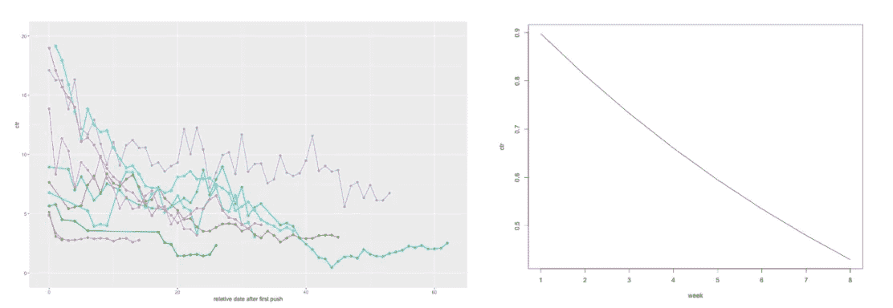

# 读者越来越不在乎你的通知

> 原文：<https://medium.com/hackernoon/push-notification-engagement-naturally-degrades-over-time-111a0d95e0b5>

## 不管信息内容如何，读者总是会溜走。

推送通知对于试图为其内容增加流量的出版商来说似乎是一份礼物。它们是一种免费的、直接的方式来建立品牌传播并接触他们的受众。

这自然导致出版商和营销人员应用增长黑客策略来最大化他们的回报。

但是，推送通知策略忽略了一个主要问题。

## 不管你的内容或策略如何，读者参与度自然会随着时间的推移而下降。

## 让我们回顾一下数据:

在发布平台 Marfeel，我们最近进行了自己的研究，查看了 10 家出版商超过 500 万条推送通知和 50 万名订阅者的点击率。

结果显示了一致的情况，时间自然会降低用户的参与度，几乎与所使用的策略无关。

这意味着每天的点击量更少，点击通知的可能性更低，而完全退订的可能性更高。

平均来说，从第一周到第五周，CTR 降低了一个系数 **0.4** 。也就是说，如果 CTR 在第一周是 **1%** ，在第五周是 **0.4%** 。

**这里是我们对实时发布者的实验结果，与我们理论上的平均降级率进行了比较。**

对于开发推送通知策略的发布者来说，这扭曲了他们试图衡量的画面。如果结果被你的用户天生的消极所拖累，你怎么能看出一个策略有多有效呢？

点击率等单一指标将因参与度的下降而扭曲。

例如，某个特定的消息可能会出现结果下滑。所以，你注意应用于这个信息的变量:时间，创造性的元素，文章的主题，并做出改变，应该给你不同的结果。

然而，除非考虑到自然的全球参与度下降，否则改变这些因素的结果仍不明朗——即使决策背后的战略实际上是正确的。

如果出版商或营销人员查看某个指标，如点击率，在你的受众中，随着时间的推移，你会看到一个奇怪的峰值和谷值模式，打断了总体的下降曲线。

消息发送给新订户的位置形成峰值。这些订阅者自然是更积极的读者，会打开更多的通知，使数量激增。随之而来的是参与度的下降，因为这些订阅者自然会对每条消息投入更少。

因此，除非你的新用户增长率高于自然下降率，否则这将呈现出整体参与度较低的趋势。

# 那么，读者为什么会失去兴趣呢？

读者失去了“通知的新颖性”。

新的颜色、新的品牌和一组新的通知最初会刺激用户的多巴胺反应。

然而，一旦这些通知变得熟悉，效果就降低了。第一条消息具有最高的回报潜力，但是随着用户接收到与他们不太相关的消息，回报也越来越少——这被称为负面预测错误——多巴胺信号就会减少。

此外，随着用户点击，他们开始更好地理解点击通知的预期个人价值。他们可以根据自己的兴趣立即判断标题的预期价值。他们学会浏览标题寻找关键信息，不点击通知就被动阅读。

“滑动退出”成为默认的学习行为。随着 cookies、GDPR 通知和订阅请求等屏幕通知和应用内通知的增加，移动用户通常会在阅读前清除通知。

一旦用户订阅了更长时间，他们对网站有了更好的导航知识，因此可以在没有通知支持的情况下找到他们感兴趣的故事。刷掉一个通知不会让读者损失任何东西。他们浏览了标题，所以他们知道主题，现在他们对网站很熟悉，可以很容易地导航找到它。

然后，高度参与的读者将已经通过另一个来源看到了内容。有多种渠道，一些通知的核心受众可能会在其他地方找到内容。

所有这些因素导致用户认识到——由于推送通知的不可预测性和变化性——他们不能每次都依赖它们来获取内容或价值。

这可能意味着他们已经找到了更有效的方法来从你的网站中找到他们想要的内容，而不是对不精确的通知感到不满。

# 对抗衰退

一个更清晰的测量系统的第一步是建立一个平均的降解率。然后，这必须与主动退订率相结合，并根据消息的点击率和每个用户每天的点击数进行分解。

这说明了这种自然下降，并提供了一个全面的新增读者群的观点，以及推送通知产生的价值。

有了这个价值，营销人员可以查看不同的推送通知策略，并清楚地了解他们的增长黑客策略所增加或减少的价值。

你可以点击阅读关于推送通知[价值的调查报告全文。](https://www.marfeel.com/push-notification-whitepaper?utm_source=blog%20post&utm_medium=Organic%20link&utm_campaign=MarfeelPush)