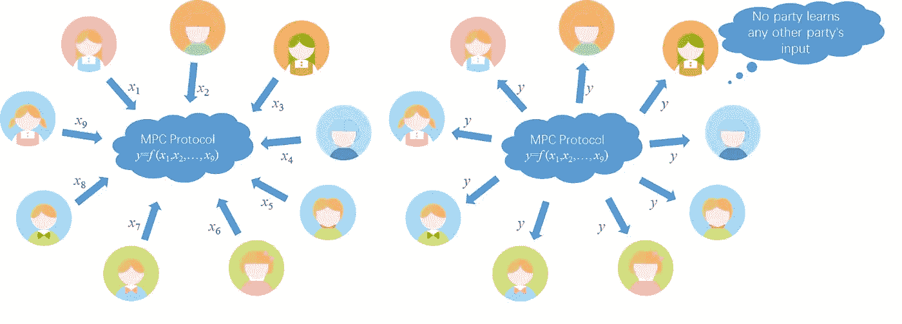
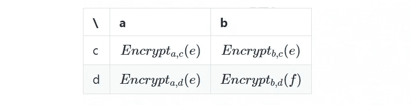
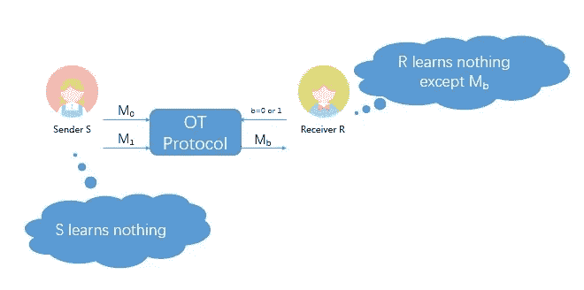
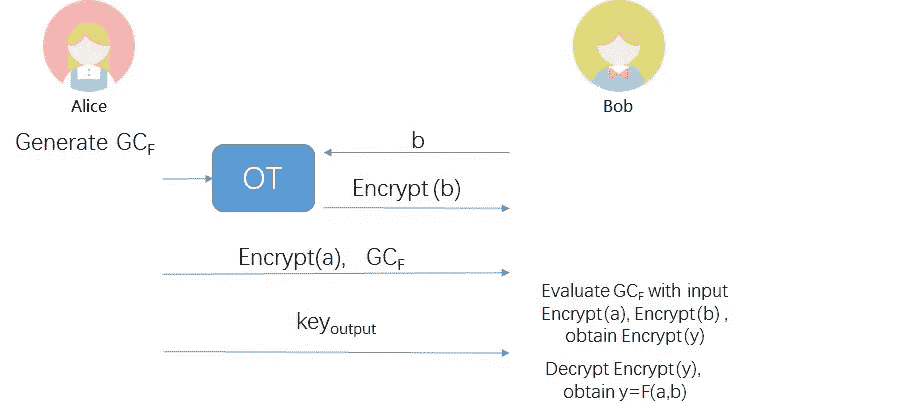
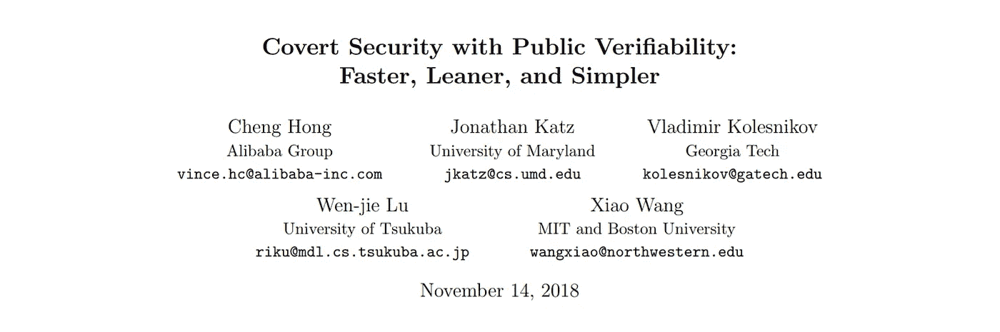

# PVC 安全:理性敌对者之间安全数据共享的无外交解决方案

> 原文：<https://medium.com/hackernoon/pvc-security-a-diplomacy-free-solution-to-safe-data-sharing-between-rational-hostiles-7c456c30b257>

*本文是* [***学术阿里巴巴***](/@alitech_2017/academic-alibaba-b56f4176a838) *系列的一部分，摘自*[*Eurocrypt 2019*](https://eurocrypt.iacr.org/2019/)*题为“具有公共可验证性的隐蔽安全:更快、更精简、更简单”的论文，作者是程虹、乔纳森·凯兹、弗拉基米尔·科列斯尼科夫、陆文杰和小王。全文可以在这里阅读***。**

*互不信任的各方如何合作以获得其集体数据的全部价值？*

*这是大数据时代一个中肯的问题。强大的计算能力提供了从数据中提取各种有价值见解的潜力，其价值足以让一些人宣称数据是新的石油。但就像石油一样，数据除非流动，否则无法产生价值。*

*大多数数据不流动，因为大多数公司对数据共享持高度谨慎的态度。出于数据保密性和个人隐私的考虑，他们这样做是正确的，但这意味着互不信任的各方无法获得通过联合分析他们的数据可以产生的洞察力。*

*因为没有人期望竞争的企业能很快解决他们的分歧，所以问题归结为一个技术问题:安全多方计算(MPC)协议。*

*为了解决这个问题，一个由阿里巴巴和几所美国和日本大学成员组成的国际研究小组提出了一个新的 MPC 协议，该协议提供了一种称为公共可验证秘密(PVC)安全的东西。PVC 安全要求敌对双方之间零外交；事实上，当工业间谍的机会在数据共享期间出现时，它利用了隐藏在不诚实行为背后的相同的私利。如果任何一方试图违反规则，它会自动生成一个可公开验证的不当行为证书，将该方的不可信任永久地暴露给世界。*

*研究小组声称，尽管其他 PVC 方法由于其高开销、庞大的证书和一般复杂性而未能流行起来，但他们更快、更精简、更简单的方法是第一个真正可行的解决方案。与此同时，世界知名的国际密码研究协会(International Association for Cryptologic Research)通过接受他们在 2019 年旗舰 Eurocrypt 会议上的论文，认识到了这项研究的重要性。*

*但是为什么一份不良信用证书首先是必要的呢？简单的答案是，虽然所有的安全协议都试图从一开始就使违反规则变得不可能，但它们在做到这一点的有效性方面受到限制。具体来说，“半诚实安全性”类别中的协议提供了高效的安全性，只要所有各方都遵守协议的规则，而“恶意安全性”类别中的协议可以防范最狡猾的安全性，但极难实现。*

*该团队声称，PVC 安全性是两个世界中最好的。它是一种半诚实的安全形式，可以抵御大多数攻击，并实现证书机制来抑制或惩罚最恶意的攻击者——只要他们只是恶意的，而不是虚无主义的。*

*为了理解这个团队为什么会达成这种技术妥协，有必要回到半诚实和恶意安全模型开始的地方:MPC 的基础。*

# *安全多方计算*

*1986 年，中国院士安德鲁·姚期智提出了一种安全多方计算(MPC)方法，用于代表多个互不信任方执行计算。MPC 允许各方提供他们的输入并接收最终输出，而无需查看其他各方的输入。原则上，这提供了一种从数据中获取价值的方法，而不必向第三方披露该数据。*

**

*With MPC, hostile parties can share insights without sharing their data*

*有两种实现 MPC 的方法:乱码电路(GC)和秘密共享。研究小组采用的解决方案是基于 GC 的。*

## *混乱的电路*

*任何计算功能最终都由电路(加法器、乘法器、移位器、选择器等)来表示。)在计算机语言中，并且这些电路可以仅由 and 和 XOR 逻辑门组成。*

*门实际上是真值表。例如，与门的真值表是:*

**

*在此示例中，右下角的单元格指示如果两条输入线的值都为 1，则输出线的值=1(即 1 和 1 = 1)。*

*现在，假设每条线路都用不同的密钥加密。真值表现在看起来像这样:*

**

*在这个例子中，右下单元格表示如果 gate 输入是 *b* 和 *d* ，那么加密的 *f* 就是输出(密钥是 *b* 和 *d* )。从控制流的角度来看，这个门保持不变；唯一的区别是输入和输出都是加密的，只有使用相应的输入才能解密输出。解密的 f 也可以用作后续门的输入。*

*正是这种加密方法被称为乱码电路。通过使用这种方法按顺序加密电路中的所有门，实现了表示为 GC 的功能。该函数接收加密的输入并输出加密的结果。*

*假设甲乙双方分别提供数据 *a* 和 *b* ，并希望安全地计算一个约定的函数 *F* ( *a* ， *b* )。基于 GC 的安全两方计算协议过程可以描述如下:*

*1.A 加密 F 得到 GC 表示的函数“ *GCF* ”(注意 A 是电路的生成器，所以知道每根线的密钥)；*

*2.a 在步骤 1 中使用相应的线密钥加密其输入“ *a* ”，以获得*加密*(a)；*

*3.a 发送 Encrypt( *a* 和 *GCF* 给 B；*

*4.a 使用步骤 1 中对应的线密钥对 B 的输入“ *b* 进行加密，得到 *Encrypt* ( *b* )，并将 *Encrypt* ( *b* )发送给 B；*

*5.b 有一个完整的 GC 和所有的输入，所以它可以运行电路获得一个加密的输出；*

*6.a 将输出线的密钥发送给 B，B 解密得到最终结果 *F* ( *a* ，*B*)；*

*7.如果 A 需要，B 再发送 *F* ( *a* ， *b* )给 A。*

*细心的读者可能会问，为什么在步骤 4 中，A 会遇到 B 的输入“ *b* ”。这不是违反安全多方计算吗？*

*答案是肯定的——除非你实现了一种叫做“不经意传输”的东西。*

# *遗忘转移*

*遗忘转移(OT)可以被认为是解决看似不可能的难题的一种手段，在这种情况下，双方希望参与交易，但不愿意分享促进交易所必需的敏感信息。*

*假设一家旅行社有关于 n 个景点的旅游信息，度假者 Joe Bloggs 想参观景点 a。Joe 想从旅行社购买一些相关资料，为他的旅行做准备。但他担心自己的隐私，不想向旅行社透露他要去哪里。*

*换句话说，双方都希望交易可以在以下隐私条件下进行:*

*1.乔没有向旅行社透露消息“我要去景点 A”。*

*2.旅行社只提供乔付费的景点 A 的信息，而不透露其他可用的信息。*

*这些条件似乎不可能满足。如果旅行社专门向乔提供关于景点 A 的信息，则它将隐含地理解乔可能会参观该景点。除了让 Joe 购买所有可用景点的信息之外，保护 Joe 隐私的唯一方法是让旅行社向他提供所有信息，使他不必指定景点。但这当然违背了该机构的利益。*

*OT 提供了一种允许交易在规定条件下进行的方法。在 OT 协议下，旅行社使用双方约定参数的加密算法对其拥有的 *n* 条数据进行加密，然后发送给乔。乔可以从密文中解密出与景点 A 相关的数据，但是不能解密出剩余的( *n* -1)条数据。*

*下面以 *n* =2 为例，描述基于 Diffie-Hellman 密钥交换协议的“1/2”OT 实现方法。在这个例子中，S(发送者)是旅行社，R(接收者)是 Joe Bloggs。s 拥有两个数据( *M* 0 和 *M* 1)，R 希望获得 *M* 0。*

*1.s 偷偷生成一个随机数*a*；r 偷偷生成一个随机数*b*；*

*2.s 发送 *A=ga* 给 R；r 发送 *B=gb* 给 S；*

*3.s 计算出 *k* 0= *Hash* (Ba)，*k*1 =*Hash*(*B*/*A*A)；*

*4.s 用 *k* 0 加密 *M* 0，用 *k* 1 加密*M*1:*e*0 =*encrypt k*0(*M*0)，*e*1 =*encrypt k*1(*M*1】1)，然后发送 *e* 0*

*5.给定 *B* a = Ab，R 可以获得 *k* 0 并解密 *M* 0，但 R 无法计算 *k* 1，因此无法解密 *M* 1。*

*如果 R 希望获得 *M* 1，他只需要在步骤 2 中将 *B* = *g* b 修改为 *B* = *Ag* b 即可。*

**

*Oblivious transfer: everyone is happy, while none are the wiser*

# *不经意传输的乱码电路*

*回顾一下上面 GC 计算中的问题步骤:*

> *在步骤 1 中，a 使用相应的网络密钥对 B 的输入“B”进行加密，以获得 Encrypt(b ),并将 Encrypt(b)发送给 B*

*这可以用 OT 安全地解决，其中 A 扮演发送者，B 扮演接收者。b 从 A 处获得*加密* ( *b* )，但没有向 A 公开 *b* 的内容，如下图所示:*

**

# *从混乱的电路到 PVC*

*上面只描述了 GC 最原始形式的基础知识。实际上，对于 GC 存在许多优化，包括点置换、自由 XOR 和半门，近年来，基于 GC 的解决方案几乎已经达到可以有效实现的程度。例如，使用基于 GC 的安全 MPC 可以在 1.5 秒内计算出两个百万维向量的汉明距离，而相关双方之间不共享任何内容。*

*然而，GC 确实存在安全问题，其中一些甚至可以从上面描述的例子中观察到。*

## *“半诚实”GC 的缺点*

*敏锐的观察者可能已经注意到前面给出的例子中的以下问题:我们如何确保 A 给 B 的 *GCF* 是正确的 GC？*

*比如，假设 A 和 B 要比较 *a* 和 *b* 的大小，约定 *F* ( *a* ，*B*)=*A*>*B*？1:0.恶意的 A 可以简单地让另一个函数 F’(例如*F’*(*A*， *b* )输出 *b* 的最左边的位，这侵犯了 B 的隐私。由于函数是使用 GC 发送给 B 的，B 没有办法检测到违例。*

*这个问题是 a 方面的恶意行为之一。GC 依赖于符合半诚实行为模型的所有参与者，由此他们将忠实地根据协议步骤执行过程——最多根据他们可以推断的内容推测其他方的私有数据，但永远不会获得它。打个扑克游戏的比方，半诚实的玩家可能会试图从自己的牌中推断出别人的牌，但仍会遵守游戏规则。*

*另一方面，一个恶意的扑克玩家会使用他们可以使用的所有手段，例如非法交换他们的牌，甚至偷别人的牌，试图赢得游戏。*

*以前优化 GC 以产生恶意安全模型的解决方案已经破坏了它的效率。最快的基于 GC 的恶意安全解决方案需要超过 10 秒来计算两个百万维向量之间的汉明距离，这比等效的半诚实解决方案慢 7 倍，使得在处理大规模数据时几乎不可能实现。*

*然而，恶意玩家确实存在。出于这个原因，PVC security 从恶意行为模型中借用概念来产生一个半诚实的解决方案，激励参与者遵守规则。*

## *PVC 妥协的理由*

*PVC 的关键创新在于，对于每个参与者的每个动作，都会生成一个可公开验证的类似签名的机制。*

*这是基于这样的想法:如果一个参与者恶意行为，则有λ的概率被其他参与者发现。λ被称为“威慑因素”，原因是如果其他参与者发现恶意行为及其签名，他们很有可能会将其公之于众，导致犯罪者遭受名誉损失。*

*考虑到声誉对数据所有者的重要性——如果他们的不当行为被公开，他们可能再也无法与其他人合作——50%的威慑力被认为足以阻止理性方做出错误行为。*

# *PVC 完美*

*PVC 模型最初是由 Asiacrypt 2012 的学者提出的。一些学者在 2015 年亚洲加密会议上提出了改进版本，但这些版本不仅效率低下，而且只提供了复杂的理论描述，距离实际实施还有很长的路要走。*

*该研究小组的新 PVC 解决方案提供了一个简洁的协议和完整的代码。至关重要的是，它在没有重大性能损失的情况下做到了这一点，声称计算两百万维向量的汉明距离只需 2.5 秒。*

*再次假设两个参与者 A 和 B 分别提供数据 *a* 和 *b* ，并且希望安全地计算约定的函数 *F* ( *a* ， *b* )。还假设威慑因素λ = 50%。团队的 PVC 方案将按如下方式工作:*

*1.a 选择两个随机种子 *s* 1 和 *s* 2。b 和 A 运行 OT 随机选择其中一个。(为论证起见，假设 B 获得*s*1)；*

*2.a 分别使用 *s* 1 和 *s* 2 生成 *GC* 1 和*GC*2；*

*3.B 和 A 运行 OT 来获得 B 在 *GC* 1 中输入线的加密值(如步骤 8 所述， *GC* 1 将不被使用。因此，这里的加密线路不一定对应于 *b* 。例如，它们可以固定为常数值)；*

*4.B 和 A 运行 OT 得到 B 在 *GC* 2 中输入线对应的 B 的加密值；*

*5.a 散列 *GC* 1 并将散列发送给 B；*

*6.a 散列 *GC* 2，并将散列发送给 B；*

*7.a 在上述所有过程笔录上签名，并将签名发送给 B；*

*8.由于 B 有 *s* 1，所以可以自己生成 *GC* 1，可以自己模拟步骤 3 和 5。如果结果与 A 发送的不一致，则公布相关签名作为 A 恶意动作的证据，如果一致，则使用 *GC* 2 进行真计算。*

*如果 A 恶意行为，总有 50%的概率被 B 抓出来，因为 A 不知道 B 手里是哪个 GC 种子。因此，理性的 A 会选择不恶意行为，而是忠实地实现安全多方计算协议。*

**

*本文只在非常基础的层面上讨论相关的技术概念。感兴趣的读者可以通过阅读全文[这里](https://eprint.iacr.org/2018/1108.pdf)了解更多。*

# *进一步阅读*

*[1]姚. A.C .如何产生和交换秘密.FOCS 1986 年:162-167*

*[2] Asharov G，Orlandi C.《呼唤骗子:具有公共可验证性的秘密安全》。密码学进展—2012 年亚洲加密会议。施普林格柏林海德堡，2012。*

*[3]科列斯尼科夫五世，马洛泽莫夫一 j .公开可验证性在隐蔽模式中(几乎)是免费的。密码学进展——ASIACRYPT 2015。施普林格柏林海德堡，2015。*

# *阿里巴巴科技*

*关于阿里巴巴最新技术的第一手深度资料→脸书: [**“阿里巴巴科技”**](http://www.facebook.com/AlibabaTechnology) 。推特: [**【阿里巴巴技术】**](https://twitter.com/AliTech2017) 。*