# Python 和金融:如何提升你的电子表格

> 原文：<https://medium.com/hackernoon/python-and-finance-how-to-level-up-your-spreadsheets-176682508370>

Source: [Toptal](https://www.toptal.com/finance/financial-modeling/python-and-finance)

> “对于长期依赖电子表格的职业来说，Python 尤其有价值。美国银行花旗集团为其见习分析师推出了 Python 速成班。 *—* [经济学家](https://www.economist.com/science-and-technology/2018/07/19/python-has-brought-computer-programming-to-a-vast-new-audience)

财务专业人员早就可以在 Excel 中使用[VBA(Visual Basic for Applications)](https://docs.microsoft.com/en-us/office/vba/library-reference/concepts/getting-started-with-vba-in-office)来构建定制功能和自动化工作流。随着近年来 Google Sheets 成为电子表格领域的重要竞争者， [Google Apps 脚本](https://developers.google.com/apps-script/overview)现在提供了一个额外的选择。

然而，我想提请注意第三种选择，[Python 编程语言](https://www.python.org/about/)，它已经在许多领域变得非常流行。

在本文中，我将提供一些使用 Python 可以完成的工作的例子，首先是对该语言本身的概述，以及为什么它在如此广泛的领域中如此受欢迎，包括 web 开发、机器学习、金融、科学和教育等等。第二部分将由一步一步的教程组成。

我写这篇文章的目的是帮助你决定 Python 是否足够吸引你，让你考虑把它加入你的财务工具箱。如果你迈出这一步，有许多应用程序、课程、视频、文章、书籍和博客文章可以用来学习这门语言。在文章的最后，我列出了一些对我有帮助的资源。

# 用例:我使用 Python 的例子

我对编程的入门是在 20 世纪 80 年代中期在 Oric 1 上学习 BASIC。那时，BASIC 是最常见的初学者语言。我在 80 年代末至 90 年代中期涉猎的其他语言是 Pascal 和 C，但我从未以任何专业身份使用过它们，我也没指望需要或使用编程技能。据我所知，在 90 年代末，金融和编程是非常不同的领域，当时我选择走上金融职业道路。

时间快进到 2012 年，我希望重新把编程作为一种爱好，所以我开始研究当时可用的语言。事实证明确实发生了一些事情，当我遇到 Python 时，我就被它迷住了，原因有很多，我将在下一节概述。从那时起，我就用 Python 完成了从小型脚本到大型项目的各种任务，包括个人任务和专业任务。许多人(但不是所有人)都使用过电子表格，这是许多金融专业人士的工作台。

以下是电子表格和 Python 如何完美结合的几个例子:

# 1.在 M&A 集成 PMO 设置中跟踪数百项活动

我负责 M&A 交易的方方面面，不仅仅是执行，还有整合。在最近的一个案例中，PMO 团队决定采用混合的计划和项目管理方法，对 12 个集成工作流中的每一个工作流使用瀑布计划和甘特图，此外还使用看板来跟踪在第一个 100 天计划及以后的任何给定时间进行的数百项活动。我们选择的看板工具 [MeisterTask](https://www.meistertask.com/) 具有许多统计和报告特性，但是我们的需求超出了分析和展示的范围，这需要一个定制的解决方案。这是我用 Python 自动化的工作流程:

1.  每周将整个电路板的状态保存为 CSV 文件。
2.  将所有历史 CSV 文件读入[熊猫数据帧](https://www.tutorialspoint.com/python_pandas/python_pandas_dataframe.htm)。
3.  对数据进行分类、过滤、分组和处理，使之成为我们希望跟踪进度的商定格式(按活动状态、工作流程等)。).
4.  将输出结果写入 Excel 文件，将每次分析的数据放在自己的表格中，格式化后可以简单地复制并粘贴到[智库](https://www.think-cell.com/en/)图表中。
5.  为每月指导委员会会议的报告包创建表格和图表。

开发脚本需要几个小时的前期投资，但现在，为指导委员会会议或特别分析更新报告包只需几分钟。从字面上看，大约 30 秒的时间转到正确的文件夹，用一行命令运行脚本，然后用几分钟的时间将输出复制粘贴到幻灯片中。12 个工作流中的大约 500 个活动(卡片)已经执行了大约一个月，每周跟踪它们是如何移动的，在两年的计划时间线内，您很快发现自己要处理几十个文件中的数千个，最终是数万个数据点。如果没有自动化，我们在这里谈论的是一些非常繁琐的任务。

“金钱的时间价值”权衡是继续工作，还是通过设置自动化来增加更多的初始工作量，这是金融界的一个常见主题。在这个过程的第一步，我做了一个类似的决定，将数据导出为 CSV 文件。MeisterTask 像许多现代 web 应用程序一样，[有一个 API](https://www.meistertask.com/blog/meister-news/2017/06/07/introducing-meistertask-api-beta/) ，它可以连接到您的 Python 应用程序，但是设置它所花费的时间将远远超过我们在这里的用例所节省的时间。

因此，如您所见，最佳解决方案通常是自动化工作流程的某些步骤，而让其他步骤保持手动。

# 2.使用网络抓取、谷歌地图 API 和 Excel 分析房价统计数据

另一个例子是我出于个人兴趣做的，但我想强调一下，因为它包含了 Python 实用程序的一些其他有趣元素:

1.  收集给定区域的房地产列表数据，包括地址、大小、房间数量、要价和其他特征；总共几百到一千行。
2.  保存到 Python 数据结构中。
3.  连接到 Google Maps API，对于每个列表，检索酒店和关键地标之间的距离，例如大海、市中心、最近的火车站、最近的机场等。
4.  将数据导出到 Excel 文件。
5.  使用标准 Excel 功能运行[回归](https://www.toptal.com/finance/real-estate/real-estate-valuation)，计算统计数据，并根据标准指标(如每平方米价格和到地标的距离)创建图表。

在寻找房地产时，这里的结果可以与你个人的偏好和财务限制相结合。

这只是两个例子，重点是自动化电子表格相关的工作和添加特性，但是使用 Python 的机会几乎是无穷无尽的。在下一节中，我将概述它变得如此流行的原因，然后继续学习 Python 中一步一步的蒙特卡罗模拟教程。

# 为什么 Python 是金融专业人士的最佳选择

编程语言 Python 从 1990 年就有了，但直到最近几年才开始流行起来。

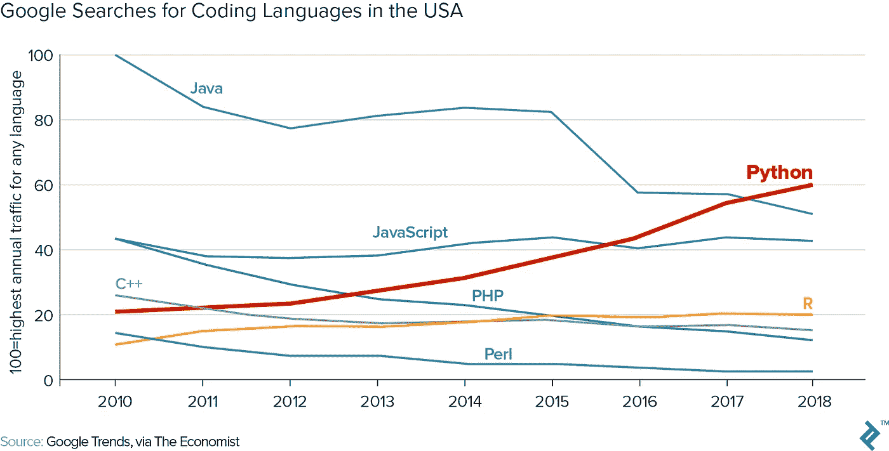

这有几个原因，我们依次来看每一个。

# 1.Python 是一种高级编程语言

高级编程语言是一种抽象出计算机内部工作的许多细节的语言。一个很好的例子就是内存管理。除了处理任务所需的时间和代码行之外，低级编程语言还需要详细了解计算机内存如何布局、分配和释放的复杂性。Python 自动抽象和处理这些细节，让您专注于您想要完成的事情。

# 2.它很简洁

因为 Python 是一种高级编程语言，代码更加简洁，几乎完全专注于你想要实现的业务逻辑，而不是技术实现细节。语言设计的选择促成了这一点:例如，Python 不需要像许多其他语言那样使用花括号或分号来描述函数、循环和行，这使它更加简洁，而且正如一些人所认为的那样，提高了可读性。

# 3.易于学习和理解

影响 Python 语言设计选择的一个观察结果是，程序被阅读的次数比它们被编写的次数多。Python 在这方面表现出色，因为它的代码看起来非常接近普通英语，特别是如果你以一种明智的方式命名脚本或程序的不同组件。

# 4.适合快速、迭代开发

> "开明的尝试和错误胜过完美无瑕的智者的计划." *—* [大卫·凯利](http://rajeshsetty.com/2007/08/02/quotes-worth-recording-david-kelley/)

Python 是原型开发和快速迭代开发(是的，试错法)的理想选择，因为交互式解释器工具，如 Python shell 、 [IPython 和 Jupyter notebooks](https://ipython.org/) 是 Python 工具链的前端和中心。在这些交互式环境中，您可以独立地编写和执行每一行代码，并立即看到结果(或有用的错误消息)。其他语言也有这种情况，但是大多数情况下[没有 Python](https://nedbatchelder.com/blog/201803/is_python_interpreted_or_compiled_yes.html) 的程度高。

# 5.可用于原型开发和生产代码

除了非常适合原型开发之外，Python 还是大型生产应用程序的优秀且强大的语言。世界上一些最大的软件公司在各种应用程序和用例中大量使用 Python。

# 6.附带“包含电池:”Python 标准库

基本操作所需的一切都内置在该语言中，但除此之外， [Python 标准库](https://docs.python.org/3/library/)还提供了处理文件、媒体、网络、日期和时间信息等更多内容的工具。这允许您完成各种各样的任务，而不必寻找第三方软件包。

# 7.用于财务分析的优秀第三方库

对于金融专业人士来说，拥有*数据框架*和*系列*对象的 Pandas 和拥有 *ndarray* 的 Numpy 是使用 Python 进行金融分析的主力。与 matplotlib 和其他可视化库相结合，您可以使用很好的工具来提高工作效率。

# 8.Python 是免费的！

Python 是在开源许可下开发的，这使得它也可以免费用于商业用途。

# 一起使用 Python 和 Finance 的分步教程

接下来是一个循序渐进的教程，展示了如何创建一个简化版的蒙特卡洛模拟，这在我之前的博客文章中有所描述，但是使用 Python 而不是 Excel 的@RISK 插件。

蒙特卡罗方法依靠随机抽样来获得数值结果。一个这样的应用是从表示世界的不确定潜在未来状态的概率分布中抽取随机样本，其中变量或假设可以取一系列值。

在一个简化的 DCF 估值模型上进行蒙特卡洛模拟是有帮助的，而不是你看到的更常见的显示期权或其他衍生品估值的例子，因为对于这一点，除了计算财务报表和贴现现金流的基础知识之外，我们不需要任何数学，这使我们可以专注于 Python 的概念和工具。请注意，这个基本的教程模型是为了说明关键概念，并没有任何实际用途。我也不会触及蒙特卡罗模拟的任何更学术的方面。

本教程假设您熟悉编程的基本构件，如变量和函数。如果没有，花 10 分钟检查一下例如[本简介](https://www.learnpython.org/)中的关键概念可能会有所帮助。

# 起点和期望的结果

我从蒙特卡洛模拟教程中使用的非常简化的 DCF 估值模型开始。它有三份财务报表中的一些关键行项目，以及三个突出显示的输入单元格，在 Excel 版本中，这些单元格有点估计值，我们现在希望用概率分布来替换，以开始探索潜在的结果范围。

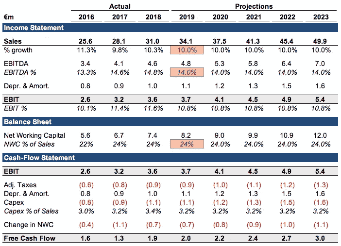

# 开发小脚本的两步法

> “让它工作，让它正确，让它快速”*——*[肯特·贝克](https://en.wikipedia.org/wiki/Kent_Beck)

本教程的目的是给刚接触 Python 的金融专业人士一个介绍，不仅介绍一个有用的程序可能是什么样子，还介绍你可以用来开发它的迭代过程。因此，它有两个部分:

1.  首先，我使用一种简单的方法开发了一个工作原型，我认为这种方法很容易遵循，并且不完全不同于如果你从零开始的话可以用来启动这个项目的过程。
2.  然后，在开发了工作原型之后，我会经历重构的过程——改变代码的结构而不改变它的功能。您可能想继续使用这一部分——这是一个比第一个更好的解决方案，另外，在执行时间方面，它快了大约 75 倍。

# 1.开发工作原型

# 设置 Jupyter 笔记本

Jupyter notebook 是一款非常棒的交互式 Python 工具。它是一个交互式 Python 解释器，其单元可以包含代码、降价文本、图像或其他数据。对于本教程，我使用了 [Python Quant 平台](https://pqp.io/)，但是我也可以推荐[Google](https://colab.research.google.com/)的合作实验室，它是免费的，运行在云中。到了那里，只需在“文件”菜单中选择“新 Python 3 笔记本”，就可以开始了。

完成后，下一步是导入我们进行数据操作和可视化所需的第三方包，并告诉程序我们希望在笔记本中看到内嵌的图表，而不是在单独的窗口中:

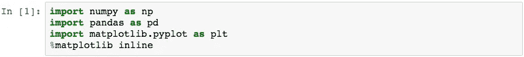

在我们开始命名第一个变量之前，需要注意一点。正如我已经强调的，可读性是 Python 的优势之一。语言设计对支持这一点大有帮助，但是每个编写代码的人都有责任使代码可读和可理解，不仅是对他人，也是对他们自己。正如伊格尔森定律所说的，“任何你自己的代码，如果你已经六个月或者更长时间没有看，就像是别人写的一样。”

一个很好的经验法则是以这样一种方式命名程序的组件，即最大限度地减少对解释程序功能的单独注释的需求。

记住这一点，让我们继续前进。

# 创建财务报表

在 Python 中，我们可以通过多种方式处理现有的电子表格数据。例如，我们可以使用`read_excel`命令，用一行代码将一张表读入熊猫数据帧。如果您想要在电子表格和 Python 代码之间实现更紧密的集成和实时链接，有两种[免费](https://www.xlwings.org/)和[商业](https://www.pyxll.com/)选项可以提供该功能。

由于这里的模型非常简单，并且为了让我们关注 Python 概念，我们将在脚本中从头开始重新创建它。在第一部分的最后，我将展示如何将我们创建的内容导出到电子表格中。

作为创建财务报表的 Python 表示的第一步，我们需要一个合适的数据结构。有许多可供选择，有些内置于 Python，有些来自各种库，或者我们可以创建自己的库。现在，让我们使用 Pandas 库中的一个系列来看看它的功能。该输入及其相应的输出如下所示:

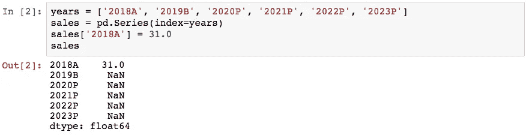

通过前三行，我们创建了一个数据结构，其索引由年份(每一年都标记为实际、预算或预测)、起始值(与原始 DCF 模型一样，以百万欧元为单位)和预测的空单元格(NaN，“不是数字”)组成。第四行打印数据的表示——一般来说，在交互式解释器中键入变量或其他对象的名称通常会给你一个合理的表示。

接下来，我们声明一个变量来表示预计的年销售额增长。在这个阶段，这是一个点估计，与我们最初的 DCF 模型中的数字相同。在考虑用概率分布替换点估计之前，我们希望首先使用这些相同的输入，并确认我们的 Python 版本与 Excel 版本执行相同并给出相同的结果。使用这个变量，我们创建了一个循环，根据前一年和增长率计算预测中每一年的销售额。我们现在有预计销售额，而不是 NaN:

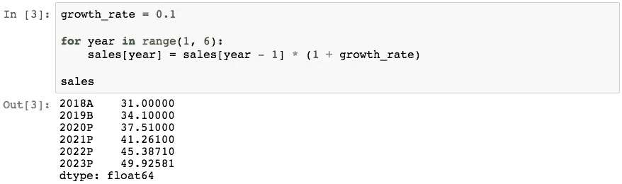

使用同样的方法，我们继续通过财务报表，在需要时声明变量，并进行必要的计算，最终得出自由现金流。一旦我们到达那里，我们可以检查我们所拥有的与 DCF 模型的 Excel 版本所说的相对应。

这给了我们自由现金流:

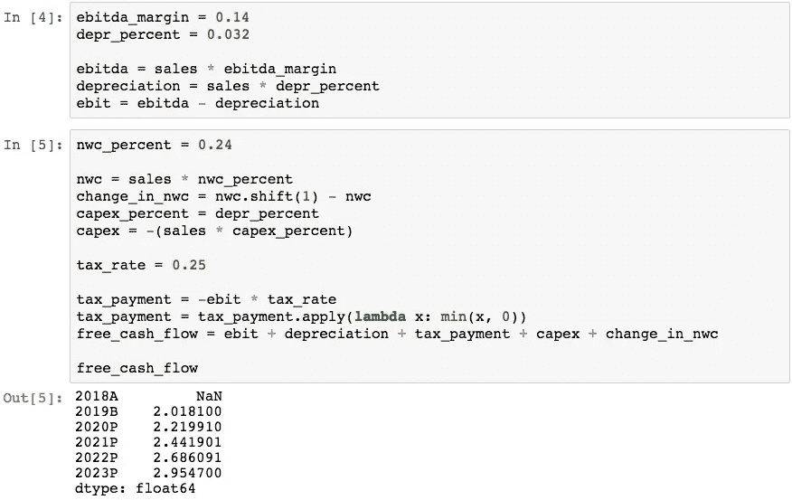

在这个阶段可能需要注释的上面一行是第二个`tax_payment`引用。这里，我们应用一个小函数来确保在税前利润为负的情况下，我们不会有正的纳税额。这显示了如何有效地将自定义函数应用于 Pandas 系列或 DataFrame 中的所有单元格。当然，实际应用的函数是一种简化。对于规模更大的评估活动来说，一个更现实的模型是一个独立的税务模型，根据许多公司特定的因素计算实际支付的现金税。

# 执行 DCF 估价

得出预计现金流后，我们现在可以计算一个简单的终值，并将所有现金流折现到现在，从而得到 DCF 结果。下面的代码介绍了索引和切片，这允许我们访问数据结构中的一个或多个元素，例如 Pandas Series 对象。

我们通过直接在结构名后面写方括号来访问元素。简单的索引通过位置访问元素，从零开始，这意味着`free_cash_flow[1]`会给我们第二个元素。`[-1]`是访问最后一个元素的简写(最后一年的现金流用于计算终值)，使用冒号给我们一个切片，意味着`[1:]`给我们除了第一个之外的所有元素，因为我们不想在我们的 DCF 评估中包括历史年份`2018A`。

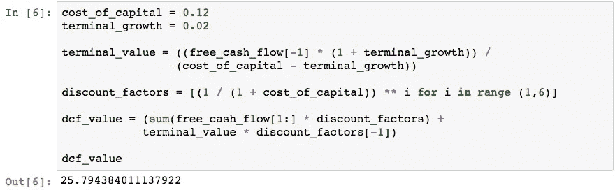

这就结束了我们原型的第一部分——我们现在有了一个可用的 DCF 模型，尽管是用 Python 编写的非常初级的模型。

# 导出数据

在进入实际的蒙特卡罗模拟之前，这可能是一个很好的时机来提一下 Pandas 包中可用的导出功能。如果你有一个熊猫 DataFrame 对象，你可以用`to_excel`方法用一行把它写到 Excel 文件中。还有类似的功能可以导出到十多种其他格式和目的位置。

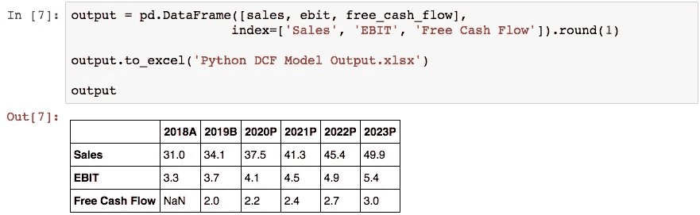

# 为蒙特卡罗模拟创建概率分布

现在我们准备应对下一个挑战:用概率分布代替一些点估计输入。虽然与在 Excel 中构建相同的模型相比，到目前为止的步骤可能显得有些繁琐，但接下来的几行代码将让您一窥 Python 的强大。

我们的第一步是决定在模拟中要运行多少次迭代。使用 1，000 作为起点，可以在获取足够的数据点以获得合理的输出图和在合理的时间范围内完成模拟之间取得平衡。接下来，我们生成实际的分布。为了简单起见，我在这里生成了三个普通的发行版，但是[NumPy 库有大量的发行版](https://docs.scipy.org/doc/numpy-1.15.4/reference/routines.random.html)可供选择，并且还有其他地方可以查看，包括 [Python 标准库](https://docs.python.org/3/library/random.html)。在决定使用哪种分布后，我们需要指定描述其形状所需的参数，如平均值和标准偏差，以及期望结果的数量。

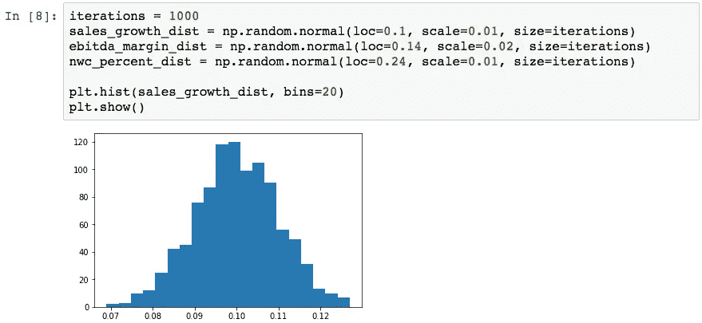

这里你可能会说，EBITDA 不应该是一个独立于销售额的独立随机变量，而是在某种程度上与销售额相关。我同意这一点，并补充说，它应该由对成本结构(可变、半可变和固定成本)和关键成本驱动因素(其中一些可能有自己的概率分布，例如投入商品价格)的动态的坚实理解所驱动，但为了空间和清晰起见，我将这些复杂性放在一边。

你在选择分布和参数时所掌握的数据越少，你就越需要依赖各种尽职调查工作流程的结果，并结合经验，以形成对各种可能情况的一致看法。在这个例子中，对于现金流预测，将有很大的主观成分，这意味着可视化的概率分布变得很重要。在这里，我们可以得到一个基本的可视化，显示销售增长分布，只有短短两行代码。这样，我们可以快速查看最能反映团队集体观点的任何分布。

现在我们已经有了运行模拟所需的所有构件，但是它们的格式不适合运行模拟。以下是我们迄今为止使用过的相同代码，但为了方便起见，它们都被收集在一个单元格中，并被重新排列成一个函数:

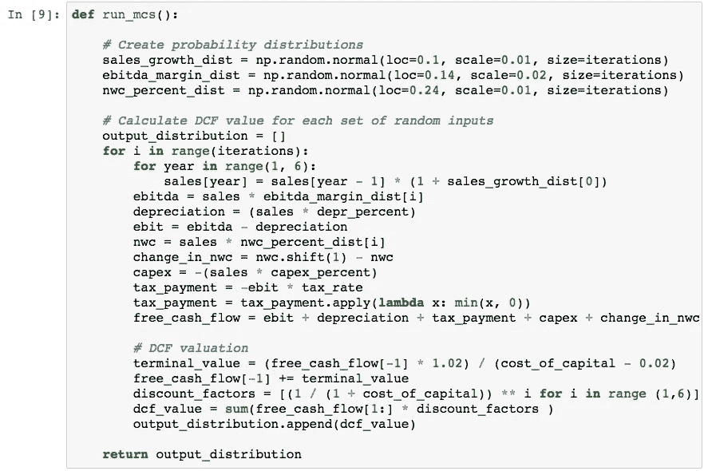

我们现在可以运行整个模拟并绘制输出分布，这将是该公司在 1000 次迭代中的每一次的贴现现金流值，代码如下。`%time`命令不是 Python 代码，而是一个笔记本速记，用来测量运行某个东西的时间(你可以使用标准库的 Python 函数[)。这取决于运行它的计算机，但这个版本需要 1-2 秒来运行 1000 次迭代并可视化结果。](https://docs.python.org/3.7/library/timeit.html)

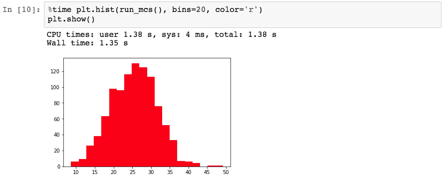

# 2.改进原型

> "对某些事情可以简化的潜在怀疑是世界上最丰富的奖励挑战的来源." *—* [埃德格·迪杰斯特拉](https://en.wikipedia.org/wiki/Edsger_W._Dijkstra)

重构是指重写现有代码以改善其结构而不改变其功能的过程，它可以是编码中最有趣和最有回报的元素之一。这样做可能有几个原因。这可能是为了:

1.  以更合理的方式组织不同的部分。
2.  重命名变量和函数，使它们的目的和工作更加清晰。
3.  允许并准备好未来的功能。
4.  提高执行速度、内存占用或其他资源利用率。

为了展示这个过程中的一个步骤可能是什么样子，我清理了我们刚刚走过的原型，将所有初始变量收集在一个地方，而不是像原型脚本中那样分散在各处，并通过一个称为*矢量化*的过程来优化其执行速度。

> 使用 NumPy 数组使您能够将多种数据处理任务表达为简洁的数组表达式，否则可能需要编写循环。这种用数组表达式替换显式循环的做法通常被称为矢量化。[韦斯·麦金尼](https://www.oreilly.com/library/view/python-for-data/9781449323592/ch04.html)

它现在看起来更清晰、更容易理解:

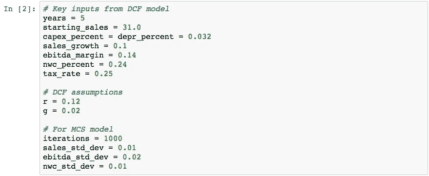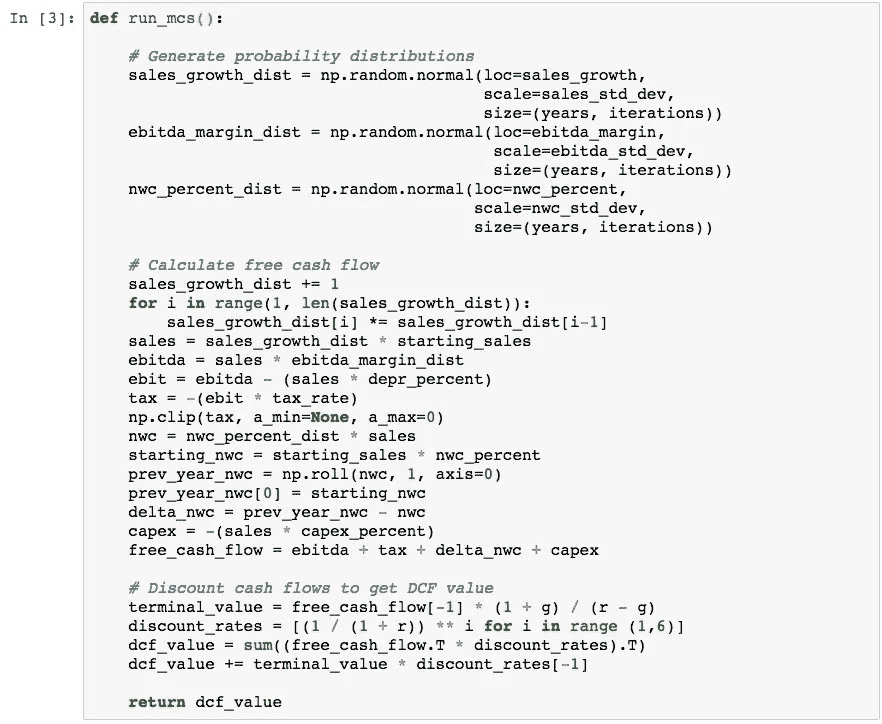

你会注意到这个版本和以前版本的主要区别是没有了`for i in range(iterations)`循环。使用 NumPy 的数组操作，这个版本的运行时间为 18 毫秒，而原型版本的运行时间为 1.35 秒，大约快了 75 倍。

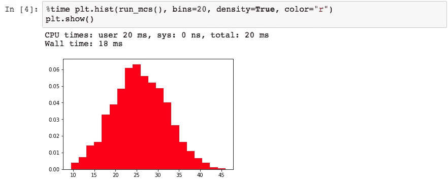

我确信进一步的优化是可能的，因为我在短时间内仅仅为了本教程的目的将原型和改进版本放在了一起。

# 更进一步

本教程展示了 Python 的一些强大特性，如果您想进一步开发，机会几乎是无穷无尽的。例如，您可以:

*   从网页或其他数据来源搜集或下载相关的公司或行业统计数据，帮助你选择假设和概率分布。
*   在定量金融应用中使用 Python，例如基于基本面和/或宏观经济因素的自动交易算法。
*   构建导出功能，以电子表格和/或演示格式生成输出，作为内部交易审查和批准流程的一部分，或用于外部演示。

我甚至还没有谈到你还可以用各种 web、数据科学和机器学习应用程序做些什么，这些应用程序为 Python 的成功做出了贡献。

本文介绍了 Python 编程语言，列举了它在金融界如此流行的一些原因，并展示了如何构建一个小型 Python 脚本。在一个循序渐进的教程中，我介绍了 Python 如何用于迭代原型、交互式金融分析，以及估值模型、算法交易程序等的应用程序代码。

对我来说，说到底，Python 技术的杀手级特性是，使用起来非常有趣！如果你喜欢解决问题、构建东西和提高工作流程的效率，那么我鼓励你尝试一下。我很想知道你用它做了什么或者想用它做什么。

[斯蒂芬·特林，瑞典](https://www.toptal.com/finance/resume/stefan-josefsson)

作为一名投资银行家、初创公司首席财务官、融资顾问和 M&A 公司董事，Stefan 建立了金融模型，并对从€600 万美元的初创公司融资到€70 亿美元的杠杆收购等项目进行了尽职调查和分析。偶尔的自由职业让他能够在全职 M&A 董事工作范围之外的领域应对有趣的金融挑战。[【点击继续……】](https://www.toptal.com/finance/resume/stefan-josefsson)

*最初发表于*[T5【www.toptal.com】](https://www.toptal.com/finance/financial-modeling/python-and-finance)*。*