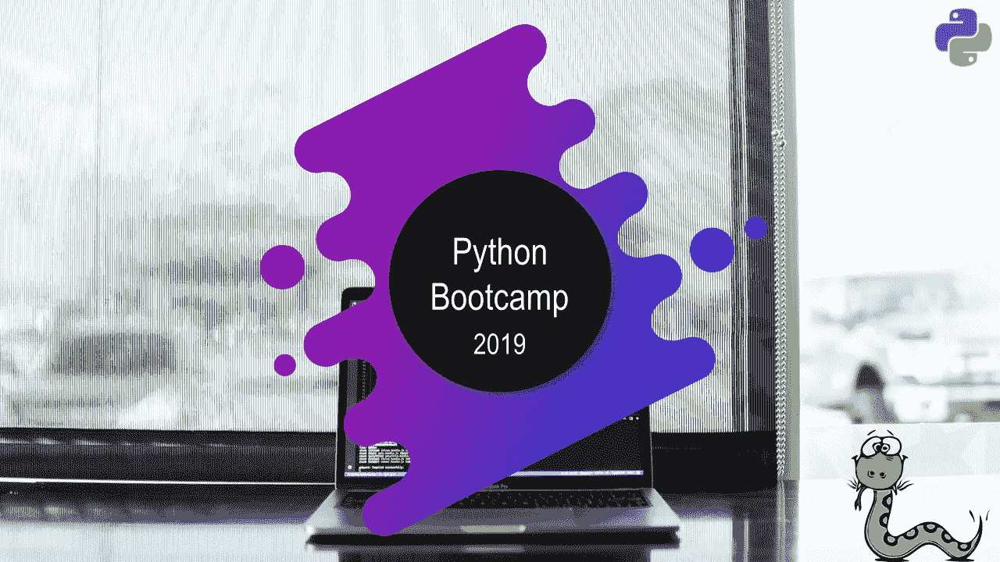
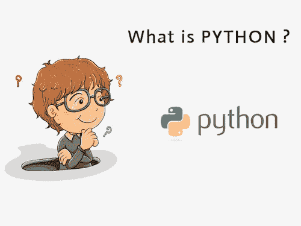
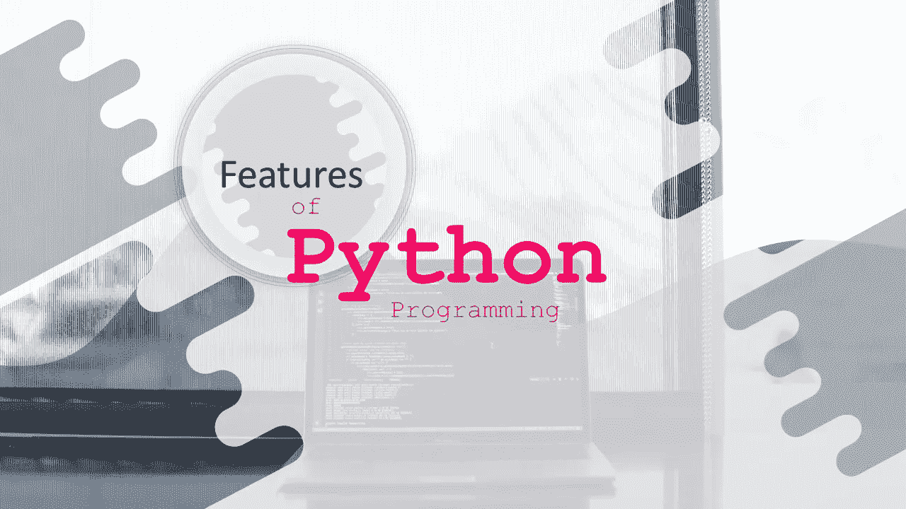
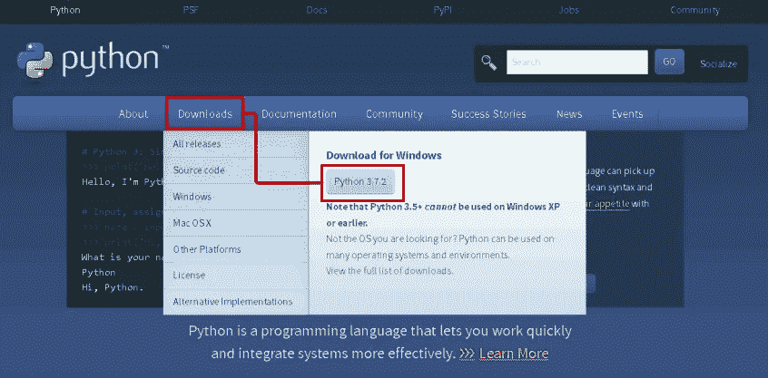
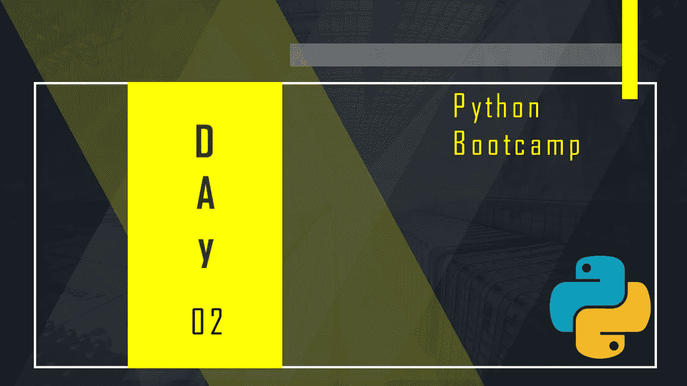
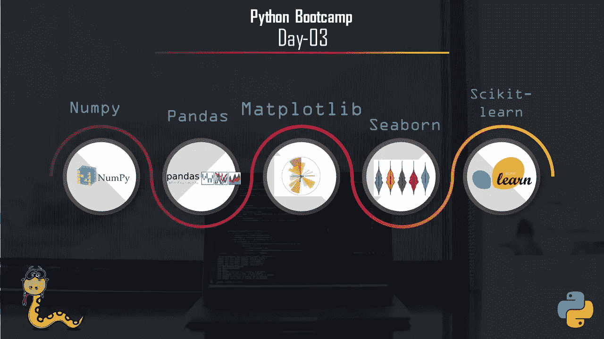

# 面向 ML 初学者的为期 3 天的 Python 训练营

> 原文：<https://medium.com/hackernoon/python-bootcamp-for-ml-c321177b957e>

## 我为热衷于机器学习的初学者做了一个为期 3 天的 Python 训练营。

## 简介:

几天前，我想我可以做一个关于 python 的训练营，这是机器学习或者深度学习或者数据科学最需要的。然后我开始了这个训练营。我希望这个训练营能对每个想在数据科学领域或机器学习领域工作的人有所帮助。

[Data Science.AI Community](https://www.facebook.com/DataScienceAI/)

> **让我们一起开始学习吧！！**

Photo on [Unsplash](https://unsplash.com/search/photos/lets-start-learning-with-us?utm_source=unsplash&utm_medium=referral&utm_content=creditCopyText)

# Python 基础(第一天)

[Data Science.AI Community](https://www.facebook.com/DataScienceAI/)

我们要去熟悉 Python 了。在第一天，我们学习了 Python 的基础部分，这对机器学习或数据科学非常有用。

## python 是什么？

**Python** 由**吉多·范·罗苏姆**开发。吉多·范·罗苏姆于 1989 年开始实施 Python。Python 是一种通用的、面向对象的、开源的计算机编程语言，它是一种高级的、人类可读的以及相应的一套软件工具和库。

> *有趣的事实:Python 是以喜剧电视节目《巨蟒剧团的飞行马戏团》命名的。它不是以蟒蛇的名字命名的。*

## Python 编程语言的特点:

[Data Science.AI Community](https://www.facebook.com/DataScienceAI/)

1.  可读性:Python 是一种可读性很强的语言。

2.易学:学习 python 是很容易的，因为这是一种富有表现力的高级编程语言，这意味着它很容易理解这种语言，因此也很容易学习。
3。跨平台:Python 是可用的，可以在各种操作系统上运行，如 Mac、Windows、Linux、Unix 等。这使它成为一种跨平台和可移植的语言。

4.开源:Python 是一种开源编程语言。

5.大型标准库:Python 附带了一个大型标准库，其中有一些方便的代码和函数，我们可以在用 Python 编写代码时使用。

6.免费:Python 可以免费下载和使用。这意味着您可以免费下载并在您的应用程序中使用它。请参阅:开源 Python 许可证

7.支持异常处理:如果您是新手，您可能想知道什么是异常？异常是在程序异常期间可能发生的事件，它会中断程序的正常流程。Python 支持异常处理，这意味着我们可以编写不太容易出错的代码，并且可以测试稍后可能导致异常的各种场景。

8.高级特性:支持生成器和列表理解。我们将在后面讨论这些特性。

9.自动内存管理:Python 支持自动内存管理，这意味着内存会被自动清除和释放。你不必费心清除记忆。

## 如何安装 Python:

您可以在任何操作系统上安装 Python，如 Windows、Mac OS X、Linux/Unix 等。

要在您的操作系统上安装 Python，请访问此[链接。](https://www.python.org/downloads/)你会看到这样一个屏幕。

[python.org](https://www.python.org)

这是**官方 Python 网站**，它会检测操作系统，并基于此推荐你下载 Python。这里我使用的是 Windows，所以它给了我 Python 2 和 Python 3 for Windows 的下载选项。我会推荐你下载**最新版本的 Python 3(截图中的 Python 3.7.2)。**

安装步骤非常简单。你只需要接受协议并完成安装。

## Python 基本主题:

我们学习了 Python 的基础部分。下面的基本部分-

1.  变量和数学运算
2.  铅字铸造
3.  线
4.  目录
5.  元组
6.  设置
7.  字典
8.  用户输入

每个人都可以从我们的笔记本上了解到这一点。笔记本在下面——

 [## Python Bootcamp 第 1 部分| Kaggle

### 编辑描述

goo.gl](https://goo.gl/aBzFfm) 

# Python 中级(第 2 天)

[Data Science.AI Community](https://www.facebook.com/DataScienceAI/)

我们要去熟悉 Python 了。在第二天，我们将关注 9 个常用于机器学习的 python 函数，这对机器学习或数据科学非常有用。

## **Python 中级主题:**

我们将重点介绍 9 个常用于机器学习的 python 函数。这下面的中间部分—

1.  if-Elif-Else
2.  For 循环
3.  While 循环
4.  功能
5.  λ表达式
6.  列出理解
7.  错误和异常处理
8.  数学模块
9.  地图

每个人都可以从我们的笔记本上了解到这一点。笔记本在下面——

 [## Python Bootcamp 第 2 部分| Kaggle

### 编辑描述

goo.gl](https://goo.gl/KLqoYw) 

# ML 或数据科学基础包(第 3 天)

[Data Science.AI Community](https://www.facebook.com/DataScienceAI/)

我们要去熟悉 Python 了。在第三天，我们将重点关注 Python 的 ML 或数据科学基础包，这对机器学习或数据科学非常有用。

## ML 或数据科学包主题:

我们将关注 ML 或 Python 的数据科学基础包。ML 或数据科学在这里打包了部分内容—

1.  Numpy
2.  熊猫
3.  Matplotlib
4.  海生的
5.  sci kit-学习

每个人都可以和我们一起学习这个话题。只需要等待，每个人都会在 Github 上看到这个话题。下面的 Github 知识库链接—

 [## harunshimanto/Python-boot camp-with-ML

### 我为热衷于机器学习的初学者做了一个为期 3 天的 Python 训练营。…

goo.gl](https://goo.gl/iF59Kw) 

# 结论

感谢阅读这篇文章。如果您有任何建议，请随时在评论中联系我，或者发送[邮件](http://harunspeedy1995@gmail.com)或联系 [LinkedIn](https://www.linkedin.com/in/harun-ur-rashid6647/) 。保持联系，了解更多最新消息。谢谢你。😎

我的工作伙伴 Richa Yadav。她是我的好朋友。如果你有任何建议，欢迎在评论中联系她，或者在 [LinkedIn](https://www.linkedin.com/in/anna-list) 上联系她。

> “训练营结束了！！我们开始做项目吧！”

Photo on [Unsplash](https://unsplash.com/search/photos/done?utm_source=unsplash&utm_medium=referral&utm_content=creditCopyText)