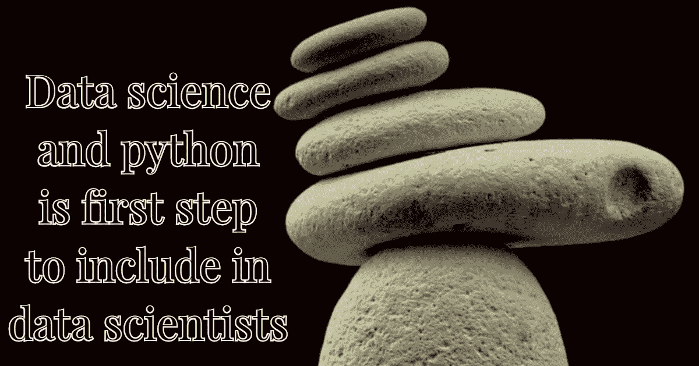

# Python 是数据科学的第一步

> 原文：<https://medium.com/hackernoon/python-is-first-step-to-data-science-705911ddf5a1>

***数据科学*** 在各行各业中的重要性稳步上升，这导致了对**数据科学家**的快速需求。有人说 ***数据科学家的角色是 21 世纪最性感的职位*** 。如果你想知道为什么如今它会成为如此抢手的职位，简短的答案是，组织和普通人生成和获取的数据都出现了巨大的爆炸，数据科学家**正在…**