# Python3:对象和可变性

> 原文：<https://medium.com/hackernoon/python-objects-and-mutability-397f7de38bb5>

在 Python 中，一切都是对象。这主要是 Guido Van Rossum(Python 编程语言的创始人)的设计原则“一切都是一流的”的副作用第一类一切意味着一切都是其他事物的实例。更一般地说，它意味着一切都与其他一切在同一“水平”上。看看下面的内容(一切都在 python3 解释器中运行):

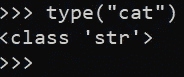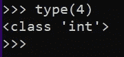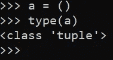

We used the type() method to see what class our objects belong to.

甚至数据类型也是它们各自类的对象。所以如果数据类型只是类的实例，我们可以想象不同的数据类型有不同的属性。例如，列表是可变的数据类型，而元组和像 int 和 float 这样的内置数据类型是不可变的。请注意以下几点:

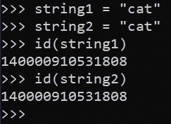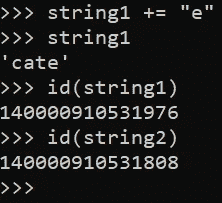

We use the id() method to examine the memory addresses of our objects

在第一帧中，我们创建了两个相同的字符串。由于字符串是不可变的对象(你不能改变字符串)，Python 将通过让两个变量指向同一个对象来节约内存使用。我们可以看到这是真的，因为 string1 和 string2 共享相同的内存地址(我们可以使用 id()来检查对象的内存地址)。然而，在第二帧中，我们试图使用“+= 'e '来改变 string1 的值由于字符串是不可变的，Python 被迫创建一个指向字符串“cate”的新字符串对象。观察整数的相同行为:

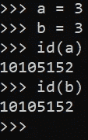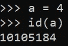

尽管整数看起来行为相同，但这实际上是出于不同的原因。为了节省内存使用，CPython 在启动时预先分配(或绑定)前 262 个整数。这意味着数字-5-256(包括 5-256)会自动绑定到内存中的特定地址。这就是为什么在上面的例子中 a 和 b 引用了内存中的同一个位置。请注意以下几点:

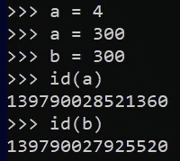

Since 300 is not pre-loaded in memory, a and b point to different addresses

更专业地说，CPython 创建了名为 NSMALLPOSINTS 和 NSMALLNEGINTS 的宏。这些宏分别引用-5 和 256。CPython 实际上将对所有这些整数对象的引用存储在一个数组中。当我们在该范围内“创建”一个整数(例如:a = 5)时，我们实际上只是告诉变量指向存储在该数组中的一个地址。该数组被设置为这个特定的范围，因为这些是最常用的数字。一旦您要求一个超出这个范围的数字，CPython 将被迫开始寻找新的存储位置来存储数字。

当然，如果我们希望 a 和 b 指向同一个对象(即使它们不在我们宏的范围内),我们可以将一个变量的内存引用传递给另一个变量:

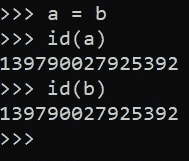

Now a and b point to the same object

最后一个例子演示了一种称为“别名”的机制。因为 a 和 b 现在指向同一个对象，我们可以说这个对象是别名的，或者说 a 是 b 的别名，反之亦然。

由于整数是不可变的对象，当我们在第二帧中改变 a 的值时，我们强制 Python 创建一个新的对象。最后两个例子展示了一种在 Python 中思考变量的聪明方法。Python 中的变量本质上是我们用来指代对象的名称。它们就像标签。这在上面的整数例子中很明显，因为即使我们说“a = 4”(告诉 a 指向一个完全不同的对象)，我们仍然使用名称或“标签”来指代新对象。

现在我们知道了一点 Python 处理不可变对象的方式。让我们检查可变对象。

列表是可变的对象。让我们初始化两个列表:

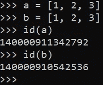

有趣的是，Python 并不试图节约，即使列表 a 和列表 b 包含相同的数据，也不会让它们指向相同的对象。列表 a 和列表 b 是不同的对象。由于列表是可变的，Python 知道您可能会在这些列表中添加或删除元素。

现在我们已经了解了可变和不可变对象的一些重要属性，让我们学习一些可以用来测试对象状态的操作符。

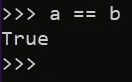

在上面的例子中，我们使用“==”操作符来测试我们的变量是否指向包含相同数据的对象。因为我们的两个列表包含相同的数据，所以这被评估为“真”。

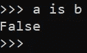

在上面的例子中，我们使用“is”操作符来测试我们的变量是否指向同一个对象。因为 a 和 be 指向不同的对象，所以计算结果为“False”

为了直观起见，我们可以通过下图来想象上述场景。左边的视觉对象 a 和 b 分别指向包含字符串“banana”的对象，这代表了我们上面创建的情况。

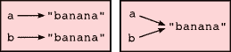

为了实现右侧的视觉效果，其中 a 和 b 指向同一个对象，我们需要执行以下操作:

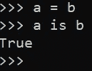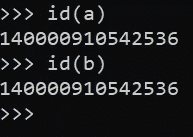

现在我们设置两个列表指向同一个对象。我们在第二张图中验证了这一点，我们打印了每个变量指向的地址。这个例子还涉及了 Python 中赋值和引用的区别。我们可以认为变量是内存中特定位置的名称或引用。这些内存位置包含对象(值)。例如，语句 a = 5 告诉或“绑定”名称“a”指向内存中保存值 5 的某个位置。我们可以通过告诉变量引用内存中的不同位置来“重新绑定”变量——a = 6。

现在让我们简单看一下元组。元组是不可变的数据结构，但是它们可以包含像列表一样的可变对象。一旦创建了元组，就不能向它追加或添加新元素，但是可以改变存储在元组中的可变对象。请注意以下几点:

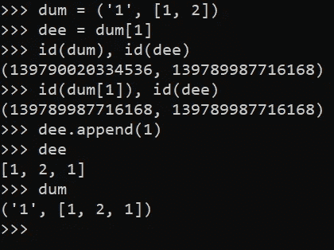

在这个例子中，我们创建了一个元组(“dum”)，其中包含一个列表。然后，我们将存储在元组中的列表对象赋给不同的变量“dee”然后，我们验证元组对象和元组中的列表对象位于不同的内存地址。然后，我们尝试改变存储在元组中的列表。我们验证该列表在“dee”和“dum”中都已更改元组是不可变对象的唯一实例，可以包含可变对象。您可以更改这些可变对象。

Python 中最后一个独特的数据结构是冻结集。冻结集合是集合对象的不可变版本。虽然可以在常规 Python 集合中添加和移除元素:

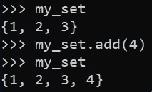

不能在冻结集中添加或删除任何元素:

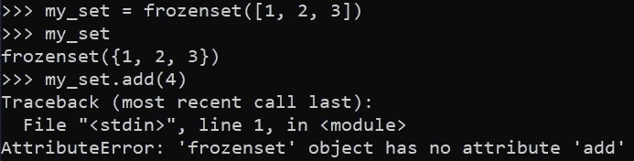

那么为什么这真的很重要呢？为什么要关心 Python 如何对待可变和不可变对象？

首先，你应该关心，因为如果你想成为一个熟练的程序员，你应该知道你的变量在任何时候都发生了什么。

其次，这很重要，因为 Python 将对象传递给函数的方式受到这些对象可变性的影响。如果你把不可变的对象传递给一个函数，传递的行为就像“通过值调用”。请注意以下几点:

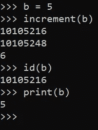

在第一帧中，我们定义了一个函数，它递增并打印一个整数变量。我们告诉该函数打印对象 id，用于调试目的。在第二个框架中，我们调用函数。打印的第一个 id 与在函数外部打印的整数对象 b 的 id 相匹配。这告诉我们，对象 b 是通过引用函数 increment()传递的。然而，第二个 id——我们在增量之后打印的——是不同的。一旦我们到了 increment 步骤，并意识到我们必须改变对象的值，Python 就用旧对象的值创建一个不同的 integer 对象，并递增该对象。这也是为什么我们函数里的对象的值是 6，而函数外的对象的值是 5。

我们可以用一个可变对象做同样的练习:

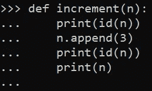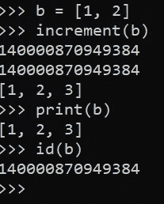

我们从第一个 id 语句中看到，我们的对象是像上次一样通过引用传递给我们的函数的。然而与上次不同的是，我们的第二个 id 方法(在 append()之后执行)打印的地址对应于同一个对象。由于列表是可变的数据结构，Python 能够只向现有列表添加一个元素，而不是创建一个全新的对象。我们还可以看到更新后的列表在我们的函数范围之外持续存在。

这就是为什么人们说 Python 既不传值也不传引用，而是“按对象引用调用”。

总之，Python 中的可变对象包括:列表、字典、集合和字节数组。不可变对象包括:int，float，complex，tuple，string，冻结集，bytes。希望您对 Python 处理可变和不可变对象的不同方式更有信心。