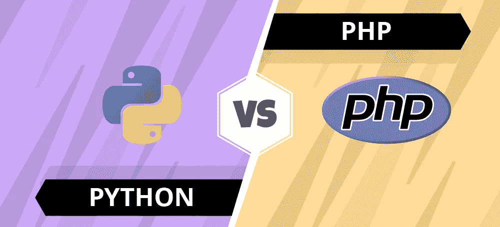
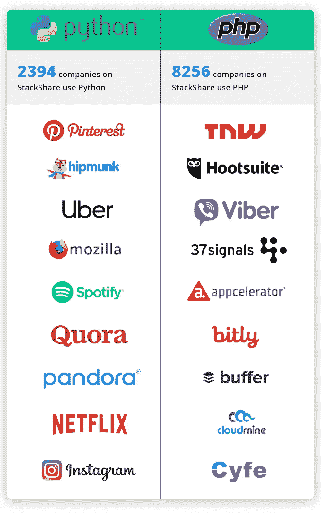

# python v/s PHP:2019 年选择哪种编程语言？

> 原文：<https://medium.com/hackernoon/python-v-s-php-which-programming-language-to-choose-in-2019-45a95249ad8d>

在当今颠覆性的技术世界中，Python 和 PHP 是最流行的两种服务器端语言。在许多方面，Python 和 PHP 因其几乎相同的特性而相互竞争。它们的开源优势和高效特性吸引了大多数企业和开发者选择 Python 或 PHP 进行应用开发。

然而，确定最佳编程语言的战斗是一场永无止境的战斗。在这篇博客中，让我们来解决 Python 和 PHP 之间的一些突出差异，并找出 2019 年应该选择的最佳编程语言。

# Python 简史

由吉多·范·罗苏姆开发的 [Python](https://www.sayonetech.com/services/python-app-development/) 是一种通用的高级编程语言，于 1990 年推出。由于其简单和易于开发，Python 已经成为开发人员进行后端开发的最佳选择。如今 Python 在 GitHub 站着 21k 明星，13k 粉丝。

# PHP 简史

PHP 是由拉斯马斯·勒德尔夫开发的，是 C 语言的扩展。GitHub 有 20k 明星和 10k 粉丝，PHP 为全世界几乎 80%的网站提供动力。在最初的日子里，脸书也有 PHP 作为其后端技术。自成立以来，PHP 团队一直在不断改进以确保其健壮性。

# Python v/s PHP

**速度**
速度是决定一个应用或网站的流畅性和性能的重要因素。用户会丢弃加载时间超过三秒的网站。

Python 版本实践了他们所宣扬的。使用即时编译器，Python 中的代码编译过程比 PHP 快。优点是文件一旦编译就不需要再次编译。

另一方面，以前的 PHP 版本如 PHP 5.x 要慢得多。只是在 PHP 7.x 版本推出之后，PHP 应用程序的速度才显著提高。

**那么，谁会赢得这一部分呢？嗯，我们可以说 PHP 是赢家，因为它的新**[**Zend engine**](https://en.wikipedia.org/wiki/Zend_Engine)**3.0。但是，故事还不止于此。尽管有高速的承诺，PHP 只是以微小的差别赢了 Python。**

**安全性**
您的企业应用程序保存着至关重要的业务数据和用户信息。因此，应用程序的安全性是不可妥协的。由于 Python 和 PHP 都是开源技术，对其安全性的疑虑是很常见的。

Python 被认为是最安全的编程语言之一。此外，Python 是网络安全专业人士的首选，因为它的安全性。时至今日，Python 被称为后端开发的可靠和安全的编程语言。

另一方面，PHP 在安全性方面有着可怕的历史。尽管许多安全问题已经得到解决，而且社区支持也很强大，但在安全性方面，它还不能打败 Python。

**胜利者？是 Python！**

**可扩展性**
一个业务应用需要轻松适应快速变化的市场趋势和客户需求。在这种情况下，所选择的应用程序开发技术必须能够在扩展过程中支持企业。

就可伸缩性而言，Python 应用程序具有高度的可伸缩性，可以轻松适应不断发展的趋势。它提供了高度的人工智能和机器学习能力。相反，PHP 对不断增长的需求和新趋势不太开放。尽管不断改进，PHP 在可伸缩性方面还是落后于 Python 应用。

**在这一部分，我们宣布 Python 为获胜者！**

**库支持**
一种流行的编程语言被期望拥有更多由程序员开发的库。这些库减轻了耗时的任务，并提高了应用程序开发的速度。

PHP 包存储库， [Packagist](https://packagist.org/) ，是 PHP 开发人员的坚强支柱。但是，它不提供 Python 库的特性和优势。Python 拥有最强的库支持以及一些优秀的内置库和第三方库。这些库易于使用且维护良好。

Python 还提供了 TensorFlow、Theano 等机器学习库。因此，正在开发尖端技术解决方案的企业家可以利用优秀的 Python 库来获得开发收益。

**赢家？毋庸置疑，Python！**

**人气&使用率统计**

**获胜者是谁？如你所见，PHP 在使用和受欢迎程度方面排名更高。所以，这次是 PHP。**

# 一句话:2019 年要选择的编程语言

根据堆栈溢出:

*“从 2016 年到 2017 年，Python 在美国和英国市场的年同比增长率稳定在 27%，远高于 PHP 的增长率”。*

从上面的比较中可以清楚地看到，Python 是一种灵活、安全、强大的技术，为企业提供了广泛的机会。因此，Python 绝对是我们 2019 年的编程语言选择。

Python 是一种通用的技术，不仅限于 web 应用程序开发。它是一种具有多种功能的通用语言。到目前为止，Python/Django 开发是用于开发健壮应用程序的最强大的 Python 框架组合。出于这些原因，我们一直将 Python 作为我们的[应用开发](https://www.sayonetech.com/services/application-development/)的主干。我们已经为全球客户开发了 300 多个应用程序，其中大部分应用程序都由 Python 支持。

想了解更多关于我们 Python 开发服务的信息吗？这里是我们的一些主要的 [Python 应用](https://www.sayonetech.com/success-stories/)。

*原发布于*[*https://www . sayone tech . com/blog/python-vs-PHP-which-programming-language-choose-2019/*](https://www.sayonetech.com/blog/python-vs-php-which-programming-language-choose-2019/)*。*