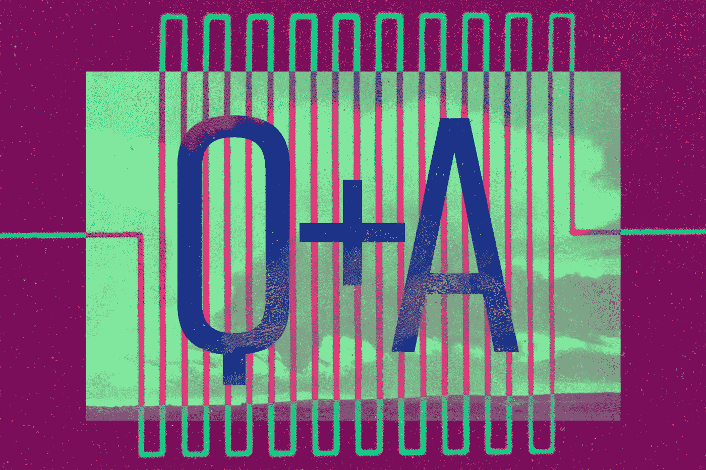
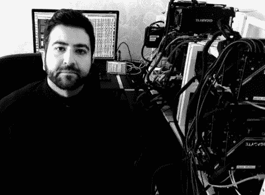
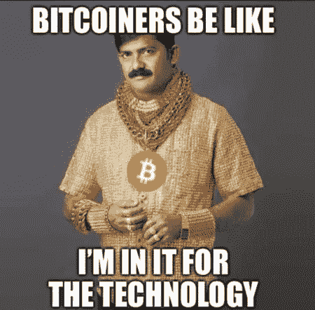
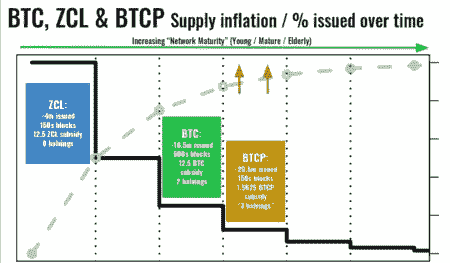
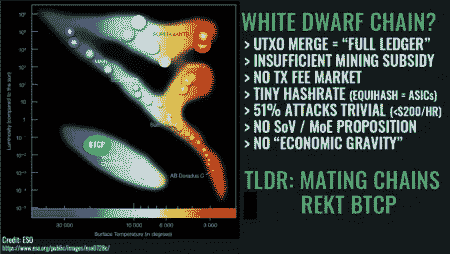
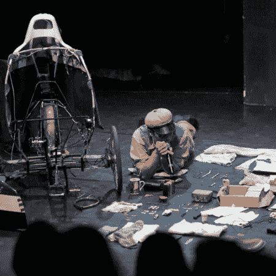

# 触及每个人:比特币的政治和人道主义潜力

> 原文：<https://medium.com/hackernoon/q-a-on-reaching-everyone-3edb056f266e>

> 这段与网格中[的对话最近发表在他们的网站上。](http://inthemesh.com) [Parallel Industries](http://www.pllel.com/industries/) 的研究总监瓦西姆·阿尔辛迪(Wassim Alsindi)目前正在与人合作撰写一系列网络文章，在这些文章中，他深入研究了比特币，以及加密货币被用来帮助那些生活在威权统治下的人的潜力。如果你错过了它们，一定要去看看部分 [I](https://hackernoon.com/reaching-everyone-pt-i-the-need-for-sound-money-outside-of-the-wealthiest-territories-f9a27e1f6488) 和 [II](https://hackernoon.com/reaching-everyone-pt-ii-resilience-censorship-resistance-and-the-bitcoin-blockchain-c1c133d5ac96) ，并尽快回来看最后两期。瓦西姆对一切“秘密”的看法是深刻的，有研究的，值得一听，他有一个有趣的背景，从学院到实验音乐。因此，我们与他聊天，以了解更多关于他的背景，并获得他对密码领域当前趋势的看法。

Kevin Durkin for In The Mesh

**您第一次听说加密货币是什么时候，当时您对此有什么想法？**
在比特币和加密货币出现之前，我的生活是一名实验音乐家和[分散艺术组织](https://thecentrifuge.bandcamp.com)创始人，有趣的创意技术项目[经理](https://twitter.com/thecentrifuge/status/616670096434573312)和[节日策展人](https://en.wikipedia.org/wiki/Norbergfestival)。2012 年在美国西海岸的一次音乐巡演中，我们去了一个朋友的朋友在硅谷的住处，他打开他的衣柜说:“看看这个，我正在做一个叫做挖掘比特币的事情”。我花了一段时间才被说服，这个想法听起来很棒，但我在网上能找到的一切看起来都很可疑——mt . Gox、Bitcoinica、BitInstant 等等——因为我不是计算机科学家或密码学家，所以详细的讨论超出了我的范围。直到 2014 年 5 月，或许是比特币最黑暗的日子，我才开始真正感兴趣。不受任何人控制的原生数字货币的想法显然很有吸引力，但在 Gox 事件中幸存下来让我看到，这项技术具有很强的弹性，可能是一个长期存在的命题。

Wassim Alsindi

最近，比特币和其他硬币的金融价值一直在下降。你如何看待这一事件的转变，以及加密货币现在是、过去一直是“泡沫”的说法？
事实不会说谎，比特币在 2015 年以 180 美元左右的价格触底，两年后交易价格是这个价格的 100 倍。尽管我很喜欢比特币作为第一种天然的数字商品和(及时)货币的特征和品质，但我们确实必须问自己，这种价格行为是否真的是可持续的或可取的。在大宗商品或投机工具中，波动性是可以接受的，但如果世界各地的人们打算将它用于货币用途，我们需要看到更多的价格稳定性、更高的流动性，以及在将现有国家货币转换为加密货币的过程中减少摩擦。是泡沫吗？大概吧。但不是第一次，也可能不是最后一次。那么，当一种新资产被采用、技术上成熟并被货币化时，它们是泡沫还是市场周期？那是旁观者的看法。

**你对加密货币的兴趣似乎在他人恐惧/恐慌的时候达到顶峰。这是为什么呢？**

Wassim is in it for the tech.

如今这有点老生常谈了，但我成年后一直是一名技术研究员，所以我真的是为了技术和自由而来。这些年来，我的兴趣一直在稳步增长，在完成了之前的承诺后，我现在没有更好的事情可做。我不喜欢熊市，对我和平行行业来说都很困难。我们在小本经营，每当市场下跌一分钟，这条线就变得越来越短。我曾希望通过开源捐赠模式来引导该组织，但目前这似乎非常困难——即使是直接为这些协议做出贡献的组织和开发者也在挣扎。尽管如此，比特币在野外生存的每一天都会变得更强大，更广为人知。如今，你不必问发达国家的大多数人是否听说过它，他们只是想要解释和/或建议。

**你开创了未来研究的一个领域，叫做未来经济学。你希望它如何影响加密空间？**

这个研究领域起源于[与一位 Twitter 朋友](https://twitter.com/parallelind/status/1004439498204307456)的对话，他正在使用 Equihash 算法监控各种网络上的 hashrate。我们注意到，一枚新硬币(BTCP)的“市值”要高得多，但只是它所来自的项目(ZCL)的一小部分。由于用于生成新分类账的新颖的“分叉合并”操作，一种有效年龄大于比特币的硬币被创造出来。

因此，我们得以一瞥比特币可能的未来，尽管这是一个噩梦般的场景，即在采矿补贴减少之前，该网络没有实现发展交易费市场的目标。目标是发现出现的类似异常，并将它们与主要网络的可能未来联系起来。作为一名实验天体物理学家，我花了一些时间将这个想法与 Hertzsprung-Russell 图的恒星分类学进行比较，Hertzsprung-Russell 图根据恒星的温度和光度预测它们可能的命运。

在我们拥有一套强大的预测分析工具之前，还有一段路要走，我们在很大程度上处于加密货币的炼金术阶段。

**您的背景如何让您对生活在压迫性政权下的人们使用加密货币的可能性感到敏感？**
不赘述，对于像我这样的伊拉克侨民来说，去中心化技术(尤其是比特币)的“政治和人道主义黑客”潜力是实实在在的。对于那些像我的一些家人一样能够离开萨达姆统治下的国家的人来说，最困难的事情之一是将金钱或价值从一个地方转移到另一个地方。银行账户被冻结，没收黄金和现金在机场司空见惯，土匪会在边境附近的沙漠地区巡逻，寻找容易得手的东西，学者的国际资助突然被撤回。鉴于上述情况，不难看出这些新生技术有望以暴君、机构和民族国家为代价，重新赋予个人和社区权力。事实上，我们可以为生活在压迫或冲突下的人们设计工具、解决方案和策略，让他们拥有政府硬性的、不受限制的伪货币资产，这完全改变了那些处于最不幸和最妥协境地的人们的处境。

The “Byzantine Generals” in Wassim’s family.

在这种情况下，你认为加密的哪种用途最能为人们服务？
我想说，只有少数加密货币真正表现出抵御这些情况的弹性(现在或未来的潜力)。这些公司拥有足够成熟和分散的网络，明确关注不变性、隐私和审查阻力，也缺乏引人注目的领导人、公司或基金会等核心失败点。比特币、Monero 和以太坊经典是我在过去六年半时间里深入研究加密货币领域后确定的例子。(很高兴听到更多消息——请通过 [Twitter](https://twitter.com/parallelind) 联系我，即使它是一个更小/更新的网络。)其用途仅受限于世界各地从事并将致力于这些问题的聪明头脑的独创性，而这才是触及每个人的真正意义所在——没有什么比一个非营利、无组织的倡议更复杂的了，这个倡议就是在好奇的头脑中播下这些种子:*当幸运者创造一个金融自由的新世界时，我们绝不能忘记地球的其他地方*。但我们不必对此过于焦虑——这与“西方的罪恶”无关。激励推动比特币，每个人都可以根据自己的理性自我利益行事。此外，人们手头的资源越少，他们就越有资源。任何去过不太富裕国家的人都可以证明这一点。

The experimental musician Goodiepal helped bring Wassim into his current exploration of the possibilities of cryptocurrency.

如何达到每个人？
尽管有上述种种情况，这个想法还是出乎意料地产生了。整整一年前(2017 年 12 月)，我在伦敦与英国金融监管机构举行了一次会议，因为我有另一个项目 [TokenSpace](https://twitter.com/hashtag/TokenSpace?src=hash) ，该项目开发了新的分类框架，以帮助了解加密资产之间的异同，目的是防止监管失误。碰巧那天晚上，我深爱的丹麦-法罗群岛朋友和臭名昭著的激进实验音乐家正在和他的乐队一起表演他们一年一度的圣诞表演。所以我去了那里，发现他们已经搬到了塞尔维亚，并且正在为非正式的人道主义工作筹集资金，帮助困在欧盟边境的难民。他们曾经帮助过的人面临的最大问题是跨国转移资金以及走私者和黑手党卡特尔的剥削/勒索。简单地说，加密货币至少可以为这些问题提供部分解决方案。我很抱歉我们不能马上筹集到任何资金，但我希望从长远来看，我们仍然可以有所作为。

你的兴趣很广泛，平行产业似乎对密码世界有一个整体的看法。你希望平行产业在不久的将来会给加密领域增加什么？
事实上，事情正在多条战线上快速向前发展，除了尽可能地推动每个人，我还试图从更广的角度看待我认为适用于彻底去中心化技术的[本体论元栈](https://twitter.com/parallelind/status/1072124160900558849)。“ [TokenSpace](https://link.medium.com/R635yaqy4T) ”超分类研究项目经过一年多的工作，已经非常接近于输出一份手稿，我最近在 2019 年初重新访问了“ [Forkonomy](https://link.medium.com/tnVaMjLxJT) ”，在命令行上学习了一些新技能，用于节点操作、挖掘和直接收获区块链数据。还有另一个名为“ [DAOs and Don'ts](http://asymmetries.pllel.com) ”的项目，该项目调查 P2P 网络中的内部不对称，尽管由于遇到的案例数量庞大，理解手头的任务是一个令人生畏的前景。

# 感谢阅读。在你走之前！

> 如果你觉得这篇文章有趣，请👏并在你能分享的地方分享。记住，你最多可以鼓掌 50 次——这对可见度和温暖模糊的感觉真的有很大的影响。欢迎大家来 www.pllel.com 和 T2 的推特上闲逛。