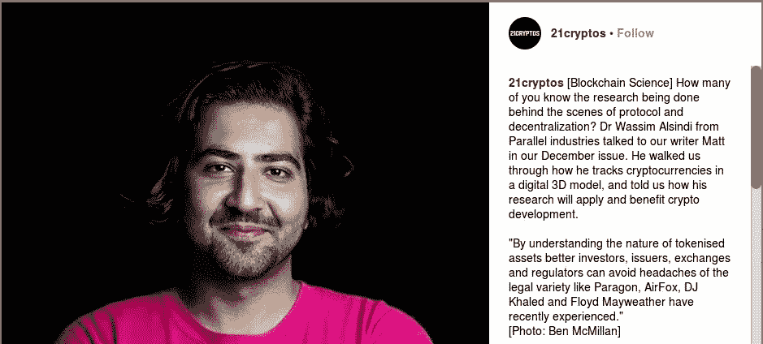
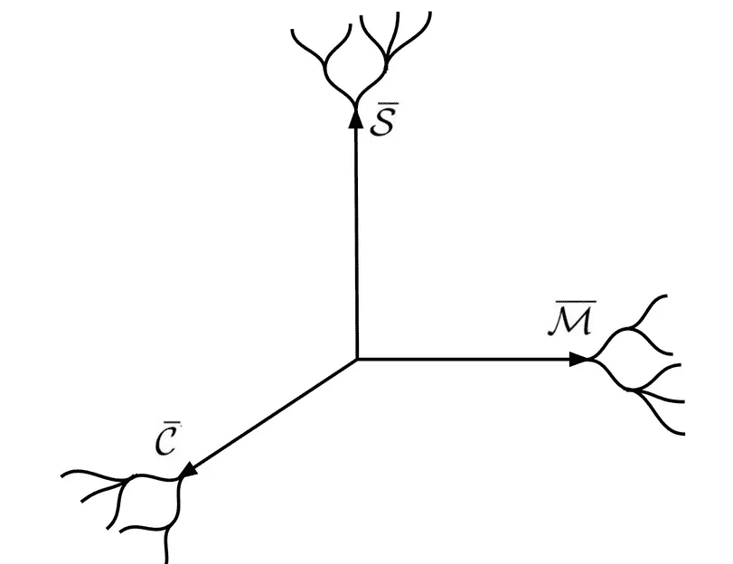
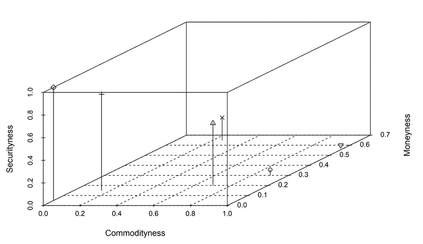
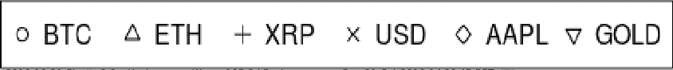
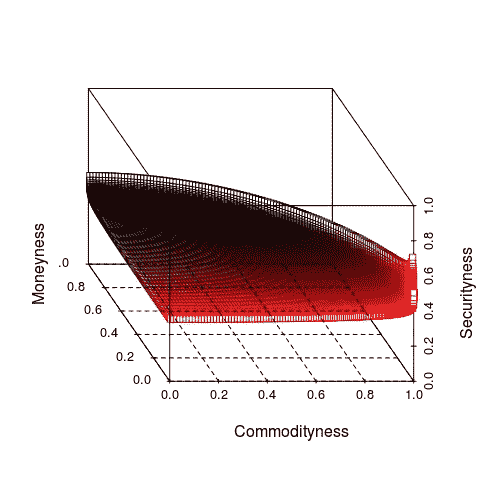

# 马特·฿:关于令牌空间的问答一种新的加密资产概念分类框架

> 原文：<https://medium.com/hackernoon/q-a-on-tokenspace-a-new-conceptual-classification-framework-for-cryptoassets-6a6d16234ed5>

寻找关于加密资产特征的新观点。这部与[马特·฿](https://medium.com/u/7364555d4095?source=post_page-----6a6d16234ed5--------------------------------)的问答最初出现在 2018 年 12 月的[21cryptos.com](http://www.21cryptos.com)。描述 TokenSpace 的全面手稿将很快发布，与此同时，更多 TokenSpace 信息将在 pllel.com 的[和 Twitter 的](http://www.pllel.com/industries/project-update-classification-approaches-for-cryptographic-assets/)[发布。](https://twitter.com/search?q=%23TokenSpace)

问:你能介绍一下自己的背景吗？是什么让你对加密货币感兴趣？

当然，这是一条曲折的道路，所以我们不要迷失在细节中！我在英国的各个城镇长大，主要是阅读数学和科幻书籍，观星，滥用家庭化学晶体生长工具，制作音乐和玩太多的电脑游戏。我在大学里花了十年时间学习、研究和管理化学、物理和天文学方面的科学研究，在那里我真正接触到了组织知识以加深我们理解的想法。我的化学导师(

在那之后，我花了几年时间从事实验音乐和艺术，经营一家 [*唱片公司*](https://thecentrifuge.bandcamp.com/) *，组织教育活动，管理* [*有趣的项目*](https://twitter.com/thecentrifuge/status/616670096434573312) *和* [*策划一个节日*](https://en.wikipedia.org/wiki/Norbergfestival) *。2012 年在美国西海岸的一次音乐巡演中，我们去了一个朋友的朋友在硅谷的住处，他打开他的衣柜说:“看看这个，我正在做一个叫做挖掘比特币的事情”。我花了一段时间才被说服，这个想法听起来很棒，但我在网上能找到的一切看起来都很粗略——mt . Gox、Bitcoinica、BitInstant 等等——直到 2014/5 年，可能是比特币最黑暗的日子，我才开始真正感兴趣。不受任何人控制的原生数字货币的想法显然很有吸引力，但在 Gox 事件中幸存下来让我看到，这项技术具有很强的弹性，可能是一个长期存在的命题。从那以后，它逐渐占据了我的生活，因为我以业余爱好者的身份通过各种活动工作——观察市场、运行节点和跟踪链上活动、摆弄彩色硬币和智能合约、采矿，现在通过独立研究组织* [*研究各种口味的平行产业*](http://www.pllel.com) *。*

My Bitcoin sunrise, after playing a gig in Stanislaus National Forest in Summer 2012

问:ELI5 令牌空间。

TokenSpace 试图从我们今天发现的加密货币、代币等杂乱无章的东西中创建一个相对简单易用的比较系统。可以把它想象成一个放置不同资产的 3D“空间”，每个轴代表一个特征，我们可以用它来直观地比较和对比不同的资产。资产在每个轴上的位置由该特征的 0 到 1 之间的评分系统确定，因此 0 分意味着该资产根本不具有这些属性，1 分意味着它是教科书案例。分数的来源取决于用户，可以是直观的“直觉”观点、不同属性的加权分类法、顾问小组的一致意见等等。这完全取决于预期的应用。

TokenSpace visual impression

*到目前为止，主要应用是研究加密资产的法律和监管地位的持续不确定性，以及它们与传统资产类型(如货币、证券或商品)的相似性或差异性。很明显，不同的资产之间存在很大的差异，而且越来越明显的是，政府机构正在密切关注这些事情。*

*重要的是要明白，令牌空间和化学元素周期表等概念之间的区别在于，我们仍然非常主观地对待加密资产，因此任何特定的分数都应该持保留态度。人们在很多事情上不会有相同的看法——如果你关注加密货币和区块链空间，你就会知道人类是非常有偏见的动物！这项工作的未来途径是探索不同的视角，看看他们在哪里走到一起，在哪里没有。你可以说我们仍然处于加密货币的神秘和炼金术阶段…*

**问:告诉我们你在这个 3D 空间中放置资产时使用的度量标准。**

我选择的坐标轴代表安全性、货币性和商品性，换句话说，一枚硬币或代币在多大程度上体现或展示了证券化资产、货币或商品的特征。经历了无数次“我认为代币 X 是一种证券，但你认为它不是”的毫无结果的辩论，鉴于这些代币和网络是支付机制、链上财产权利或“现金流”如主节点、价值商店和可消耗资源的混合体，似乎有理由产生更大的能力来区分这些资产中更微妙的差异。

*使用这样的概念框架的一个好处是，它可以很容易地适应另一个目的——例如，Parallel Industries 已经开始与 DAO 专家合作，这些专家希望应用类似的方法来描述围绕分散网络存在的组织结构，并提供正确的维度，没有理由为什么您不能为此目的建立一套分类法或评分系统。它确实需要仔细的思考和设计选择，以确保您最终得到一个有用的工具，可以被有意义地使用。*

**问:用这个框架，你如何区分比特币、莱特币、Tether 和 Polymath？**

好问题。我认为有理由说，作为资产，比特币和莱特币通常被认为具有“类商品”的特征。人们经常提到数字黄金和白银迷因，因此他们会合理地对其进行定位，尽管比特币具有更高的流动性和市场深度，因此很容易证明它是首要的数字商品。尽管你可以提出莱特币的创始人和基金会在某种程度上依赖于对利润的预期，但它们与证券也没有太多共同点。尽管可以这么说，但与法定货币相比，比特币和莱特币仍然不是很好的货币，所以它们在这方面仍有一些市场。

*Tether 的主要功能是作为一种货币替代品，尽管很难相信它的供应或长期储存价值的能力，尽管凭借其相对于传统加密货币对法定货币的稳定性，它确实在今天与交易所之间的高摩擦中相当好地实现了这一目的。在我看来，它不太像商品或证券。*

*我不太熟悉 Polymath，作为一个安全令牌平台，他们至少在这方面是坦率的。作为以太坊上一个拥有中央管理团队的 ERC20 令牌，它似乎有很多证券的特征，尽管看起来确实有一些“效用”被用来在他们的平台上发行证券令牌，但可以说它比 2017 年典型的以太坊 ICO 或 XRP 等毫无用处的东西更具商品性，但远不及比特币或莱特币。*

Placing selected assets in TokenSpace. Scores are assigned by author.

**问:你承担了一项看似难以完成的任务，试图对加密资产进行分类。监管机构做错了什么？什么样的组织会从中受益？**

这确实是一项艰巨的任务，也许花了一段时间才达到这一阶段并不奇怪。希望 TokenSpace 这样的工具可以帮助硬币和代币发行者、律师、监管者和交易所运营商更好地掌握不同资产的特征，避免做出错误的决定，例如全面禁止、上市或采用可能给他们带来合规问题的资产，或者发行设计糟糕的代币，这些代币可能会使他们以后陷入困境。

我见过一些监管者、代币发行者和交易所合规官，似乎迄今为止看到的许多陷阱(以及更多的陷阱)都是由于缺乏对这些资产和基础网络如何运行以及如何随时间演变的理解。要完全掌握这些东西几乎是不可能的——即使是 Satoshi 也没有涵盖所有的角度！到目前为止，我所见过的官员们犯的最大错误是急于做出全面的声明，而没有能够证明这些声明的理由，这使得形势更加不明朗。

*一个例子是美国证券交易委员会(sec)官员的评论，即以太网众筹是一种证券发行，但以太坊网络此后变得“足够分散”，因此不再是一种证券。从表面上看，这表明 ETH 已经跨越了一个“合法/不合法”的界限，但是在哪里以及如何跨越呢？是什么造成了这种差异，这一决定是如何做出的？节点分布？内部人员集中代币？领导权的分散化？利用现有的证券法指导方针，如豪威测试，解决这个问题并不容易。网络分叉和诸如 DAO 漏洞之类的问题呢？这种事情会继续发生。*

An example of a regulatory boundary function. Arbitrary polynomial for illustrative purposes.

**问:监管机构在哪些方面可以做得更好？**

*做出更清晰的陈述，做足功课以理解技术，并更加坦诚地对待决策过程！监管者认为重要的指标是什么？为什么？不要建立僵化的法律框架，这些框架无法应对加密货币的飞速发展。无国界技术总会有监管套利，看看马耳他和波多黎各就知道了。哪个小国会是下一个重新定位以吸引像币安这样的司法管辖区跳跳者的国家？*

***问:平行产业还在做什么？你未来的计划是什么？***

*目前，平行产业在很大程度上处于启动阶段，收入很少(由于熊市),因此当务之急是通过* [*赞助*](https://tallyco.in/parallelind/) *、咨询和合同研究引进资源，以便可持续地运营，这样我们可以扩大我们的研究活动，而你们的研究活动确实不会分散得太开！*[*token space*](http://www.pllel.com/industries/project-update-classification-approaches-for-cryptographic-assets/)*论文终于接近完成，我们的*[*Forkonomy*](/@parallelind/forkonomy-revisited-where-are-they-now-73fbfbec6b4d)*项目承担了网络分叉(如 BTC/BCH、ETC/ETH、BTCP/ZCL)的比较分析，已经有了一些成果，包括最近在韩国* [*ETC 峰会上的一次演讲*](https://www.youtube.com/watch?v=kxMDIKjBSCI) *和一篇* [*广受好评的论文还有一个名为*](http://forkonomy.pllel.com) [*DAOs 和 Don'ts*](http://www.pllel.com/industries/wp-content/uploads/Nov2018-DAOsandDonts.pdf) *的项目正在进行中，该项目着眼于加密货币网络中的权力失衡，已经观望了一段时间。请留意 Mesh* *杂志中标题为* [*的*](https://twitter.com/hashtag/ReachingEveryone?src=hash) [*中关于政治和人道主义黑客和加密货币用例的系列文章，这些文章将影响所有人*](https://inthemesh.com/) *。*

# 感谢阅读。在你走之前！

> 如果你觉得这篇文章有趣，请👏并在你能分享的地方分享。记住，你最多可以鼓掌 50 次——这对可见度和温暖模糊的感觉真的有很大的影响。欢迎大家来 www.pllel.com[和推特](http://www.pllel.com)[上](http://twitter.com/parallelind)闲逛。