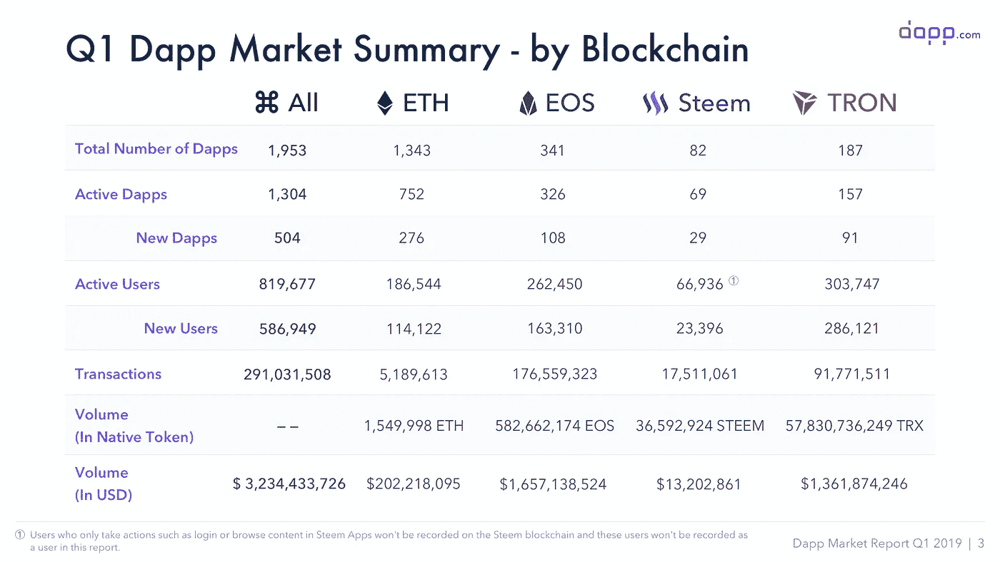
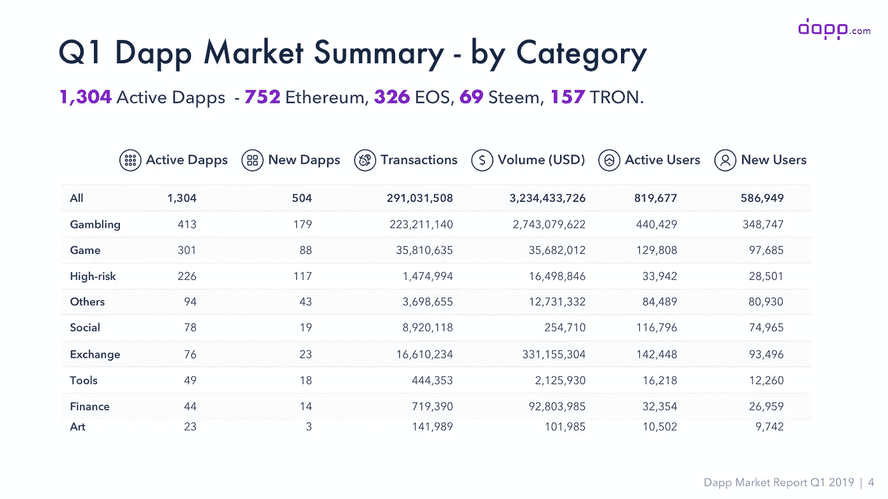
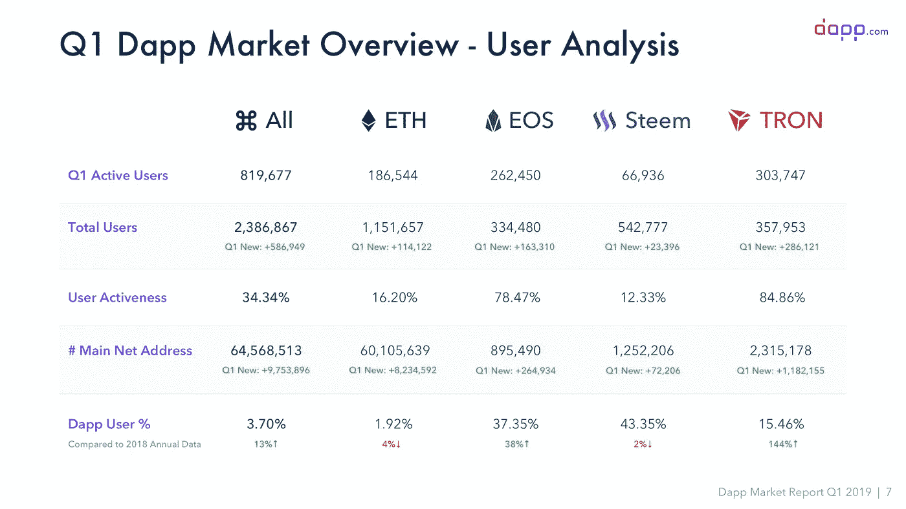
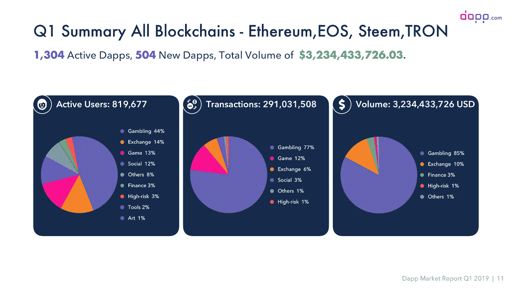
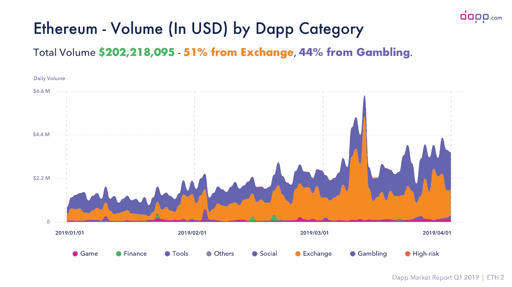
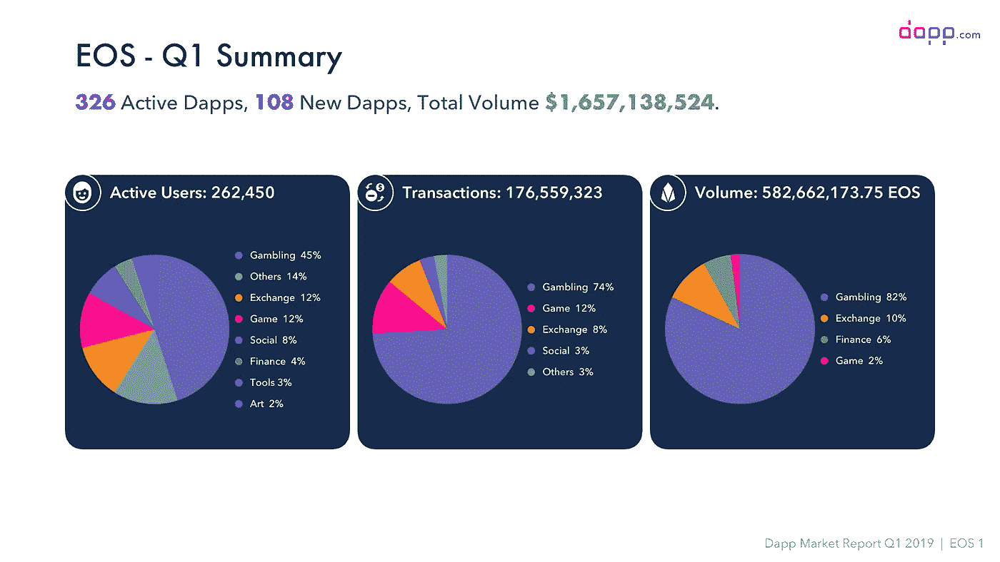
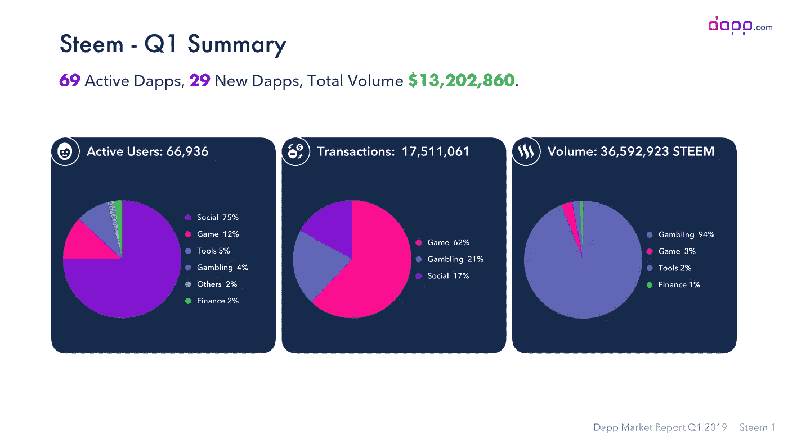
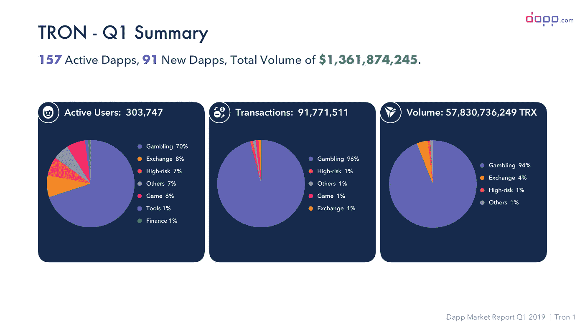
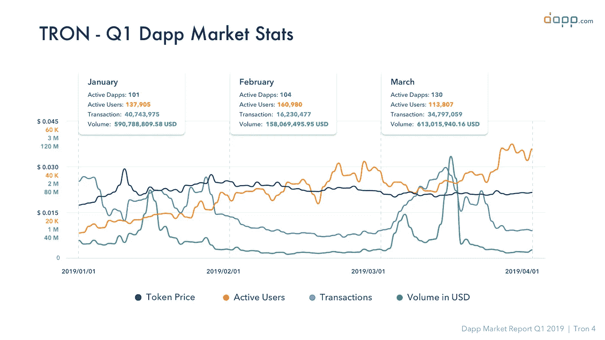

# Q1 2019 年 Dapp 市场报告

> 原文：<https://medium.com/hackernoon/q1-2019-dapp-market-report-7aca7cbbccad>

Q1 2019 年 dapp 市场报告，包含 4 个主流区块链-以太坊、EOS、Steem 和 TRON 最全面的数据和见解。

# 总结:

[***Q1 2019 年 dapp 市场报告***](https://www.dapp.com/article/dapp-com-q1-2019-dapp-market-report) 总结了最全面的数据，并提供了对 4 个主流区块链的见解——以太坊、EOS、Steem 和 TRON——它们代表了整个区块链生态系统，拥有市场上最活跃的用户。

*由于敏感内容、欺诈、安全问题等原因，有些 dapps 已提交给[Dapp.com](http://dapp.com/)但未获批准。这些 dapps 的数据没有包括在这份报告中。

# 亮点:

## Dapp 生长和活性

*   2019 年第一季度，**Dapp.com**共新增 504 家 dapp，以以太坊为基础的 dapp 占主导地位，占新上市 dapp 的一半以上。这表明以太坊仍然是开发者构建 dapp 的首选。与此同时，我们也看到了多链发展的趋势，因为许多以太坊 dapps 在多链上扩展，如以太坊+ EOS 或以太坊+ Tron。

*   就 dapp 的活跃性而言， **95%的 EOS dapps 保持活跃**—341 个 dapp 中有 326 个在第一季度有交易。建立在 Steem 和 TRON 网络上的超过 80%的 dapps 也有活跃用户。另一方面，尽管在 dapp 金额方面击败了其他连锁店，但近 600 家以太坊 dapp 在过去 3 个月中处于“不活跃”状态，没有任何交易记录。

## Dapp 音量

*   **四大主流区块链在 Q1 保持强势，总交易额达到 32 亿美元。** EOS 和 TRON 是 dapp 生态系统中最大的区块链，它们都处理了超过 10 亿美元的交易量。至于 Ethererum， [PoS](https://www.dapp.com/article/proof-of-stake-or-proof-of-work-whats-the-difference) (或 DPoS)和 PoW 之间的争论将继续围绕效率和因零交易费而被怀疑的 bot 交易问题展开。

## 用户增长和活动

*   *TRON dapps 拥有超过* ***30 万活跃用户*** *，其次是 EOS dapps，拥有约 26 万活跃用户。*截至 Q1 2019 年底，TRON mainnet 上创建的钱包数量已超过 230 万美元，其中，15.46%是 dapp 用户，自 2019 年初以来增长了近 1.5 倍。此外，超过 80%的 TRON dapp 用户在过去 3 个月中至少使用过一次 dapps 并在其中进行过一次交易。
*   新用户的增长主要是由赌博 dapp 推动的——这为 dapp 生态系统带来了近 35 万用户。游戏和交易所的新用户增长并驾齐驱，这两个领域在 Q1 吸引了约 90，000 名新用户。

## 以太坊:除了游戏玩家，Dapp 用户都在离开

*   dapp 用户的增长没有跟上以太坊 mainnet 钱包地址的增长，与去年相比，dapp 用户的百分比下降了 4%左右。与此同时，统计数据显示，许多老以太坊 dapp 用户(2018 年使用 dapp)正在逐渐离开，2019 年只有 72，422 名老用户仍在使用 dapp，低于 7%。
*   以太坊区块链上的成交量分布与 2018 年相比变化不大，dex 贡献了超过 50%的成交量，其次是赌博 dapps。这里有一个有趣的数据，以太坊玩家是所有 dapp 用户中最活跃的。超过 40%的每日活跃 dapp 用户是游戏玩家，但这些人只占 Q1 总活跃用户的 30%。基于以太坊的游戏已经创造了一个稳定的社区，拥有一群忠实的观众。

## EOS:更加多样化的 Dapp 生态系统

*   EOS dapp 卷的分布从 2018 年开始有了很大的变化。去年，EOS 赌博 dapps 占其总交易量的 99%。然而，自 2019 年 Q1 奥运会以来，EOS 上的 dapp 生态系统变得更加多样化，更多的游戏和金融服务平台加入了这一行列。

## 斯蒂安人越来越不活跃了

*   Steem dapps 不再仅仅是社交 dapp。游戏、赌博、工具和其他 Steem dapps 在 Q1 蓬勃发展。博彩类 dapps 在总交易额中的占比攀升至 94%，同比增长 104.35%。
*   根据 Steem 上最大的 dapp Steem 上的 [SimilarWeb](https://www.similarweb.com/) 的数据，其月访问量为 1000 万次。但第一季度只有不到 10 万 Steem 的链上用户。在 Steem 的区块链上，“链上用户”指的是那些有转账、投票和发布内容等活动的人，这些活动都被记录在区块链上。

## TRON:增长最快的用户群，单日交易量最高

*   TRON 是 2019 年增长最快的 dapp 生态系统。mainnet 钱包的数量和 dapp 新用户的数量都有最高的增长率。**值得注意的是，TRON 大约 85%的 dapp 用户也在 Q1 使用过 dapp**，这是 4 个区块链中用户活跃度最高的。

*   TRON 上的总交易量也非常可观。3 月 15 日一度突破 9100 万美元，远超以太坊和 EOS dapps 的历史最高纪录。

