# QA 工程角色:测试团队中的技能、工具和职责

> 原文：<https://medium.com/hackernoon/qa-engineering-roles-skills-tools-and-responsibilities-in-a-testing-team-7c499adc8057>

质量保证工程师对于每一个科技产品的发布都是至关重要的。根据团队的规模和结构，QA 被不同地看待和利用，但是是为特定的组织需求定制的。

最常见的是，软件测试职位被指定为 *QA* (质量保证)或*测试员*。它们还可能包括以下规格:

*   工艺:硒测试仪
*   领域:医疗保健 QA
*   专长:高级质量保证测试专家

其他与 QA 相关的工作包括 QA 分析师、QA 工程师、自动化工程师、测试自动化开发人员等。然而，这一系列独特的软件测试角色最终都有相似的职责。实际上，不同的头衔对于大规模团队来说可能有实际用途，可以表明员工的经验，并大致了解他们的能力。

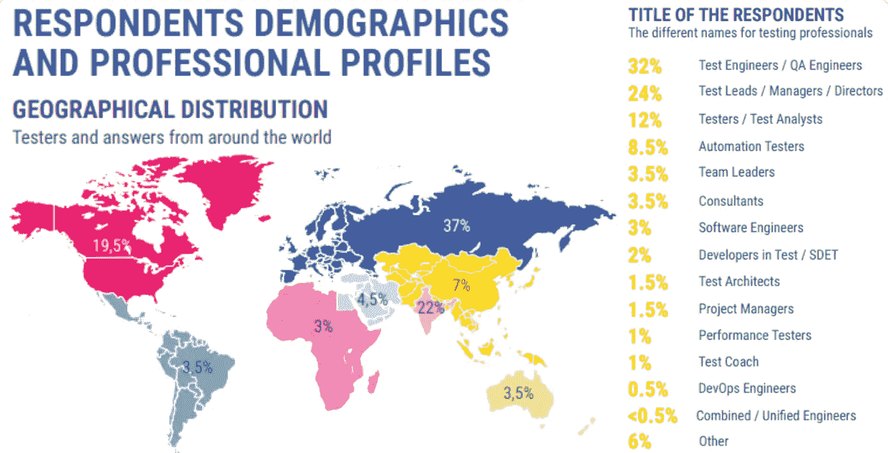

*Most popular QA job titles according to the* [*STATE OF TESTING REPORT 2018*](https://www.practitest.com/resources/state-of-testing-report-2018/?utm_source=qablog&utm_medium=button&utm_content=download) *by PractiTest*

QA 职位的模糊性和丰富性可能会导致测试人员如何融入软件开发的大环境中的困惑。在本文中，我们强调了软件测试中的三个主要角色，并详细阐述了每个角色的特定技能和职责:

*   人工质量保证工程师
*   自动化质量保证工程师
*   质量保证主管

为了记录在案，我们之前发表过一篇文章，根据资历描述了[软件开发人员的角色](https://www.altexsoft.com/blog/business/software-engineer-qualification-levels-junior-middle-and-senior/?utm_source=MediumCom&utm_medium=referral)。

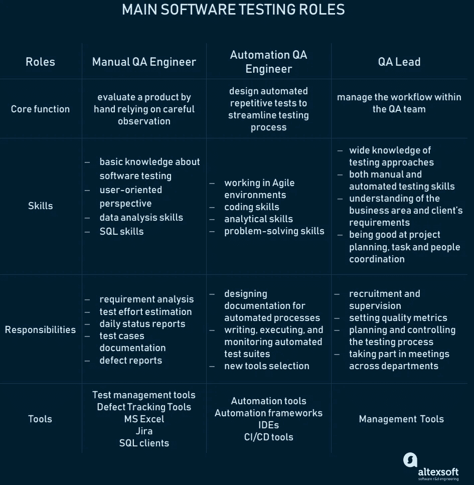

*主要质量保证工程角色:他们的核心职能、技能、职责以及他们使用的工具*

# 手动测试与自动化测试

尽管今天自动化测试有很强的趋势，但是一些测试场景要么手工运行更节省时间和成本，要么它们不可能像真实的用户交互一样自动化。除此之外，手工测试被用作开发自动化测试的第一步。

当时间不够的时候，**手动测试**是一个必选的选项，因为它更多的是关于测试执行，而不是计划。依靠人的技能对可用性测试更好。一个应用程序的用户友好性只能通过人工观察来正确评估——人工测试有助于发现 UI 和可用性问题，而自动化测试无法识别这些问题。

QA 工程师应用**自动化测试**在实现频繁的代码变更后运行重复和回归测试。自动化测试也是负载测试的首选，有助于验证系统在负载条件下的性能。尽管最初会有花费，但是自动化测试比手工测试要快得多并且不容易出错。此外，自动化测试是可重用的，并且易于在不同的机器上运行。

如果你对[手工测试和](https://www.altexsoft.com/blog/engineering/striking-a-balance-between-manual-and-automated-testing-when-two-is-better-than-one/?utm_source=MediumCom&utm_medium=referral)自动化测试的更基础的分析感兴趣，我们有一篇文章并列了这些方法。

# 人工质量保证工程师

如前所述，人工 QA 专家依靠人工观察来发现系统中的 bug。他们需要确保测试需求与测试目标相匹配。在 QA 领导详细了解测试工作流程(包括测试策略、环境要求、测试时间表、要测试的功能、资源和责任、可交付成果、退出标准、工具等)后，制定*测试计划*。)，测试人员编写*测试用例*——描述输入动作和预期响应的脚本。

在运行测试时，QA 工程师将实际结果与测试用例中概述的结果进行比较，如果不匹配，就记录一个缺陷。在*测试执行状态报告*中或者通过任何缺陷跟踪和管理工具，例如吉拉，将发现的缺陷传达给其他部门。

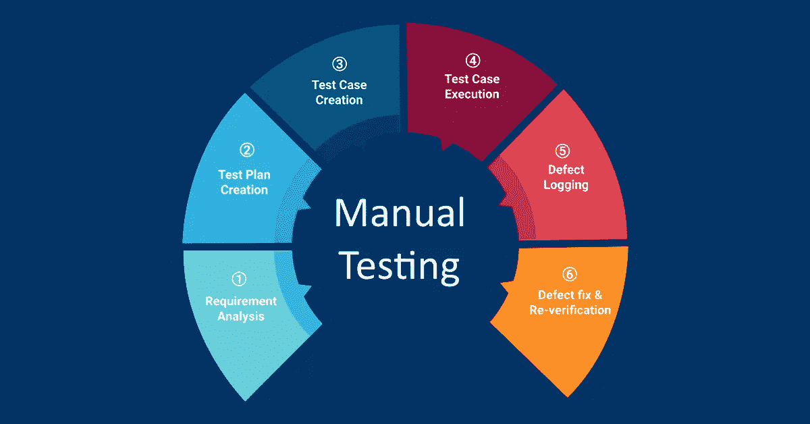

*Life cycle of the manual testing process. Image credit:* [*Abhishek Desai*](https://www.esds.co.in/blog/manual-testing-process-lifecycle/#sthash.5C1niMWd.kVeTKljR.dpbs)

一旦工程团队报告缺陷已经解决，QA 工程师必须验证问题是否已经解决。QA 工程师的工作流程在*每日状态报告*中管理，该报告监控项目的进展和每个参与的测试人员。状态报告采用不同的形式:电子邮件、文档或实时会议。你可以在我们的文章中读到更多关于优化软件测试过程的[工件的信息。](https://www.altexsoft.com/blog/engineering/6-ways-to-improve-software-testing-through-planning-work-environment-automated-testing-and-reporting/?utm_source=MediumCom&utm_medium=referral)

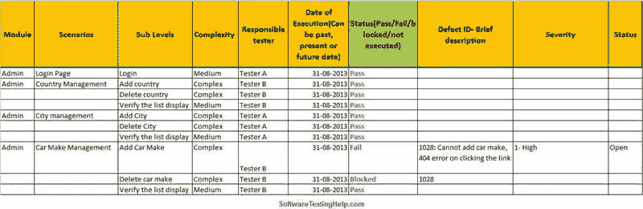

*QA Testing Status Report. Image source:* [*Software Testing Help*](https://www.softwaretestinghelp.com/test-execution-report/)

**人工 QA 的其他常见头衔:**人工测试员、软件测试工程师、QA 分析师。

在手动软件测试中，有三个资历级别:初级、中级和高级 QA 工程师。我们将从他们的技能、职责和他们处理的各种工具方面分析人工 QAs 的角色，同时考虑资历级别。

## 人工质量保证工程师技能

**软件测试基础知识。**进入软件测试领域，大三学生应该对主要概念和过程有一个正确的理解:整个 *bug 生命周期*；[不同的测试水平、方法和类型](https://www.altexsoft.com/whitepapers/quality-assurance-quality-control-and-testing-the-basics-of-software-quality-management/?utm_source=MediumCom&utm_medium=referral)；测试评估技术。

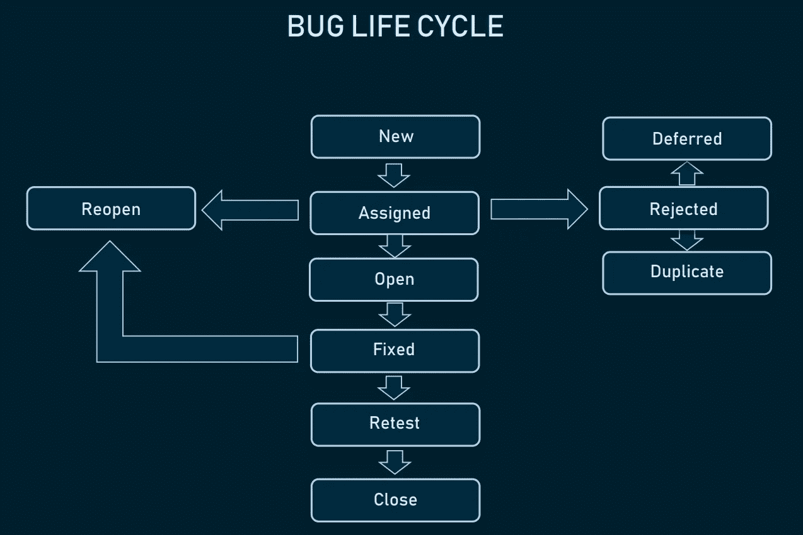

*Bug life cycle. Source:* [*ToolsQA*](http://toolsqa.com/software-testing/defect-life-cycle/)

但是，为了成为中级 QA 工程师，测试人员应该已经拥有强大的软件测试流程知识，对开发生命周期的深刻理解，以及不同测试类型的实践经验。

**快速学习。由于项目通常分配给测试的时间最少，QA 工程师需要快速学习，以便能够简化任务并按时执行分配的工作。考虑到最近的变化，有必要快速理解软件的需求和目的。**

**在截止日期前完成工作的能力。质量保证工程师应该能够有效地计划他们的工作，以便能够按时完成任务。**

**面向用户的视角。为了设计更多的实时场景，QA 工程师应该清楚地了解谁是最终用户，产品服务于什么目的，以及它如何对客户有用。**

**沟通和协作技能。拥有良好的沟通和团队合作技能对于软件测试人员来说是至关重要的，因为他们经常与项目团队成员、客户和利益相关者互动。掌握点对点通信将有助于 QA 工程师准确决定在每日状态报告中包含哪些信息。**

**好奇心。做一名 QA 工程师意味着不断质疑产品的质量。他们经常处理不完整的需求，他们需要问一些有意义的问题，这些问题将产生更多的信息并帮助有效地执行测试。**

**自组织，无需监控。**与在持续监控下工作的低年级学生相比，高年级学生知道如何在没有任何帮助的情况下优先考虑和评估任务的执行。高年级学生试图改变他们的工作方式以适应这些过程。

**与开发团队紧密合作的沟通策略。高级 QA 工程师经常必须与开发人员合作:从重现报告的问题和强调关键 bug 的修复，到了解 bug 是如何修复的。**

SQL 技能对于某些项目来说非常有用。需要 SQL 经验来验证测试数据，在数据库中插入、更新和删除测试数据值。因此，作为高级专家，高级 QA 工程师应具备下列数据库和 SQL 知识:

*   区分数据库类型
*   使用 SQL 客户端连接到数据库
*   理解数据库表、键和索引之间的关系
*   编写一个简单的 SQL 语句和更复杂的连接查询
*   解释更复杂的查询

## 人工质量保证工程师的职责

**每日状态报告。**质量保证工程师必须通过每日状态报告告知质量保证主管所执行的测试活动。

**详细的缺陷报告**，这需要熟练掌握特定的 AUT(被测应用程序)是如何工作的。

**列出需要改进的地方。在对产品有新的看法的同时，初级质量保证员应该有提高产品可用性的想法。**

**测试用例文档。**中级 QA 有一个专业门槛，使他们能够自己编写测试用例。除此之外，他们必须以特定的格式记录测试用例，这种格式根据组织的不同而不同。

**需求分析。**理解客户提供的要求和相关工作领域是为 QA 领导准备查询列表的必要条件。

**测试工作量估算。QA 工程师总是评估有效完成任务所需的努力。**

**有助于测试计划、设计和评估。**更有经验的高级 QA 工程师负责提供高级测试场景、挑战、风险、资源等方面的信息。，在测试计划会议期间。他们还应该帮助测试设计，并将高级测试场景组织成中级测试用例。基于他们丰富的经验，高级 QA 工程师能够提供最准确的测试评估。

## 手动 QA 工程师工具

除了使用不同的桌面和移动操作系统、浏览器和 web 代理进行跨浏览器测试之外，手动测试人员还使用以下工具。

**测试管理工具(TMTs)** 帮助组织测试过程。使用 TMTs，手工测试人员可以生成并存储测试报告，将它们与发布需求联系起来。一些 TMT 是[测试管理器](https://marketplace.visualstudio.com/items?itemName=ms.vss-testmanager-web)、 [TestLink](http://testlink.org/) 、 [SpiraTest](https://www.inflectra.com/SpiraTest/) 、 [TestRail](https://www.gurock.com/testrail?utm_source=adwords&utm_medium=cpc&utm_campaign=europe_en_brand&utm_content=testrail&gclid=Cj0KCQiArqPgBRCRARIsAPwlHoVDV1r659OS2SEVkQMiqnf5k1AOo9zNJV_LUyCF7Q_YTjJx2TrTJ3YaAt6VEALw_wcB) 、 [HP-ALM (QC)](https://software.microfocus.com/en-us/products/quality-center-quality-management/overview) 。

缺陷跟踪工具。在 dtt 的帮助下，QA 工程师跟踪应用程序中发现的缺陷，并生成 bug 报告，与开发团队进行沟通。dtt 的例子有 [BugZilla](https://www.bugzilla.org/) 、 [Mantis](https://www.mantisbt.org/) 、 [IBM Rational ClearQuest](https://www.ibm.com/us-en/marketplace/rational-clearquest) 。

MS Excel 帮助编写大量的测试用例，然后将它们导入 TMTs。 [Test Studio](https://www.telerik.com/download/teststudio) 是 Excel 的替代品，提供了更好的 UI 体验和测试用例可重用性。

**项目管理软件**具有时间跟踪、维基、任务列表、甘特图等功能，是敏捷项目的必备软件。[吉拉](https://www.atlassian.com/software/jira)是一个常见的[产品管理](https://www.altexsoft.com/blog/business/product-management-main-stages-and-product-manager-role/?utm_source=MediumCom&utm_medium=referral)选择，同样常见的还有 [Redmine](https://www.redmine.org/) 、 [YouTrack](https://www.jetbrains.com/youtrack/) 和 [Backlog](https://backlog.com/) 。

对于人工 QA 工程师必须连接到数据库的特殊情况，SQL 客户端会很有用。

# 自动化质量保证工程师

自动化 QA 工程师比人工 QA 专家拥有更高级的技能，因为他们编写脚本来运行重复测试。编程技能允许他们编写自动化测试脚本。正因如此，他们在测试中常常被称为*开发者*。使用不同的自动化工具，这些 QA 工程师设计、构建、测试和部署有效的测试自动化解决方案。他们的目标是用最少的代码集尽可能多地自动化测试工作。通过这种方式，他们优化了测试，如果手动完成，将会消耗很大比例的测试资源。

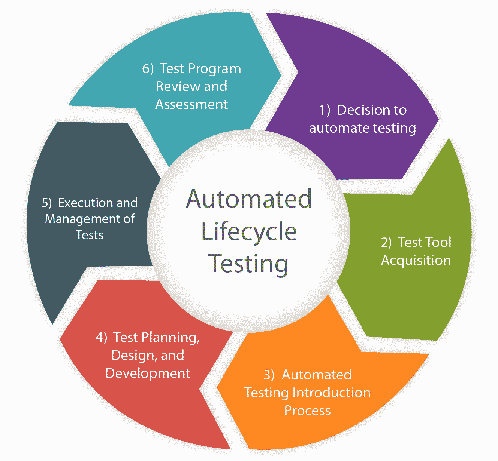

*Life cycle of the automated testing process. Source:* [*Kellton Tech*](https://www.kelltontech.com/quality-assurance-services)

**自动化 QA 其他常见头衔:** SDET(测试中的软件开发工程师)，技术测试员。

## 自动化质量保证工程师技能

**编码技巧。了解通用的计算机语言将允许自动化 QA 工程师编写自动化测试过程的代码。测试自动化最流行的编程语言是 Python 和 [Java](https://www.altexsoft.com/blog/engineering/pros-and-cons-of-java-programming/) ，其次是 Ruby、с++、Perl 和 PHP。鉴于其简洁性和全面的测试支持包，Python 允许捕获测试用例的本质。虽然 Java 是一门相当复杂的语言，但是它的应用非常广泛，在搜索引擎上可以找到很多例子。Java 有一个多样化的工具和包平台，通过集成像 Jenkins 这样的自动化工具，与 Java 的持续集成很容易。大三学生几乎不懂一门编程语言，而大四学生擅长几种编程语言。这使得他们可以在任何团队中无缝地工作，不管他们使用什么语言。除此之外，他们需要很好地掌握不同自动化测试技术所需的语言。**

**在敏捷的环境中工作。**虽然自动化 QA 主要在敏捷中工作，但他们应该了解自动化 QA 流程是如何工作的。

**分析能力。在检查错误报告后，自动化 QA 应该优先考虑必要的测试，并通过自动化测试来简化应用程序的功能。**

**解决问题的技能**帮助自动化 QA 工程师有效地发现 bug 并为它们创建修复程序。

## 自动化质量保证工程师的职责

**编写、执行和监控自动化测试套件。** QA 自动化工程师通过创建自动运行测试功能的脚本来设计自动化测试。这包括确定测试场景的优先级，以及创建实现这些场景的执行计划。

**为自动化流程设计文档。**这些文档包括测试计划、测试程序和测试用例。

**使用自动化测试框架。**简而言之，测试框架是更有效地创建和设计测试用例的实践和工具的集合。尽管是自动化测试过程的一个可选部分，一个有组织的框架减少了维护成本和测试工作，同时使测试自动化代码可重用、可维护和稳定。构建自动化框架是高级自动化 QA 工程师的高级任务。

**新工具选择。自动化 QA 工程师可以负责研究、推荐和实施工具，以提高项目的自动化程度。他们主动将创新的自动化测试策略和工具集引入到整个开发过程中。这些新的解决方案通常看起来是[持续集成(CI)和持续交付(CD)](https://www.altexsoft.com/blog/business/continuous-delivery-and-integration-rapid-updates-by-automating-quality-assurance/?utm_source=MediumCom&utm_medium=referral) 工具，尤其是当涉及到回归测试的时候。**

## 自动化 QA 工程师工具

除了为人工 QA 工程师提到的工具之外，自动化测试人员还使用以下工具。

**自动化工具。**其中最受欢迎的是 [Selenium](https://www.altexsoft.com/blog/engineering/the-good-and-the-bad-of-selenium-test-automation-tool/?utm_source=MediumCom&utm_medium=referral) ，TestComplete，Katalon Studio，以及 [Ranorex](https://www.altexsoft.com/blog/engineering/the-good-and-the-bad-of-ranorex-gui-test-automation-tool/?utm_source=MediumCom&utm_medium=referral) 。如果你正在考虑在你的项目中使用自动化测试，我们关于自动化测试工具比较的文章应该对你有用。

**自动化框架。自动化测试人员也可以利用现成的产品，比如基于 Java 的框架 Serenity 或以开发人员为中心的 Cypress 等，而不是从头开始构建复杂的自动化框架。**

**编写代码的 ide。** [VSCode](https://code.visualstudio.com/) 、 [Visual Studio](https://visualstudio.microsoft.com/) 、 [IntelliJ IDEA](https://www.jetbrains.com/idea/) 等。

**CI/CD 工具:** [詹金斯](https://jenkins.io/)[TeamCity](https://www.jetbrains.com/teamcity/)等。

# 质量保证主管

除了处理诸如建立度量标准、监督团队成员、管理外部资源和设计测试程序等日常职责之外，QA 领导还有广泛的工作职责，因为他们必须采取任何必要的行动来满足质量目标。

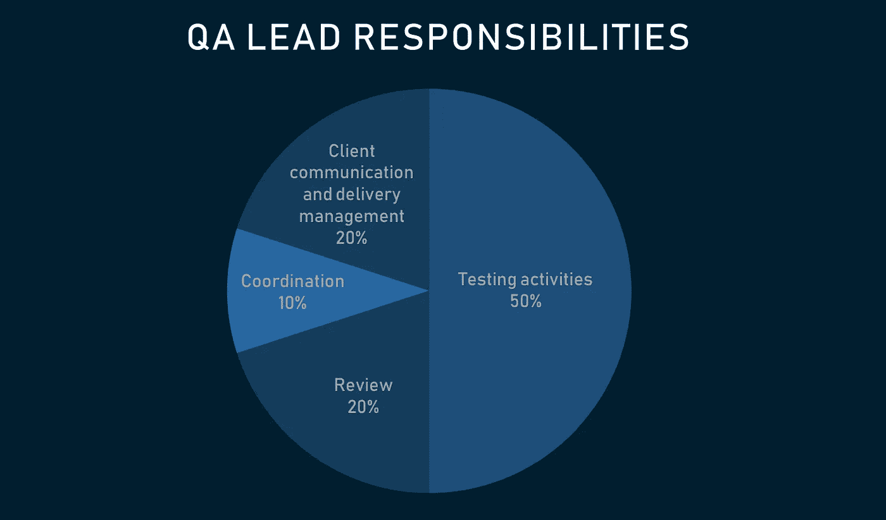

*QA Lead’s time is divided between responsibilities in a project. Source:* [*Software Testing Help*](https://www.softwaretestinghelp.com/qa-test-lead-interview-questions-and-answers/)

**QA 主管的其他常见头衔:**测试主管、首席 QA 分析师、测试经理。

## QA 领导技能

**手工和自动化测试技能。QA 领导有必要在手动和自动化测试方面都有经验，这样他们就可以定义哪些案例将受益于手动测试，哪些需要自动化。**

**广泛了解测试方法。**QA 主管应该非常了解测试的方法、级别和类型，以及测试工具，以便为项目选择最合适的工具。此外，他们需要跟上最新的趋势和技术。

对业务领域和客户需求的深刻理解。这对于确定测试策略、测试目标和目的是必要的。

擅长项目计划、任务和人员协调。所有的管理活动，包括为下属定义任务列表，管理必要的资源，以及确保必要的测试活动按时执行，都落在 QA 领导的肩上。

## 质量保证主管的职责

**测试策略准备。** QA 领导决定如何建立测试环境，如何管理信息流，实施什么测试工具以及应用什么行业公认的实践。除此之外，QA 领导建立测试文档、报告和其他程序的模板。因此，他们的工作责任重大。

**接受并阐明需求。**质量保证主管应确保项目要求得到精确定义。否则，他们需要通过与客户沟通来澄清这些问题。

**设置质量指标。QA 领导应该帮助开发人员建立度量交付质量的标准。有单独的度量标准来对缺陷进行分类，有度量标准来确定效率或回归比率，还有度量标准来定义初始质量是否已经交付。**

**计划和控制测试过程。** QA 领导应该开发测试计划和程序，安排测试活动，计划测试预算，并准备测试工作评估。通过持续的分析，QA 领导检查团队是否正确地进行了过程。QA 领导还跟踪每个测试人员的表现:检查他或她能够发现什么样的缺陷，以及哪里有遗漏 bug 的趋势。

在*需求跟踪矩阵*的帮助下，捕获双基线文档——需求和测试用例——QA 领导检查当前项目需求是否得到满足，所有测试用例是否被覆盖。

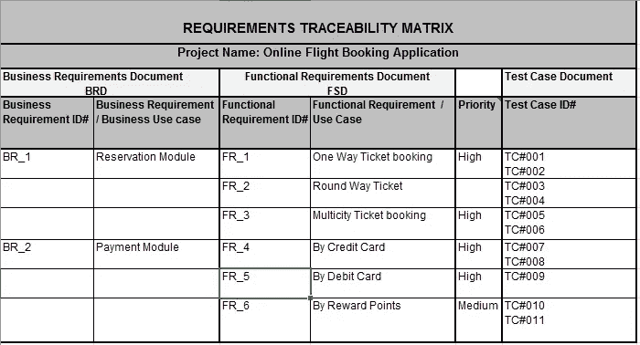

*Requirements traceability matrix. Source:* [*Opencodez*](https://www.opencodez.com/software-testing/create-requirement-traceability-matrix-rtm-free-sample-download.htm)

**招募和监督。**质量保证主管负责挑选质量保证职位的候选人，然后确定是否存在需要更多培训的知识不足或技能差距。

**代表 QA 团队参加跨部门会议。**测试主管参加不同的跨部门会议，并向客户更新测试活动的进度。

**持续测试过程改进。QA 领导总是致力于优化测试过程，包括使用合适的测试工具、测试技术和测试自动化。如果由于某种原因团队表现不佳，QA 领导有责任识别并解决问题。**

## QA 领导工具

质量保证负责人应该证明对项目使用的手动和自动化工具的熟练程度。除此之外，他们使用不同的管理工具。

**之前提到的项目管理工具**(吉拉、Redmine、YouTrack、Backlog 等。)对 QA 领导非常重要，因为它们有助于确定如何向团队介绍方法，如何培训初级人员，以及如何在整个开发过程中监控进度和质量。

# QA 工程师在软件开发生命周期中的角色

通过从测试人员的角度观察 SDLC(软件开发生命周期),我们可以跟踪测试人员和其他部门之间的关系是如何从瀑布式发展到敏捷式，然后发展到 DevOps 的。

在**瀑布**环境中，QA 工程师受限于他们的领域，并与 SDLC 的其他领域相分离。当从开发人员那里得到一些要测试的东西时，QA 团队自己计划测试。尽管它们与其他角色相互作用，但它们仍然作为 SDLC 的一个独立分支发挥作用。

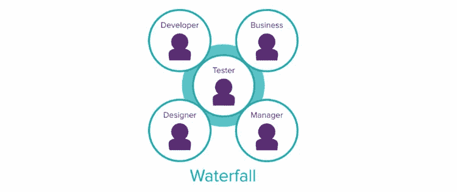

*Testin*g *domain in Waterfall model
Image Source: “A Practical Guide to Testing in DevOps” by Katrina Clokie*

在 [**敏捷**](https://www.altexsoft.com/whitepapers/agile-project-management-best-practices-and-methodologies/?utm_source=MediumCom&utm_medium=referral) 方法中，产品的质量被认为是一种集体责任。因此，其他角色开始参与测试，作为一个大团队协作:测试想法被共享，开发人员做更多的单元测试，业务领域现在也链接到 QA 过程。

在 Scrum 中，在冲刺阶段，开发人员和 QA 专家在相同的任务上合作，以避免意外和错误。

*Testing domain in Agile
Image Source: “A Practical Guide to Testing in DevOps” by Katrina Clokie*

然而，敏捷仍然有它的局限性，因为当产品被移交给运营部门以投入生产时，开发就结束了。尽管敏捷塑造了一个跨平台的团队，但它缺乏运营团队成员、支持等。

最后， [**DevOps**](https://www.altexsoft.com/blog/engineering/devops-principles-practices-and-devops-engineer-role/?utm_source=MediumCom&utm_medium=referral) 更进一步，将开发和运营合并到一个无限循环中，每个阶段都有测试。持续自然地进行，测试是项目中其他任务的一部分。

DevOps 中*连续测试*的概念意味着自动化测试的执行与软件交付管道不可分割，软件交付管道旨在对与软件发布相关的业务风险进行即时反馈。由于持续的测试，今天的测试人员的角色被扩展到处理复杂和加速的产品开发和交付。

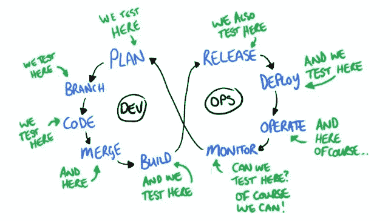

*Testing in DevOps. Image credit:* [*Dan Ashby*](https://danashby.co.uk/2016/10/19/continuous-testing-in-devops/)

开发运维测试中涉及的外部角色可能是分析团队、基础架构人员、监控和支持人员，这些都是运营领域中不同类型的角色。这是互利的，因为不仅这些人对测试有贡献，而且测试团队为他们的工作提供了信息。

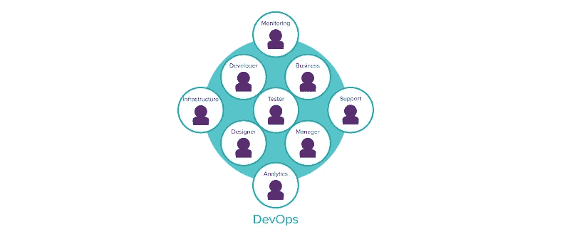

*Testing domain in DevOps
Image Source: “A Practical Guide to Testing in DevOps” by Katrina Clokie*

# 全栈 QA 工程师:未来的测试者

有了新的开发模型——敏捷和开发运维——测试规程扩展到影响从事同一项目的其他团队。测试员的角色不断发展，给了 QA 工程师在公司内更多的权力。

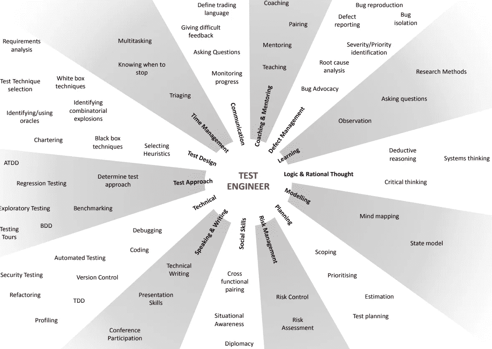

*Core skills of the modern QA Engineer
Source:* [*Redgate*](https://www.red-gate.com/wp-content/uploads/2014/02/Test-Engineering-Skills-v3.pdf)

通过测试产品质量的各个方面，如功能性、可用性、性能、安全性、全球化等。，并结合不同的策略和技术来测试一个 app，测试人员当然可以被称为全栈 QA 工程师。他们拥有领域知识、技术技能和测试专业知识的丰富组合，这使他们能够满足快速交付的现代需求。因此，每个测试人员都应该追求全栈 QA 工程师的道路，他们从一开始就参与项目开发生命周期，因此对产品有更大的影响，这导致了比以前更高的质量水平。

肖恩·奥尔登多夫在 [Unsplash](https://unsplash.com/?utm_source=unsplash&utm_medium=referral&utm_content=creditCopyText) 上拍摄的照片

*最初发表于 AltexSoft Tech 博客**[***QA 工程角色:测试团队中的技能、工具和职责***](https://www.altexsoft.com/blog/engineering/qa-engineering-roles-skills-tools-and-responsibilities-within-a-testing-team/?utm_source=MediumCom&utm_medium=referral)*