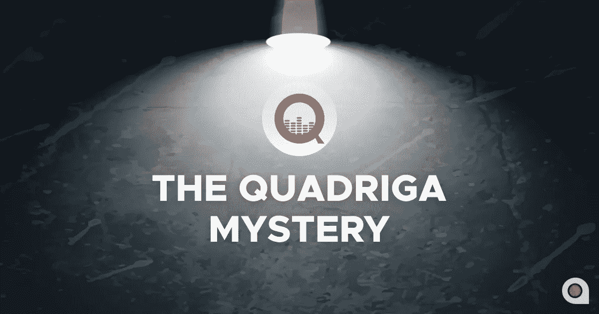

# 夸夸其谈:一场历史性的秘密灾难

> 原文：<https://medium.com/hackernoon/quadriga-a-historic-crypto-catastrophe-dfaa1bb7f88c>

# 四边形之谜

QuadrigaCX 首席执行官 Gerald Cotten 的神秘死亡使其成为世界媒体的焦点。2 月初，该公司要求债权人提供保护，声称无法使用 cold wallets，只有 Gerald Cotton 知道其密码。法院给予该公司 30 天的诉讼保护，并选择 EY 作为独立观察员，但很明显，Quadriga 正在等待他们的客户进行审判和诉讼。

在宣誓作证的过程中，已故 Gerald Cotten 的妻子 Jennifer Robertson 证实，该公司持有 2.5 亿加拿大元(CAD)或 1.9 亿美元的数字货币和属于他们客户的法令。冷热钱包中的资产数量不得而知。罗伯逊宣称少量加密货币被转移到热门钱包。

“通常，Cotten 会将几乎所有的硬币重新放置到冷库中，以更好地防范黑客攻击，”她补充道。根据她的陈述，现在知道 Cotten“完全负责管理用户的资产。”

*“Quadriga 加密货币储备现在不可用，其中一些可能会丢失，”*罗伯逊写道。她有科滕的笔记本电脑，但她和专家都无法提取其中的加密信息。

罗伯逊说，即使在科滕死后，他们的客户仍继续存款，这些存款最终被承认。其中一些是自动的，但至少有一个用户进行了手动转移。创始人的妻子不知道有多少比例的资金存储在“热”钱包中，即需要不断连接到网络的平台，以及哪些交易在菲亚特 mo 中进行。此外，罗伯逊补充说，一些加密硬币有可能存储在其他网站的账户中。

这份文件的结尾是向法院申请免除交易所可能面临的其他诉讼。Quadriga“迫切需要免于诉讼，这将使它和它的同行有额外的时间来搜索可访问的数字资产，并讨论与银行合作的可能性。”罗伯逊认为，否则，“该交易所的许多(如果不是全部)客户可能会遭受额外损失。”

# 夸德里加的金钱漏斗

一些 QuadrigaCX 加密货币资产仍有可能存储在第三方交易所，但这一信息尚未得到证实。分析公司 Elementus Group 的专家发现，加拿大加密货币交易所 QuadrigaCX 可能无法访问客户拥有的 1.9 亿美元的冷钱包，可能从来没有这些钱包。此外，几乎所有的 140 万以太币(按当前汇率计算超过 2 亿美元)都被送到了其他公司和交易所的在线钱包中，交易所称这些硬币存放在冰冷的 Quadriga 钱包中。

此外,[华尔街日报](https://www.wsj.com/articles/our-cash-went-to-something-customers-hunt-for-bankrupt-crypto-exchanges-missing-millions-11550596908)报道称，至少价值 3500 万美元的乙醚被送往一家证券交易所，该交易所此前被怀疑帮助罪犯洗钱。这些醚然后被转换成比特币和其他加密货币，并转移到其他平台，最终进入匿名钱包。至少有 268，000 个乙醚被送往 ShapeShift AG，该公司涉嫌帮助犯罪分子洗钱数百万美元。存放用户资金的钱包的真正所有者不得而知，因为 ShapeShift 使得匿名使用加密货币进行操作成为可能，直到 2018 年 10 月。

# 有解决办法吗？

加密货币社区中没有多少 QuadrigaCX 客户端，但公众对这个故事感兴趣，因为它是该行业状况及其造成的混乱的一个指标。许多用户认为这个案例生动地展示了为什么加密货币领域需要正常的监管。在垂死的首席执行官的笔记本电脑上的钥匙、锁着的金库和不付款之后，用户相信混乱不会停止，直到监管机构干预并建立正常的操作规则。

然而，Quadriga 团队正在积极寻找解决方案。这是他们网站上的官方声明:“在过去的几周里，我们做了大量的工作来解决我们的问题，试图找到并保护保存在冷钱包中的大量加密货币资金。这些资金对于维持我们客户账户的平衡和接受我们银行支票的金融机构的资源支持是必要的。不幸的是，搜索没有成功。听证会后将公布进一步的报告。"

T2 应用软件公司的首席技术官 Andrew Zubko 认为，如果交易所一开始就做得好，这个问题就不会出现。存储资金的最佳决策是使用多重签名，并将数据访问权授予至少两个人。例如，要实现一个事务，您需要指定五个签名中的三个。如果其他参与者可以访问被设计为多钱包的钱包，这意味着如果其中一个参与者去世，其他参与者可以安全地管理资金。当然，任何问题都可以找到解决方案，但在这种特殊情况下，这可能会花费很多时间。这种情况可以认定为资金存放不当。不幸的是，目前没有人能保证 Quadriga 的客户不会赔钱。

专家们还有一些其他有趣的观点。例如， *Whispers* 的创始人兼首席执行官希沙姆·法奥里(Hisham Faouri)认为，即使创始人没有出事，他们也应该提供所有必要的解决方案来保护存储的资金。没有后备计划，一个人不可能接触到所有的东西。必须有一定的组织和管理程序。如果一个拥有巨额资金存取钥匙的人失踪了，总会有人替他做这件事。因此，我们可以说其中一个问题是公司内部管理不善。

对这一特殊事件的一些研究揭示了它本来是可以解决的。当一个人去世或失去对某些东西的控制时，可以实现一种形式的人机界面。机器或计算机基于他/她的响应或无响应来与用户行动/通信。任何对其他人无法访问的数据和资产拥有完全控制权的人都必须找到一种方法，在发生此类事件时将所有权/占有权转移给其他人。

我们在这里谈论的是一个平台，它可以传输和管理数据，并创建一个工作流，该工作流仅在特定用户没有响应的情况下运行。举个例子，假设你有 100 个比特币储存在一个无人知晓的安全的在线或离线钱包里。您可以将该钱包的种子自动传递给家人。例如，如果你一周没有登录你的 Gmail 或脸书账户，就会触发这种情况。一个程序可以连接到你的 Gmail 或任何社交媒体网络，并检查你的在线活动。您可以设置多个触发器:向您发送电子邮件、向您的亲戚发送短信、在您的脸书上发布内容或停用您的社交媒体个人资料。目前有公司在做密码管理、遗嘱管理、遗产管理。如今，在区块链有遗嘱被执行，这是安全和可靠的。

用户可以将许多触发器分配给平台。然后，它可以将某人的加密货币遗产的密码转移给他们的家人。这是一种可能的解决方案，可以将 Quadriga 从目前的不幸境地中拯救出来。

# 北海巨妖来了

社区对这个奇怪的故事有很多疑问。Cotten 于 12 月 9 日去世，那么 QuadrigaCX 加密市场是如何在没有加密货币的情况下运作如此之久的呢？这段时间运营钱包补多少？为什么钥匙丢失这么久都没有向公众报告？

北海巨妖似乎知道 QuadrigaCX 客户的数千个地址，并表示愿意协助调查。北海巨妖团队发布了以下消息:

> “我们悬赏 10 万美元给发现夸夸其谈硬币的人。对于导致重大进展或发现全部或部分失踪客户资金的信息，北海巨妖将给予奖励。如果有奖励的话，哪条建议值得奖励完全由我们决定。所有奖励的总额将不超过 100，000 美元。北海巨妖可能会在任何时候结束这个奖励计划。北海巨妖收集的所有线索将提供给联邦调查局、加拿大皇家骑警或其他执法当局，他们对此案有积极的兴趣。”

北海巨妖组建了一个专家团队，他们将跟踪已知钱包的资金转移，并调查它们回归的可能性。

感谢您的阅读！想要获得更多更新和见解？

请访问我们的官方网站:【https://applicature.com】T2 或通过电子邮件联系我们【info@applicature.com】T4