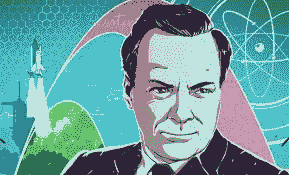

# 量子计算机:不切实际的梦想还是既定的真理？

> 原文：<https://medium.com/hackernoon/quantum-computers-unrealistic-dream-or-established-truth-6839b04e6c18>

## 来自外太空的不明飞行物，美国和美国接吻和化妆，英国退出欧盟迟早会发生，唐纳德·特朗普表现出一些谦逊。我们知道这是不可能的。那些怀疑量子计算机在我们世界的未来的人也这么说

Photo by [Mar Cerdeira](https://unsplash.com/@estudiodelmar?utm_source=unsplash&utm_medium=referral&utm_content=creditCopyText) on [Unsplash](https://unsplash.com/search/photos/graffiti-kissing?utm_source=unsplash&utm_medium=referral&utm_content=creditCopyText)

# 像不明飞行物一样可能

我不是计算机科学家，也不是物理学家，所以从长远来看，也许我的一毛钱并不重要，但我仍然可以有自己的观点，我对量子计算机有自己的观点。

量子计算的世界是一个相对较新的世界。每天都有新的理论和主张出现在那里，既有成熟的出版物，也有博客文章。自然，这可能导致对学科发展方向的各种态度和立场。大多数人——或者至少是我读过的那些人——主张量子计算机有一个光明的未来，以及在未来几十年，当它们达到一个新的复杂等级时，它们将如何在我们的生活中发挥重要作用。然而，那些驱散了他们有多重要的神话的文章——也许并不少见——远远少于那些拥护 QC 的文章。

> 这是为什么呢？

为什么量子计算机就像访问我们星球的 UFO 一样是一个幻想，其中一个主要的理由是因为一些物理学家认为量子比特是按照自己的节奏播放的现象，让它们做我们想要的事情，操纵它们的量子本质和行为对它们要求太高了。考虑到建造成本和其他未知因素，这种计算机将使可能的任务成为一个徒劳的项目，这是由人类可以控制量子世界的傲慢想法推动的。

再想一想，穿白大褂的人，你们书呆子气，实验室混乱，头发蓬乱，在你们的疯狂和对真理的追求中，你们忘了吃饭。

# 夸托诺维奇和未来

“W你在那里说什么来着？”

我转向左边:一个男人正站着。五英尺十英寸，身材苗条，戴眼镜。

*你是谁？*”我问他。

“谢尔盖·夸托诺维奇教授，听候您的吩咐，先生，”他回答。

“你在这里做什么？”我说。

“我刚刚告诉你了。”

“你跟我说什么？”

"我听候你的吩咐。"

“为了什么？”

“你的疑惑，你的疑问。”

“你是俄罗斯人吗？”我接着问。

“是的，斯皮塔利亚大学的量子计算机怀疑理论教授。”

“权杖大学——”

“我知道，这很难理解，”Quantonovich 插话道。

"什么是量子计算机怀疑理论？"

"*一个应该被丢到黑暗时代的扯淡学派！一个声音在我的右边响起。*

我转向那个方向:

“你是谁？”我对我旁边的黑人妇女说。她很年轻，穿着优雅，看起来非常像蕾哈娜，有一双让我想死的炯炯有神的眼睛。

“他的对面。未来。”

“你叫什么名字？”

“你们最好做好准备，因为我们即将迎来一场变革。"

“那是一个很长的标题。”

“不是我选的。”

“那你们两个人怎么会在这里。”

“我们在这里争论，解决问题，”Quantonovich 说。

“是这样吗？”我问 Futurio。

“当然是，亲爱的……你为什么对这些感兴趣？”她说。

“我只是一名科技记者，一名博客写手，试图弄清这一切。”

“底部，”Quantonovich 说，“没有底部。只有悖论和反索赔永远继续下去。”

“请坐，”Futurio 对我说。

***不知从哪里冒出来一把椅子。***

> 魔法。

”*我要坐吗？*”我问。

“是的，”Quantonovich 说。

我感觉很舒服。

“现在怎么办？”我说。

“你先来，Quantonovich 教授，”Futurio 说。

"好吧……听着，你相信量子计算机会成为现实吗？"Quantonovich 问我。

我想了一秒钟，然后说:

“我希望如此，是的。”

“那么，请想一想:现在，作为一名训练有素的计算机科学家、受人尊敬的医生和数学家，我也持这种立场，所以请听我说完……当谈到由非量子架构构建的全功能量子计算机时，我们面临的主要问题是噪声。你有没有意识到，所有的物理系统都是嘈杂的 buggers，在叠加和纠缠的量子状态下保持量子位的微妙位置意味着它们在某个时候不可避免地会被噪音的外力破坏。”

"我们就不能把噪音关小吗？"我天真地问，我知道。

“不，因为这不仅仅是一个让架构的物理工程正确的问题……*你看，有不同级别的噪音*。而噪音，至少在量子世界中，更多的是关于过程中的错误，这些错误可以影响量子比特的量子状态，以执行我们希望它们在纠缠阶段执行的操作。”

”*我有点失落？*”

“基本上，噪音或错误率会影响量子位在纠缠状态下的状态，这会破坏它们，使它们变得无用。”

"所以你的意思是你需要减少错误？"

“差不多吧，是的。纠错将是王国的关键，我不认为我们现在或将来有科学知识来完成它。这是两种截然不同的现象:物理量子位和逻辑或操作量子位。”

“又有什么区别呢？”我问我的大脑开始升温。

“逻辑量子位是计算能力的来源。物理量子位将只是可牺牲的假人，被创造出来的唯一目的是因为它们的错误而被淘汰，这样逻辑量子位就可以开始工作。”

“不错的理论，”我评论道。

“但困难就在这里——要做到这一点，实现操作上的一致性，需要的物理量子比特要比逻辑量子比特多得多。”

*到底有多少？*

“谁知道呢？五百比一。一千比一。*可能更多*。无论是多少，这在科学上都是不可能的。”

“他在胡说八道，”Futurio 插嘴说。

“你知道我不是……假设我们可以达到 10 个逻辑量子位，这将是可操作的，我们需要更多的物理量子位来对抗它。但是让我们保守一点:你将需要 1⁰来解决容错问题，”Quantonovich 继续说道。

" [D-Wave](https://www.dwavesys.com/home) 已经估计他们有超过一千个量子位机器？"Futurio 对 Quantonovich 说。

“D-Wave 是一家心不在焉的公司。即使有[谷歌](https://ai.google/research/teams/applied-science/quantum-ai/)和 [IBM](https://www.research.ibm.com/ibm-q/) 的资源，在计算上也是不可能的… *你现在明白我在说什么了吗？Quantonovich 问我。*

“比以前多了，但仍然很难，”我回答。

“更重要的是，两个阵营是分裂的:一方，我所在的地方，科学家和数学家，不相信它。另一方面，风险资本家和想从中赚钱的人持不切实际的观点。很简单，用英语怎么说，“粉笔和奶酪”。量子至上是一个不可能的壮举。”

Source: storyblocks.com

“别听他的，先生——我的阵营里有很多物理学家和计算机科学家。他只是嫉妒，因为我们抢了他的风头！”未来对我说。

“别听她的！”Quantonovich 喊道，现在很生气，用手指指责地指着 Futorio。

“量子位的创建方式是否会成为建筑系统内物理量子位与逻辑量子位比例的障碍？”我问。

"你是说它们是由超导体、俘获离子、光学方法还是其他方法制成的？"Quantonovich 回答。

“是吗？”

“还没有证明它会影响结果。”

“那是一种耻辱。”

“我想我已经说得够多了。Futurio 教授，你现在愿意为你失败的事业辩护吗？”Quantonovich 说。

"我当然愿意……那么，你受过科学训练吗，先生？"Futurio 问我，她慢慢走向我。

“不，我不是。”

“你的职业是什么？”

"我是一名作家，也是一名教师。"

“什么，如果我可以问吗？”

“英语和商务。”

“英语……有意思。还有你对量子计算的兴趣是从哪里来的？”

“从书本上，在学校学物理。阅读理查德·费曼的作品，这对于没有受过良好训练的人来说是很容易理解的。”

“我同意。这个人是个天才……你知道吗，我年轻的时候迷恋过他——至少是他的照片。”

“不，我没有。”

“你喜欢什么书？”

你肯定在开玩笑，费曼先生！一个好奇角色的冒险和*物理法则的角色。”*

Richard Feynman. Source: hackaday.com

“伟大的书，”Futurio 笑着说。

“你是要开始，Futurio，还是要谈论一个甚至没有自己写书的人的文学品质——这些书都是转录的。”

“好吧，好吧，冷静点，Quantonovich……所以，当我告诉你我们要带着这些机器去某个地方的时候，你一定要相信。也许目前我们正处于量子计算的图灵时代，从现实角度来看，回到了 30 年代末或 40 年代初，但我们正在快速前进，很快我们就会到达我们想要的地方。”

“我希望如此，”我说。

"听说过[噪音中等规模的量子](https://www.darpa.mil/program/optimization-with-noisy-intermediate-scale-quantum-devices)设备吗？"

“不，从来没有，”我回答。

"嗯，他们将解决 Quantonovich 教授认为现在量子架构存在的问题."

“他们永远也解决不了物理量子位与逻辑量子位的高比率。我举十比一的例子是因为我尊重你，Futurio 教授。我相信，创建一个完全可操作的逻辑量子位将需要数千比一，比如说 20，000 个物理量子位——你认为 NISQs 会在这方面帮助你吗？”

“我以为轮到我说话了？”Futurio 说。

“继续。”

“不，我不会。我不会，你知道为什么吗？”Futurio 说，看着我，她美丽的眼睛现在很悲伤——这不是一件好看的事情。

“她被打败了。Quantonovich 说:“科学最终取得了胜利。

“我要走了，”Futurio 宣布，她开始走开。

“就这样，做吧。去告诉所有的金融家，所有 IBM、谷歌和英特尔的梦想家，他们在浪费时间，量子技术只是一门伪科学，一种骗取风投资金的方式……”

“顺便问一下，你叫什么名字，孩子？”Quantonovich 对我说，他现在搂着我，脸上的笑容沾沾自喜于它的学术部署。

“詹姆斯，”我回答。

“好了，詹姆斯，我最好现在就走。他看了看手表。一小时后我有一个讲座。"

“关于什么的讲座？”

“高级量子场论。*你想来吗？*

“好的，请。”在我们离开之前，我回答道。