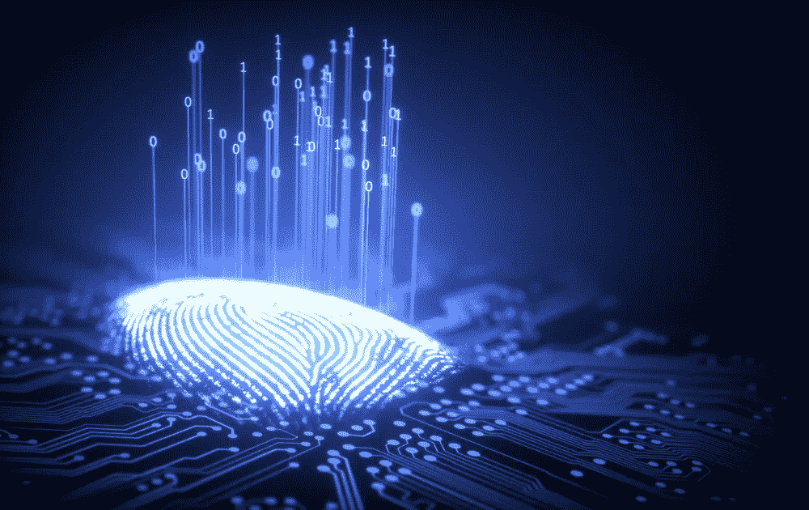
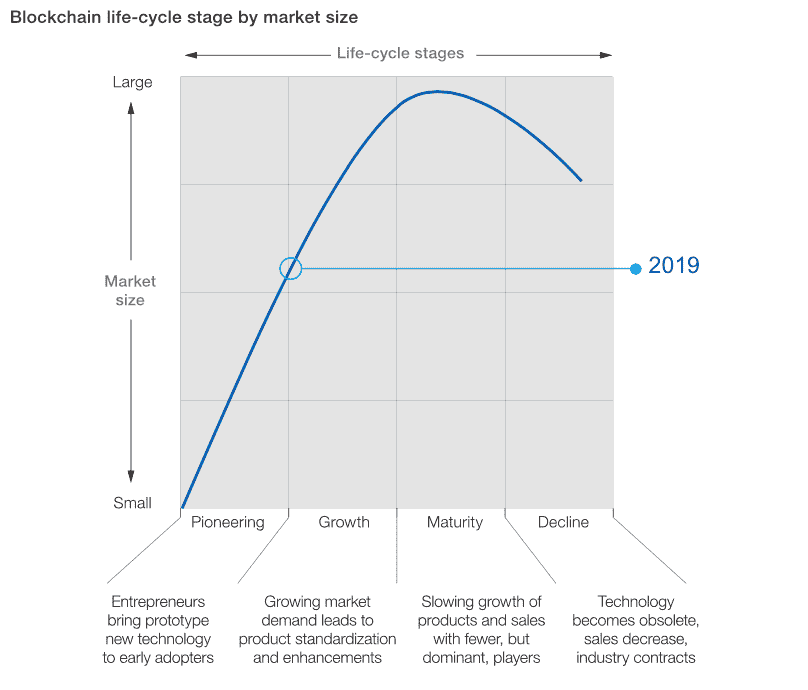

# 量子计算——区块链能被黑吗？

> 原文：<https://medium.com/hackernoon/quantum-computing-can-blockchain-be-hacked-19c2ec7bac85>

**“密码术**是一个涉及语言和数学技术的领域，用于保护信息，尤其是在通信中”以及分布式账本技术的安全特性。**量子计算机**一直被称为比特币和整个[加密货币](https://hackernoon.com/tagged/cryptocurrency)行业的阿喀琉斯之踵。由于在计算速度上的压倒性优势，量子计算机理论上不仅可以用来破坏分散系统或区块链的活动，还可以用来破坏使用任何加密技术的任何软件的活动。

*在德国，你可能会称之为‘bauernfnger’(因为在德国，我们几乎所有的东西都用一个单词来表示)，在英语中，可能是‘horns’通过策划吸引眼球的标题来吸引人们的注意力，或者是‘流行语’？*

*这在 crypto 里挺常见的？或许无处不在的“社交媒体”，终极真相。你有 FUD(害怕不确定性和怀疑)新闻——传播负面新闻，通常没有确凿的证据或个人观点。你有 FOMO(害怕错过)新闻——应该让你相信有些事情很棒，你不应该错过，否则……罗伯特·恰尔迪尼的《影响力》一书中也描述了一个很好的说服方式。*

但是，够了，否则评论区可能会变成 FUD 频道？

## **首先要做的事情:**

> *“84%的受访者认为区块链能提供比传统 IT 系统更高的安全性。”德勤*

以下是**区块链的独特功能**，原则上:

1.  旨在跨网络分布和同步。这使得它成为多组织业务网络的理想选择，如供应链或金融联盟。
2.  一个人可以进行的交易由参与者事先达成一致，并作为“智能合约”存储在区块链中。这有助于树立每个人都在遵守规则的信心。
3.  被称为“共识”的过程有助于将不准确或潜在的欺诈性交易排除在数据库之外。
4.  资产来源的概念。这意味着，对于任何资产，通过记录数据的不变性，你可以知道它在哪里，它去过哪里，以及在其整个生命周期中发生了什么。

所有这些都是为了实现更安全、更快速、更透明的交易方式。企业应用和测试这种颠覆性技术的例子有[这里](https://www.linkedin.com/pulse/disrupt-disrupted-danny-j-christ/)。

> *通过实施区块链技术，在业务运营方面有可能节约 70%的成本，在合规方面有可能节约 30–50%的成本。研究之门*

关于量子计算机是否能在理论上**破解用户钱包上的加密**的讨论正在进行。计算机可能只能通过看到地址的公钥来推断出它的私钥。第二种潜在的攻击方法是控制整个网络。通过纯粹的计算速度，量子计算机可以压倒比特币网络上的其余 miner 节点，并达到网络散列率的至少 51%。第二种方法也可以由一个强大的矿商实现，收购大部分(51%的网络)。**值得注意的是，没有一次攻击是由区块链本身的弱点造成的。而是人为错误或外部技术漏洞的结果。**

> 原则上，量子通信实现了绝对的安全性——也就是说，任何对手都无法拦截或篡改消息。科学日报

*其他可能的攻击方式:*

*相对很少提到的可能对加密货币造成大量损害的攻击是* ***Sybil 攻击。*** *攻击包括攻击者用他控制的节点淹没网络。*

*一种* ***DDoS 攻击*** *是一种恶意玩家通过向服务器注入大量流量来使其过载的攻击。*

****路由攻击*** *表明 30%的比特币网络的节点由 13 个不同的 ISP 托管。与此同时，流向比特币节点的总流量的 60%以上由总共 3 家 ISP 处理。**

****负责创建、运行和维护区块链网络的人类*** *是所述网络漏洞或骗局的主要来源(这适用于所有开发的技术)。**

## ***那么，Crypto 注定要失败吗？***

*没有人能确切地说量子计算机将能够产生什么样的影响。但有一个共识是，它不会使网络过时。*

**

**量子计算机仍处于萌芽阶段。如果说比特币和加密货币还处于青少年时期，那么任何可行的量子计算机都还在学习如何爬行。**

*2019 年，IBM、谷歌和英特尔正在开发的量子计算机屈指可数。在推进量子空间的发展之前，必须首先解决计算机硬件的局限性。此外，已经有现存的[加密方法](https://www.esat.kuleuven.be/cosic/elliptic-curves-are-quantum-dead-long-live-elliptic-curves/)可以抵抗**量子**。*

*如果有一台足够强大的量子计算机突然出现在世界的某个地方，许多加密货币已经开发并部署了缓解机制。例如，通过只使用一次性地址，量子计算机甚至无法破解用户的加密密钥。*

*然而，随着 IBM 宣布商用量子计算，世界上最具弹性的技术可能面临第一次严峻的技术挑战。*

# ***复杂系统以复杂的方式失败***

*任何对真区块链的潜在利用，或者利用量子计算的大规模密码盗窃。尽管 IBM 宣布了，但它只能由一个民族国家行动者或一个财力雄厚、拥有大量物理空间的非常坚定的企业来实施。IBM 和其他技术专业都在用区块链**进化。**至关重要的是，他们的管理层了解底层技术，以及它如何影响他们业务的核心功能和整体经济。*

*云计算在很大程度上是一种没有保险且容易产生风险的技术。区块链比现在使用的许多遗留系统和数据库要好得多，也安全得多。它不需要在量子计算上花费数百万美元来侵入传统系统。一个简单的勒索软件可以是它所需要的一切，或者是一个低成本高影响的社会工程，或者是一个简单的网络钓鱼攻击。*

# ***那么，量子计算可以用来黑区块链吗？***

> **“让区块链防黑的是区块链的百万用户。它们使得任何人都很难破坏网络。每个块都有一个时间戳和一个到前一个块的链接，形成一个通过加密技术加强的按时间顺序排列的链，确保记录不会被他人篡改。”**

***因此从技术上来说，区块链自己对黑客攻击是免疫的。**在任何情况下，集中式遗留系统和数据库比(分散式)分布式分类账技术更容易被破解、更改和误用。*

*每一项新的数字技术都会经历软件缺陷和有人试图破解的初期痛苦。这些痛苦只是暂时的，它们会导致技术和良好实践实施的整体改进。这不应该阻止中小企业、跨国公司和其他企业服用区块链药丸。围绕它的技术和实践只会越来越好。更不用说更快更安全的未来，任何落后的人都可能会错过很多。*

*来源:福布斯、德勤、麦肯锡咨询公司、ETHZurich、IBM、[月鲸](https://moonwhale.io/investment-platform/)*

**本文由月鲸投资公司首席执行官丹尼·克里斯特撰写。由我编辑。**

# *关于我:*

*伊利亚·扎基是美国一家名为 [**STO 咨询公司**](https://moonwhale.io/) **的公司的业务开发主管和营销官。***

*在我们的各种社交媒体平台上关注我们—*

*[推特](https://twitter.com/MoonwhaleBV) | [领英](https://www.linkedin.com/company/moonwhalebv) | [脸书](https://www.facebook.com/MoonwhaleBV/) | [电报](https://t.me/moonwhaler)*

**