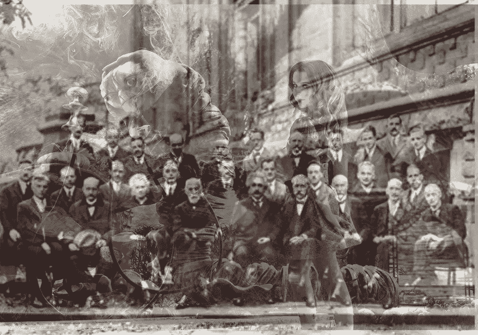

# 量子纠缠&模拟现实

> 原文：<https://medium.com/hackernoon/quantum-entanglement-simulated-reality-620e9aa28ebb>

## 爱因斯坦和玻尔在 1927 年比利时的索尔维会议上进行了一场大辩论。这里聚集了地球上最聪明的一些人。

1927 Solvay Conference of Realism vs Quantum

爱因斯坦相信上帝给了我们一个常识现实的宇宙，我们会找到一个共同的理论来解释…